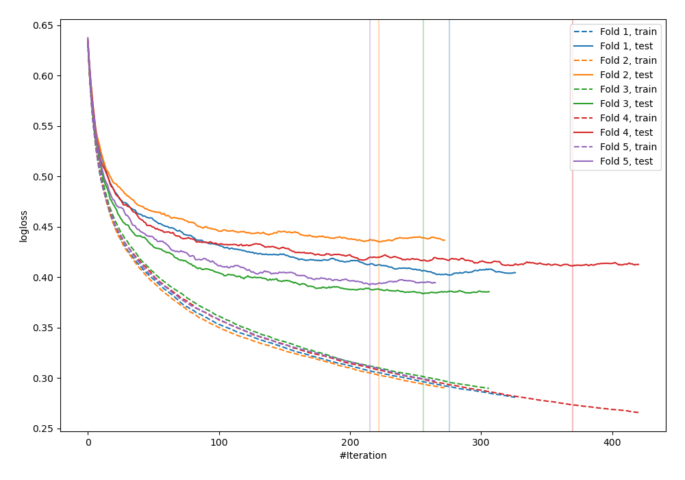
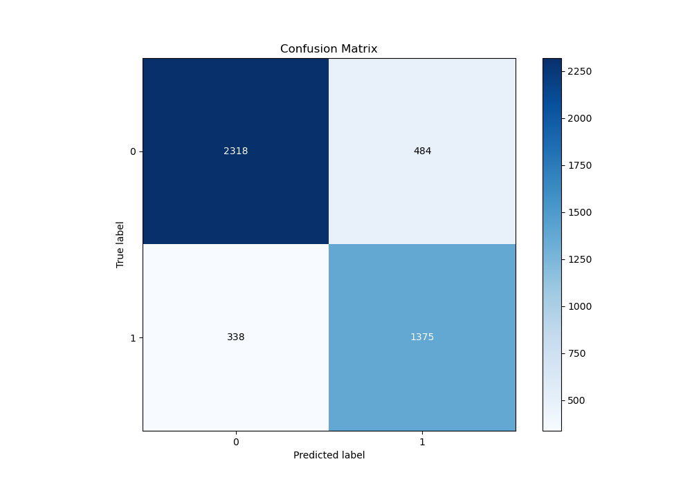
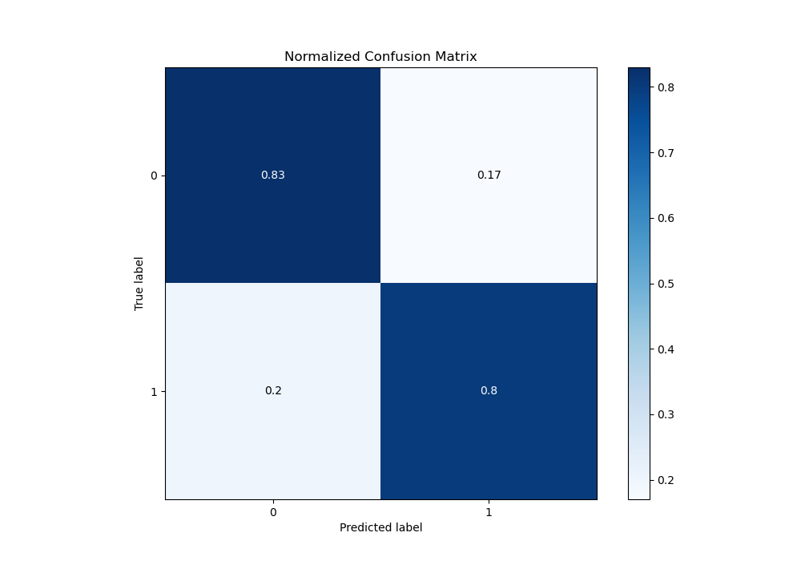
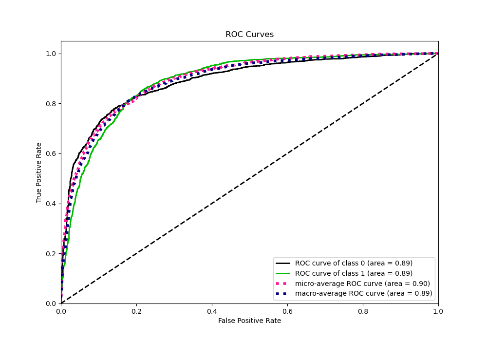
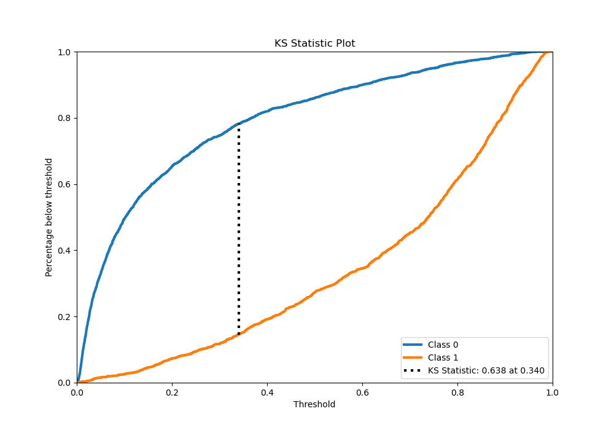
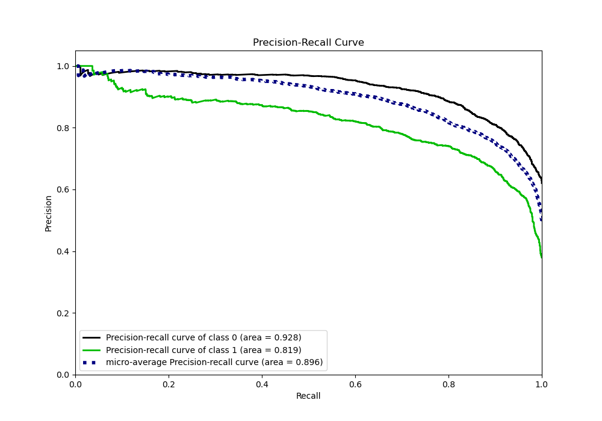
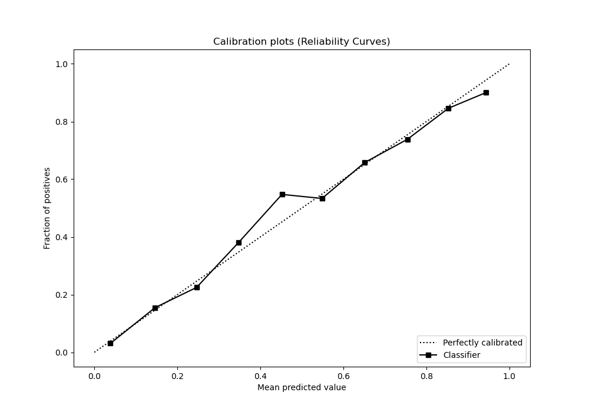
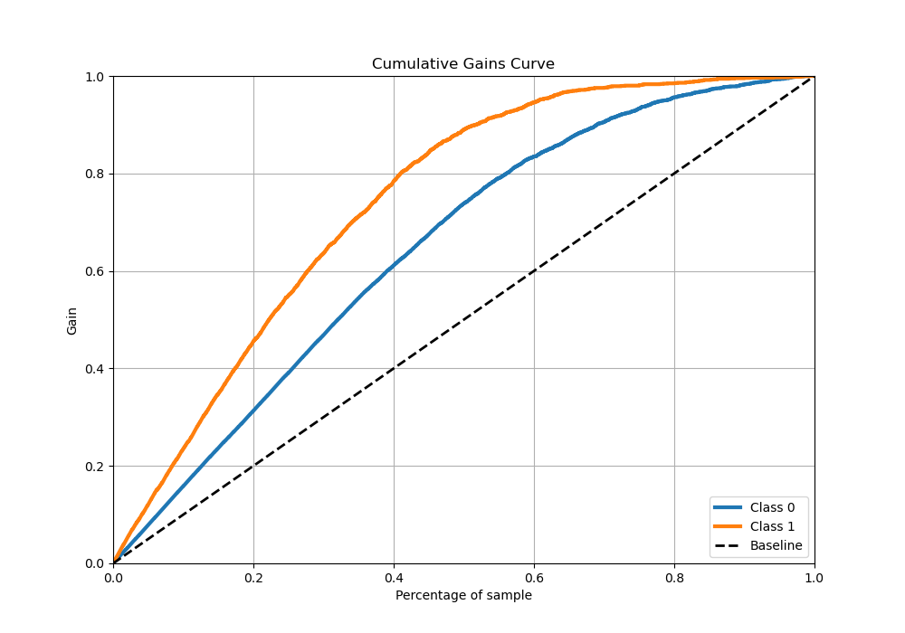
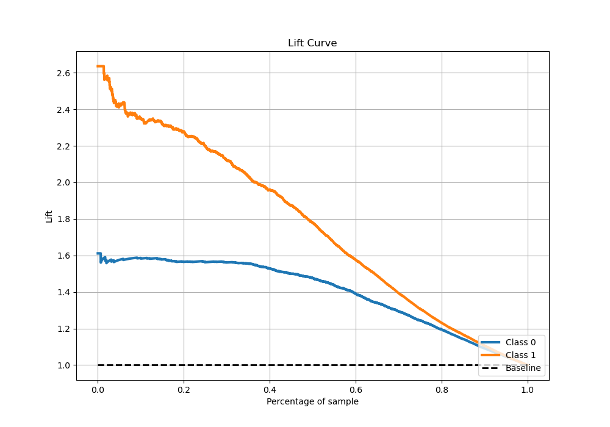

# Summary of 11_Xgboost

[<< Go back](../README.md)

## Extreme Gradient Boosting (Xgboost)
- **n_jobs**: -1
- **objective**: binary:logistic
- **eta**: 0.15
- **max_depth**: 7
- **min_child_weight**: 25
- **subsample**: 0.6
- **colsample_bytree**: 1.0
- **eval_metric**: logloss
- **explain_level**: 0

## Validation
 - **validation_type**: kfold
 - **stratify**: True
 - **k_folds**: 5
 - **shuffle**: True
 - **random_seed**: 42

## Optimized metric
logloss

## Training time

52.3 seconds

## Metric details
|           |    score |    threshold |
|:----------|---------:|-------------:|
| logloss   | 0.404866 | nan          |
| auc       | 0.890252 | nan          |
| f1        | 0.772514 |   0.325373   |
| accuracy  | 0.81794  |   0.4111     |
| precision | 1        |   0.968316   |
| recall    | 1        |   0.00146237 |
| mcc       | 0.621107 |   0.4111     |

## Metric details with threshold from accuracy metric
|           |    score |   threshold |
|:----------|---------:|------------:|
| logloss   | 0.404866 |    nan      |
| auc       | 0.890252 |    nan      |
| f1        | 0.769877 |      0.4111 |
| accuracy  | 0.81794  |      0.4111 |
| precision | 0.739645 |      0.4111 |
| recall    | 0.802685 |      0.4111 |
| mcc       | 0.621107 |      0.4111 |

## Confusion matrix (at threshold=0.4111)
|              |   Predicted as 0 |   Predicted as 1 |
|:-------------|-----------------:|-----------------:|
| Labeled as 0 |             2318 |              484 |
| Labeled as 1 |              338 |             1375 |

## Learning curves

## Confusion Matrix

## Normalized Confusion Matrix

## ROC Curve

## Kolmogorov-Smirnov Statistic

## Precision-Recall Curve

## Calibration Curve

## Cumulative Gains Curve

## Lift Curve

[<< Go back](../README.md)
