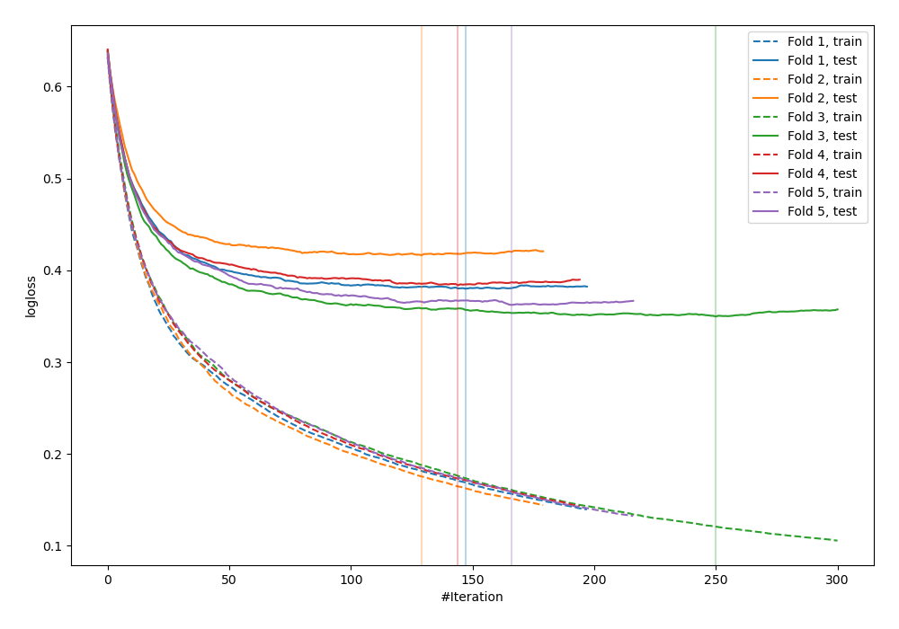
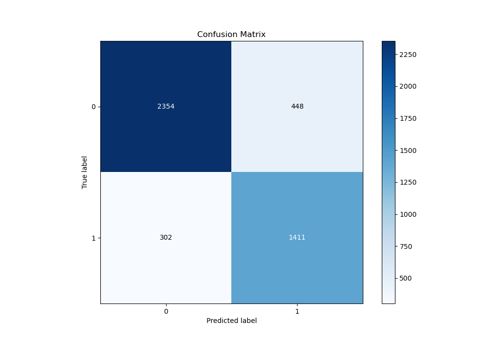
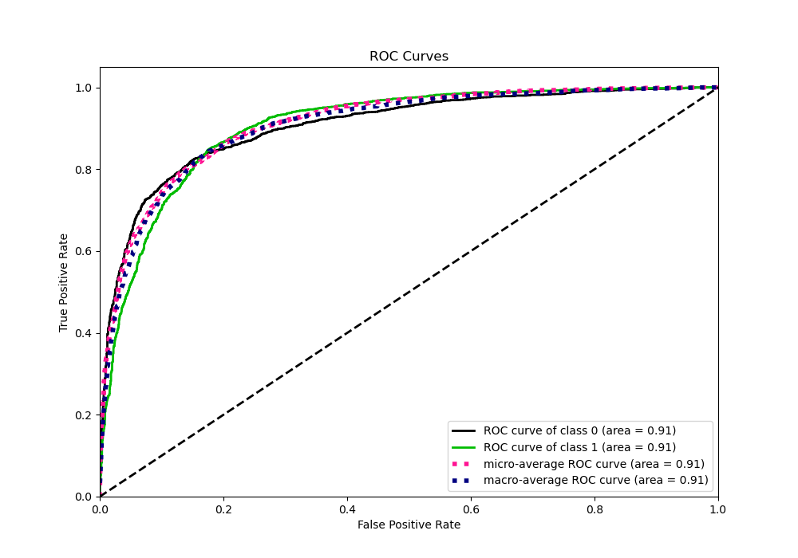
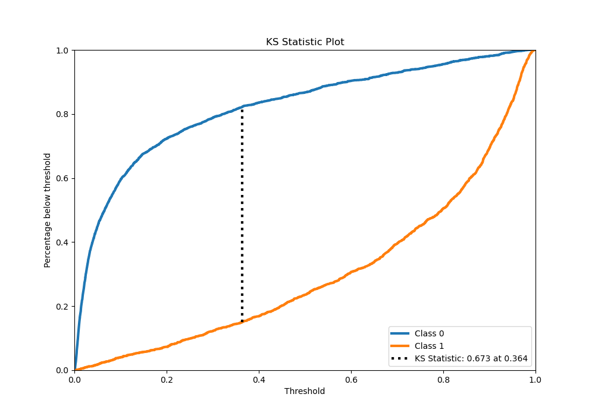
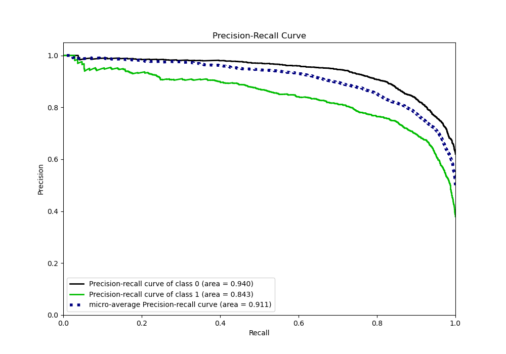
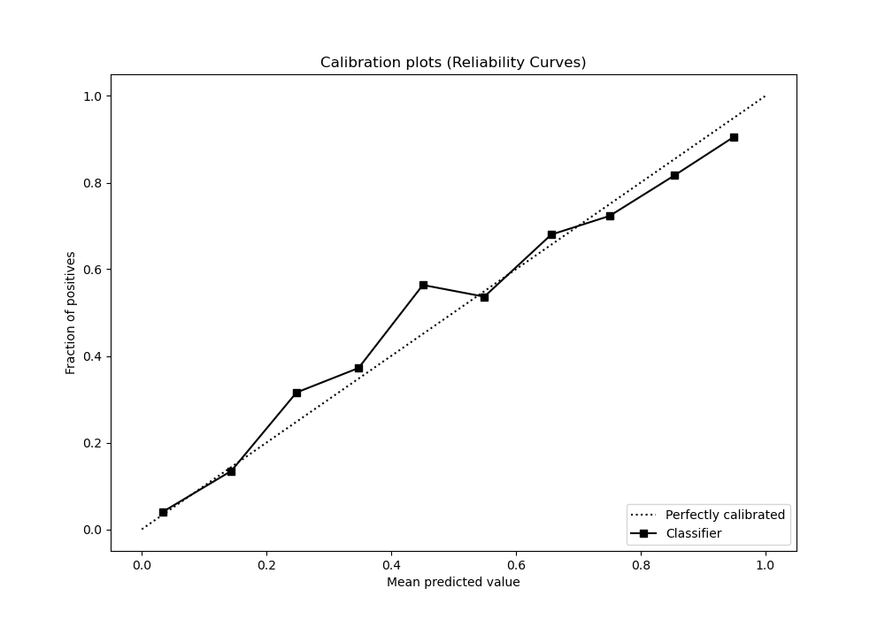
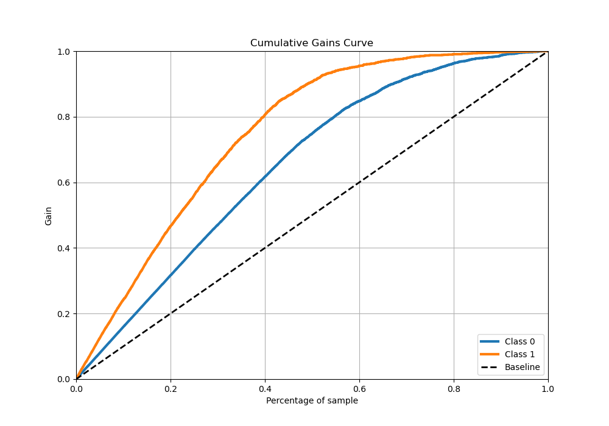
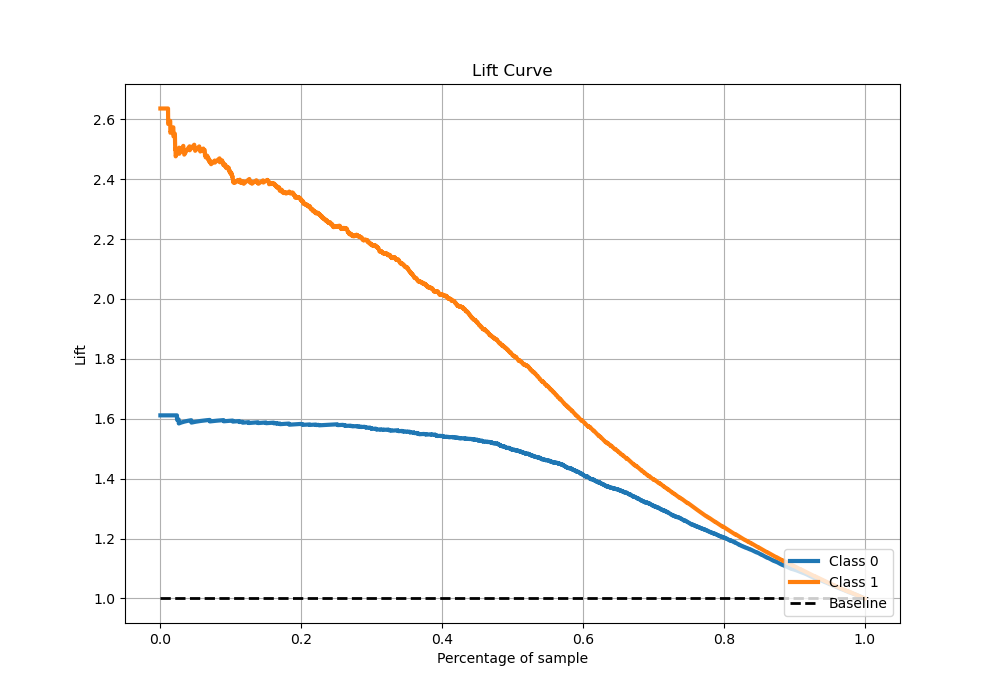

# Summary of 12_Xgboost

[<< Go back](../README.md)

## Extreme Gradient Boosting (Xgboost)
- **n_jobs**: -1
- **objective**: binary:logistic
- **eta**: 0.1
- **max_depth**: 8
- **min_child_weight**: 1
- **subsample**: 0.6
- **colsample_bytree**: 0.5
- **eval_metric**: logloss
- **explain_level**: 0

## Validation
 - **validation_type**: kfold
 - **stratify**: True
 - **k_folds**: 5
 - **shuffle**: True
 - **random_seed**: 42

## Optimized metric
logloss

## Training time

46.6 seconds

## Metric details
|           |    score |     threshold |
|:----------|---------:|--------------:|
| logloss   | 0.378389 | nan           |
| auc       | 0.905813 | nan           |
| f1        | 0.794102 |   0.365116    |
| accuracy  | 0.833887 |   0.413971    |
| precision | 0.983051 |   0.980928    |
| recall    | 1        |   0.000506336 |
| mcc       | 0.658477 |   0.365116    |

## Metric details with threshold from accuracy metric
|           |    score |   threshold |
|:----------|---------:|------------:|
| logloss   | 0.378389 |  nan        |
| auc       | 0.905813 |  nan        |
| f1        | 0.790034 |    0.413971 |
| accuracy  | 0.833887 |    0.413971 |
| precision | 0.75901  |    0.413971 |
| recall    | 0.823701 |    0.413971 |
| mcc       | 0.654495 |    0.413971 |

## Confusion matrix (at threshold=0.413971)
|              |   Predicted as 0 |   Predicted as 1 |
|:-------------|-----------------:|-----------------:|
| Labeled as 0 |             2354 |              448 |
| Labeled as 1 |              302 |             1411 |

## Learning curves

## Confusion Matrix

## Normalized Confusion Matrix

## ROC Curve

## Kolmogorov-Smirnov Statistic

## Precision-Recall Curve

## Calibration Curve

## Cumulative Gains Curve

## Lift Curve

[<< Go back](../README.md)
