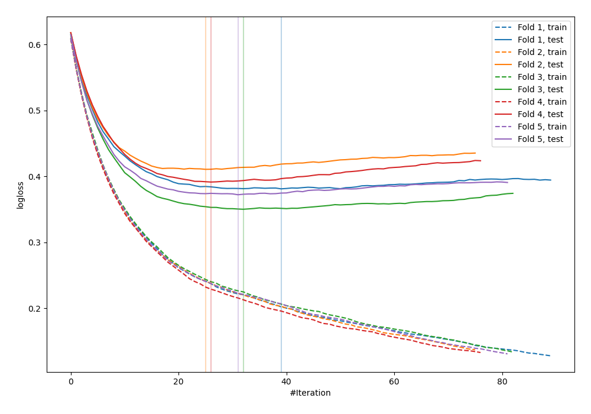
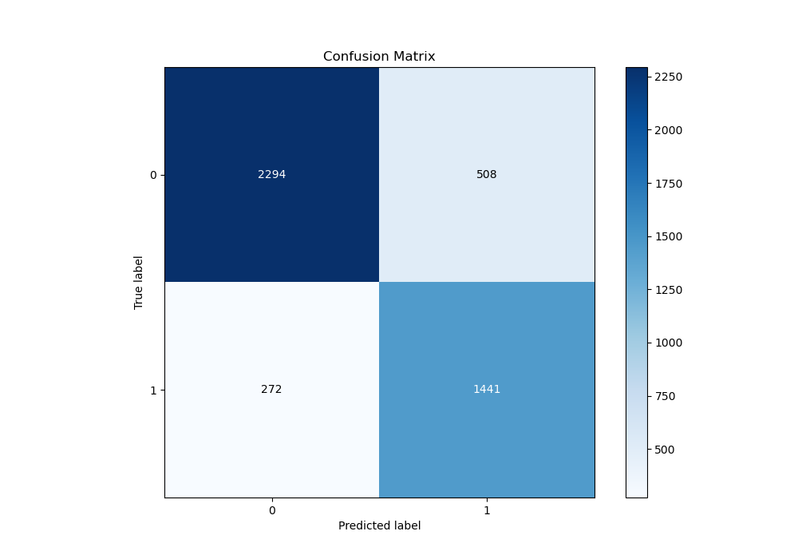
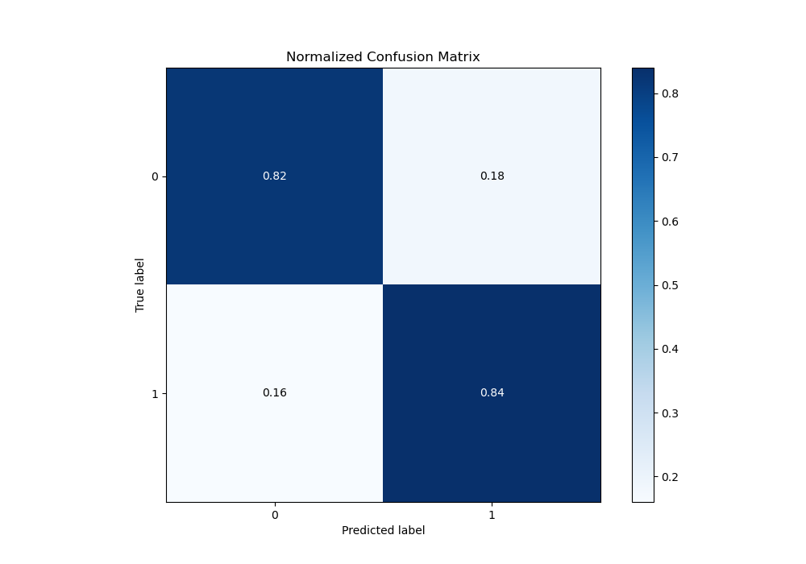
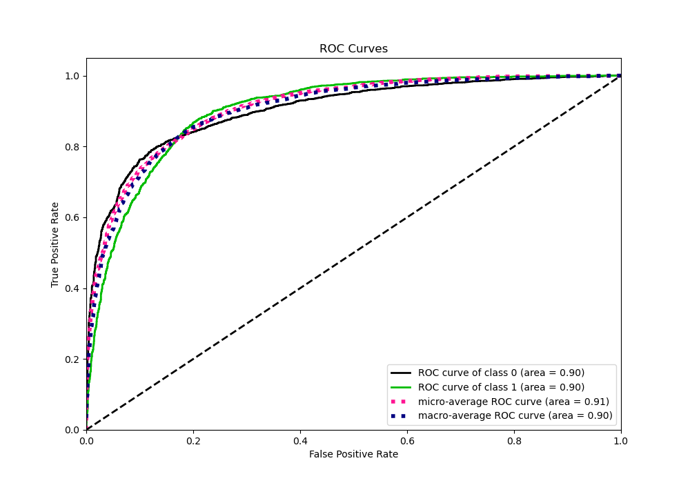
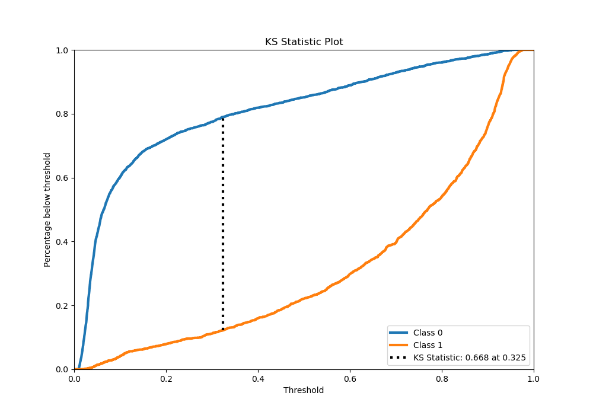
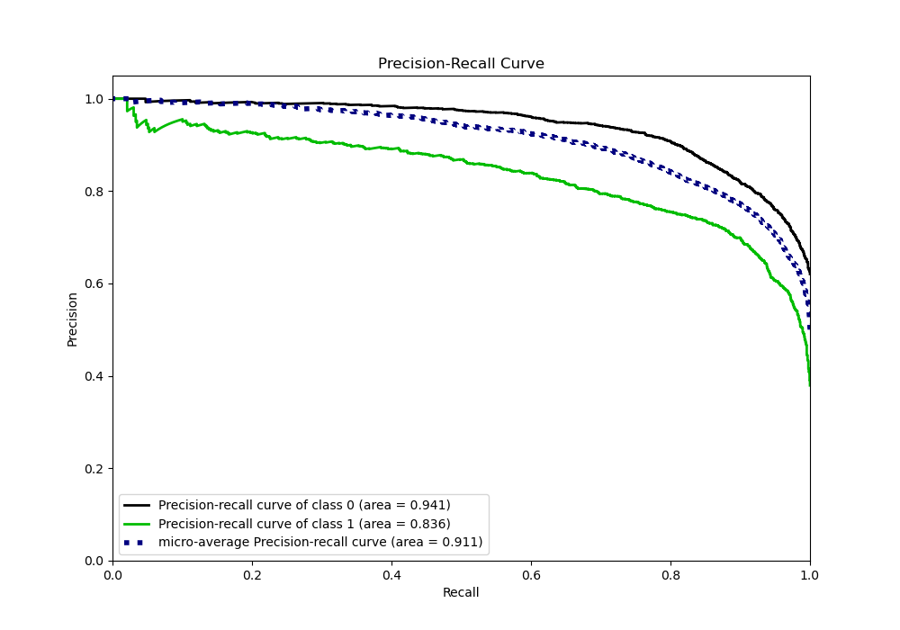
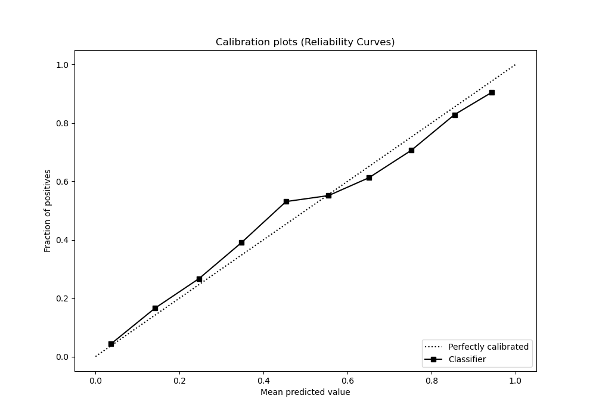
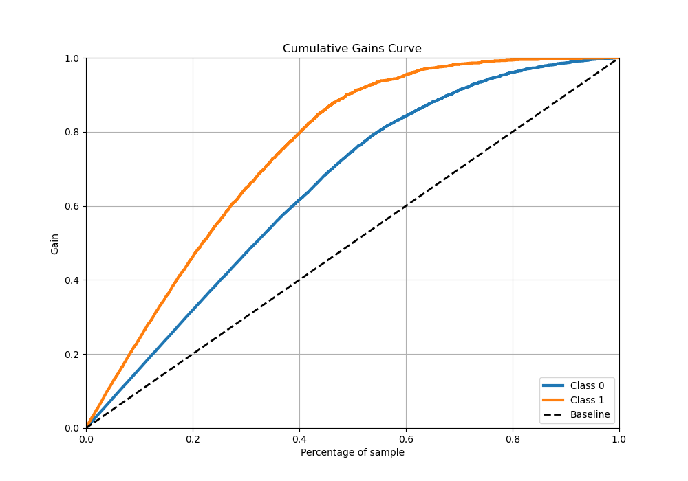
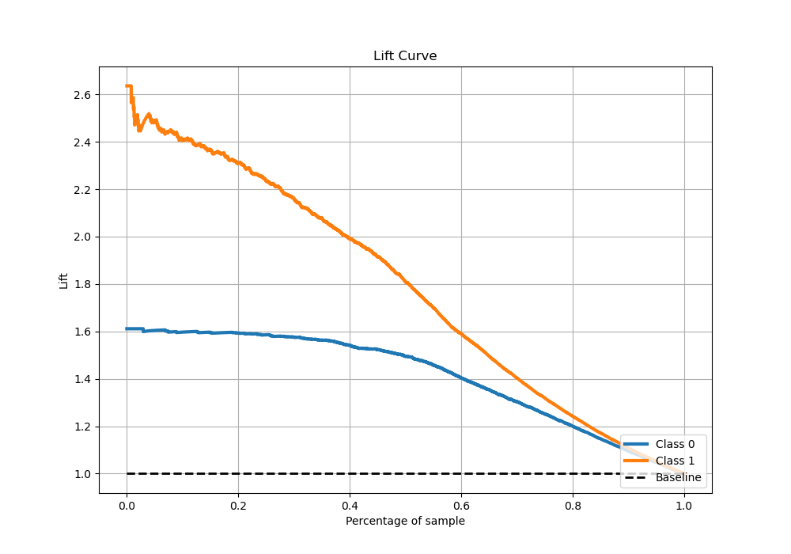

# Summary of 12_Xgboost_Stacked

[<< Go back](../README.md)

## Extreme Gradient Boosting (Xgboost)
- **n_jobs**: -1
- **objective**: binary:logistic
- **eta**: 0.1
- **max_depth**: 8
- **min_child_weight**: 1
- **subsample**: 0.6
- **colsample_bytree**: 0.5
- **eval_metric**: logloss
- **explain_level**: 0

## Validation
 - **validation_type**: kfold
 - **stratify**: True
 - **k_folds**: 5
 - **shuffle**: True
 - **random_seed**: 42

## Optimized metric
logloss

## Training time

23.6 seconds

## Metric details
|           |    score |    threshold |
|:----------|---------:|-------------:|
| logloss   | 0.381095 | nan          |
| auc       | 0.903663 | nan          |
| f1        | 0.789571 |   0.32894    |
| accuracy  | 0.827243 |   0.398486   |
| precision | 0.966102 |   0.951115   |
| recall    | 1        |   0.00795917 |
| mcc       | 0.648822 |   0.351218   |

## Metric details with threshold from accuracy metric
|           |    score |   threshold |
|:----------|---------:|------------:|
| logloss   | 0.381095 |  nan        |
| auc       | 0.903663 |  nan        |
| f1        | 0.787002 |    0.398486 |
| accuracy  | 0.827243 |    0.398486 |
| precision | 0.739354 |    0.398486 |
| recall    | 0.841214 |    0.398486 |
| mcc       | 0.646497 |    0.398486 |

## Confusion matrix (at threshold=0.398486)
|              |   Predicted as 0 |   Predicted as 1 |
|:-------------|-----------------:|-----------------:|
| Labeled as 0 |             2294 |              508 |
| Labeled as 1 |              272 |             1441 |

## Learning curves

## Confusion Matrix

## Normalized Confusion Matrix

## ROC Curve

## Kolmogorov-Smirnov Statistic

## Precision-Recall Curve

## Calibration Curve

## Cumulative Gains Curve

## Lift Curve

[<< Go back](../README.md)
