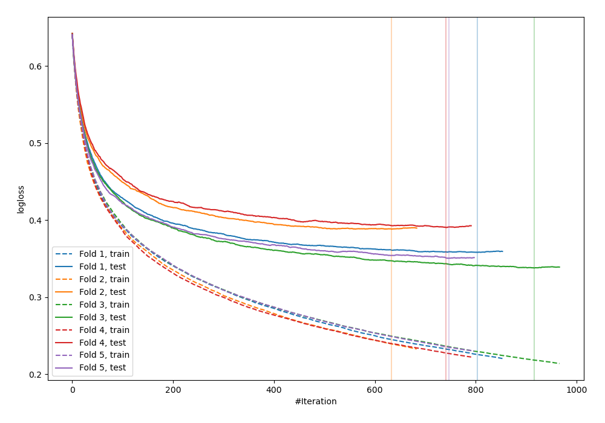
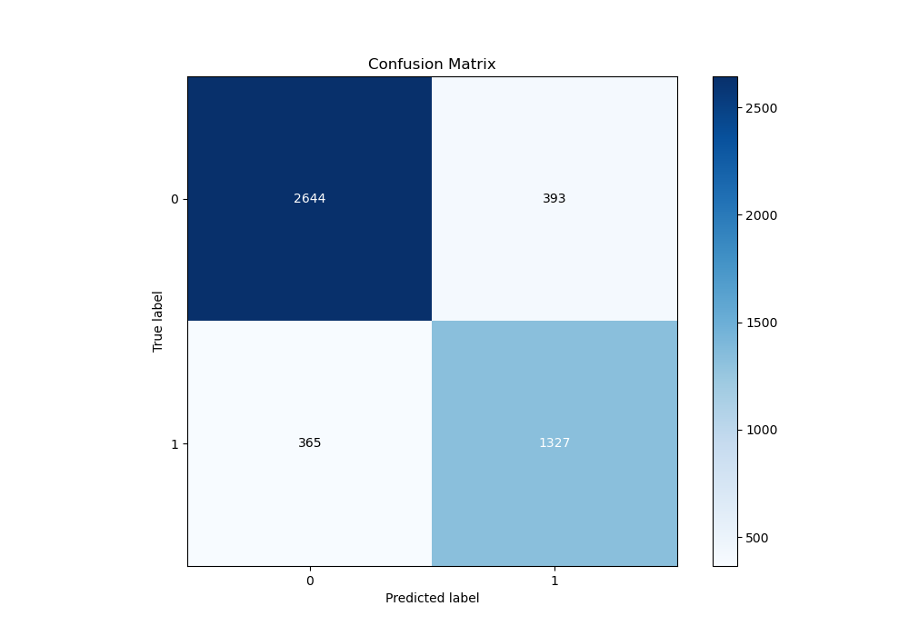
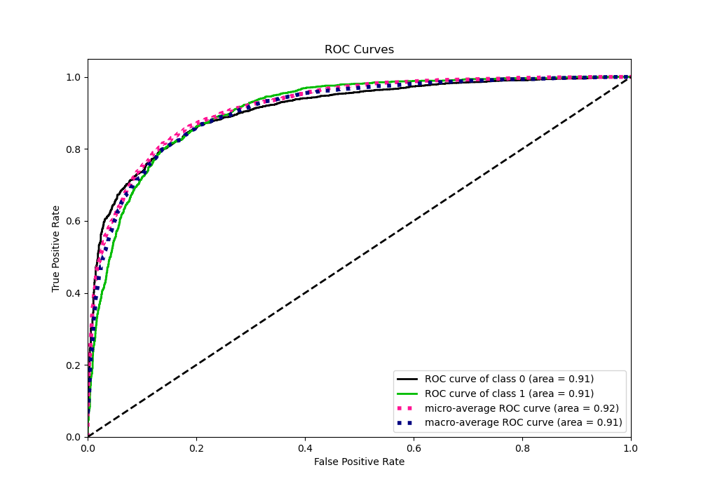
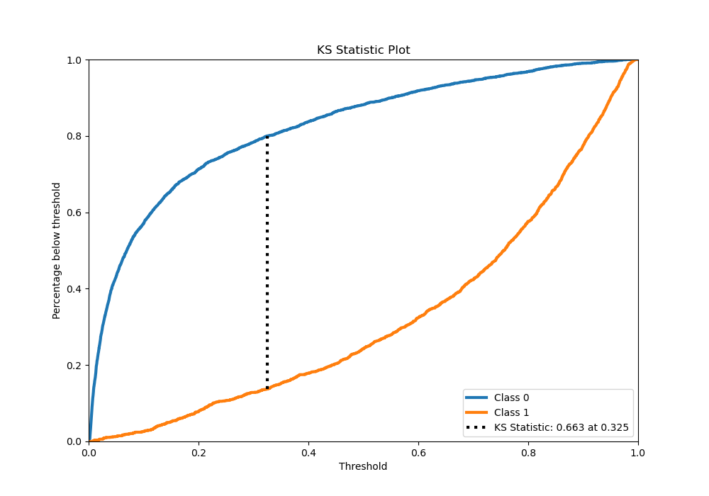
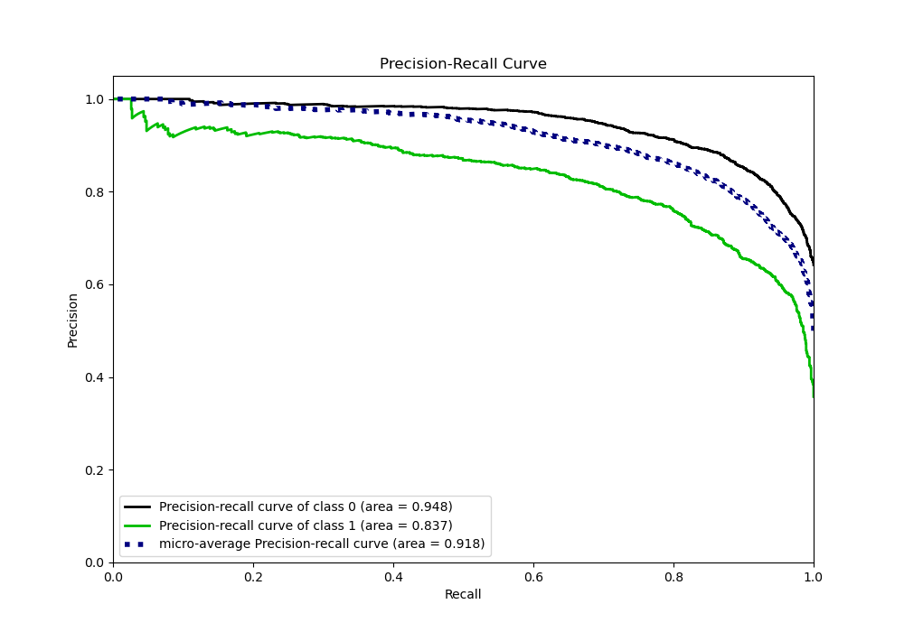
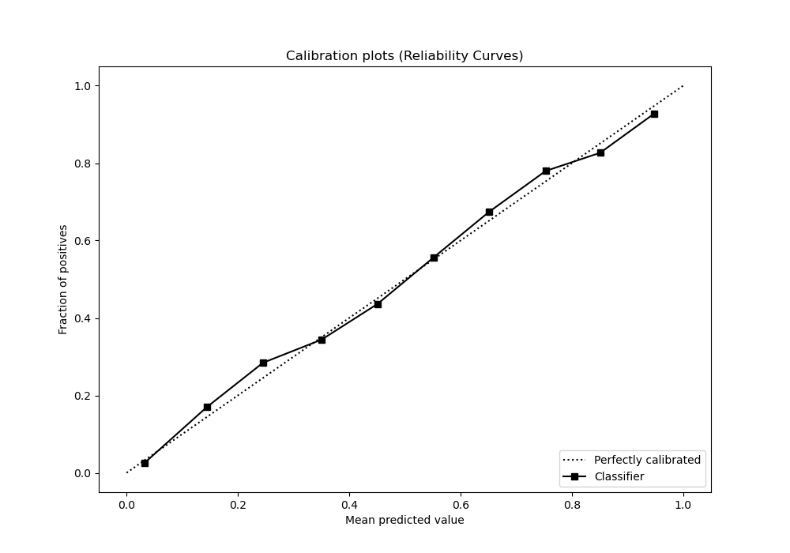
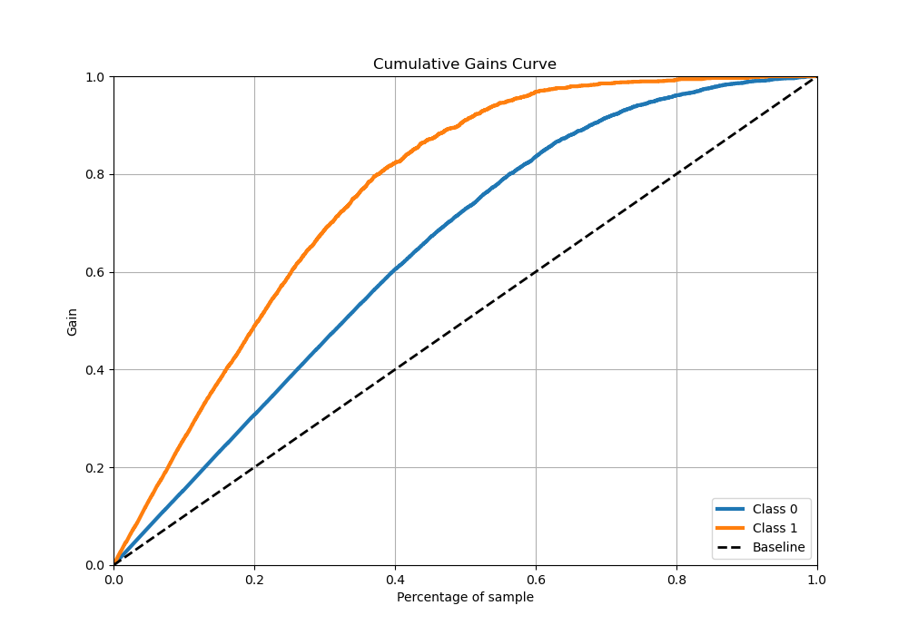
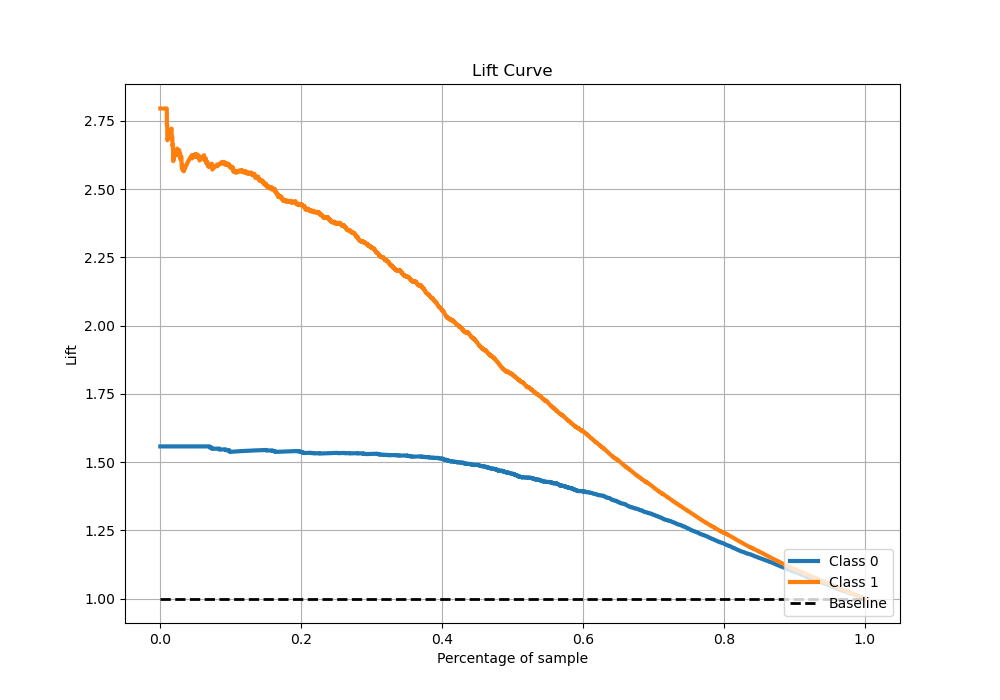

# Summary of 13_Xgboost

[<< Go back](../README.md)

## Extreme Gradient Boosting (Xgboost)
- **n_jobs**: -1
- **objective**: binary:logistic
- **eta**: 0.05
- **max_depth**: 6
- **min_child_weight**: 10
- **subsample**: 0.6
- **colsample_bytree**: 0.6
- **eval_metric**: logloss
- **explain_level**: 0

## Validation
 - **validation_type**: kfold
 - **stratify**: True
 - **k_folds**: 5
 - **shuffle**: True
 - **random_seed**: 42

## Optimized metric
logloss

## Training time

64.4 seconds

## Metric details
|           |    score |     threshold |
|:----------|---------:|--------------:|
| logloss   | 0.365062 | nan           |
| auc       | 0.909365 | nan           |
| f1        | 0.780572 |   0.447844    |
| accuracy  | 0.839712 |   0.466283    |
| precision | 0.973333 |   0.972177    |
| recall    | 1        |   0.000591575 |
| mcc       | 0.654527 |   0.447844    |

## Metric details with threshold from accuracy metric
|           |    score |   threshold |
|:----------|---------:|------------:|
| logloss   | 0.365062 |  nan        |
| auc       | 0.909365 |  nan        |
| f1        | 0.777843 |    0.466283 |
| accuracy  | 0.839712 |    0.466283 |
| precision | 0.771512 |    0.466283 |
| recall    | 0.784279 |    0.466283 |
| mcc       | 0.652538 |    0.466283 |

## Confusion matrix (at threshold=0.466283)
|              |   Predicted as 0 |   Predicted as 1 |
|:-------------|-----------------:|-----------------:|
| Labeled as 0 |             2644 |              393 |
| Labeled as 1 |              365 |             1327 |

## Learning curves

## Confusion Matrix

## Normalized Confusion Matrix

## ROC Curve

## Kolmogorov-Smirnov Statistic

## Precision-Recall Curve

## Calibration Curve

## Cumulative Gains Curve

## Lift Curve

[<< Go back](../README.md)
