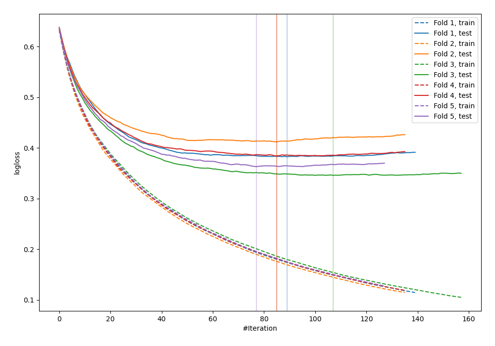
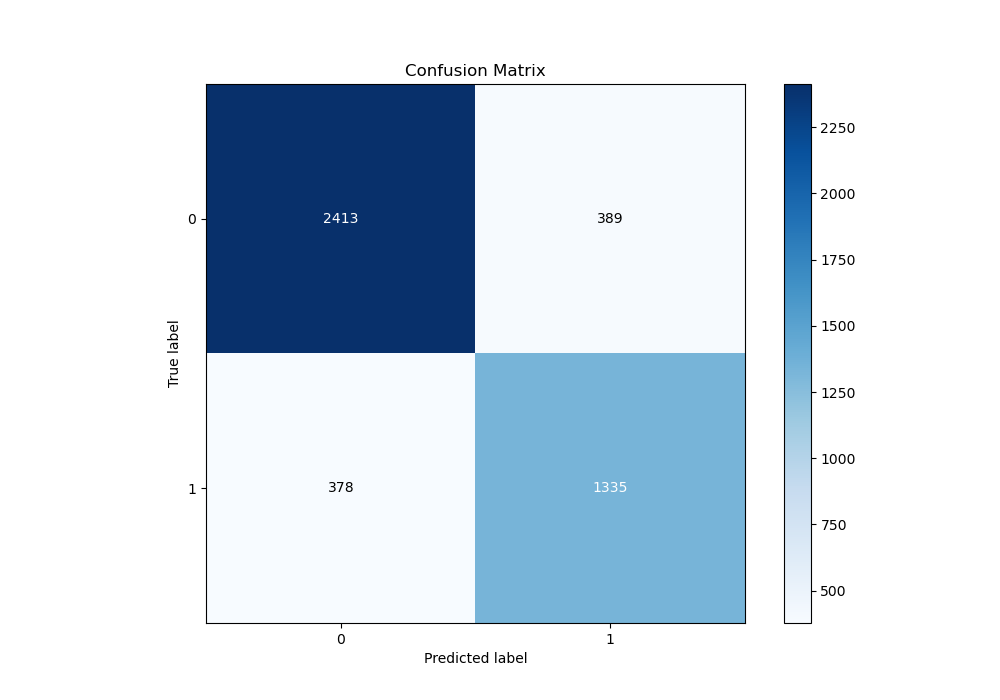
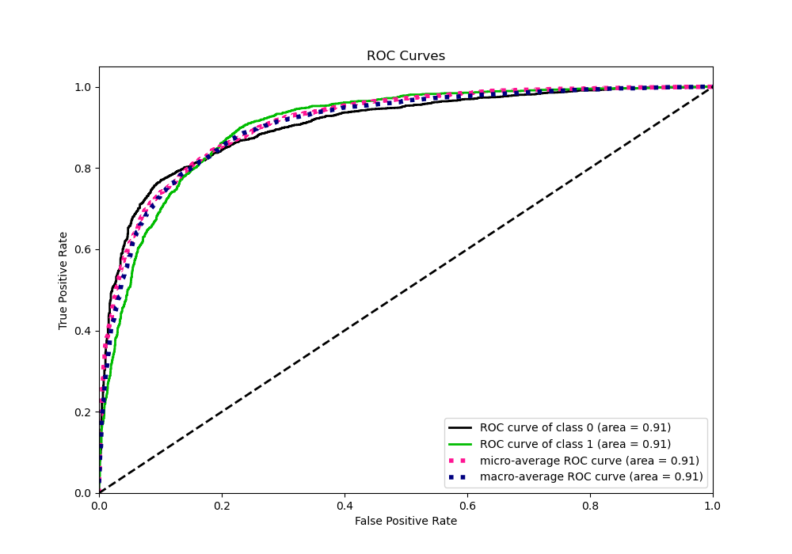
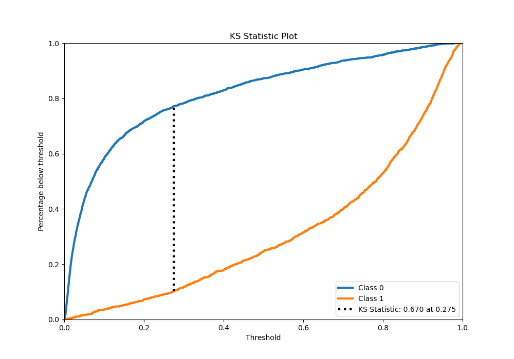
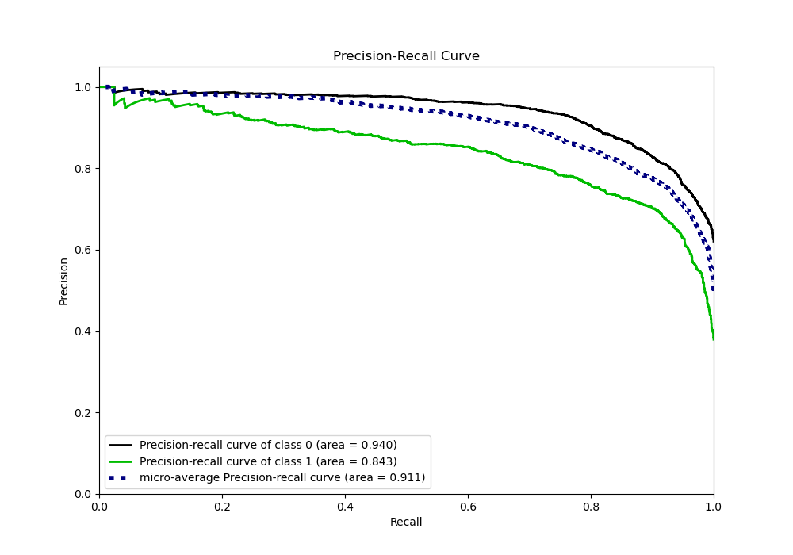
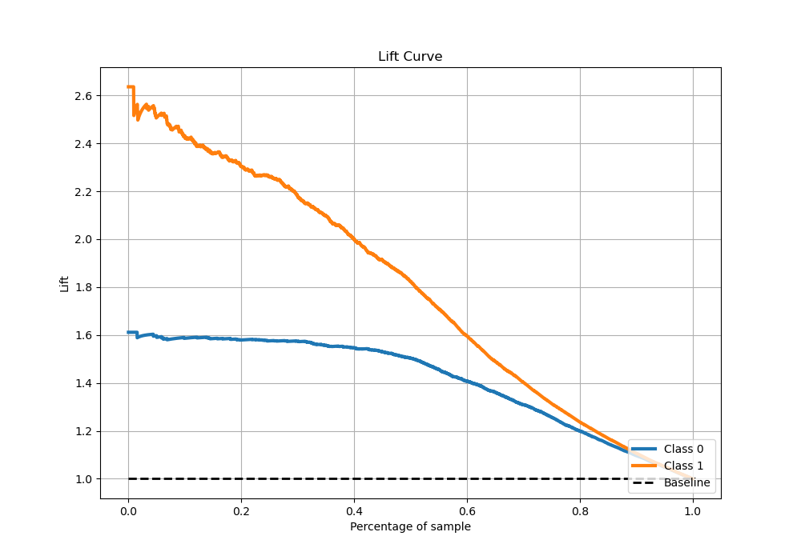

# Summary of 14_LightGBM

[<< Go back](../README.md)

## LightGBM
- **n_jobs**: -1
- **objective**: binary
- **num_leaves**: 95
- **learning_rate**: 0.1
- **feature_fraction**: 0.5
- **bagging_fraction**: 0.8
- **min_data_in_leaf**: 50
- **metric**: binary_logloss
- **custom_eval_metric_name**: None
- **explain_level**: 0

## Validation
 - **validation_type**: kfold
 - **stratify**: True
 - **k_folds**: 5
 - **shuffle**: True
 - **random_seed**: 42

## Optimized metric
logloss

## Training time

129.5 seconds

## Metric details
|           |    score |     threshold |
|:----------|---------:|--------------:|
| logloss   | 0.377608 | nan           |
| auc       | 0.905388 | nan           |
| f1        | 0.78942  |   0.260839    |
| accuracy  | 0.830122 |   0.466117    |
| precision | 0.969072 |   0.951045    |
| recall    | 1        |   0.000540555 |
| mcc       | 0.648342 |   0.260839    |

## Metric details with threshold from accuracy metric
|           |    score |   threshold |
|:----------|---------:|------------:|
| logloss   | 0.377608 |  nan        |
| auc       | 0.905388 |  nan        |
| f1        | 0.77684  |    0.466117 |
| accuracy  | 0.830122 |    0.466117 |
| precision | 0.774362 |    0.466117 |
| recall    | 0.779335 |    0.466117 |
| mcc       | 0.639715 |    0.466117 |

## Confusion matrix (at threshold=0.466117)
|              |   Predicted as 0 |   Predicted as 1 |
|:-------------|-----------------:|-----------------:|
| Labeled as 0 |             2413 |              389 |
| Labeled as 1 |              378 |             1335 |

## Learning curves

## Confusion Matrix

## Normalized Confusion Matrix

## ROC Curve

## Kolmogorov-Smirnov Statistic

## Precision-Recall Curve

## Calibration Curve

## Cumulative Gains Curve

## Lift Curve

[<< Go back](../README.md)
