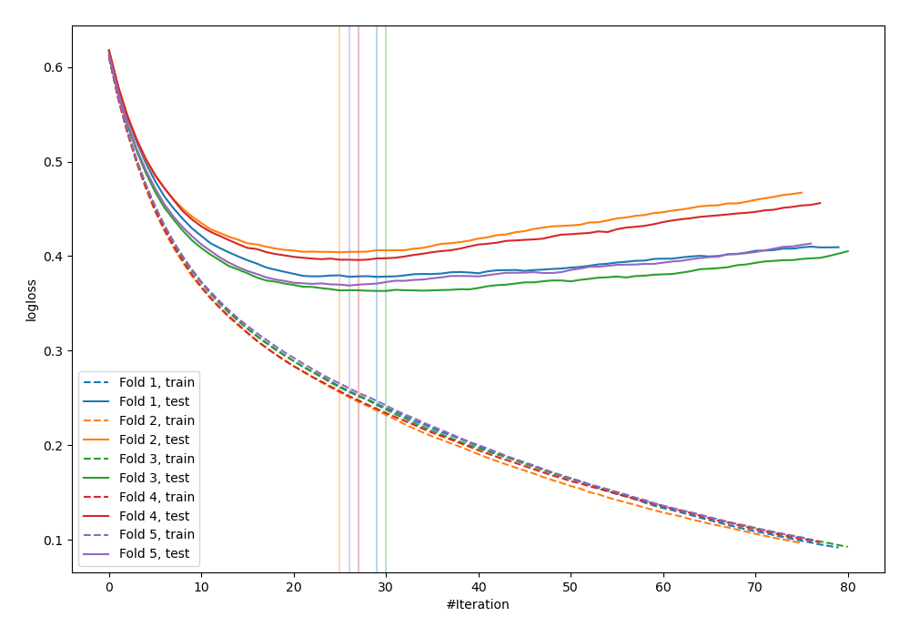
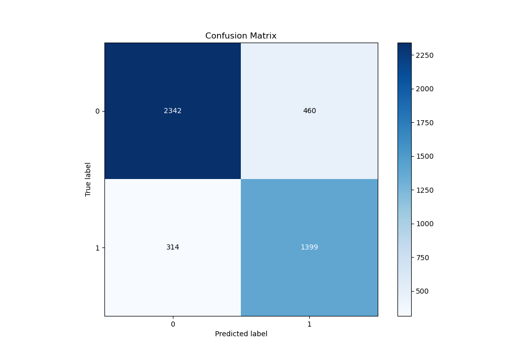
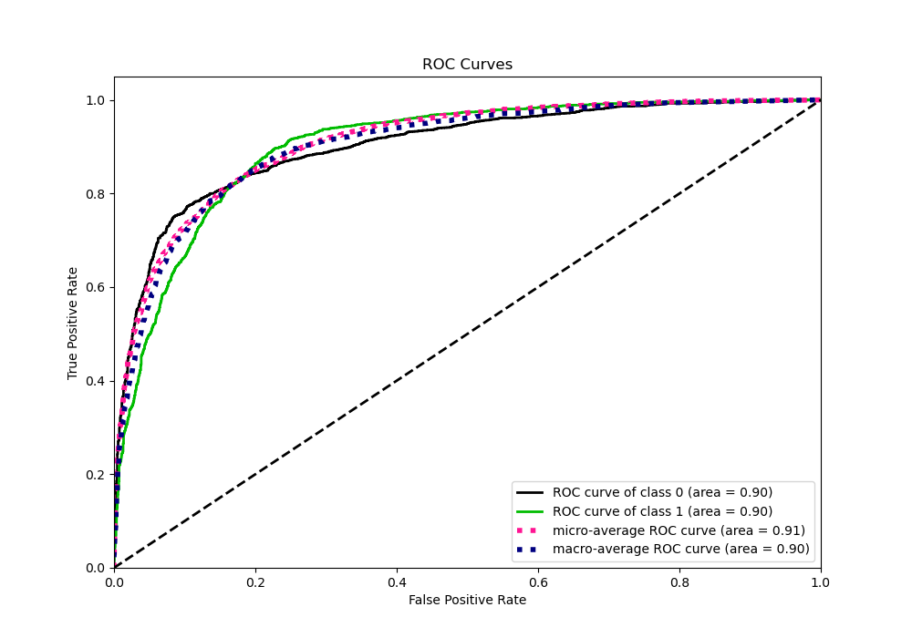
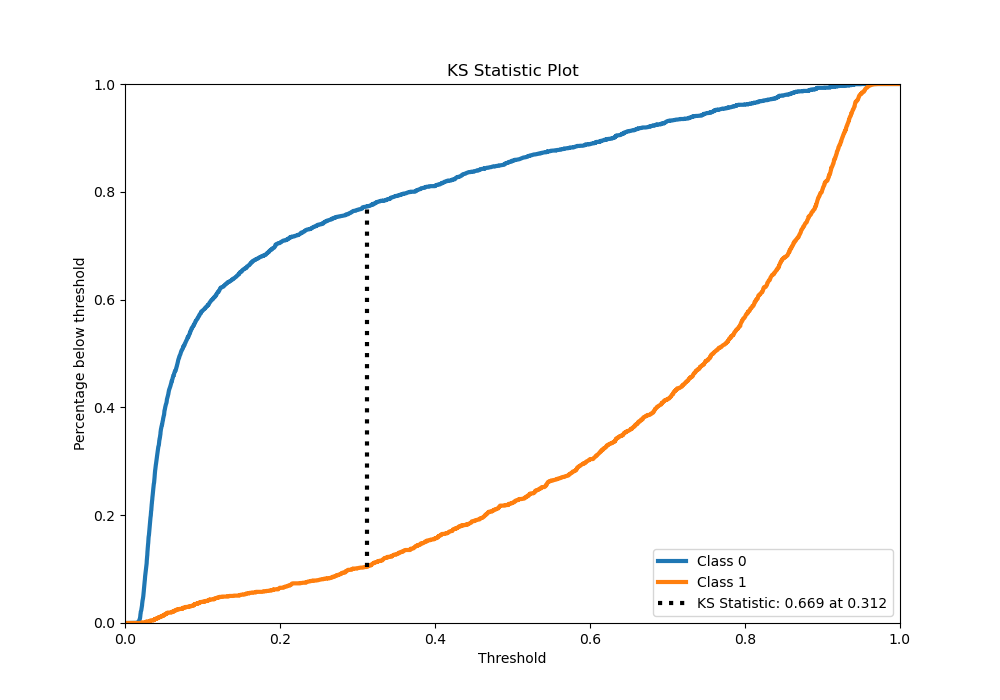
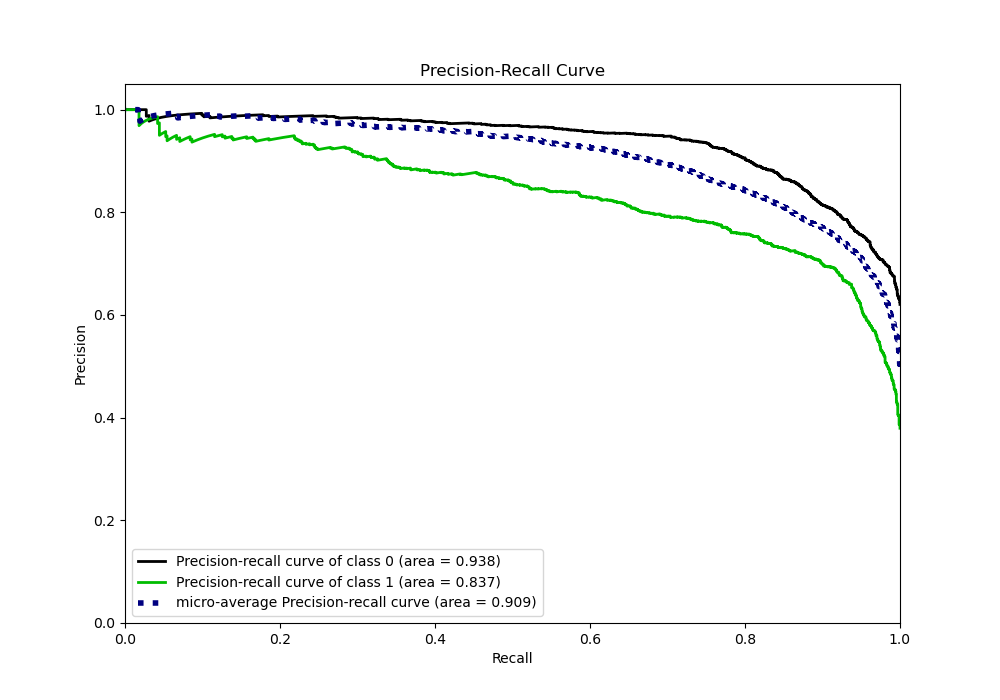
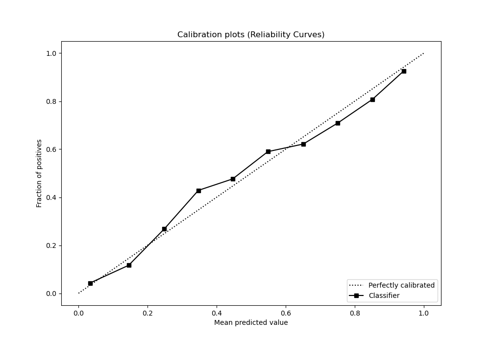
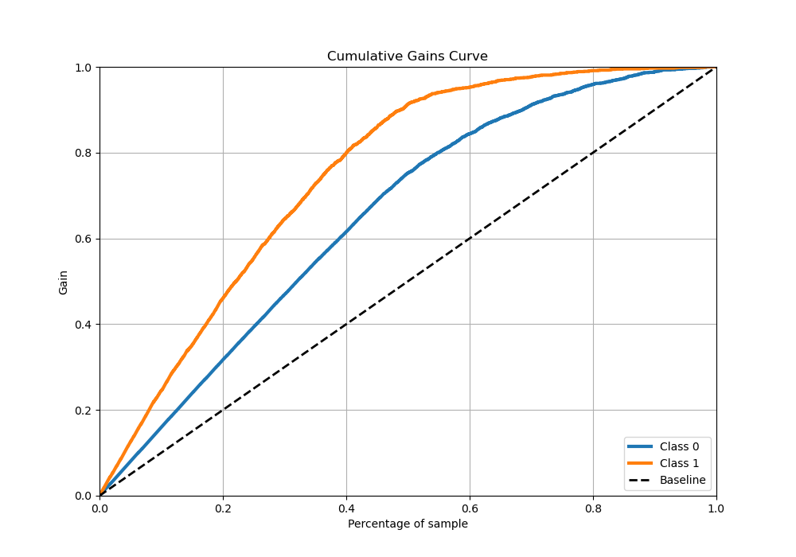
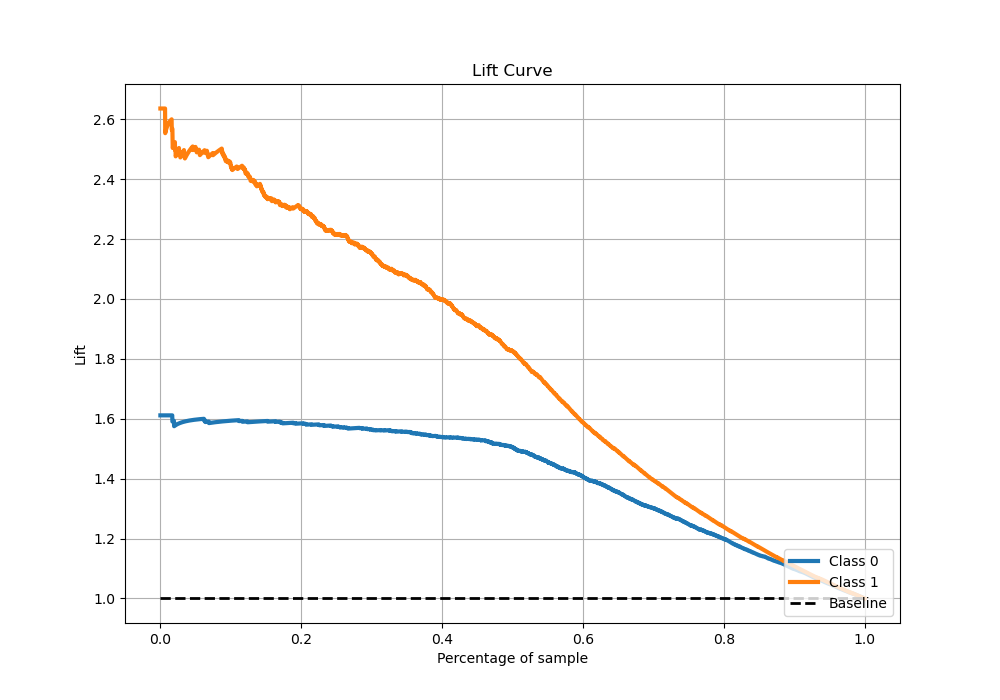

# Summary of 14_LightGBM_Stacked

[<< Go back](../README.md)

## LightGBM
- **n_jobs**: -1
- **objective**: binary
- **num_leaves**: 95
- **learning_rate**: 0.1
- **feature_fraction**: 0.5
- **bagging_fraction**: 0.8
- **min_data_in_leaf**: 50
- **metric**: binary_logloss
- **custom_eval_metric_name**: None
- **explain_level**: 0

## Validation
 - **validation_type**: kfold
 - **stratify**: True
 - **k_folds**: 5
 - **shuffle**: True
 - **random_seed**: 42

## Optimized metric
logloss

## Training time

114.5 seconds

## Metric details
|           |    score |   threshold |
|:----------|---------:|------------:|
| logloss   | 0.382062 | nan         |
| auc       | 0.902066 | nan         |
| f1        | 0.789812 |   0.310182  |
| accuracy  | 0.828571 |   0.442752  |
| precision | 0.983051 |   0.94252   |
| recall    | 1        |   0.0149554 |
| mcc       | 0.648758 |   0.310182  |

## Metric details with threshold from accuracy metric
|           |    score |   threshold |
|:----------|---------:|------------:|
| logloss   | 0.382062 |  nan        |
| auc       | 0.902066 |  nan        |
| f1        | 0.783315 |    0.442752 |
| accuracy  | 0.828571 |    0.442752 |
| precision | 0.752555 |    0.442752 |
| recall    | 0.816696 |    0.442752 |
| mcc       | 0.643366 |    0.442752 |

## Confusion matrix (at threshold=0.442752)
|              |   Predicted as 0 |   Predicted as 1 |
|:-------------|-----------------:|-----------------:|
| Labeled as 0 |             2342 |              460 |
| Labeled as 1 |              314 |             1399 |

## Learning curves

## Confusion Matrix

## Normalized Confusion Matrix

## ROC Curve

## Kolmogorov-Smirnov Statistic

## Precision-Recall Curve

## Calibration Curve

## Cumulative Gains Curve

## Lift Curve

[<< Go back](../README.md)
