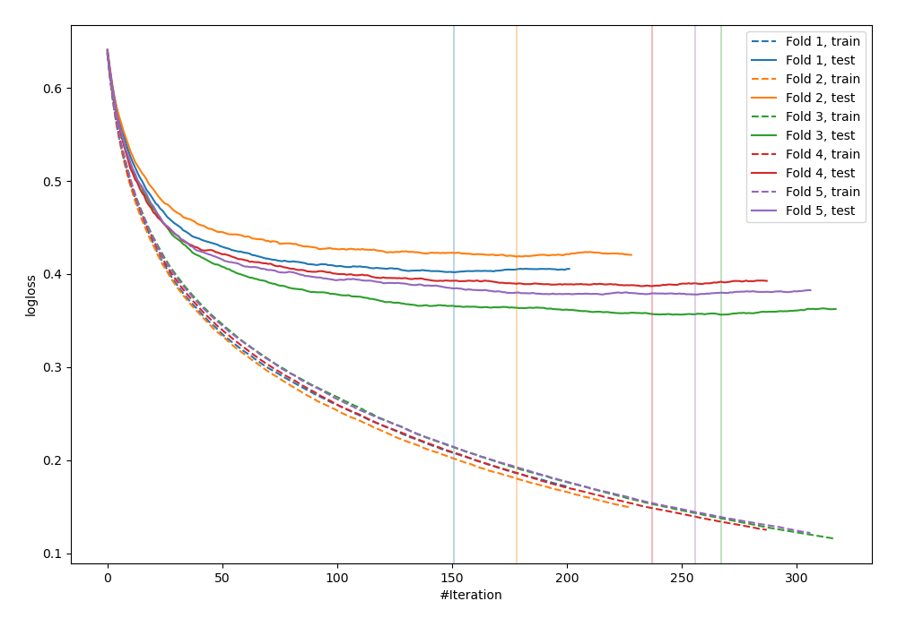
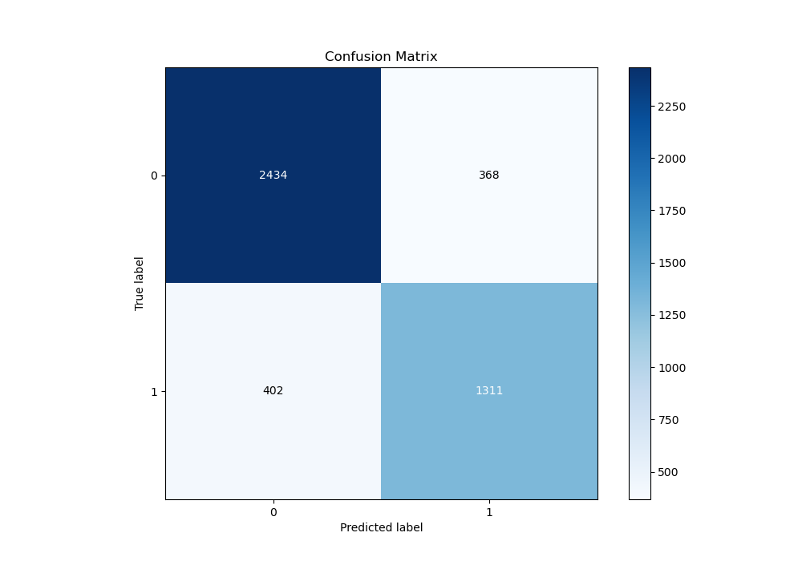
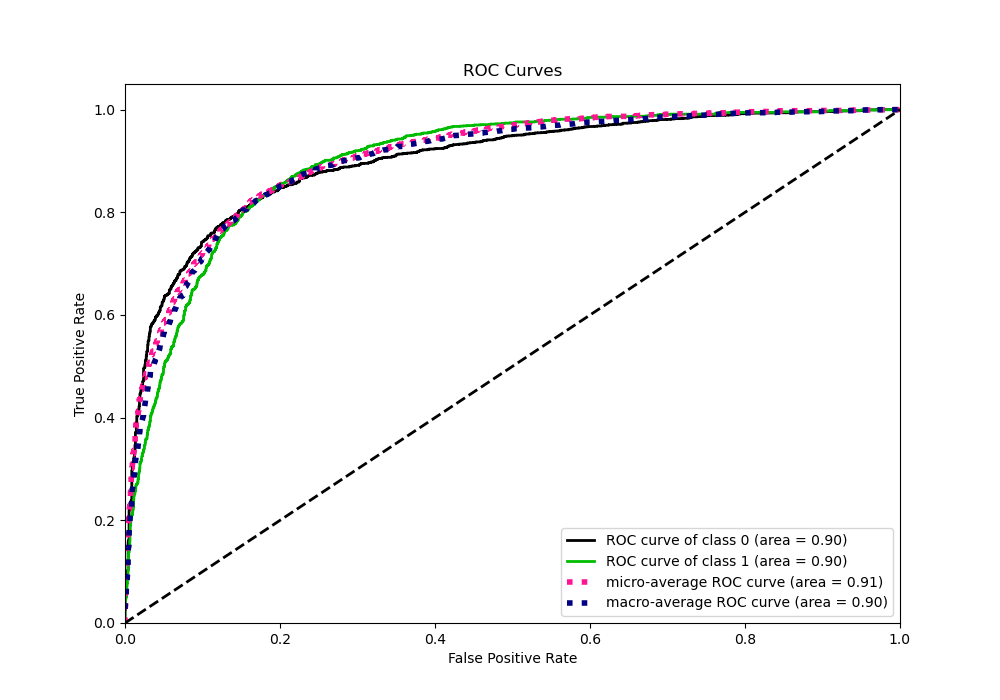
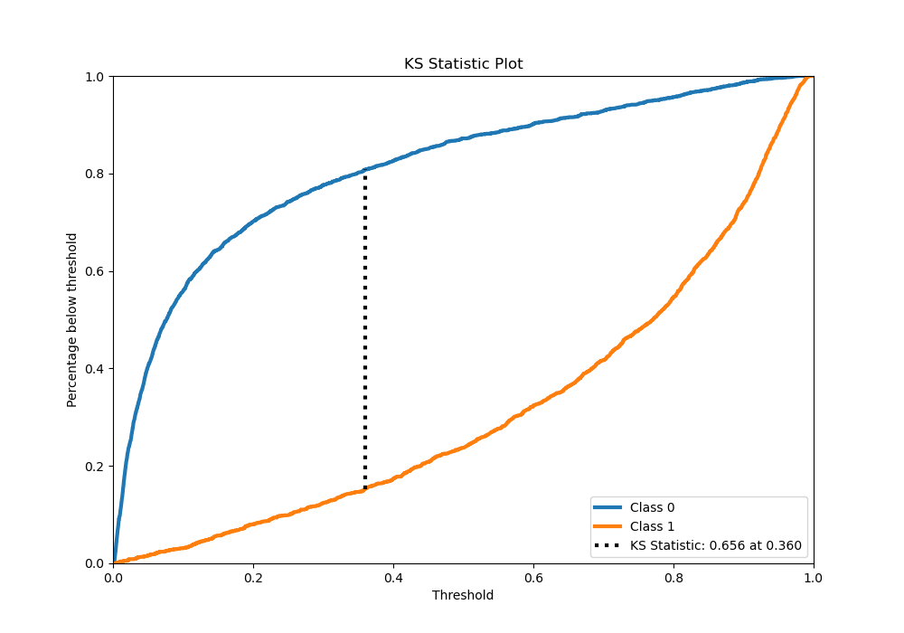
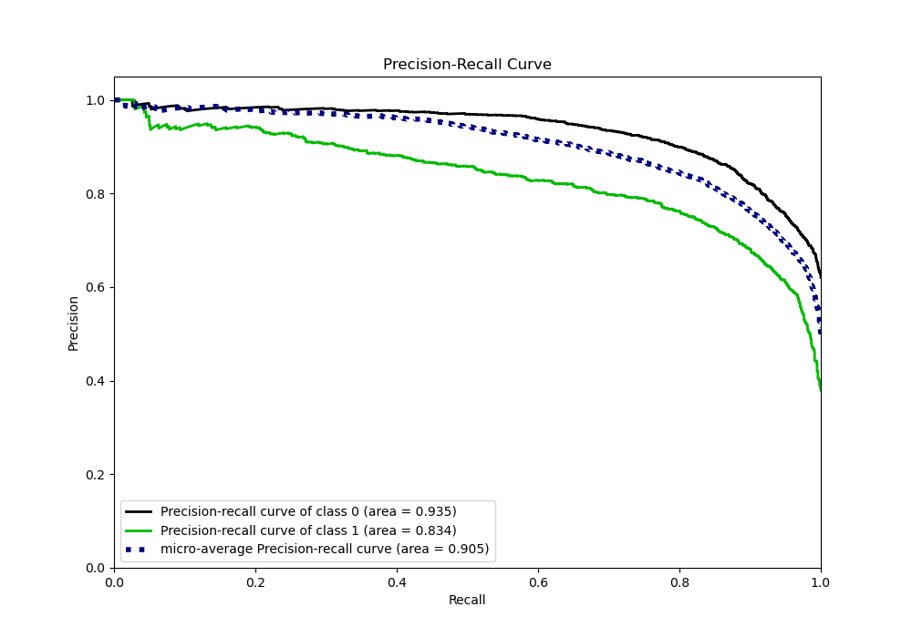
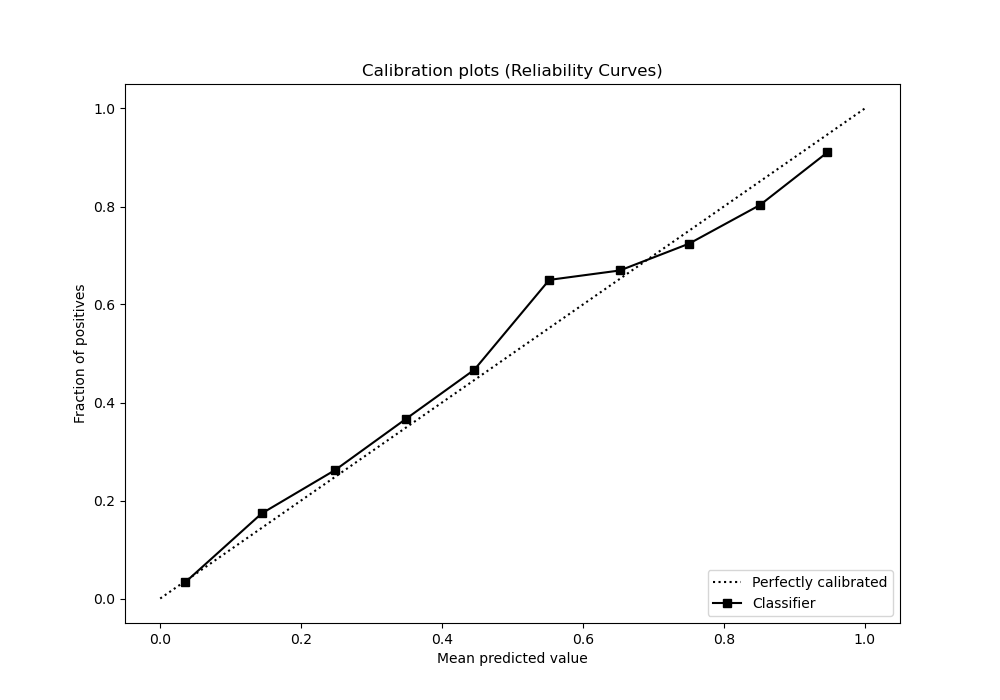
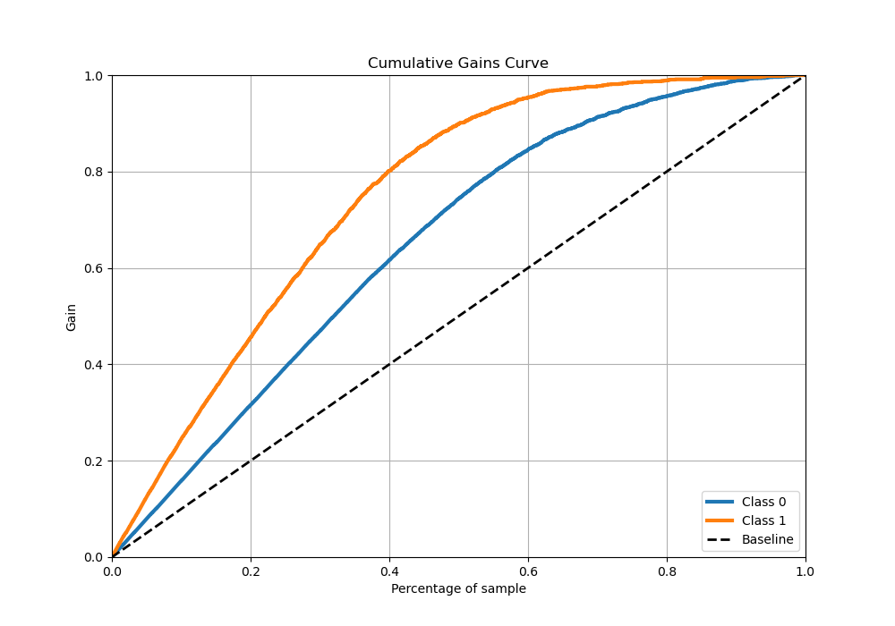
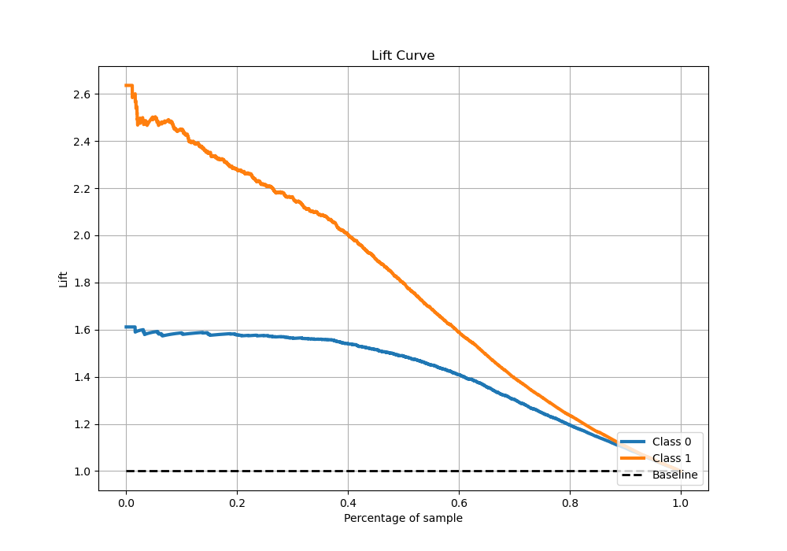

# Summary of 15_LightGBM

[<< Go back](../README.md)

## LightGBM
- **n_jobs**: -1
- **objective**: binary
- **num_leaves**: 15
- **learning_rate**: 0.1
- **feature_fraction**: 0.8
- **bagging_fraction**: 0.5
- **min_data_in_leaf**: 5
- **metric**: binary_logloss
- **custom_eval_metric_name**: None
- **explain_level**: 0

## Validation
 - **validation_type**: kfold
 - **stratify**: True
 - **k_folds**: 5
 - **shuffle**: True
 - **random_seed**: 42

## Optimized metric
logloss

## Training time

81.7 seconds

## Metric details
|           |    score |     threshold |
|:----------|---------:|--------------:|
| logloss   | 0.388357 | nan           |
| auc       | 0.899899 | nan           |
| f1        | 0.783922 |   0.358923    |
| accuracy  | 0.829457 |   0.493939    |
| precision | 0.983051 |   0.976185    |
| recall    | 1        |   0.000325168 |
| mcc       | 0.641105 |   0.399873    |

## Metric details with threshold from accuracy metric
|           |    score |   threshold |
|:----------|---------:|------------:|
| logloss   | 0.388357 |  nan        |
| auc       | 0.899899 |  nan        |
| f1        | 0.772995 |    0.493939 |
| accuracy  | 0.829457 |    0.493939 |
| precision | 0.780822 |    0.493939 |
| recall    | 0.765324 |    0.493939 |
| mcc       | 0.636526 |    0.493939 |

## Confusion matrix (at threshold=0.493939)
|              |   Predicted as 0 |   Predicted as 1 |
|:-------------|-----------------:|-----------------:|
| Labeled as 0 |             2434 |              368 |
| Labeled as 1 |              402 |             1311 |

## Learning curves

## Confusion Matrix

## Normalized Confusion Matrix

## ROC Curve

## Kolmogorov-Smirnov Statistic

## Precision-Recall Curve

## Calibration Curve

## Cumulative Gains Curve

## Lift Curve

[<< Go back](../README.md)
