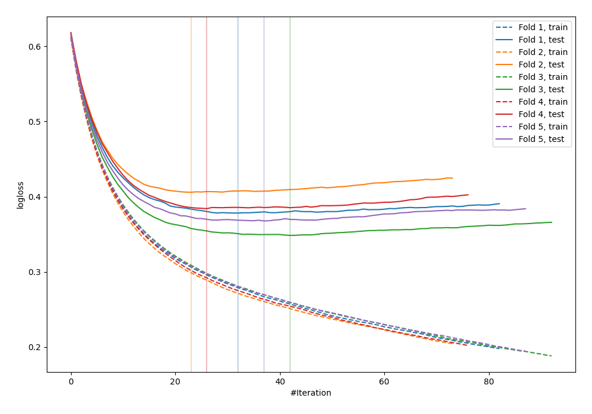
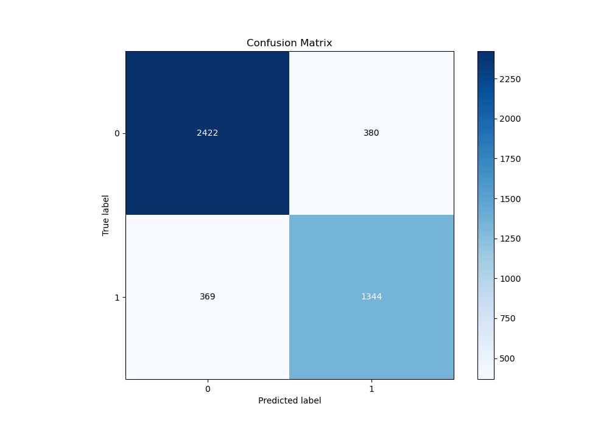
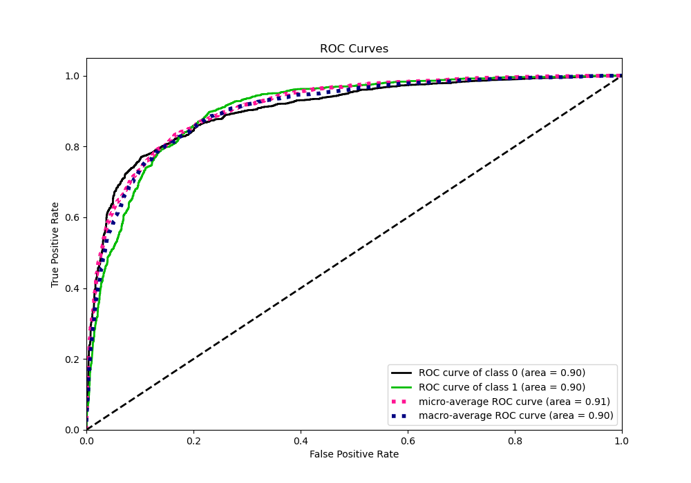
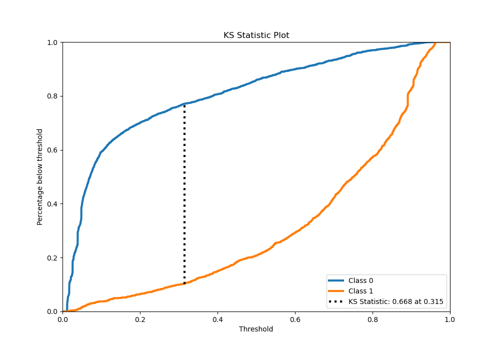
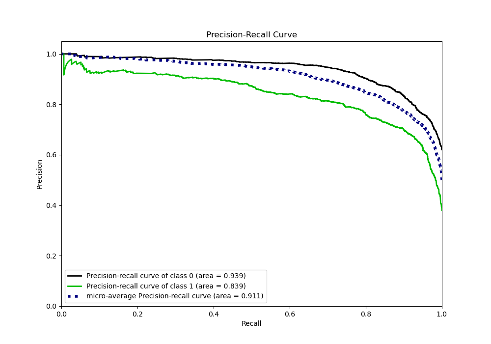
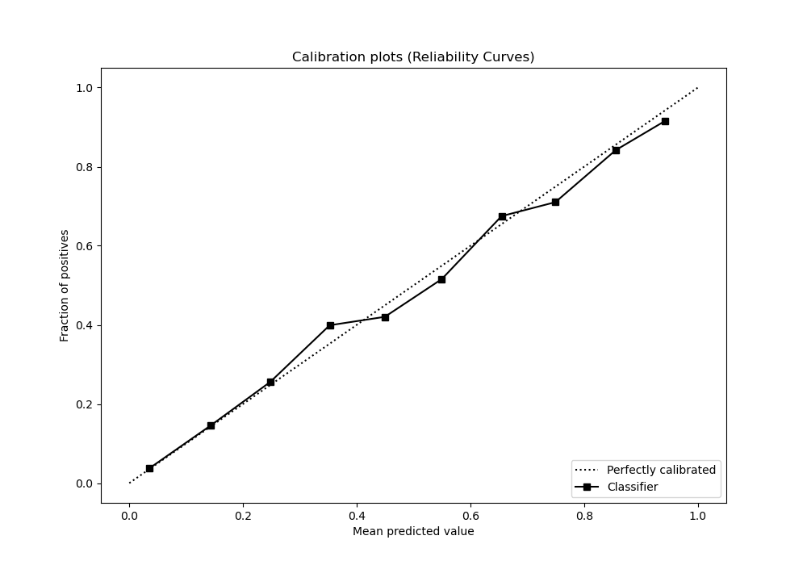
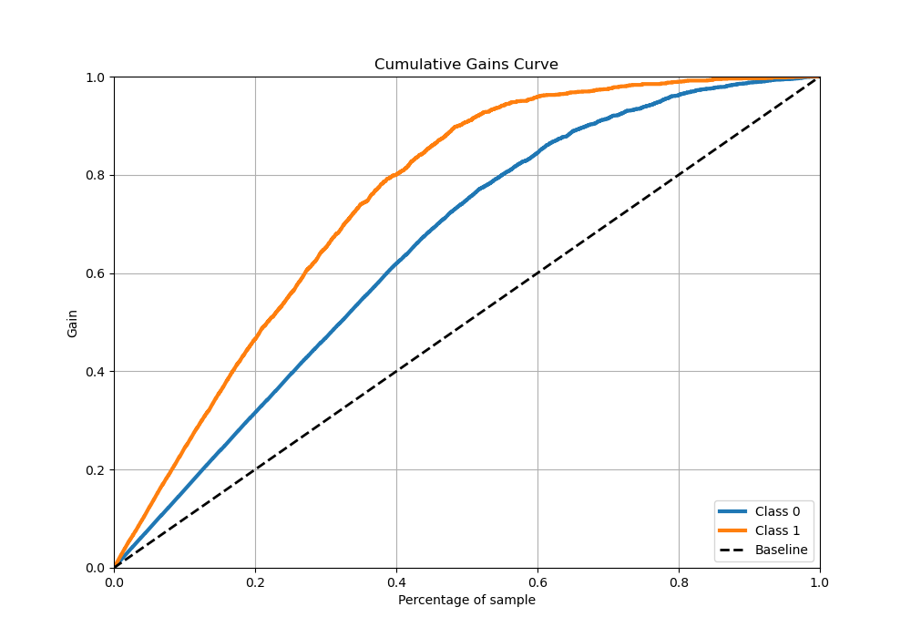
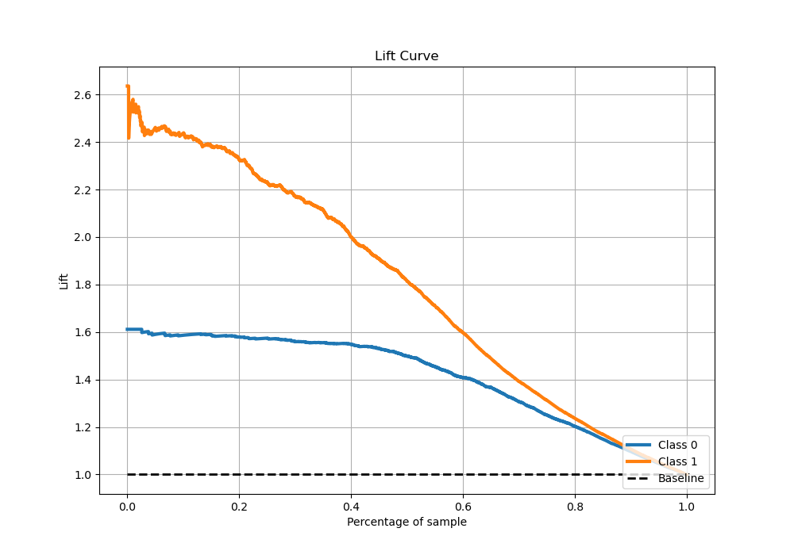

# Summary of 15_LightGBM_Stacked

[<< Go back](../README.md)

## LightGBM
- **n_jobs**: -1
- **objective**: binary
- **num_leaves**: 15
- **learning_rate**: 0.1
- **feature_fraction**: 0.8
- **bagging_fraction**: 0.5
- **min_data_in_leaf**: 5
- **metric**: binary_logloss
- **custom_eval_metric_name**: None
- **explain_level**: 0

## Validation
 - **validation_type**: kfold
 - **stratify**: True
 - **k_folds**: 5
 - **shuffle**: True
 - **random_seed**: 42

## Optimized metric
logloss

## Training time

37.6 seconds

## Metric details
|           |    score |   threshold |
|:----------|---------:|------------:|
| logloss   | 0.376829 | nan         |
| auc       | 0.904598 | nan         |
| f1        | 0.789298 |   0.317814  |
| accuracy  | 0.834109 |   0.513343  |
| precision | 0.965517 |   0.945839  |
| recall    | 1        |   0.0106466 |
| mcc       | 0.648171 |   0.513343  |

## Metric details with threshold from accuracy metric
|           |    score |   threshold |
|:----------|---------:|------------:|
| logloss   | 0.376829 |  nan        |
| auc       | 0.904598 |  nan        |
| f1        | 0.782077 |    0.513343 |
| accuracy  | 0.834109 |    0.513343 |
| precision | 0.779582 |    0.513343 |
| recall    | 0.784588 |    0.513343 |
| mcc       | 0.648171 |    0.513343 |

## Confusion matrix (at threshold=0.513343)
|              |   Predicted as 0 |   Predicted as 1 |
|:-------------|-----------------:|-----------------:|
| Labeled as 0 |             2422 |              380 |
| Labeled as 1 |              369 |             1344 |

## Learning curves

## Confusion Matrix

## Normalized Confusion Matrix

## ROC Curve

## Kolmogorov-Smirnov Statistic

## Precision-Recall Curve

## Calibration Curve

## Cumulative Gains Curve

## Lift Curve

[<< Go back](../README.md)
