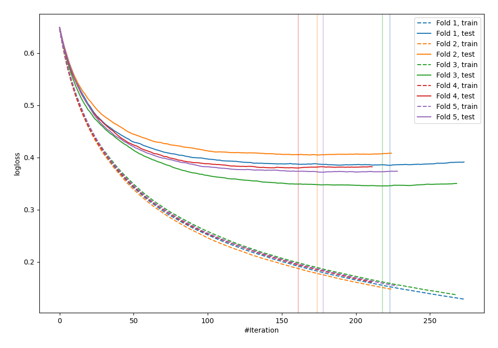
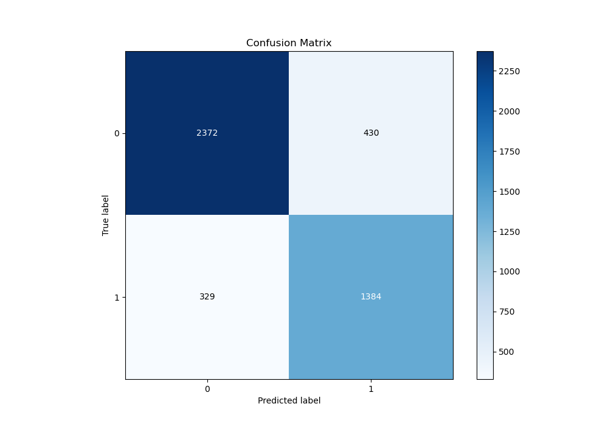
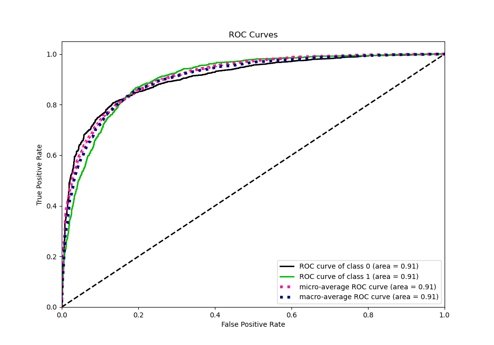
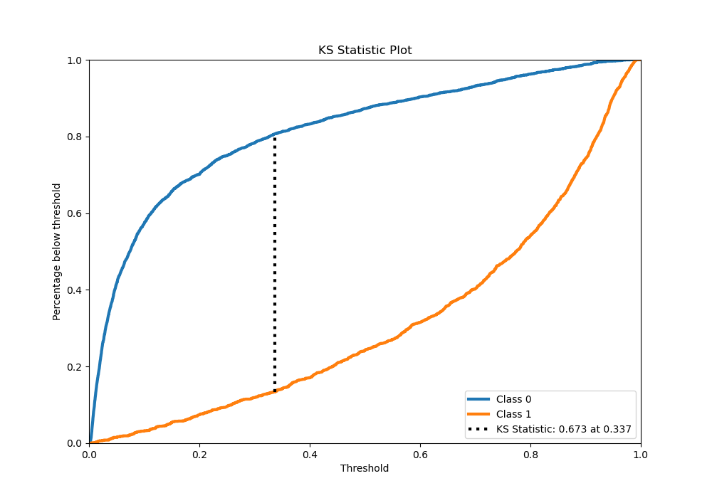
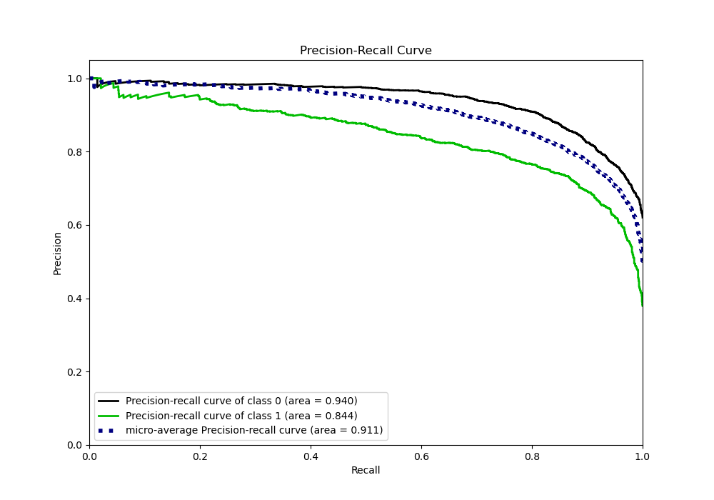
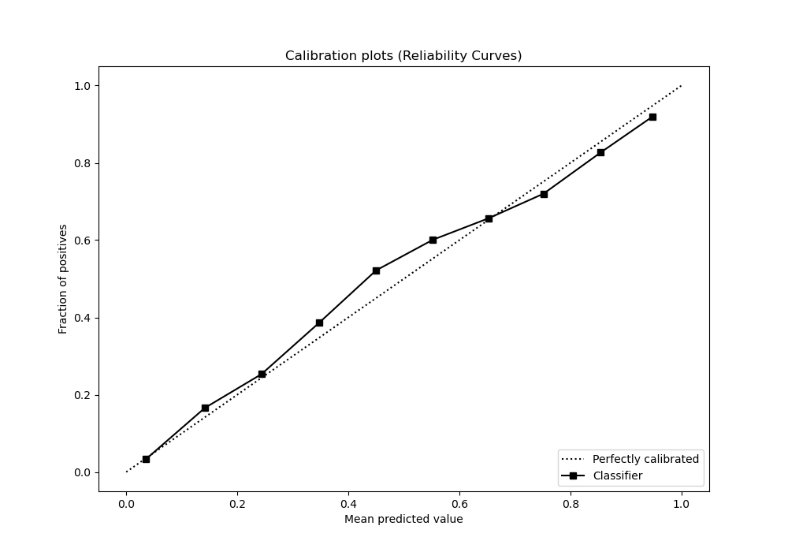
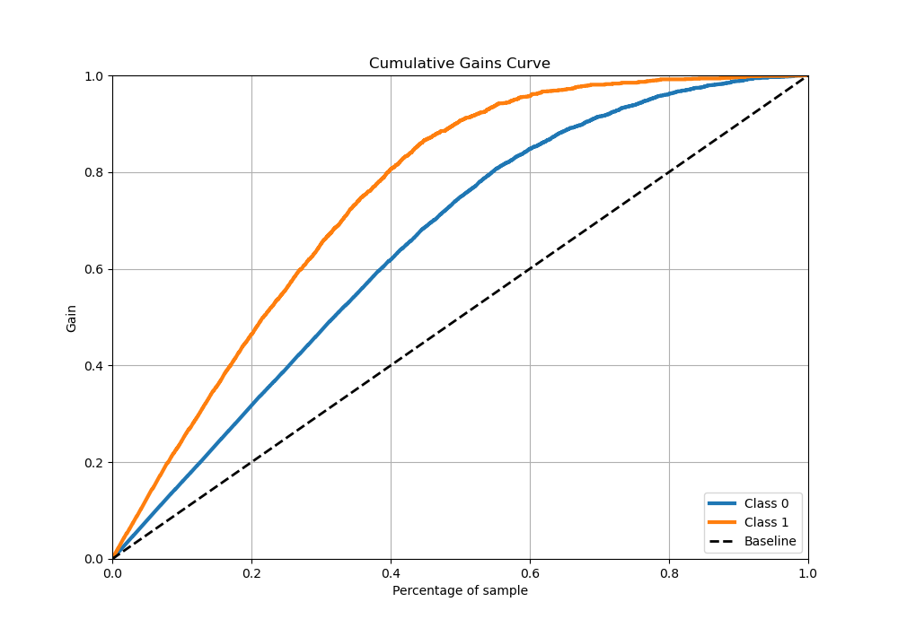
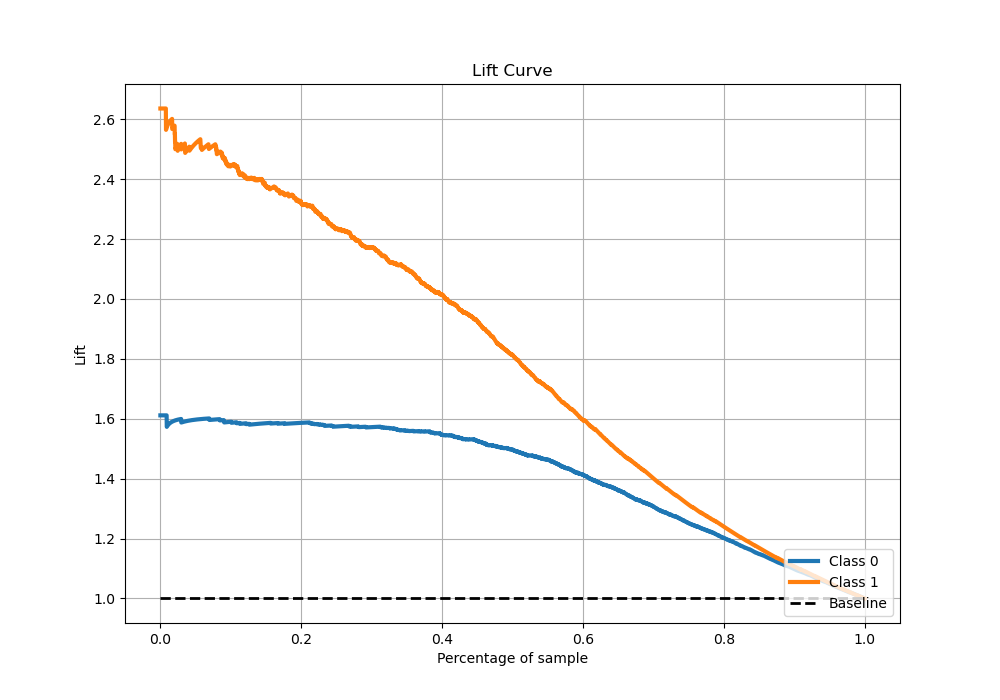

# Summary of 16_LightGBM

[<< Go back](../README.md)

## LightGBM
- **n_jobs**: -1
- **objective**: binary
- **num_leaves**: 31
- **learning_rate**: 0.05
- **feature_fraction**: 0.9
- **bagging_fraction**: 0.9
- **min_data_in_leaf**: 20
- **metric**: binary_logloss
- **custom_eval_metric_name**: None
- **explain_level**: 0

## Validation
 - **validation_type**: kfold
 - **stratify**: True
 - **k_folds**: 5
 - **shuffle**: True
 - **random_seed**: 42

## Optimized metric
logloss

## Training time

142.3 seconds

## Metric details
|           |    score |   threshold |
|:----------|---------:|------------:|
| logloss   | 0.377237 | nan         |
| auc       | 0.905444 | nan         |
| f1        | 0.792555 |   0.350393  |
| accuracy  | 0.831894 |   0.430403  |
| precision | 0.983051 |   0.975074  |
| recall    | 1        |   0.0010798 |
| mcc       | 0.654884 |   0.350393  |

## Metric details with threshold from accuracy metric
|           |    score |   threshold |
|:----------|---------:|------------:|
| logloss   | 0.377237 |  nan        |
| auc       | 0.905444 |  nan        |
| f1        | 0.784803 |    0.430403 |
| accuracy  | 0.831894 |    0.430403 |
| precision | 0.762955 |    0.430403 |
| recall    | 0.807939 |    0.430403 |
| mcc       | 0.647778 |    0.430403 |

## Confusion matrix (at threshold=0.430403)
|              |   Predicted as 0 |   Predicted as 1 |
|:-------------|-----------------:|-----------------:|
| Labeled as 0 |             2372 |              430 |
| Labeled as 1 |              329 |             1384 |

## Learning curves

## Confusion Matrix

## Normalized Confusion Matrix

## ROC Curve

## Kolmogorov-Smirnov Statistic

## Precision-Recall Curve

## Calibration Curve

## Cumulative Gains Curve

## Lift Curve

[<< Go back](../README.md)
