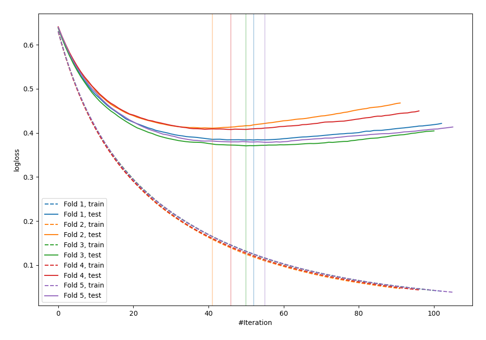
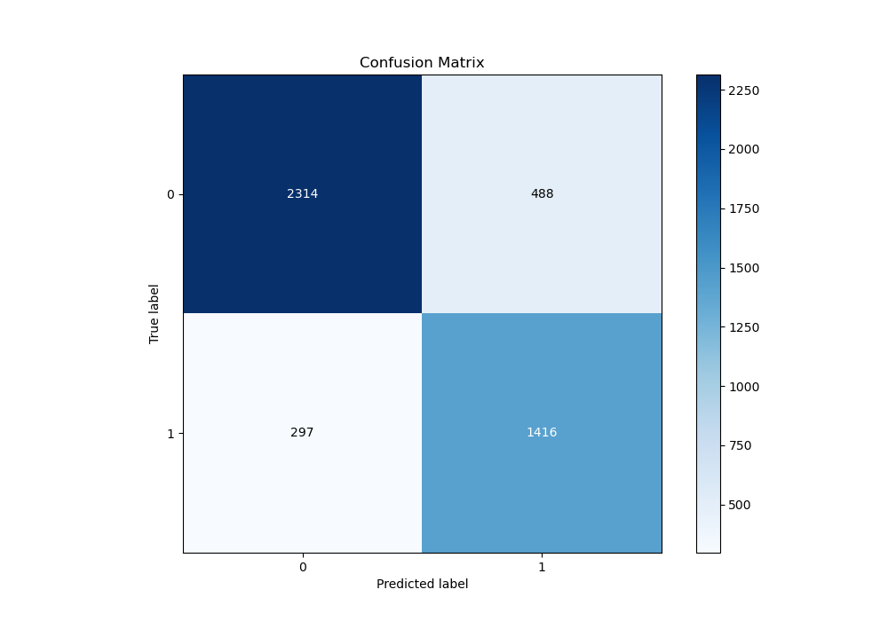
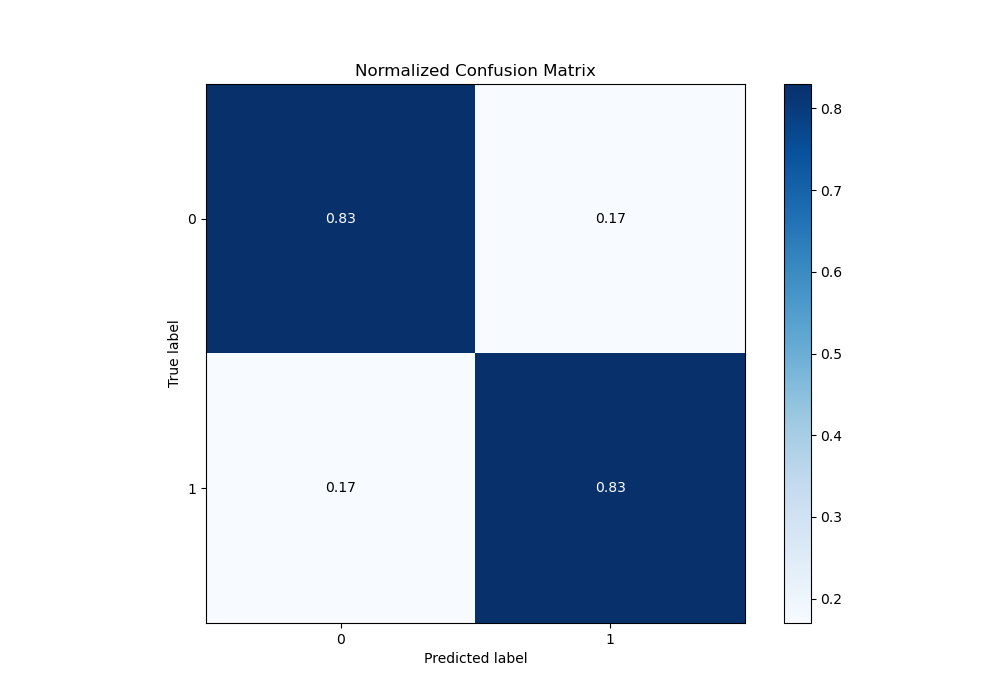
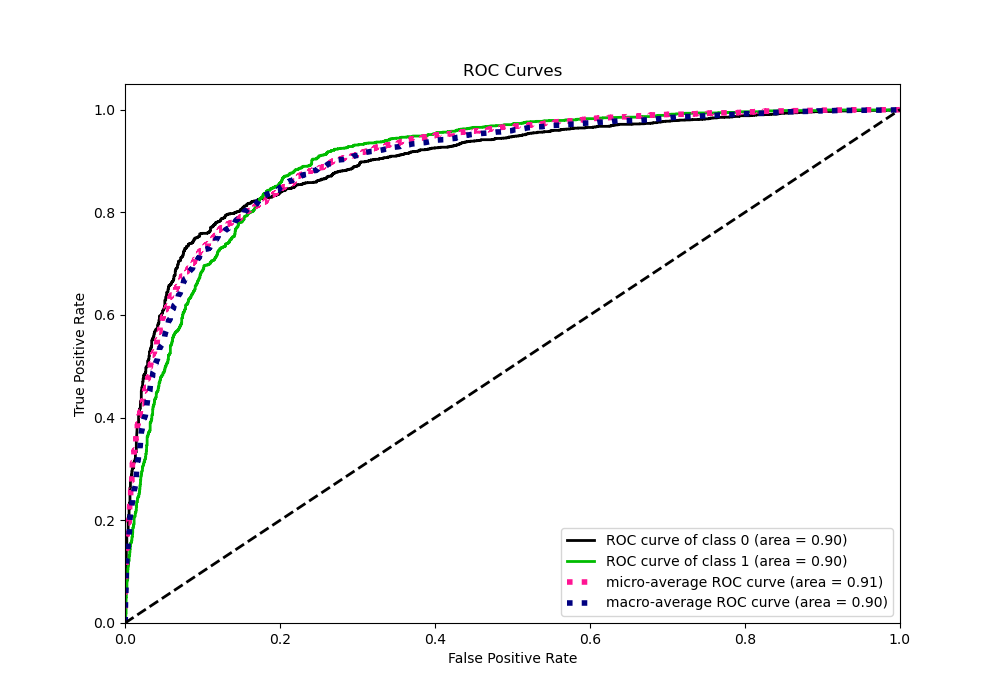
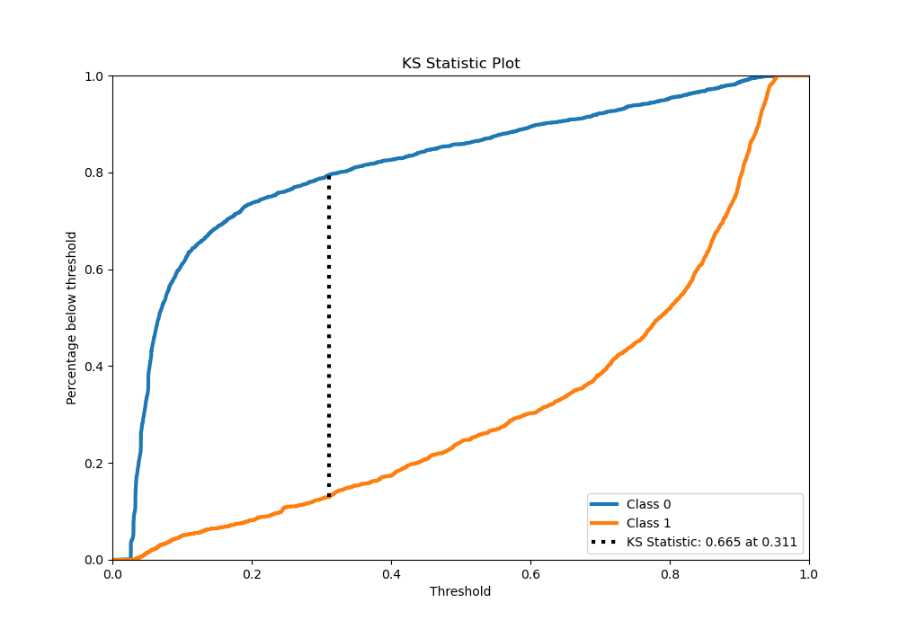
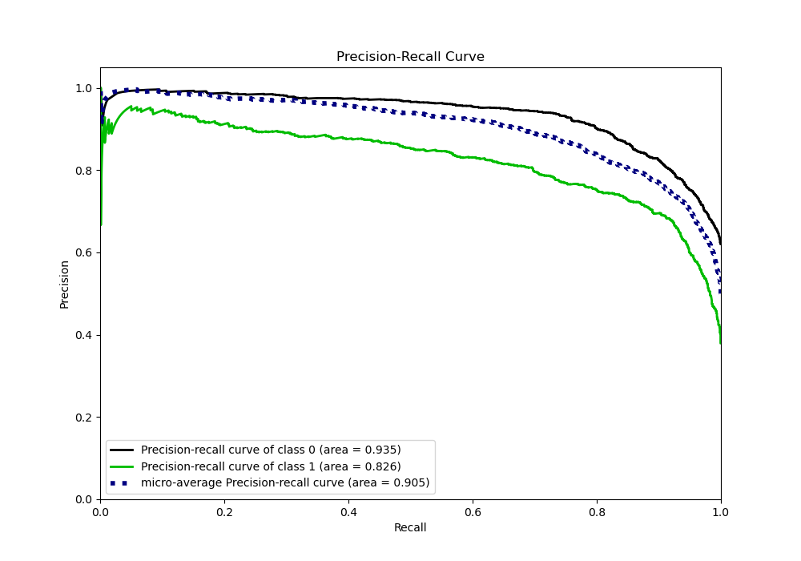
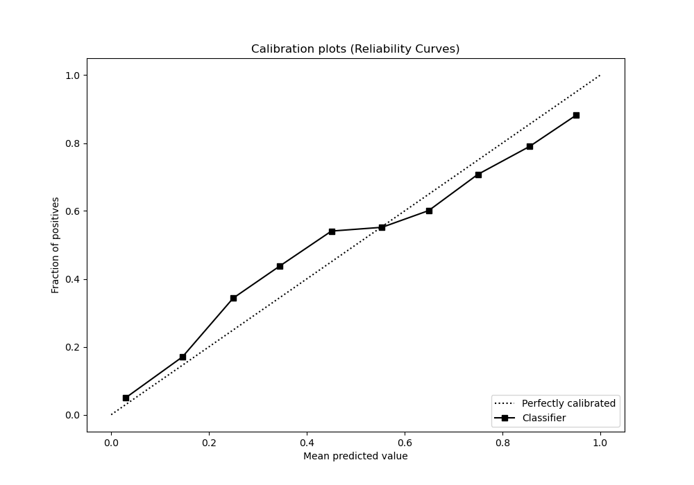
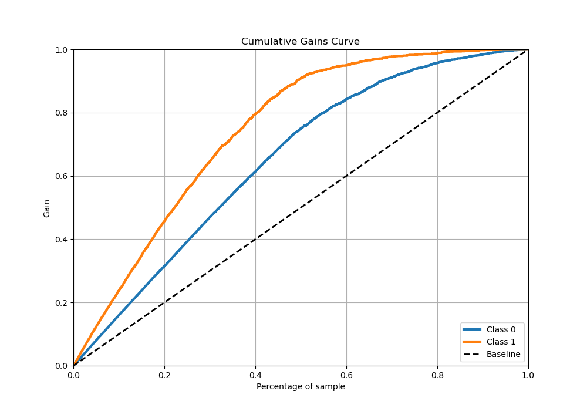
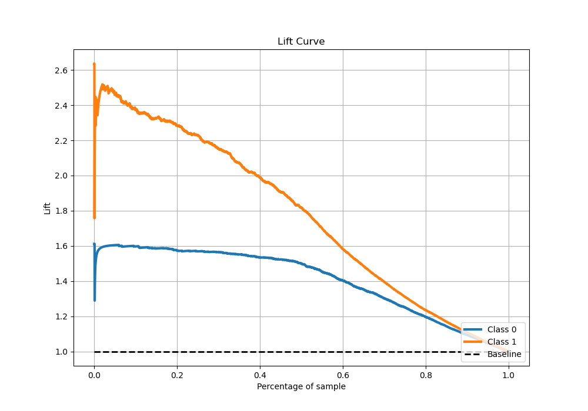

# Summary of 17_LightGBM_Stacked

[<< Go back](../README.md)

## LightGBM
- **n_jobs**: -1
- **objective**: binary
- **num_leaves**: 95
- **learning_rate**: 0.05
- **feature_fraction**: 0.9
- **bagging_fraction**: 0.8
- **min_data_in_leaf**: 10
- **metric**: binary_logloss
- **custom_eval_metric_name**: None
- **explain_level**: 0

## Validation
 - **validation_type**: kfold
 - **stratify**: True
 - **k_folds**: 5
 - **shuffle**: True
 - **random_seed**: 42

## Optimized metric
logloss

## Training time

166.1 seconds

## Metric details
|           |    score |   threshold |
|:----------|---------:|------------:|
| logloss   | 0.3903   | nan         |
| auc       | 0.8991   | nan         |
| f1        | 0.78709  |   0.282511  |
| accuracy  | 0.826135 |   0.399603  |
| precision | 0.951923 |   0.936357  |
| recall    | 1        |   0.0236134 |
| mcc       | 0.643962 |   0.30472   |

## Metric details with threshold from accuracy metric
|           |    score |   threshold |
|:----------|---------:|------------:|
| logloss   | 0.3903   |  nan        |
| auc       | 0.8991   |  nan        |
| f1        | 0.782969 |    0.399603 |
| accuracy  | 0.826135 |    0.399603 |
| precision | 0.743697 |    0.399603 |
| recall    | 0.82662  |    0.399603 |
| mcc       | 0.641105 |    0.399603 |

## Confusion matrix (at threshold=0.399603)
|              |   Predicted as 0 |   Predicted as 1 |
|:-------------|-----------------:|-----------------:|
| Labeled as 0 |             2314 |              488 |
| Labeled as 1 |              297 |             1416 |

## Learning curves

## Confusion Matrix

## Normalized Confusion Matrix

## ROC Curve

## Kolmogorov-Smirnov Statistic

## Precision-Recall Curve

## Calibration Curve

## Cumulative Gains Curve

## Lift Curve

[<< Go back](../README.md)
