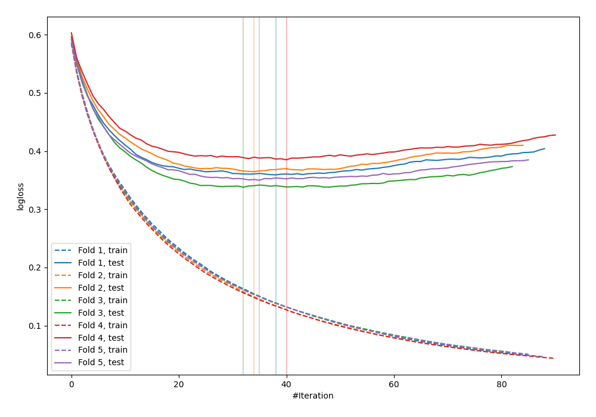
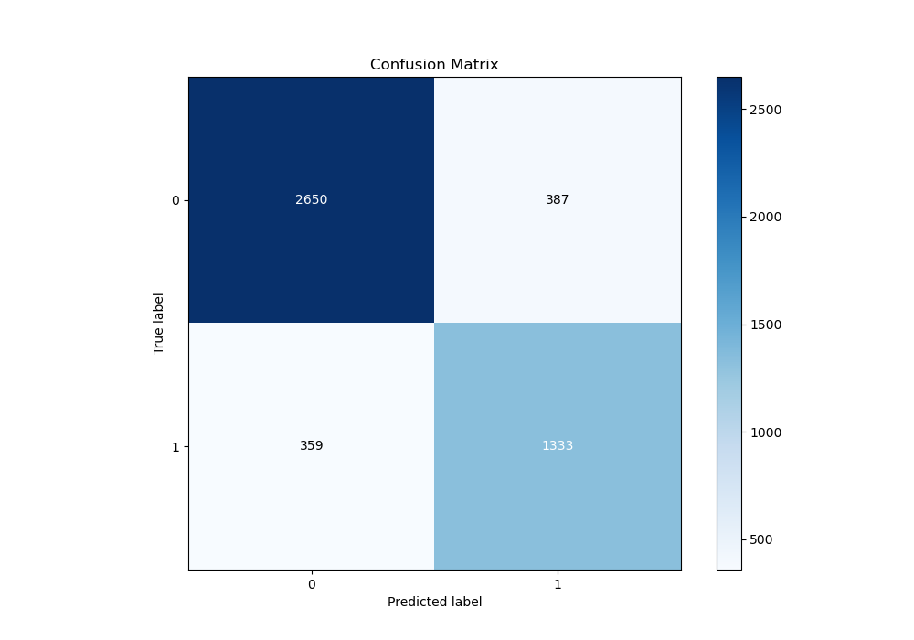
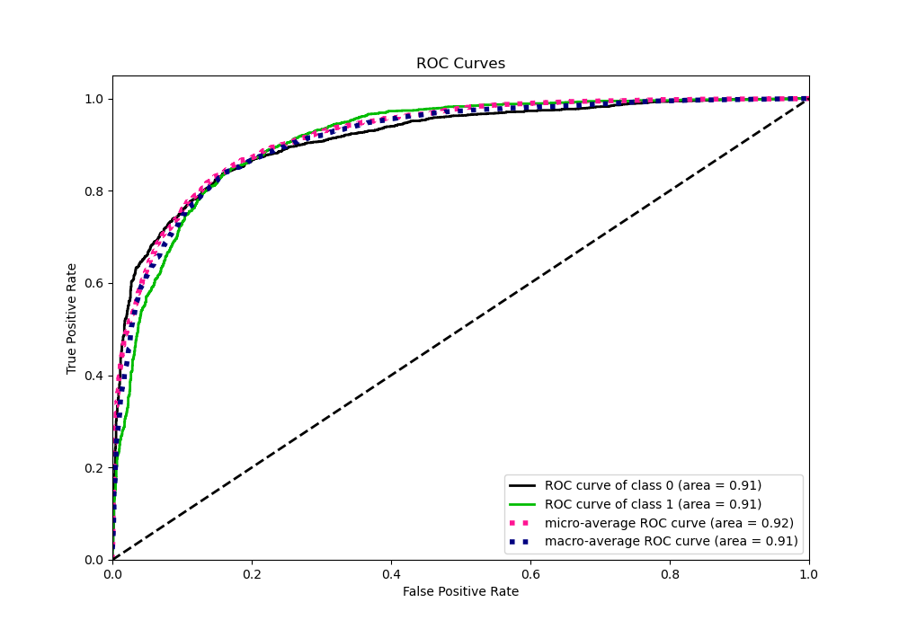
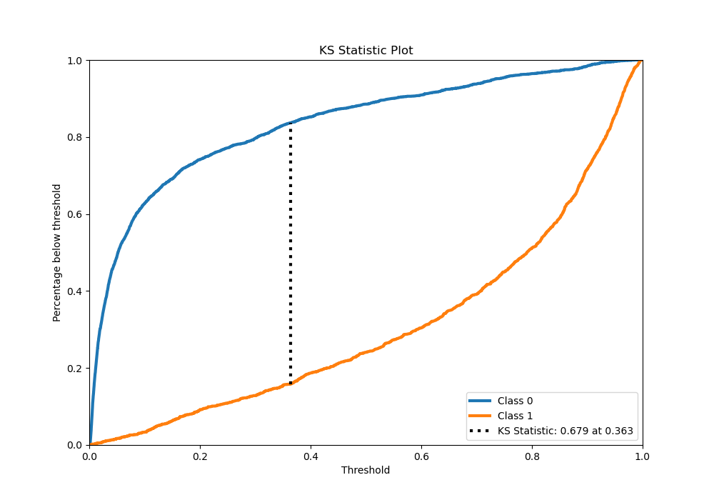
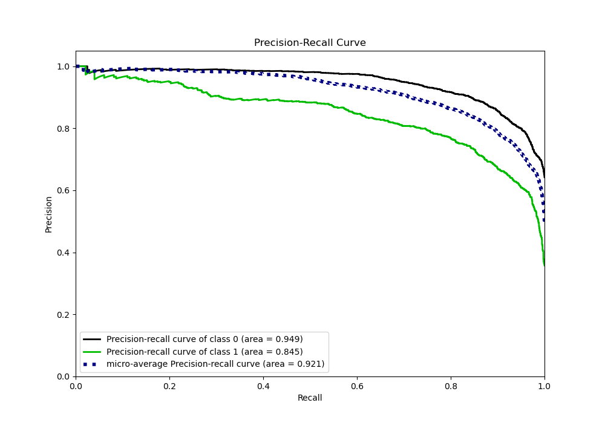
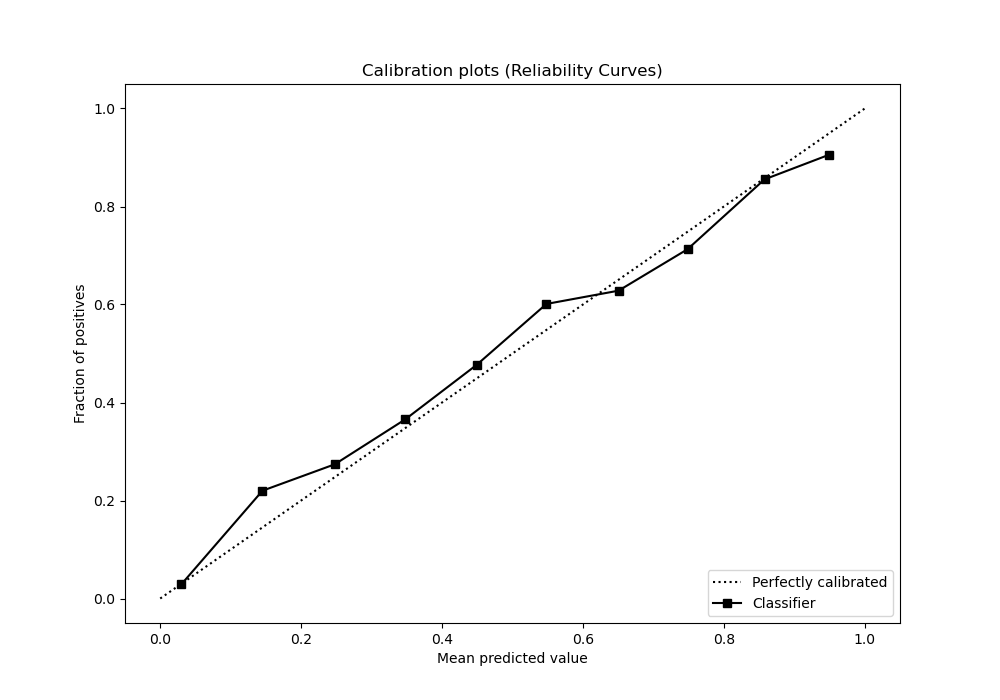
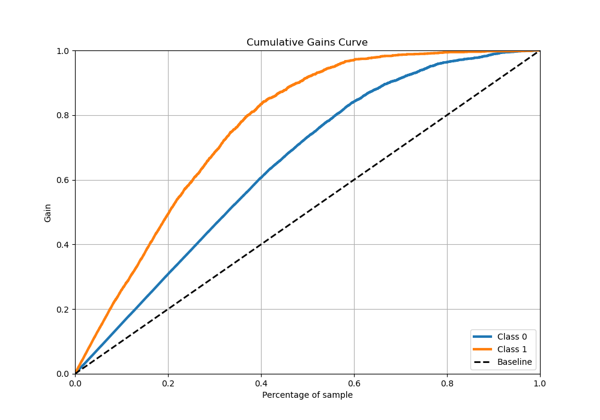
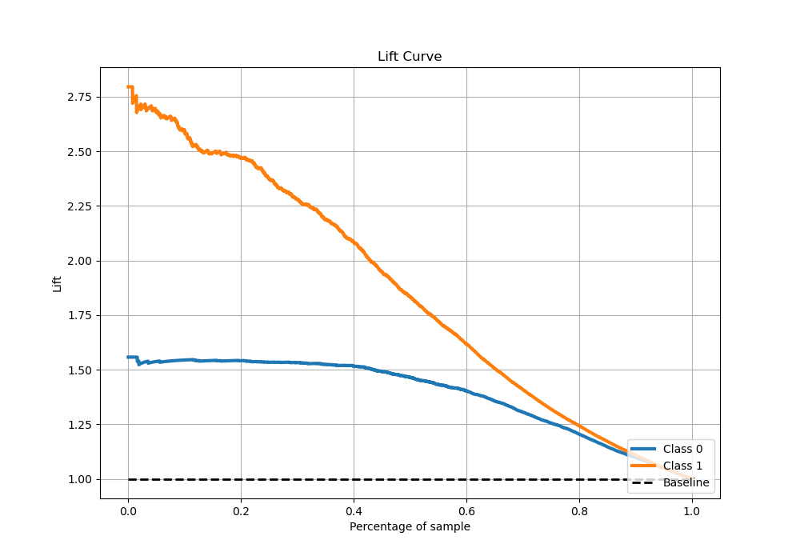

# Summary of 18_LightGBM

[<< Go back](../README.md)

## LightGBM
- **n_jobs**: -1
- **objective**: binary
- **num_leaves**: 63
- **learning_rate**: 0.2
- **feature_fraction**: 0.5
- **bagging_fraction**: 0.8
- **min_data_in_leaf**: 30
- **metric**: binary_logloss
- **custom_eval_metric_name**: None
- **explain_level**: 0

## Validation
 - **validation_type**: kfold
 - **stratify**: True
 - **k_folds**: 5
 - **shuffle**: True
 - **random_seed**: 42

## Optimized metric
logloss

## Training time

30.4 seconds

## Metric details
|           |    score |     threshold |
|:----------|---------:|--------------:|
| logloss   | 0.359414 | nan           |
| auc       | 0.912825 | nan           |
| f1        | 0.788333 |   0.369019    |
| accuracy  | 0.84225  |   0.450461    |
| precision | 0.967213 |   0.969435    |
| recall    | 1        |   0.000600253 |
| mcc       | 0.662109 |   0.369019    |

## Metric details with threshold from accuracy metric
|           |    score |   threshold |
|:----------|---------:|------------:|
| logloss   | 0.359414 |  nan        |
| auc       | 0.912825 |  nan        |
| f1        | 0.78136  |    0.450461 |
| accuracy  | 0.84225  |    0.450461 |
| precision | 0.775    |    0.450461 |
| recall    | 0.787825 |    0.450461 |
| mcc       | 0.65804  |    0.450461 |

## Confusion matrix (at threshold=0.450461)
|              |   Predicted as 0 |   Predicted as 1 |
|:-------------|-----------------:|-----------------:|
| Labeled as 0 |             2650 |              387 |
| Labeled as 1 |              359 |             1333 |

## Learning curves

## Confusion Matrix

## Normalized Confusion Matrix

## ROC Curve

## Kolmogorov-Smirnov Statistic

## Precision-Recall Curve

## Calibration Curve

## Cumulative Gains Curve

## Lift Curve

[<< Go back](../README.md)
