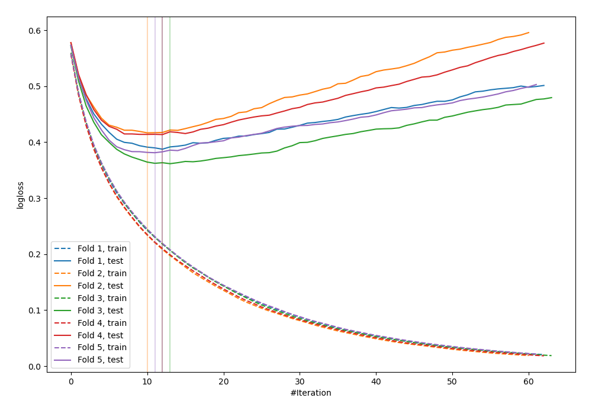
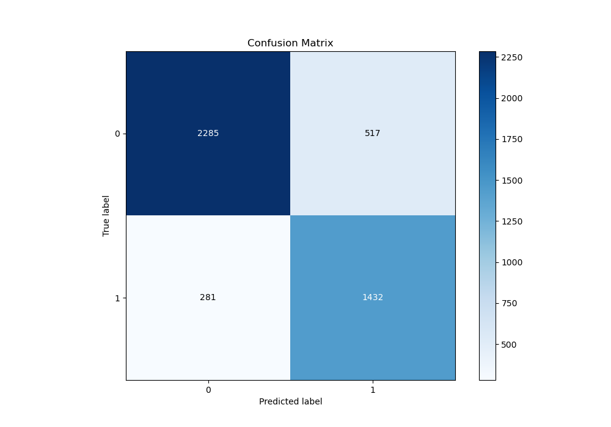
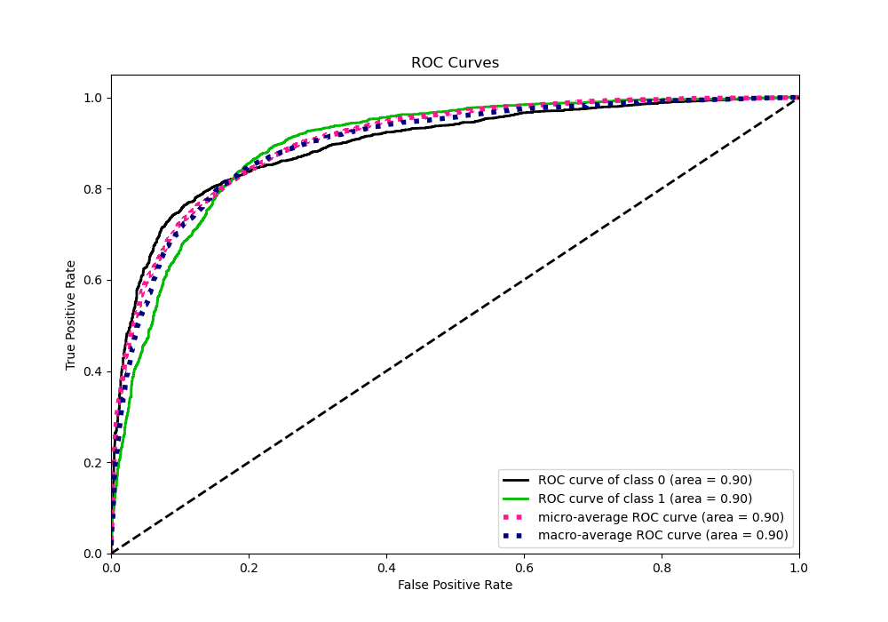
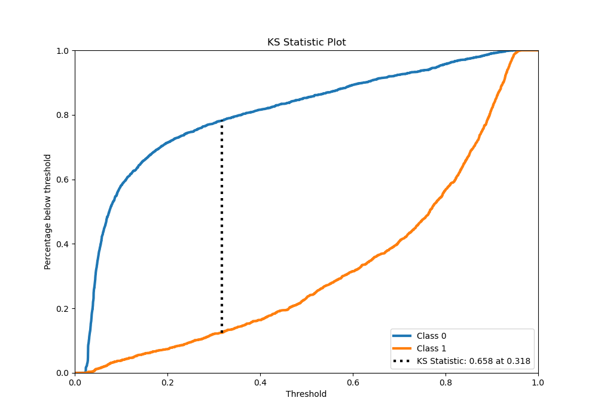
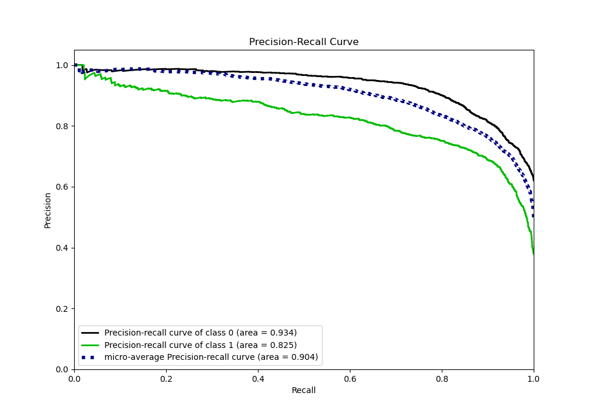
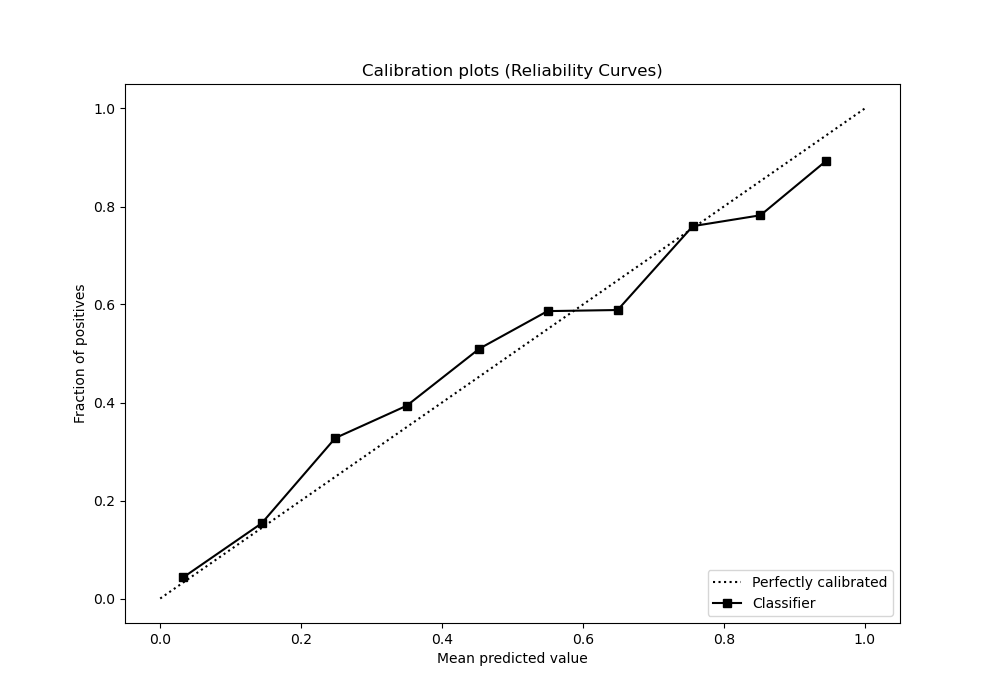
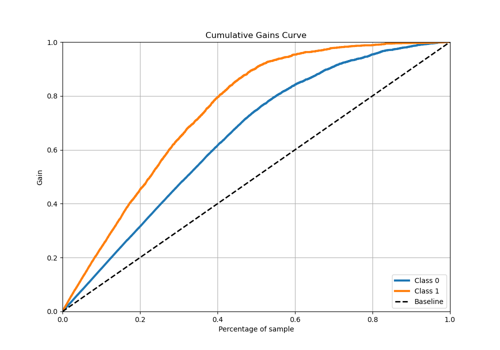
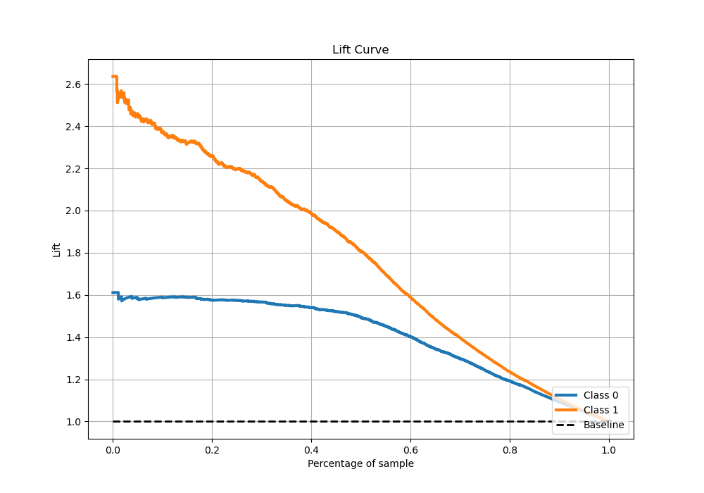

# Summary of 18_LightGBM_Stacked

[<< Go back](../README.md)

## LightGBM
- **n_jobs**: -1
- **objective**: binary
- **num_leaves**: 63
- **learning_rate**: 0.2
- **feature_fraction**: 0.5
- **bagging_fraction**: 0.8
- **min_data_in_leaf**: 30
- **metric**: binary_logloss
- **custom_eval_metric_name**: None
- **explain_level**: 0

## Validation
 - **validation_type**: kfold
 - **stratify**: True
 - **k_folds**: 5
 - **shuffle**: True
 - **random_seed**: 42

## Optimized metric
logloss

## Training time

107.1 seconds

## Metric details
|           |    score |   threshold |
|:----------|---------:|------------:|
| logloss   | 0.392203 |  nan        |
| auc       | 0.896948 |  nan        |
| f1        | 0.784115 |    0.351052 |
| accuracy  | 0.823256 |    0.399096 |
| precision | 0.966102 |    0.942153 |
| recall    | 1        |    0.019896 |
| mcc       | 0.63965  |    0.351052 |

## Metric details with threshold from accuracy metric
|           |    score |   threshold |
|:----------|---------:|------------:|
| logloss   | 0.392203 |  nan        |
| auc       | 0.896948 |  nan        |
| f1        | 0.782086 |    0.399096 |
| accuracy  | 0.823256 |    0.399096 |
| precision | 0.734736 |    0.399096 |
| recall    | 0.83596  |    0.399096 |
| mcc       | 0.638203 |    0.399096 |

## Confusion matrix (at threshold=0.399096)
|              |   Predicted as 0 |   Predicted as 1 |
|:-------------|-----------------:|-----------------:|
| Labeled as 0 |             2285 |              517 |
| Labeled as 1 |              281 |             1432 |

## Learning curves

## Confusion Matrix

## Normalized Confusion Matrix

## ROC Curve

## Kolmogorov-Smirnov Statistic

## Precision-Recall Curve

## Calibration Curve

## Cumulative Gains Curve

## Lift Curve

[<< Go back](../README.md)
