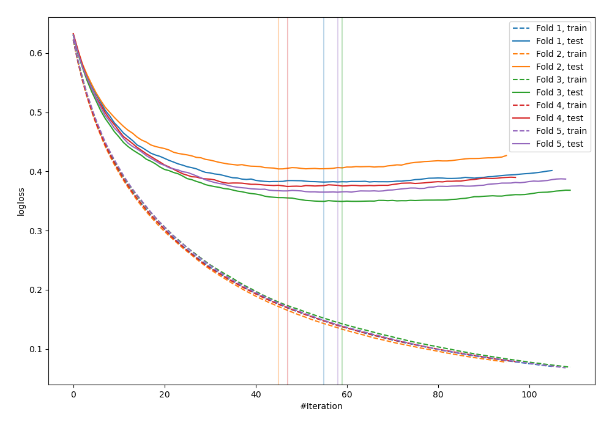
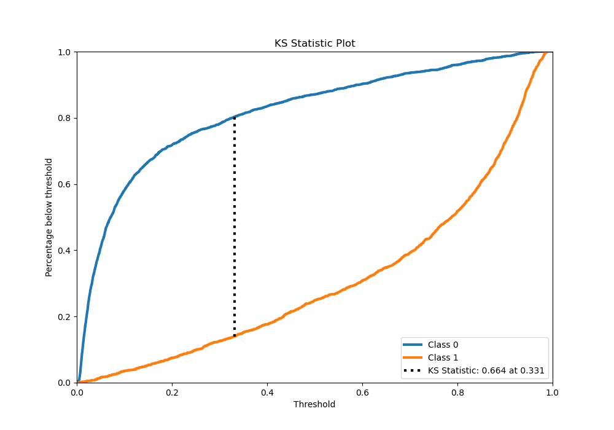
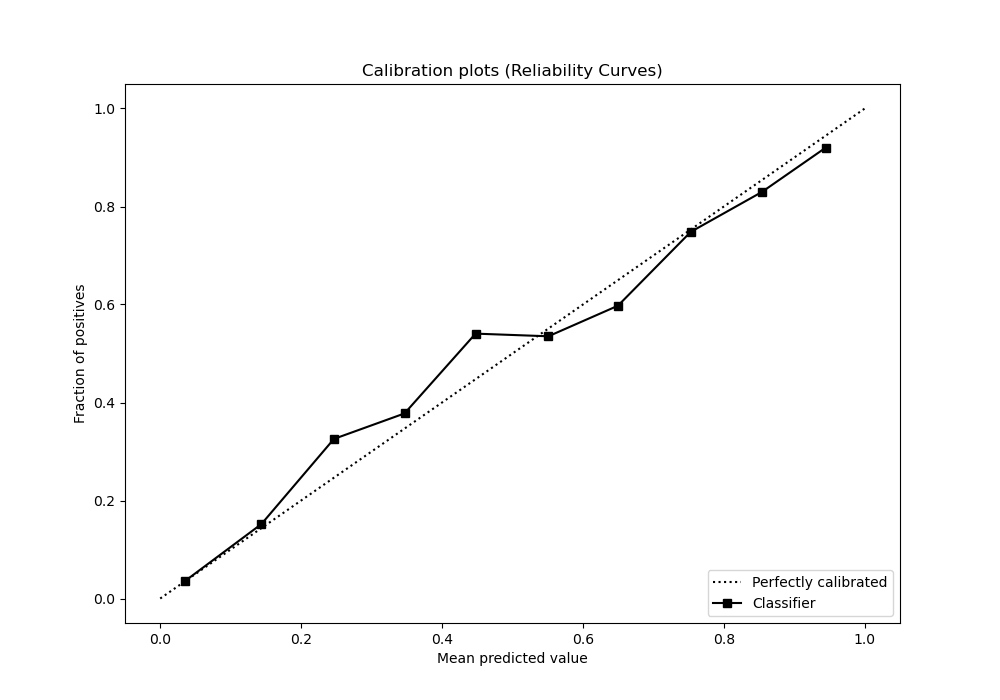
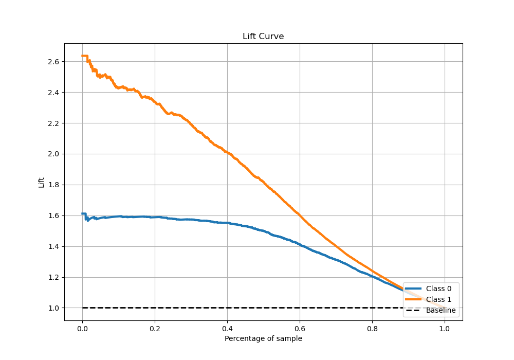

# Summary of 19_LightGBM

[<< Go back](../README.md)

## LightGBM
- **n_jobs**: -1
- **objective**: binary
- **num_leaves**: 63
- **learning_rate**: 0.1
- **feature_fraction**: 0.8
- **bagging_fraction**: 0.8
- **min_data_in_leaf**: 15
- **metric**: binary_logloss
- **custom_eval_metric_name**: None
- **explain_level**: 0

## Validation
 - **validation_type**: kfold
 - **stratify**: True
 - **k_folds**: 5
 - **shuffle**: True
 - **random_seed**: 42

## Optimized metric
logloss

## Training time

118.6 seconds

## Metric details
|           |    score |    threshold |
|:----------|---------:|-------------:|
| logloss   | 0.37494  | nan          |
| auc       | 0.906942 | nan          |
| f1        | 0.788238 |   0.344638   |
| accuracy  | 0.831229 |   0.406006   |
| precision | 1        |   0.971483   |
| recall    | 1        |   0.00287275 |
| mcc       | 0.64893  |   0.406006   |

## Metric details with threshold from accuracy metric
|           |    score |   threshold |
|:----------|---------:|------------:|
| logloss   | 0.37494  |  nan        |
| auc       | 0.906942 |  nan        |
| f1        | 0.786674 |    0.406006 |
| accuracy  | 0.831229 |    0.406006 |
| precision | 0.755783 |    0.406006 |
| recall    | 0.820198 |    0.406006 |
| mcc       | 0.64893  |    0.406006 |

## Confusion matrix (at threshold=0.406006)
|              |   Predicted as 0 |   Predicted as 1 |
|:-------------|-----------------:|-----------------:|
| Labeled as 0 |             2348 |              454 |
| Labeled as 1 |              308 |             1405 |

## Learning curves

## Confusion Matrix

## Normalized Confusion Matrix

## ROC Curve

## Kolmogorov-Smirnov Statistic

## Precision-Recall Curve

## Calibration Curve

## Cumulative Gains Curve

## Lift Curve

[<< Go back](../README.md)
