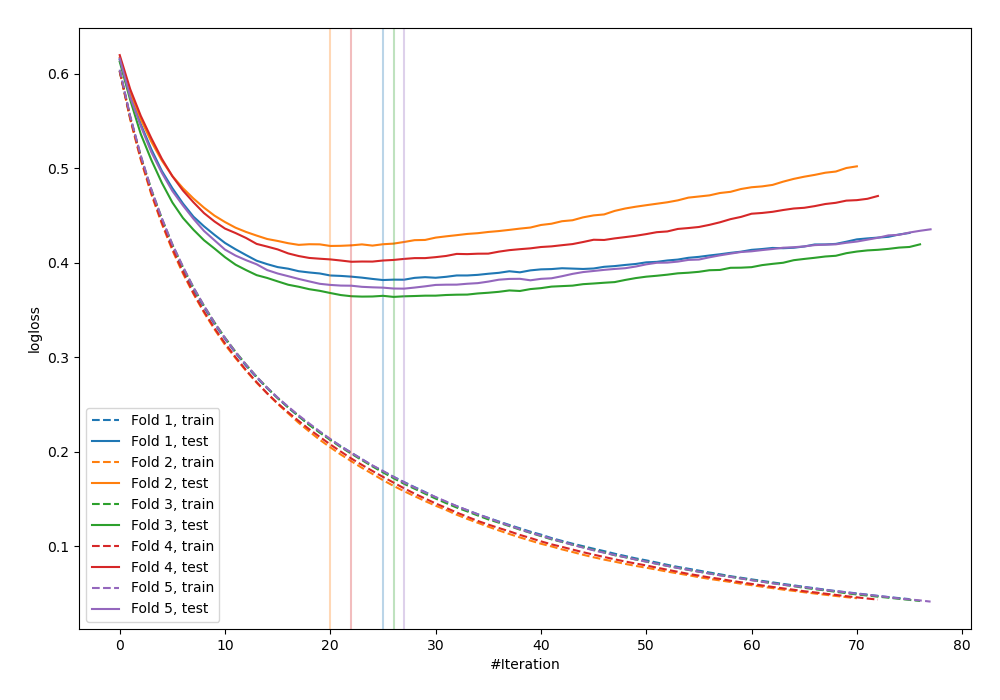
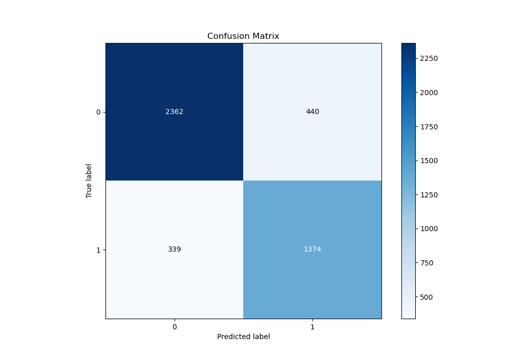
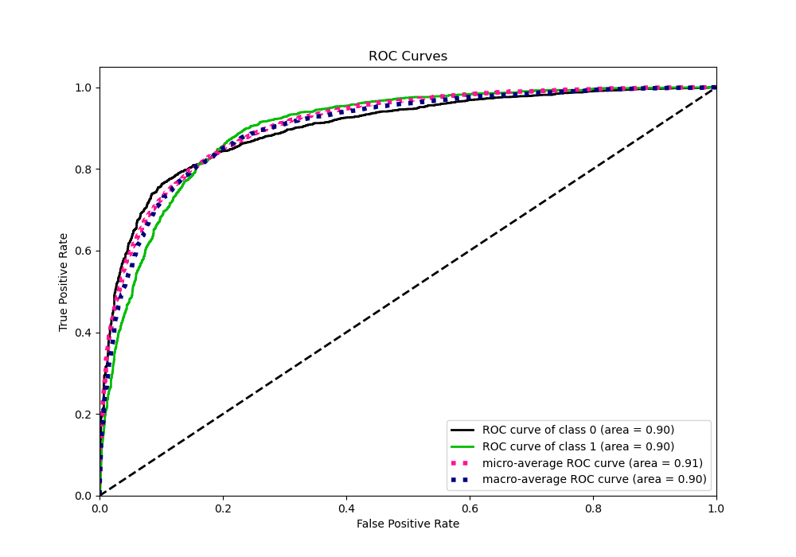
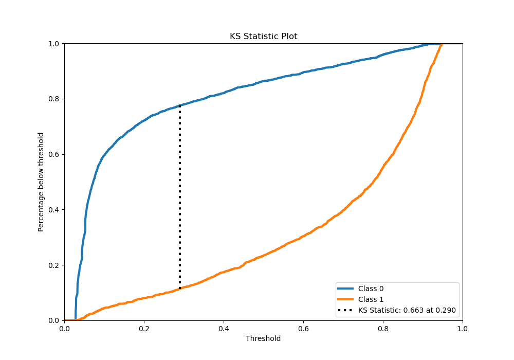
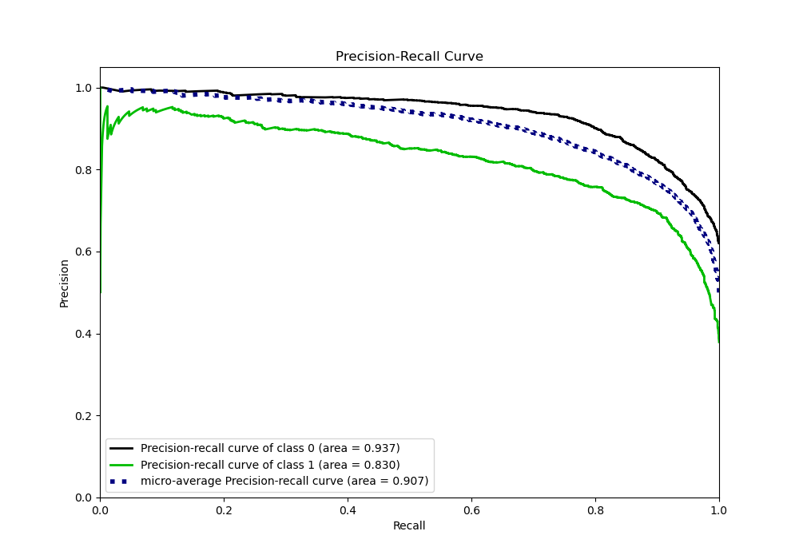
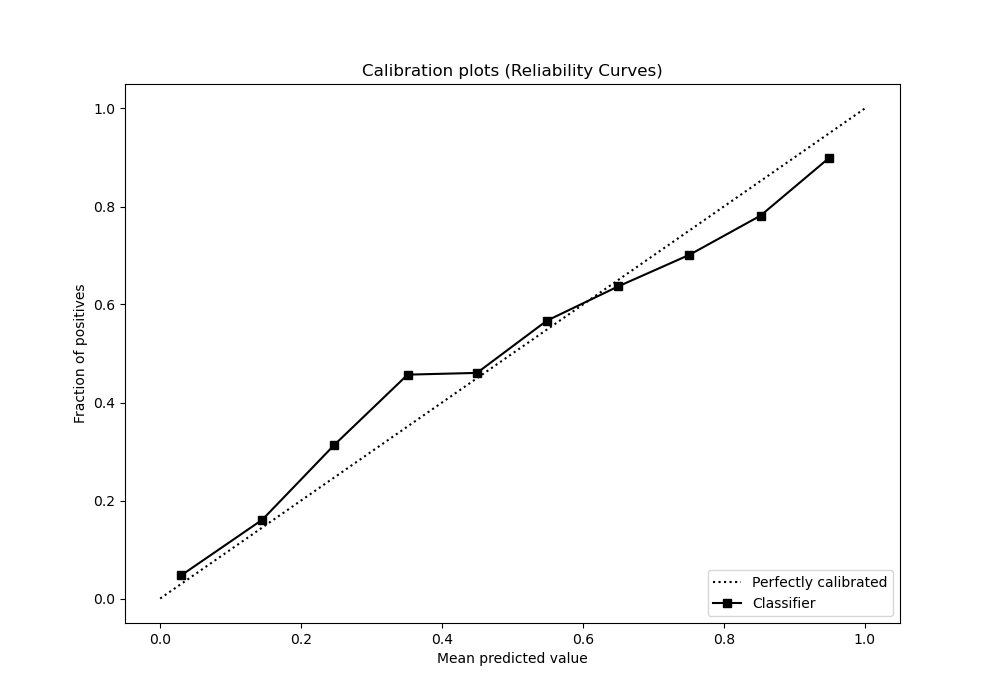
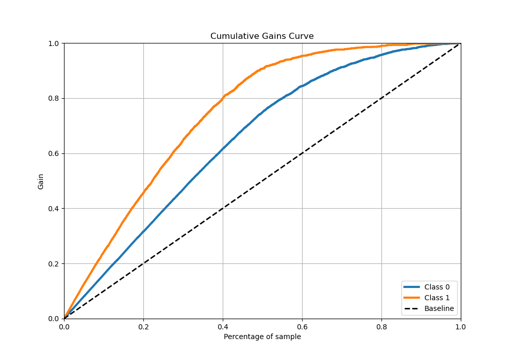
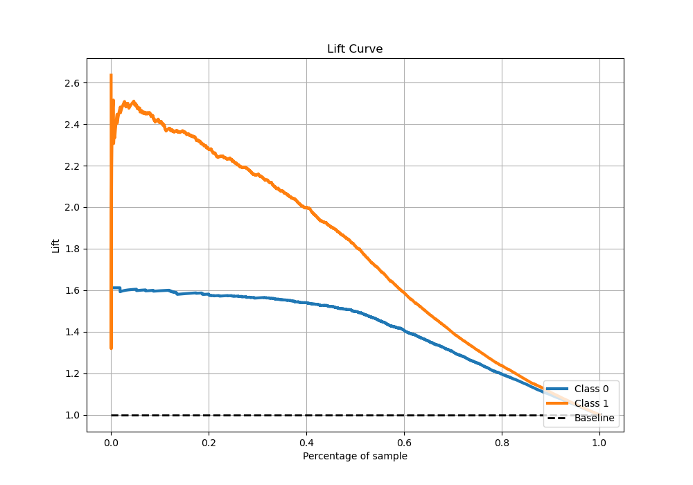

# Summary of 19_LightGBM_Stacked

[<< Go back](../README.md)

## LightGBM
- **n_jobs**: -1
- **objective**: binary
- **num_leaves**: 63
- **learning_rate**: 0.1
- **feature_fraction**: 0.8
- **bagging_fraction**: 0.8
- **min_data_in_leaf**: 15
- **metric**: binary_logloss
- **custom_eval_metric_name**: None
- **explain_level**: 0

## Validation
 - **validation_type**: kfold
 - **stratify**: True
 - **k_folds**: 5
 - **shuffle**: True
 - **random_seed**: 42

## Optimized metric
logloss

## Training time

101.0 seconds

## Metric details
|           |    score |   threshold |
|:----------|---------:|------------:|
| logloss   | 0.387431 | nan         |
| auc       | 0.900212 | nan         |
| f1        | 0.786937 |   0.323896  |
| accuracy  | 0.827464 |   0.447506  |
| precision | 0.948454 |   0.916669  |
| recall    | 1        |   0.0251732 |
| mcc       | 0.643962 |   0.323896  |

## Metric details with threshold from accuracy metric
|           |    score |   threshold |
|:----------|---------:|------------:|
| logloss   | 0.387431 |  nan        |
| auc       | 0.900212 |  nan        |
| f1        | 0.779132 |    0.447506 |
| accuracy  | 0.827464 |    0.447506 |
| precision | 0.757442 |    0.447506 |
| recall    | 0.802102 |    0.447506 |
| mcc       | 0.638468 |    0.447506 |

## Confusion matrix (at threshold=0.447506)
|              |   Predicted as 0 |   Predicted as 1 |
|:-------------|-----------------:|-----------------:|
| Labeled as 0 |             2362 |              440 |
| Labeled as 1 |              339 |             1374 |

## Learning curves

## Confusion Matrix

## Normalized Confusion Matrix

## ROC Curve

## Kolmogorov-Smirnov Statistic

## Precision-Recall Curve

## Calibration Curve

## Cumulative Gains Curve

## Lift Curve

[<< Go back](../README.md)
