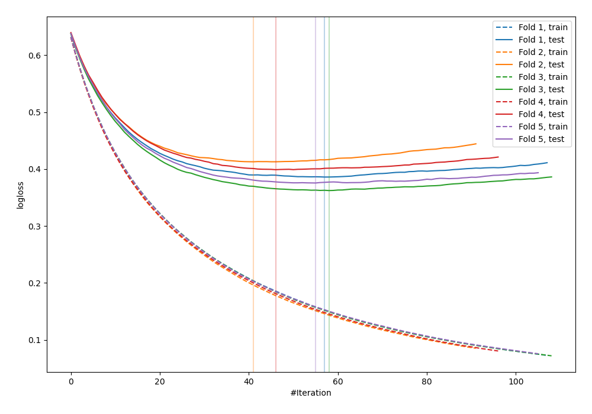
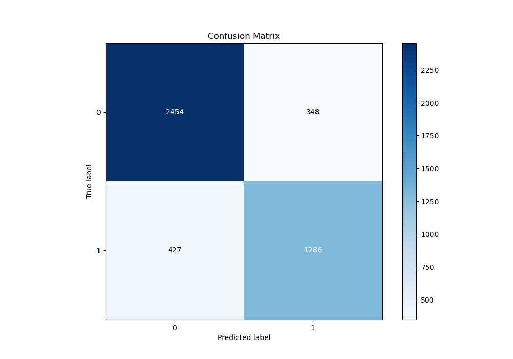
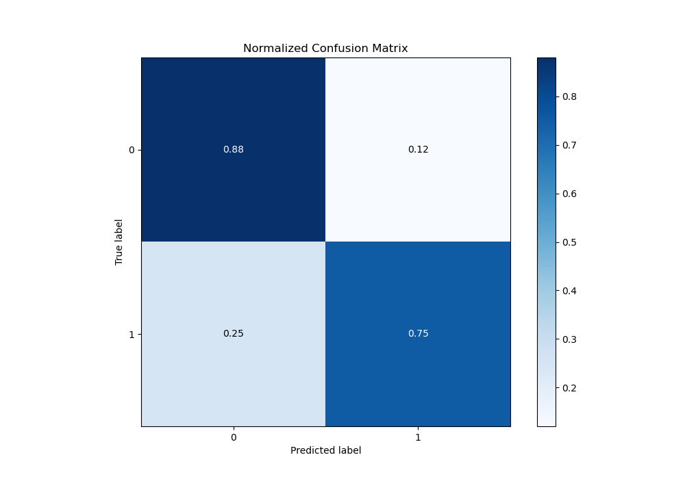
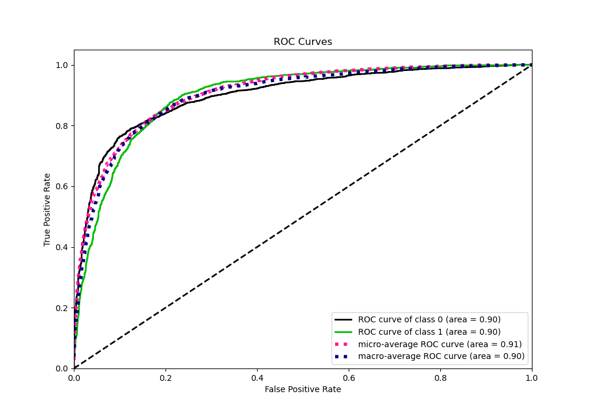
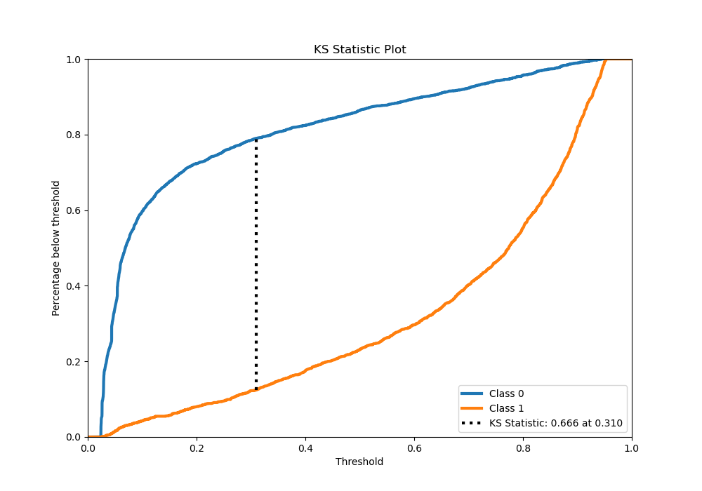
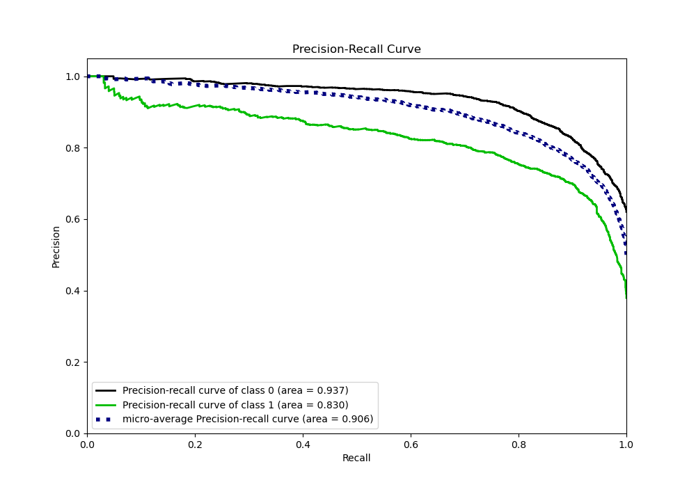
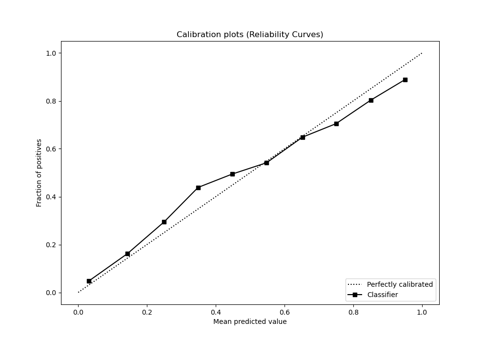
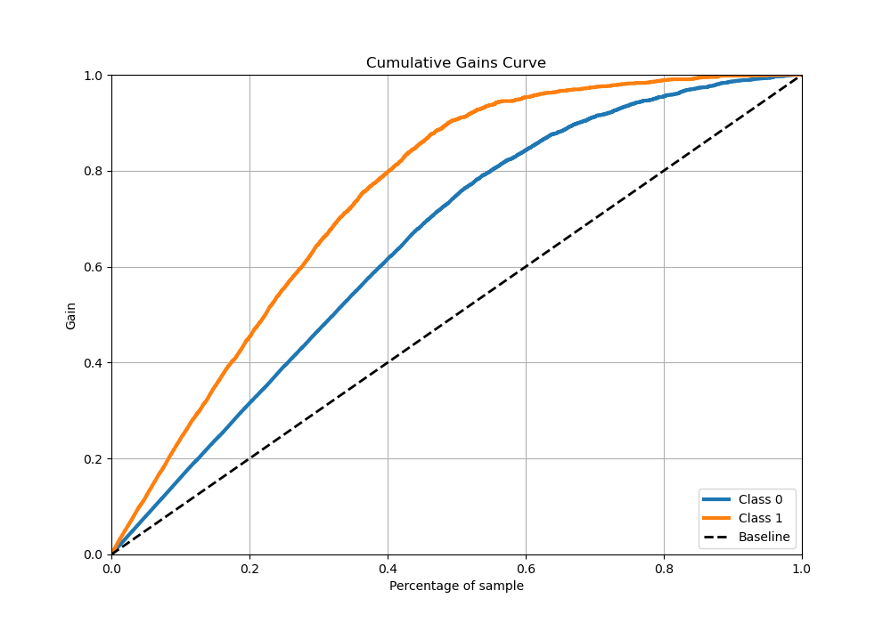
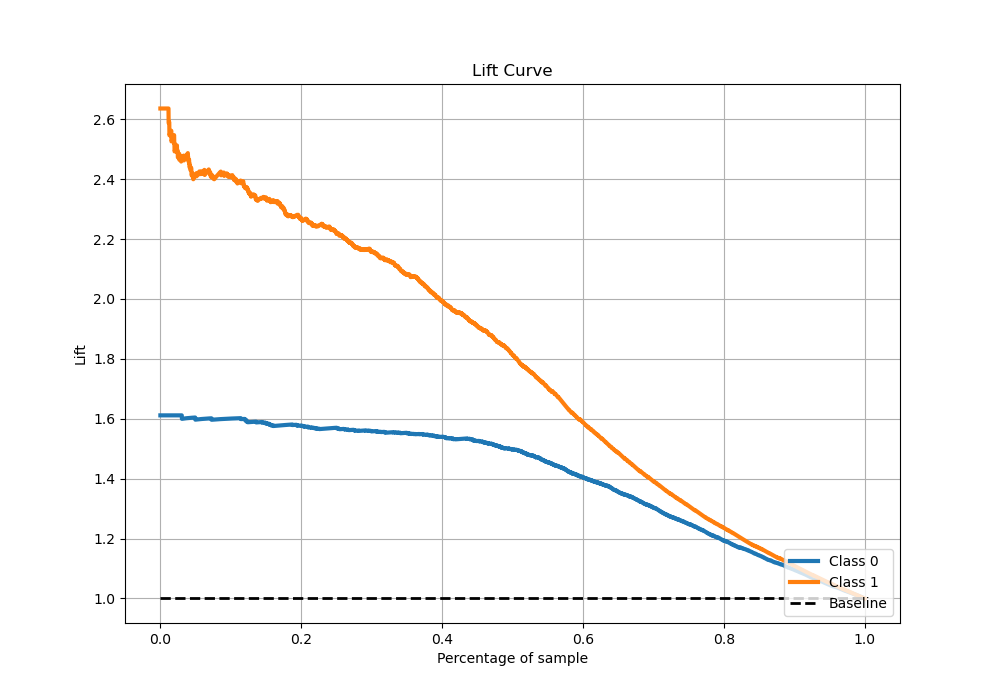

# Summary of 1_Default_LightGBM_Stacked

[<< Go back](../README.md)

## LightGBM
- **n_jobs**: -1
- **objective**: binary
- **num_leaves**: 63
- **learning_rate**: 0.05
- **feature_fraction**: 0.9
- **bagging_fraction**: 0.9
- **min_data_in_leaf**: 10
- **metric**: binary_logloss
- **custom_eval_metric_name**: None
- **explain_level**: 0

## Validation
 - **validation_type**: kfold
 - **stratify**: True
 - **k_folds**: 5
 - **shuffle**: True
 - **random_seed**: 42

## Optimized metric
logloss

## Training time

141.4 seconds

## Metric details
|           |    score |   threshold |
|:----------|---------:|------------:|
| logloss   | 0.387146 | nan         |
| auc       | 0.899753 | nan         |
| f1        | 0.788517 |   0.312136  |
| accuracy  | 0.82835  |   0.535333  |
| precision | 0.966102 |   0.944291  |
| recall    | 1        |   0.0211464 |
| mcc       | 0.646709 |   0.312136  |

## Metric details with threshold from accuracy metric
|           |    score |   threshold |
|:----------|---------:|------------:|
| logloss   | 0.387146 |  nan        |
| auc       | 0.899753 |  nan        |
| f1        | 0.768449 |    0.535333 |
| accuracy  | 0.82835  |    0.535333 |
| precision | 0.787026 |    0.535333 |
| recall    | 0.75073  |    0.535333 |
| mcc       | 0.632643 |    0.535333 |

## Confusion matrix (at threshold=0.535333)
|              |   Predicted as 0 |   Predicted as 1 |
|:-------------|-----------------:|-----------------:|
| Labeled as 0 |             2454 |              348 |
| Labeled as 1 |              427 |             1286 |

## Learning curves

## Confusion Matrix

## Normalized Confusion Matrix

## ROC Curve

## Kolmogorov-Smirnov Statistic

## Precision-Recall Curve

## Calibration Curve

## Cumulative Gains Curve

## Lift Curve

[<< Go back](../README.md)
