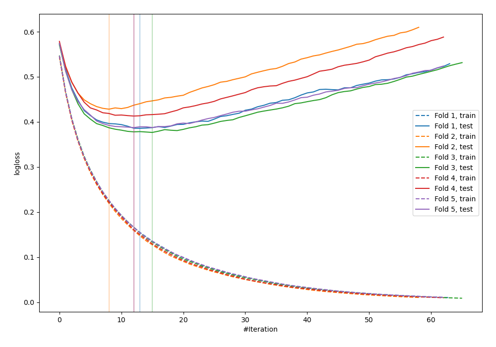
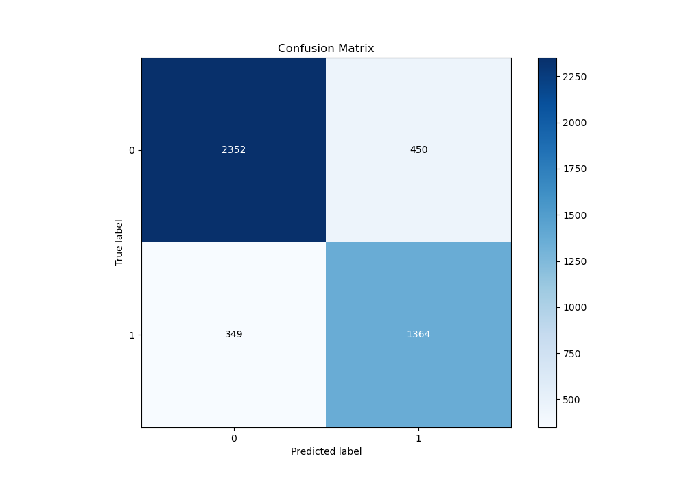
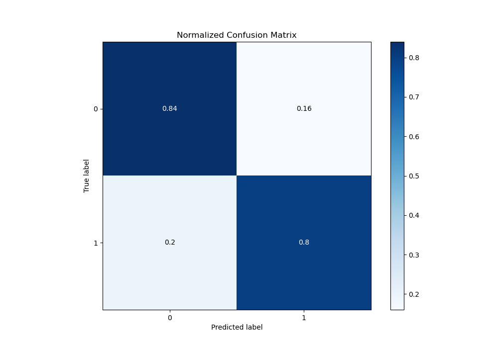
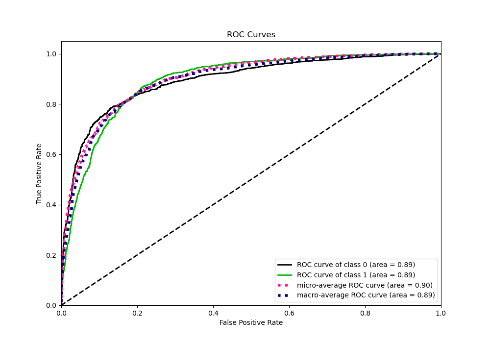
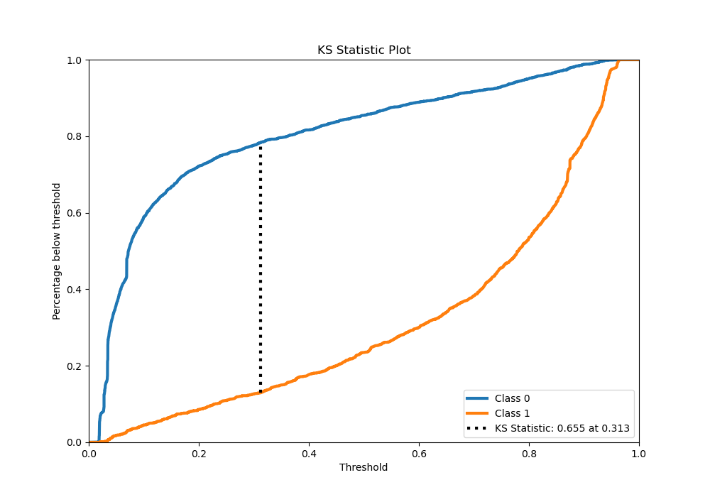
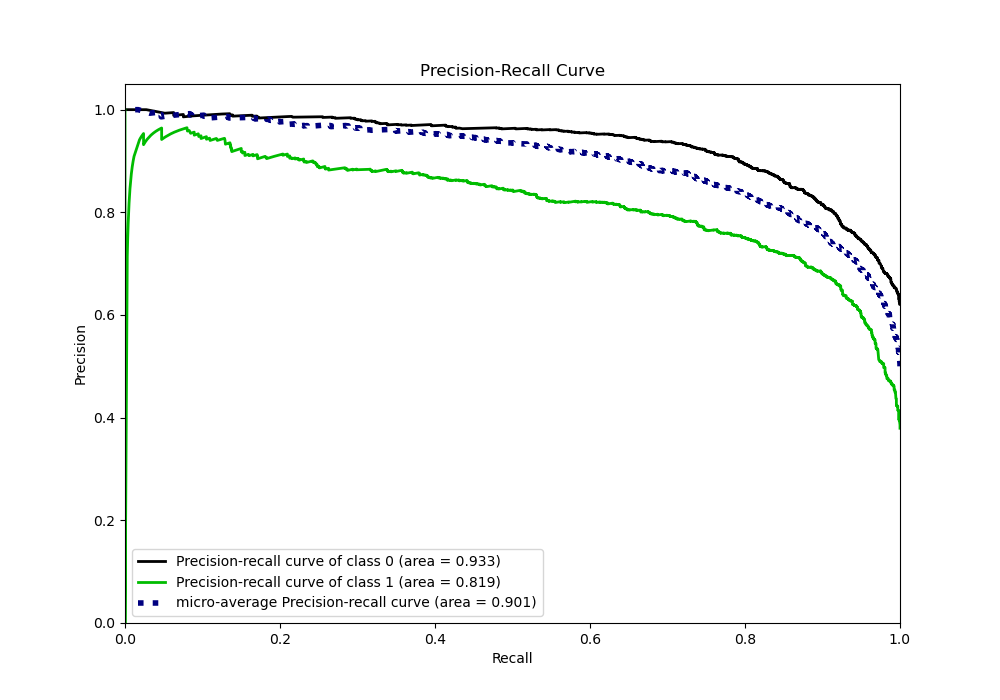
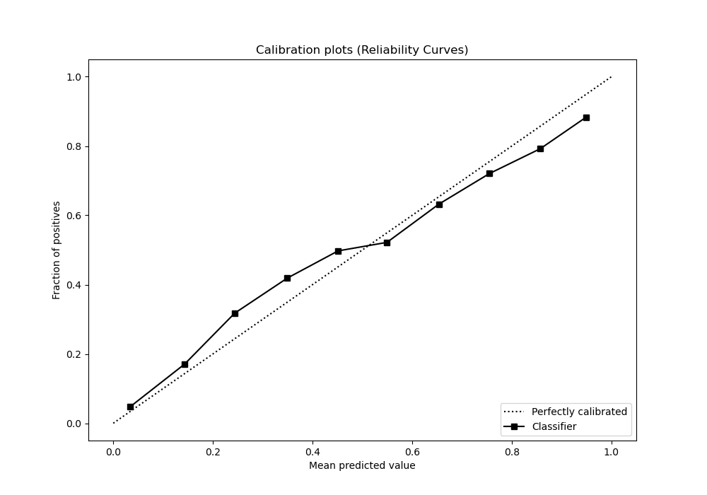
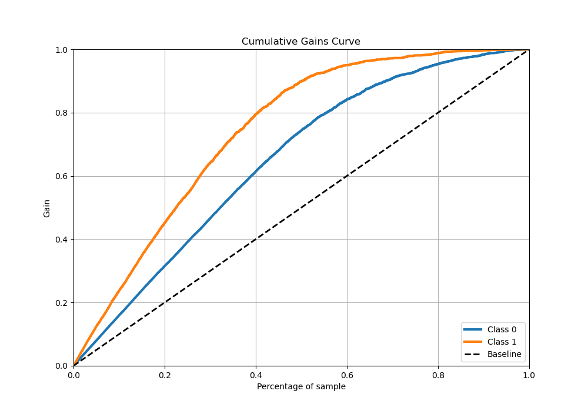
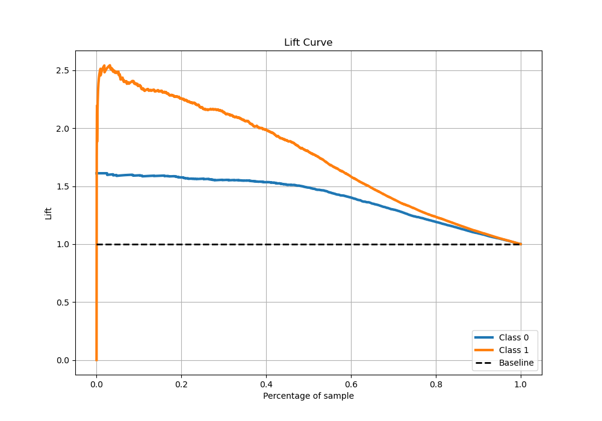

# Summary of 22_LightGBM_Stacked

[<< Go back](../README.md)

## LightGBM
- **n_jobs**: -1
- **objective**: binary
- **num_leaves**: 63
- **learning_rate**: 0.2
- **feature_fraction**: 1.0
- **bagging_fraction**: 0.9
- **min_data_in_leaf**: 10
- **metric**: binary_logloss
- **custom_eval_metric_name**: None
- **explain_level**: 0

## Validation
 - **validation_type**: kfold
 - **stratify**: True
 - **k_folds**: 5
 - **shuffle**: True
 - **random_seed**: 42

## Optimized metric
logloss

## Training time

114.4 seconds

## Metric details
|           |    score |   threshold |
|:----------|---------:|------------:|
| logloss   | 0.398279 | nan         |
| auc       | 0.894156 | nan         |
| f1        | 0.782196 |   0.318697  |
| accuracy  | 0.823034 |   0.454875  |
| precision | 0.959459 |   0.937686  |
| recall    | 1        |   0.0162461 |
| mcc       | 0.635722 |   0.318697  |

## Metric details with threshold from accuracy metric
|           |    score |   threshold |
|:----------|---------:|------------:|
| logloss   | 0.398279 |  nan        |
| auc       | 0.894156 |  nan        |
| f1        | 0.773462 |    0.454875 |
| accuracy  | 0.823034 |    0.454875 |
| precision | 0.751929 |    0.454875 |
| recall    | 0.796264 |    0.454875 |
| mcc       | 0.629158 |    0.454875 |

## Confusion matrix (at threshold=0.454875)
|              |   Predicted as 0 |   Predicted as 1 |
|:-------------|-----------------:|-----------------:|
| Labeled as 0 |             2352 |              450 |
| Labeled as 1 |              349 |             1364 |

## Learning curves

## Confusion Matrix

## Normalized Confusion Matrix

## ROC Curve

## Kolmogorov-Smirnov Statistic

## Precision-Recall Curve

## Calibration Curve

## Cumulative Gains Curve

## Lift Curve

[<< Go back](../README.md)
