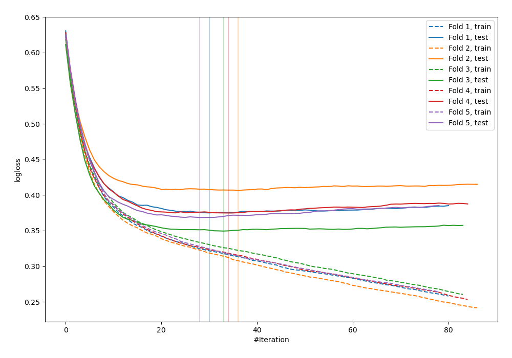
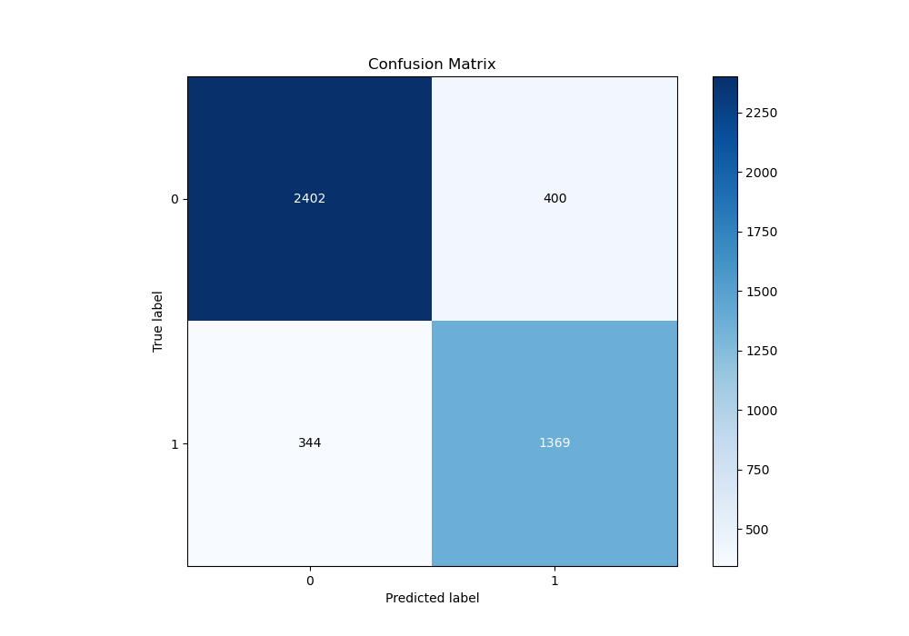
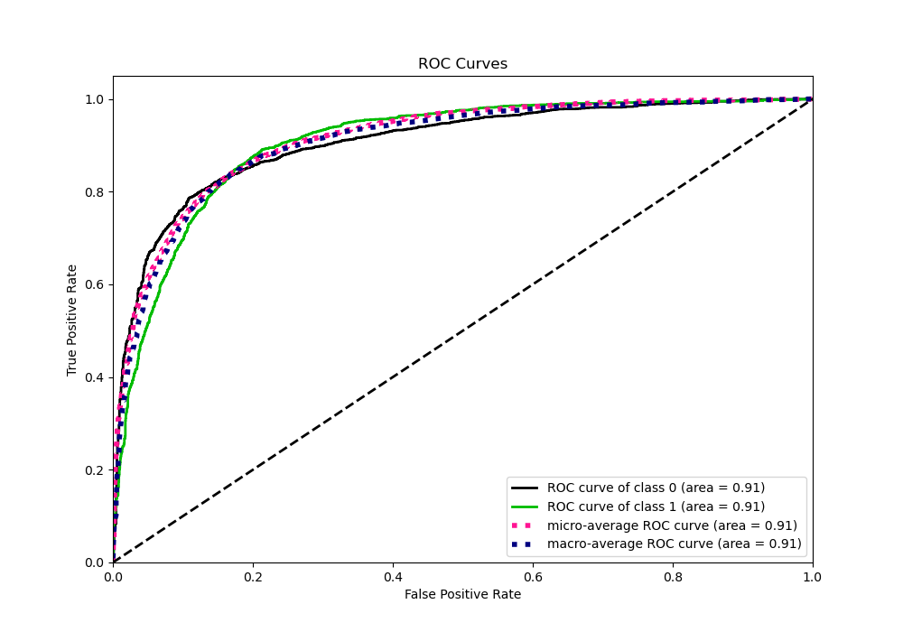
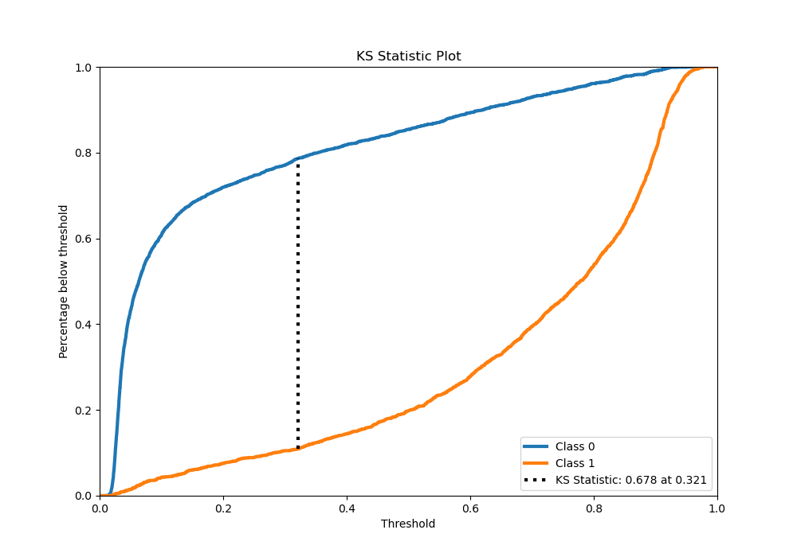
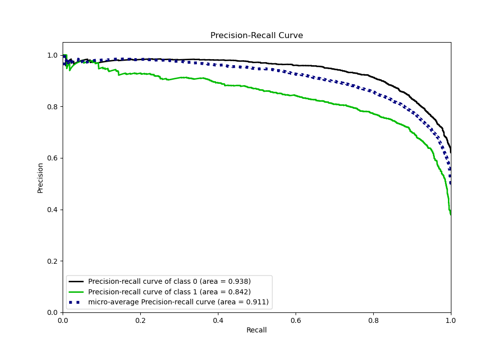
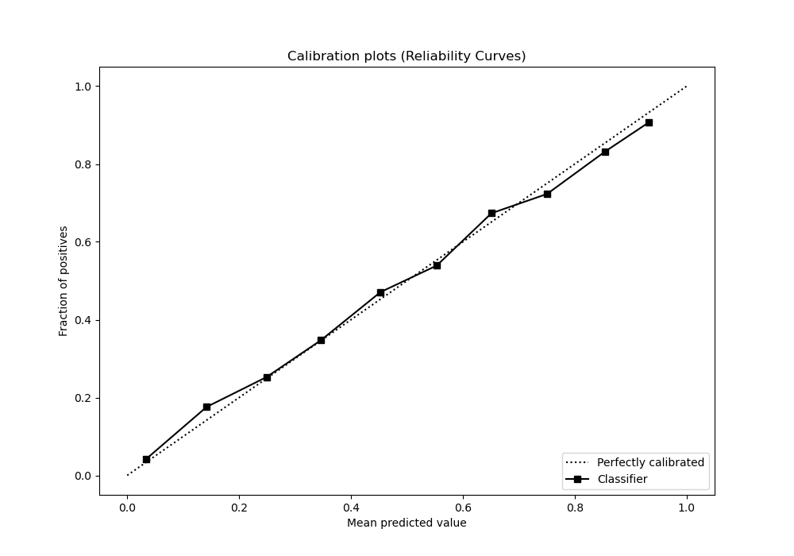
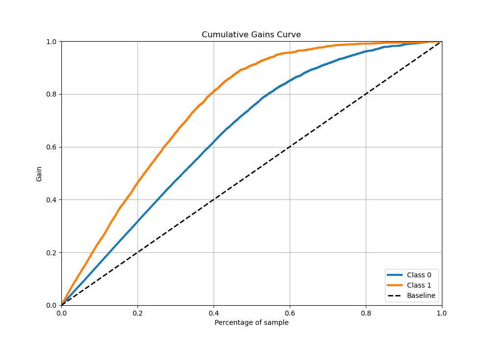
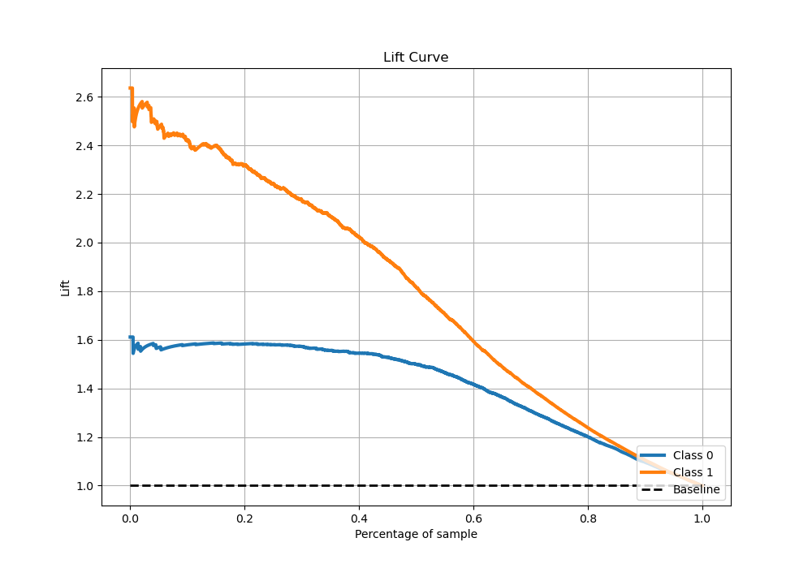

# Summary of 23_CatBoost_Stacked

[<< Go back](../README.md)

## CatBoost
- **n_jobs**: -1
- **learning_rate**: 0.1
- **depth**: 7
- **rsm**: 0.8
- **loss_function**: Logloss
- **eval_metric**: Logloss
- **explain_level**: 0

## Validation
 - **validation_type**: kfold
 - **stratify**: True
 - **k_folds**: 5
 - **shuffle**: True
 - **random_seed**: 42

## Optimized metric
logloss

## Training time

28.5 seconds

## Metric details
|           |    score |   threshold |
|:----------|---------:|------------:|
| logloss   | 0.374812 | nan         |
| auc       | 0.906055 | nan         |
| f1        | 0.794898 |   0.319429  |
| accuracy  | 0.835216 |   0.507018  |
| precision | 0.971154 |   0.933113  |
| recall    | 1        |   0.0121247 |
| mcc       | 0.659399 |   0.41737   |

## Metric details with threshold from accuracy metric
|           |    score |   threshold |
|:----------|---------:|------------:|
| logloss   | 0.374812 |  nan        |
| auc       | 0.906055 |  nan        |
| f1        | 0.78633  |    0.507018 |
| accuracy  | 0.835216 |    0.507018 |
| precision | 0.773884 |    0.507018 |
| recall    | 0.799183 |    0.507018 |
| mcc       | 0.652507 |    0.507018 |

## Confusion matrix (at threshold=0.507018)
|              |   Predicted as 0 |   Predicted as 1 |
|:-------------|-----------------:|-----------------:|
| Labeled as 0 |             2402 |              400 |
| Labeled as 1 |              344 |             1369 |

## Learning curves

## Confusion Matrix

## Normalized Confusion Matrix

## ROC Curve

## Kolmogorov-Smirnov Statistic

## Precision-Recall Curve

## Calibration Curve

## Cumulative Gains Curve

## Lift Curve

[<< Go back](../README.md)
