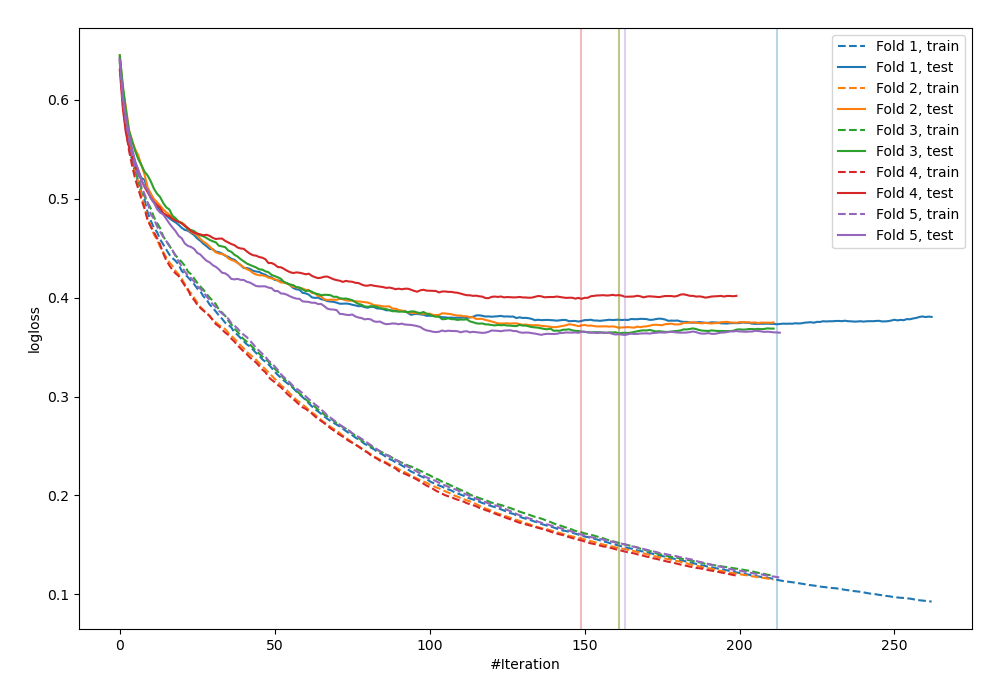
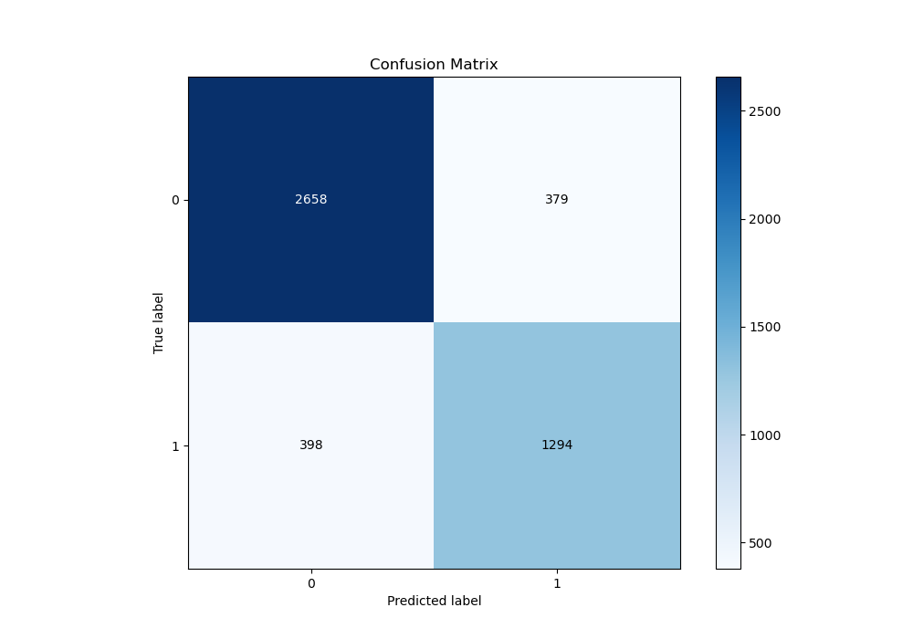
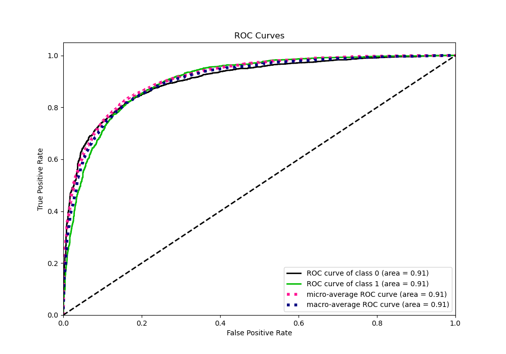
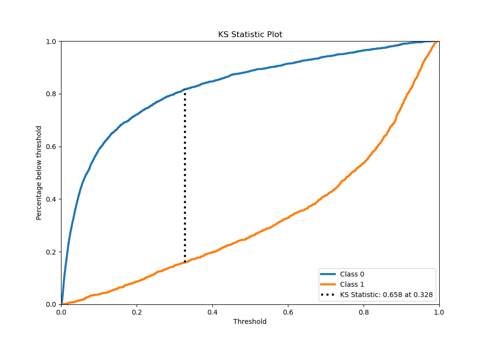
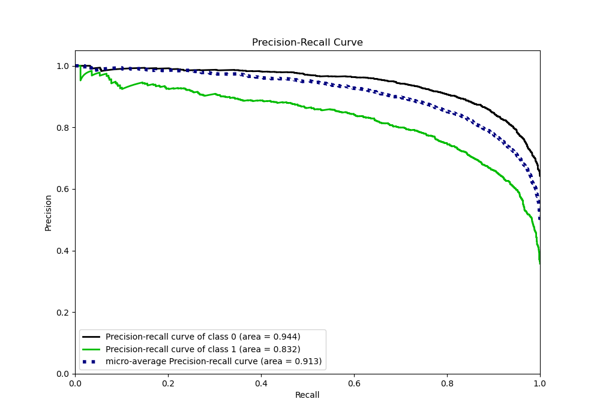
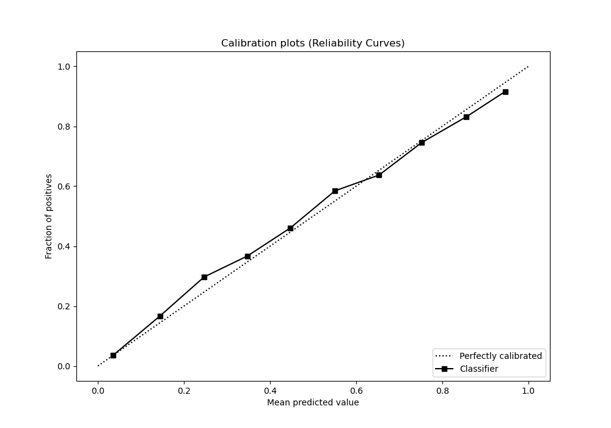
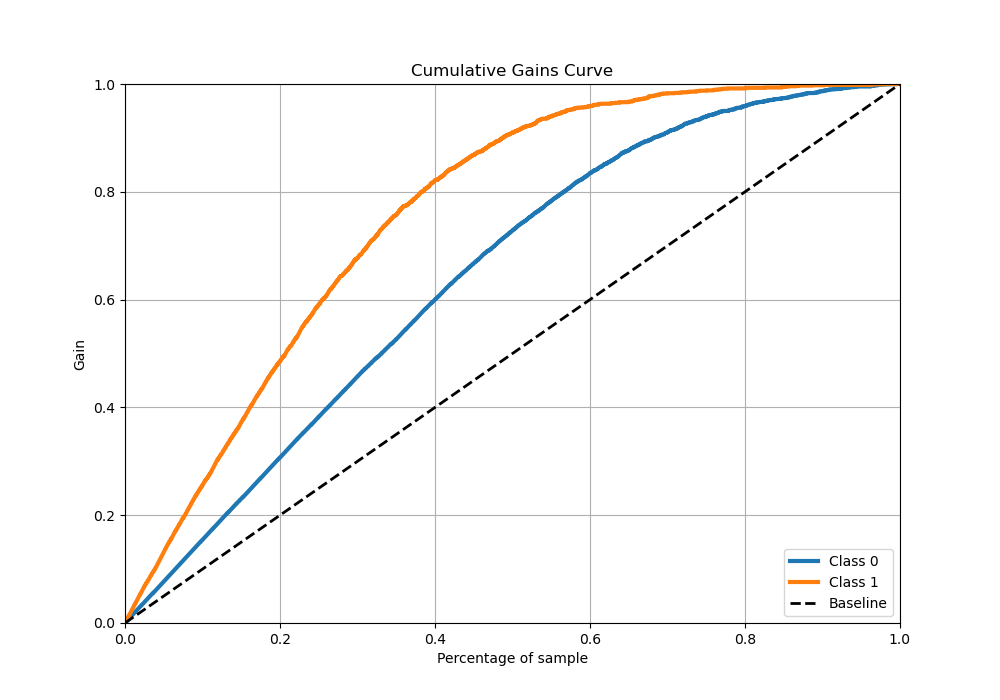
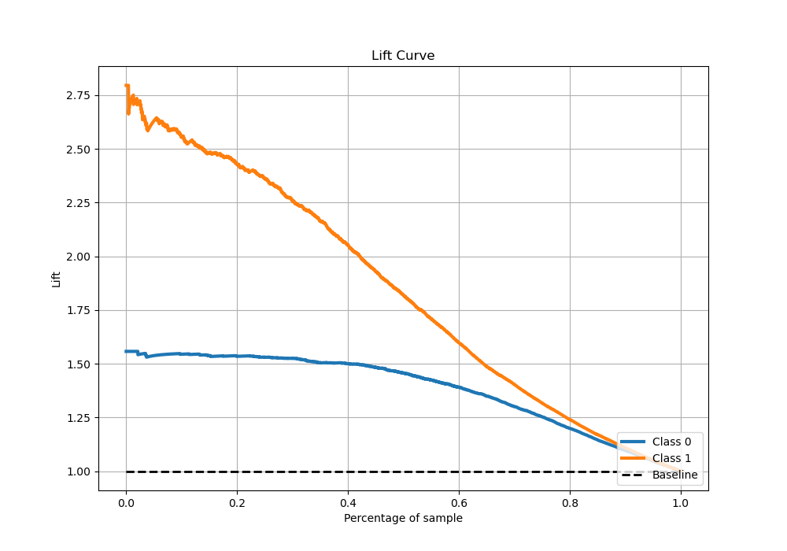

# Summary of 24_CatBoost

[<< Go back](../README.md)

## CatBoost
- **n_jobs**: -1
- **learning_rate**: 0.2
- **depth**: 6
- **rsm**: 0.8
- **loss_function**: Logloss
- **eval_metric**: Logloss
- **explain_level**: 0

## Validation
 - **validation_type**: kfold
 - **stratify**: True
 - **k_folds**: 5
 - **shuffle**: True
 - **random_seed**: 42

## Optimized metric
logloss

## Training time

27.8 seconds

## Metric details
|           |    score |     threshold |
|:----------|---------:|--------------:|
| logloss   | 0.373515 | nan           |
| auc       | 0.90511  | nan           |
| f1        | 0.774883 |   0.339861    |
| accuracy  | 0.835695 |   0.463414    |
| precision | 0.973333 |   0.974203    |
| recall    | 1        |   0.000642408 |
| mcc       | 0.641601 |   0.463414    |

## Metric details with threshold from accuracy metric
|           |    score |   threshold |
|:----------|---------:|------------:|
| logloss   | 0.373515 |  nan        |
| auc       | 0.90511  |  nan        |
| f1        | 0.769094 |    0.463414 |
| accuracy  | 0.835695 |    0.463414 |
| precision | 0.773461 |    0.463414 |
| recall    | 0.764775 |    0.463414 |
| mcc       | 0.641601 |    0.463414 |

## Confusion matrix (at threshold=0.463414)
|              |   Predicted as 0 |   Predicted as 1 |
|:-------------|-----------------:|-----------------:|
| Labeled as 0 |             2658 |              379 |
| Labeled as 1 |              398 |             1294 |

## Learning curves

## Confusion Matrix

## Normalized Confusion Matrix

## ROC Curve

## Kolmogorov-Smirnov Statistic

## Precision-Recall Curve

## Calibration Curve

## Cumulative Gains Curve

## Lift Curve

[<< Go back](../README.md)
