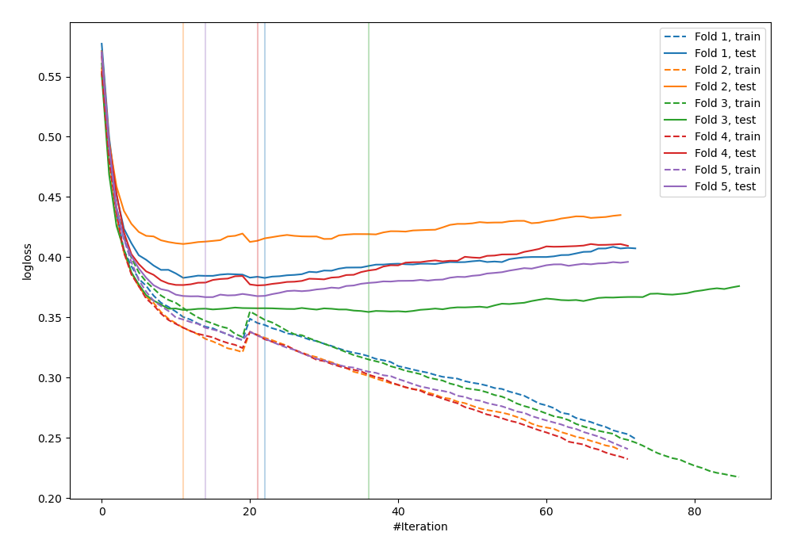
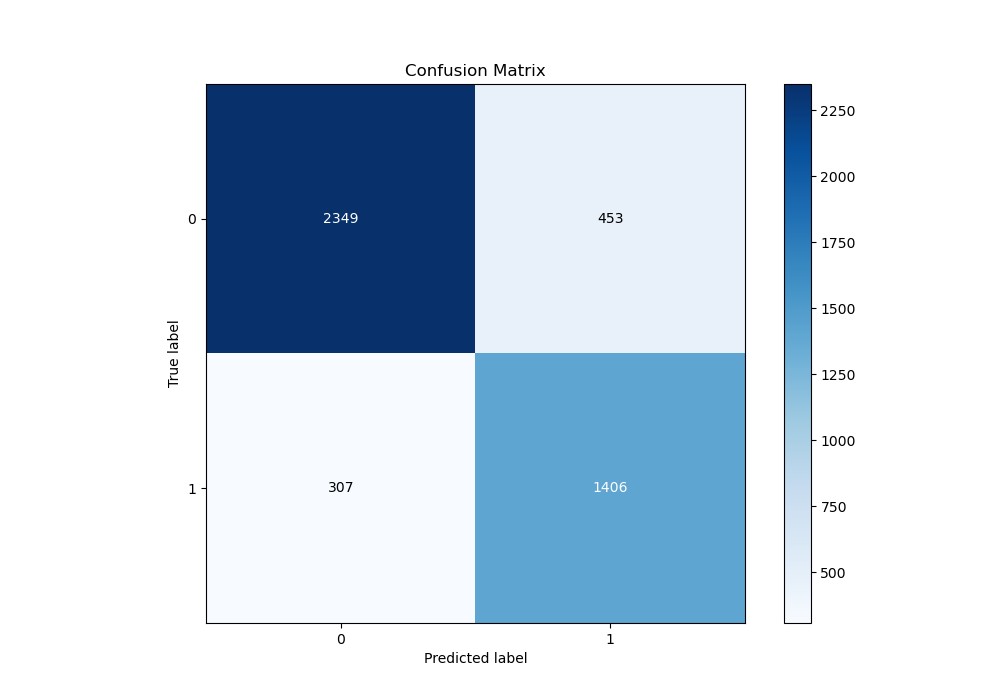
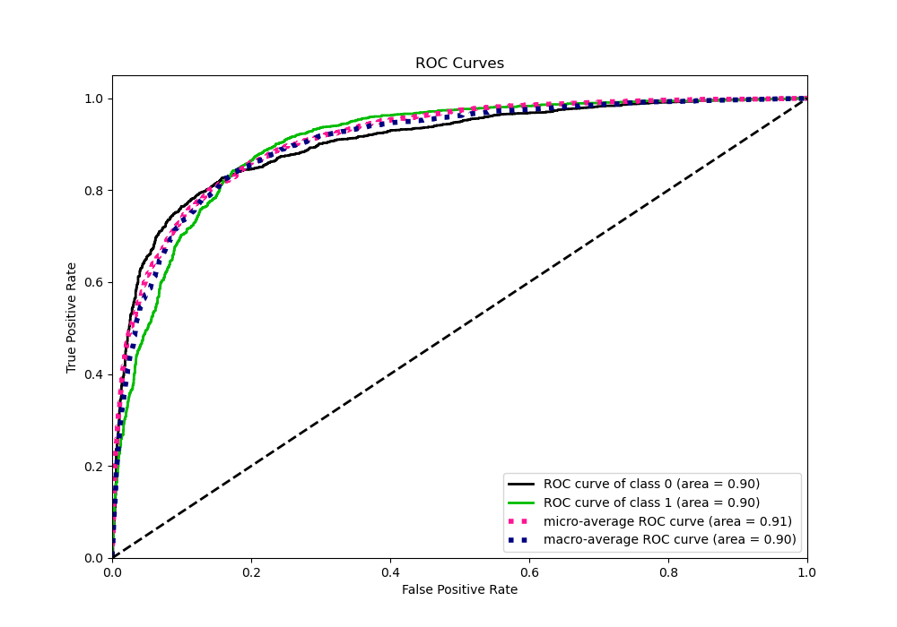
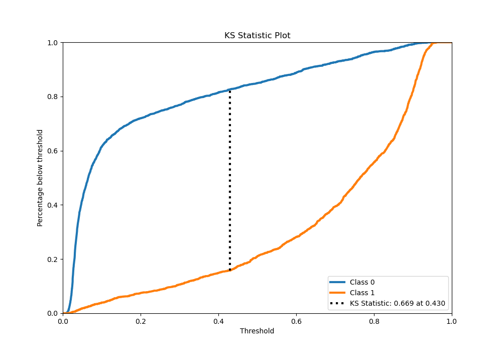
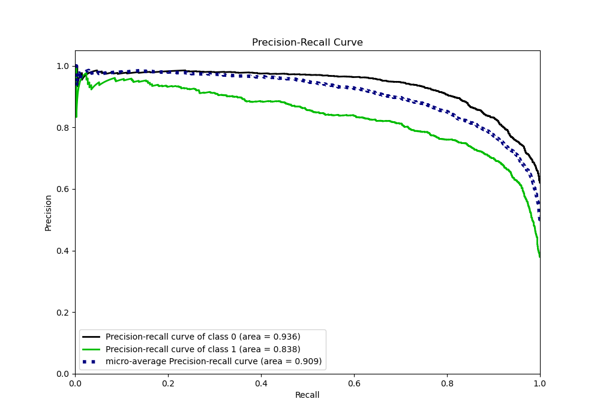
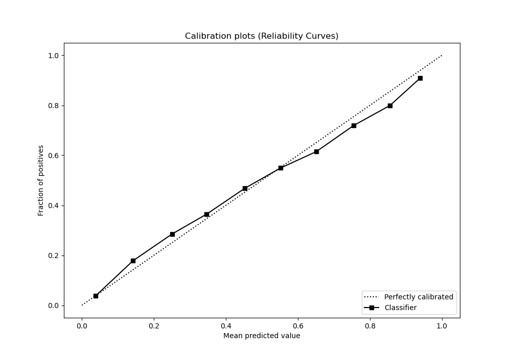
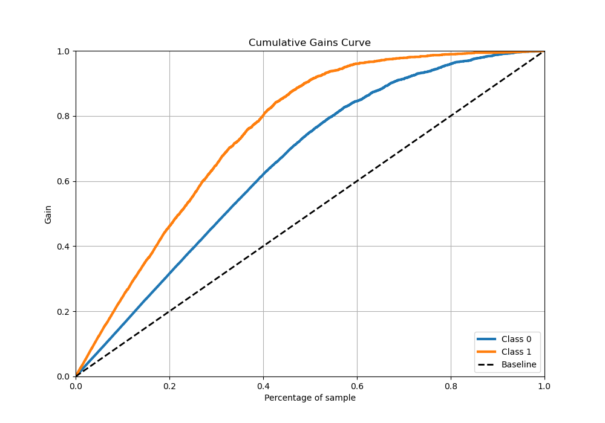
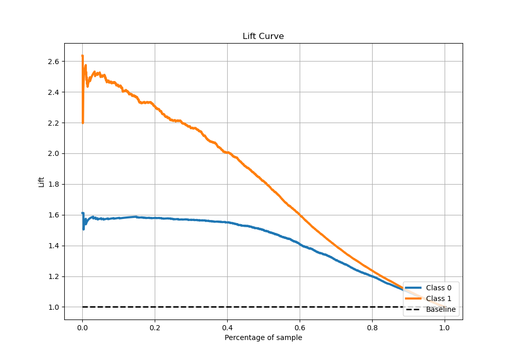

# Summary of 24_CatBoost_Stacked

[<< Go back](../README.md)

## CatBoost
- **n_jobs**: -1
- **learning_rate**: 0.2
- **depth**: 6
- **rsm**: 0.8
- **loss_function**: Logloss
- **eval_metric**: Logloss
- **explain_level**: 0

## Validation
 - **validation_type**: kfold
 - **stratify**: True
 - **k_folds**: 5
 - **shuffle**: True
 - **random_seed**: 42

## Optimized metric
logloss

## Training time

24.0 seconds

## Metric details
|           |    score |    threshold |
|:----------|---------:|-------------:|
| logloss   | 0.378805 | nan          |
| auc       | 0.90373  | nan          |
| f1        | 0.790279 |   0.42051    |
| accuracy  | 0.831672 |   0.462365   |
| precision | 0.959732 |   0.921376   |
| recall    | 1        |   0.00772062 |
| mcc       | 0.652026 |   0.42051    |

## Metric details with threshold from accuracy metric
|           |    score |   threshold |
|:----------|---------:|------------:|
| logloss   | 0.378805 |  nan        |
| auc       | 0.90373  |  nan        |
| f1        | 0.787234 |    0.462365 |
| accuracy  | 0.831672 |    0.462365 |
| precision | 0.756321 |    0.462365 |
| recall    | 0.820782 |    0.462365 |
| mcc       | 0.649858 |    0.462365 |

## Confusion matrix (at threshold=0.462365)
|              |   Predicted as 0 |   Predicted as 1 |
|:-------------|-----------------:|-----------------:|
| Labeled as 0 |             2349 |              453 |
| Labeled as 1 |              307 |             1406 |

## Learning curves

## Confusion Matrix

## Normalized Confusion Matrix

## ROC Curve

## Kolmogorov-Smirnov Statistic

## Precision-Recall Curve

## Calibration Curve

## Cumulative Gains Curve

## Lift Curve

[<< Go back](../README.md)
