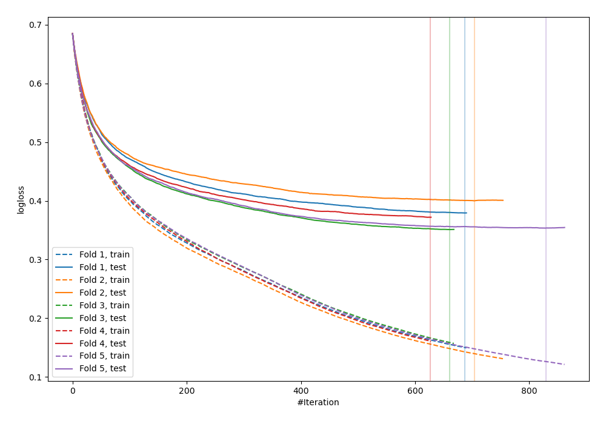
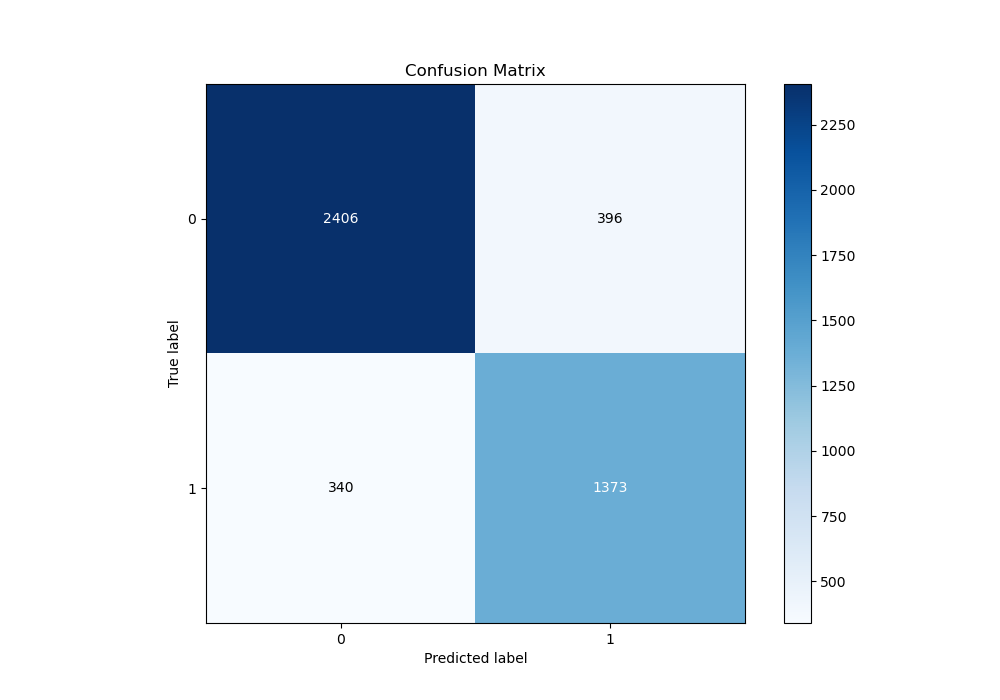
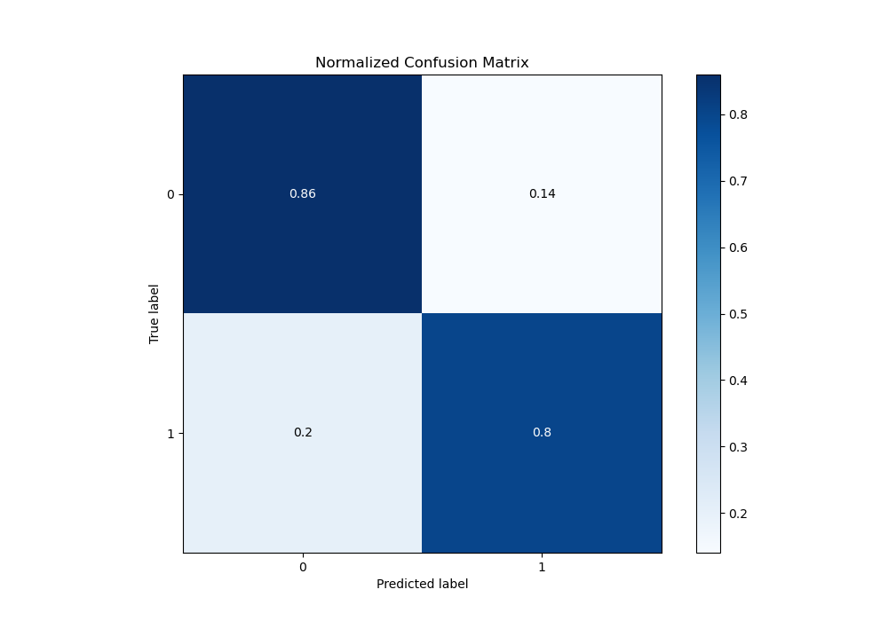
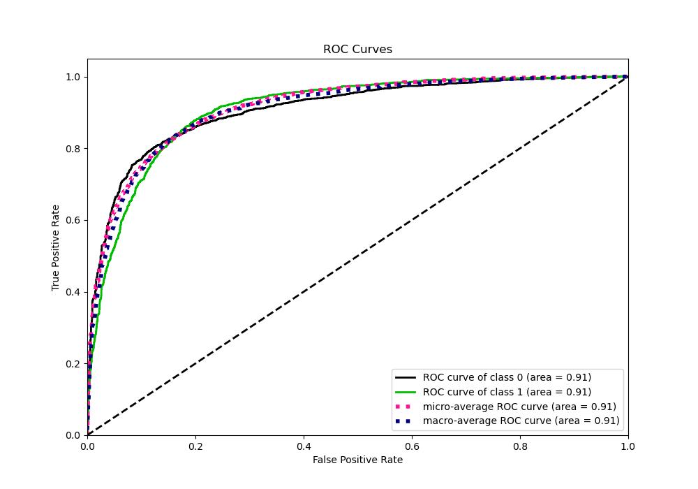
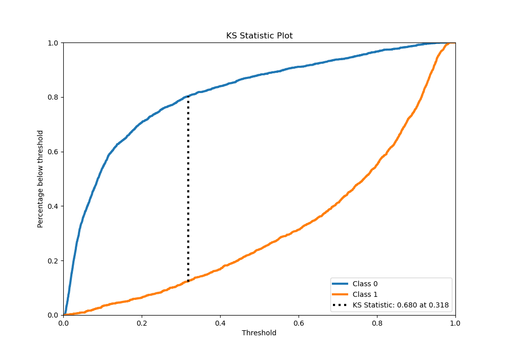
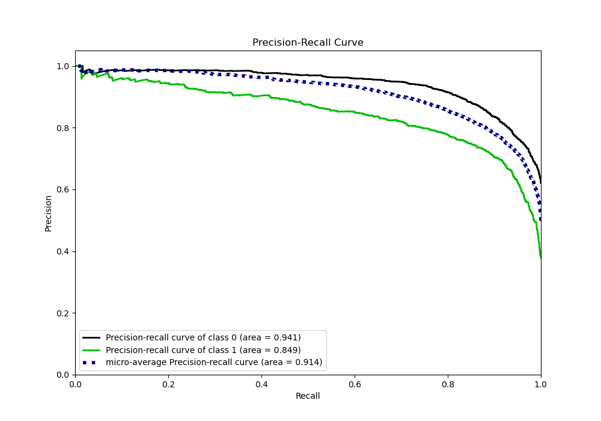
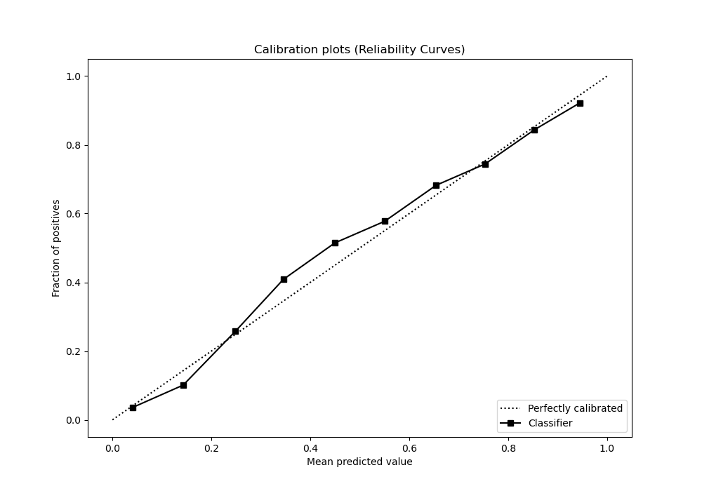
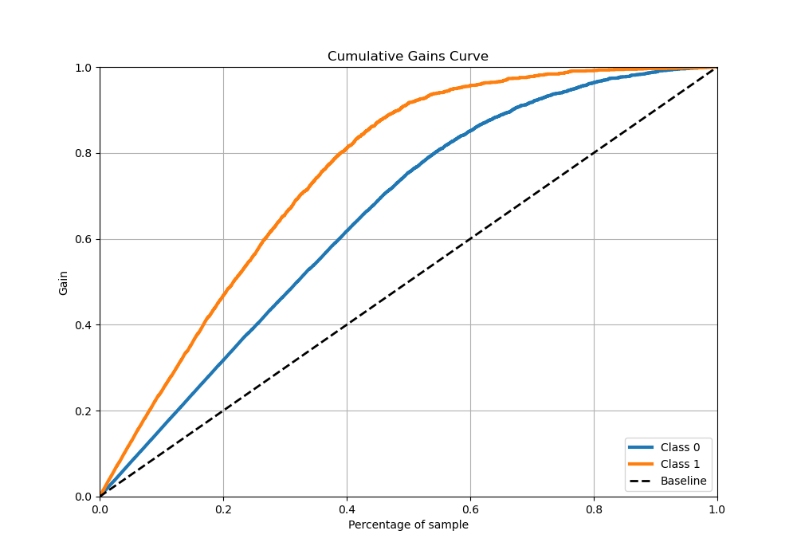
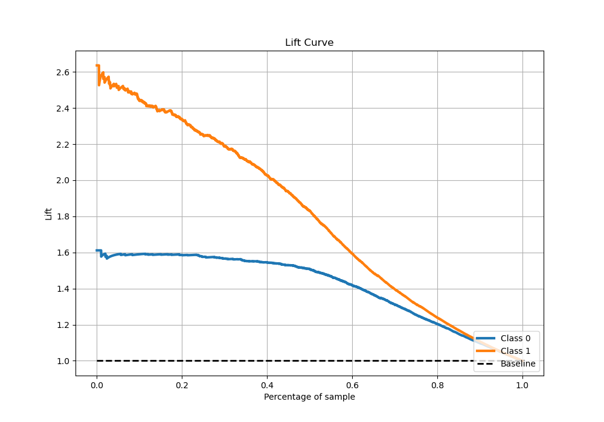

# Summary of 25_CatBoost

[<< Go back](../README.md)

## CatBoost
- **n_jobs**: -1
- **learning_rate**: 0.025
- **depth**: 9
- **rsm**: 0.9
- **loss_function**: Logloss
- **eval_metric**: Logloss
- **explain_level**: 0

## Validation
 - **validation_type**: kfold
 - **stratify**: True
 - **k_folds**: 5
 - **shuffle**: True
 - **random_seed**: 42

## Optimized metric
logloss

## Training time

337.5 seconds

## Metric details
|           |    score |    threshold |
|:----------|---------:|-------------:|
| logloss   | 0.371174 | nan          |
| auc       | 0.908868 | nan          |
| f1        | 0.796908 |   0.323789   |
| accuracy  | 0.836988 |   0.442369   |
| precision | 0.983051 |   0.962907   |
| recall    | 1        |   0.00192015 |
| mcc       | 0.661663 |   0.323789   |

## Metric details with threshold from accuracy metric
|           |    score |   threshold |
|:----------|---------:|------------:|
| logloss   | 0.371174 |  nan        |
| auc       | 0.908868 |  nan        |
| f1        | 0.788627 |    0.442369 |
| accuracy  | 0.836988 |    0.442369 |
| precision | 0.776145 |    0.442369 |
| recall    | 0.801518 |    0.442369 |
| mcc       | 0.656247 |    0.442369 |

## Confusion matrix (at threshold=0.442369)
|              |   Predicted as 0 |   Predicted as 1 |
|:-------------|-----------------:|-----------------:|
| Labeled as 0 |             2406 |              396 |
| Labeled as 1 |              340 |             1373 |

## Learning curves

## Confusion Matrix

## Normalized Confusion Matrix

## ROC Curve

## Kolmogorov-Smirnov Statistic

## Precision-Recall Curve

## Calibration Curve

## Cumulative Gains Curve

## Lift Curve

[<< Go back](../README.md)
