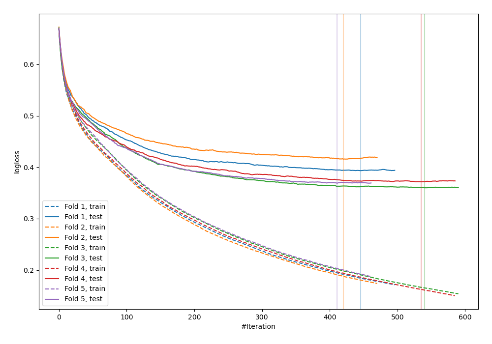
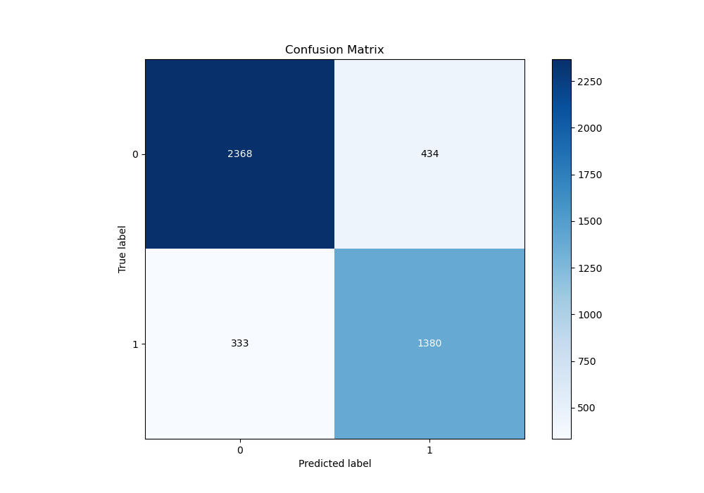
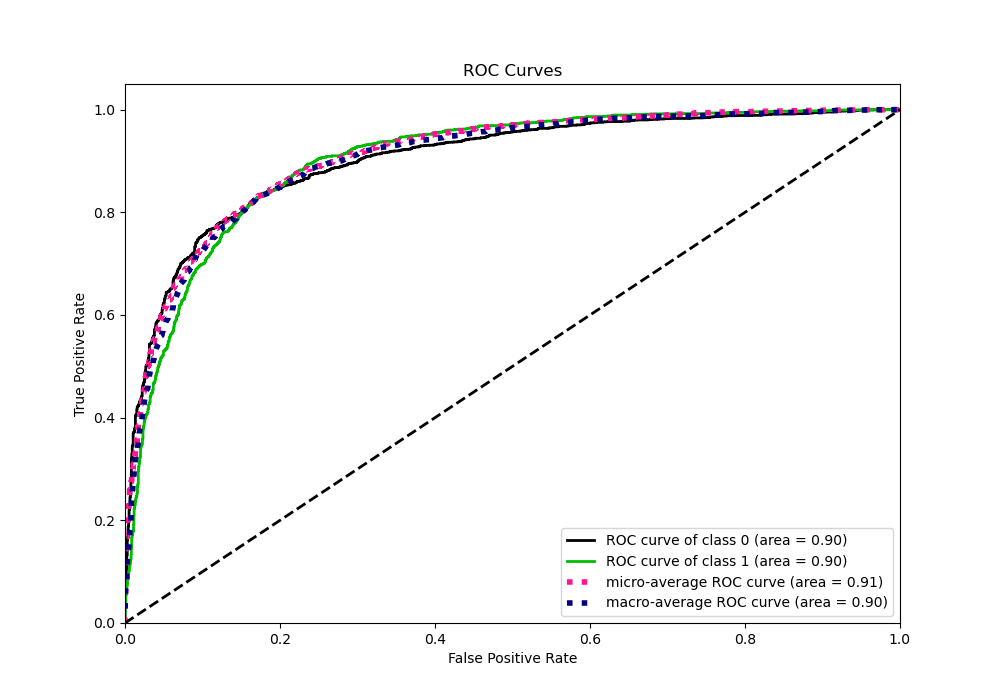
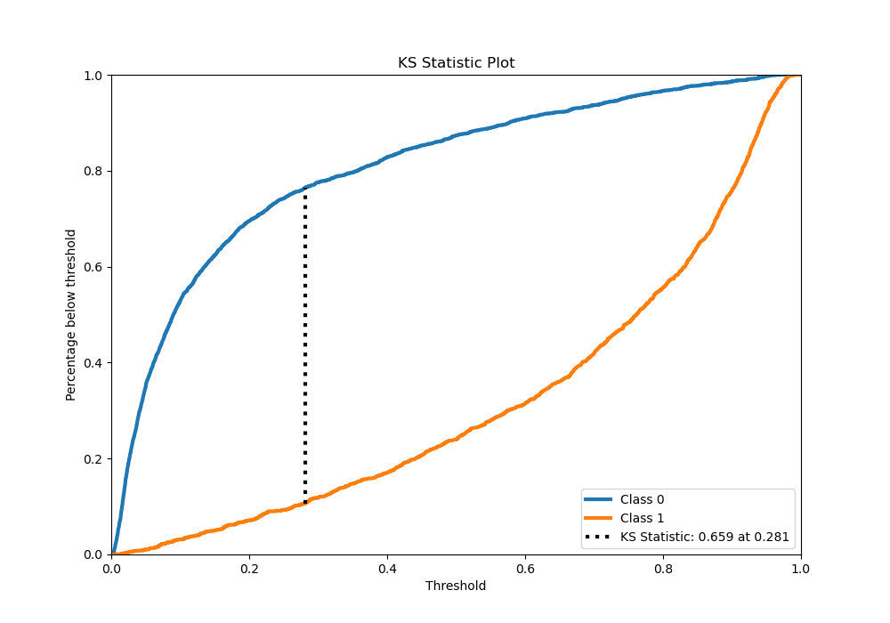
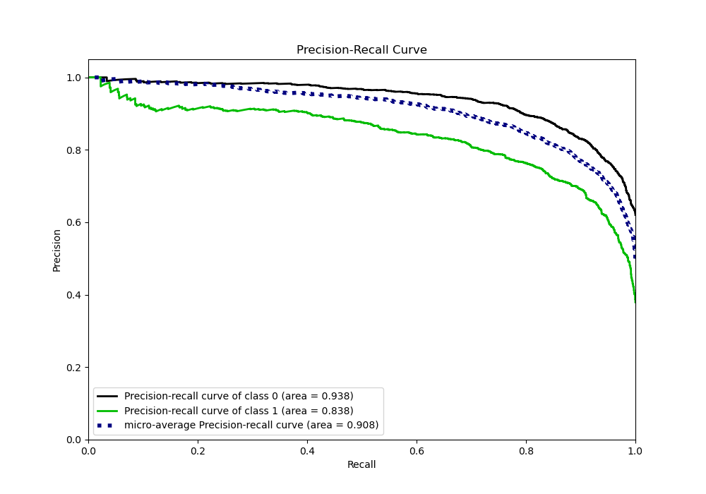
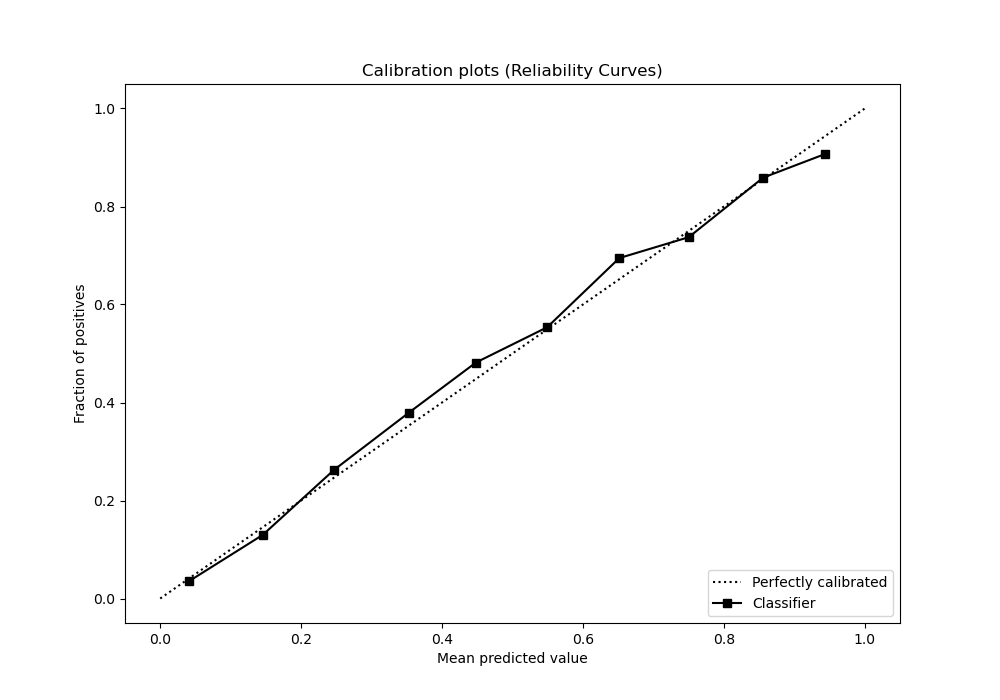
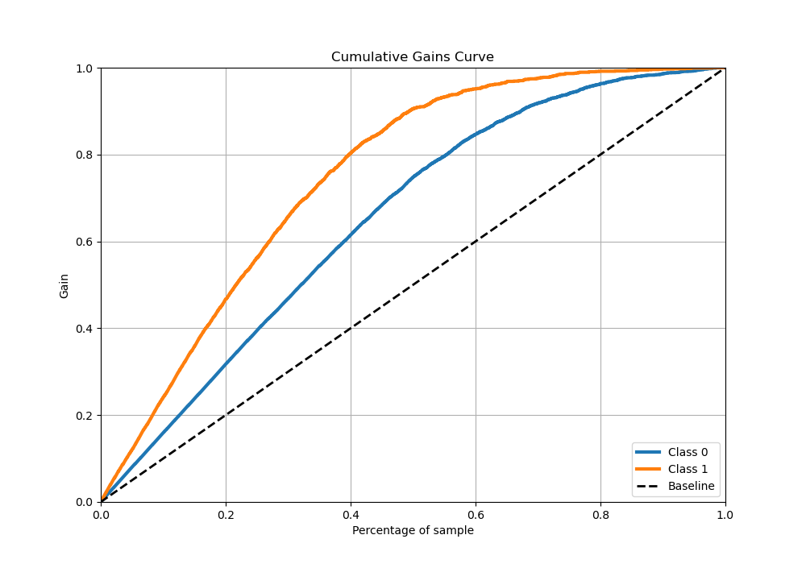
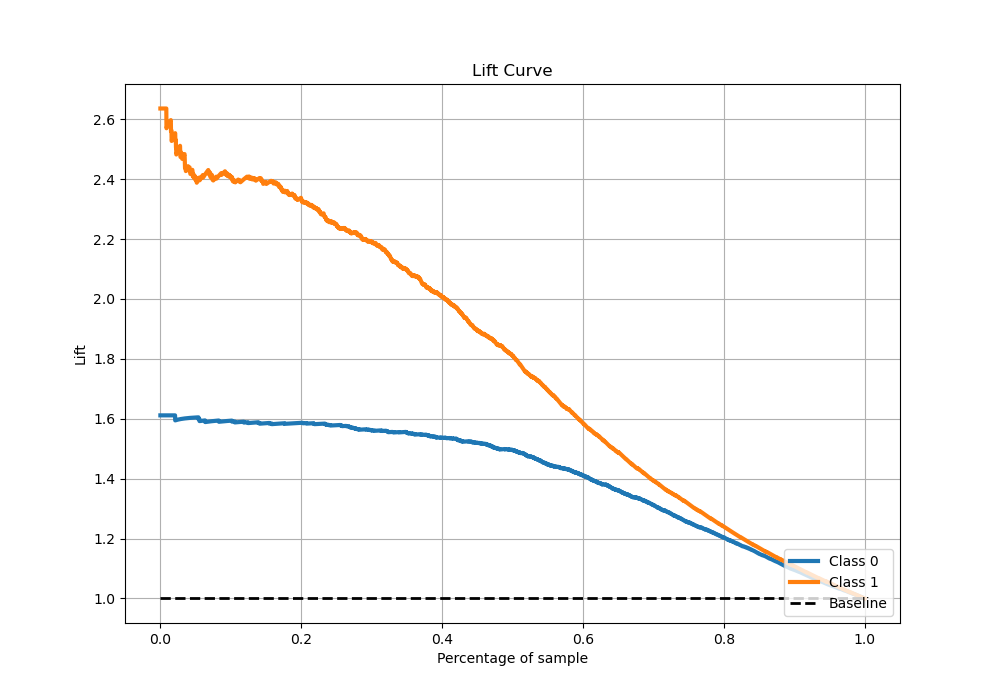

# Summary of 26_CatBoost

[<< Go back](../README.md)

## CatBoost
- **n_jobs**: -1
- **learning_rate**: 0.1
- **depth**: 4
- **rsm**: 0.9
- **loss_function**: Logloss
- **eval_metric**: Logloss
- **explain_level**: 0

## Validation
 - **validation_type**: kfold
 - **stratify**: True
 - **k_folds**: 5
 - **shuffle**: True
 - **random_seed**: 42

## Optimized metric
logloss

## Training time

18.6 seconds

## Metric details
|           |    score |    threshold |
|:----------|---------:|-------------:|
| logloss   | 0.381884 | nan          |
| auc       | 0.903052 | nan          |
| f1        | 0.785734 |   0.399681   |
| accuracy  | 0.830122 |   0.432087   |
| precision | 0.983051 |   0.965675   |
| recall    | 1        |   0.00204214 |
| mcc       | 0.645726 |   0.399681   |

## Metric details with threshold from accuracy metric
|           |    score |   threshold |
|:----------|---------:|------------:|
| logloss   | 0.381884 |  nan        |
| auc       | 0.903052 |  nan        |
| f1        | 0.782535 |    0.432087 |
| accuracy  | 0.830122 |    0.432087 |
| precision | 0.76075  |    0.432087 |
| recall    | 0.805604 |    0.432087 |
| mcc       | 0.644054 |    0.432087 |

## Confusion matrix (at threshold=0.432087)
|              |   Predicted as 0 |   Predicted as 1 |
|:-------------|-----------------:|-----------------:|
| Labeled as 0 |             2368 |              434 |
| Labeled as 1 |              333 |             1380 |

## Learning curves

## Confusion Matrix

## Normalized Confusion Matrix

## ROC Curve

## Kolmogorov-Smirnov Statistic

## Precision-Recall Curve

## Calibration Curve

## Cumulative Gains Curve

## Lift Curve

[<< Go back](../README.md)
