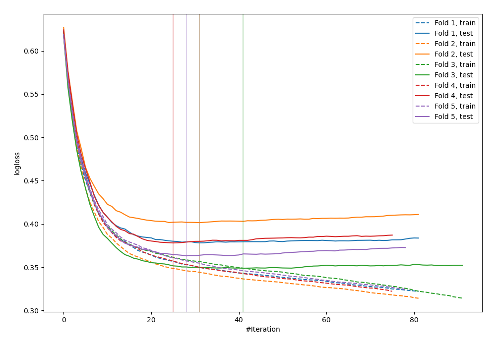
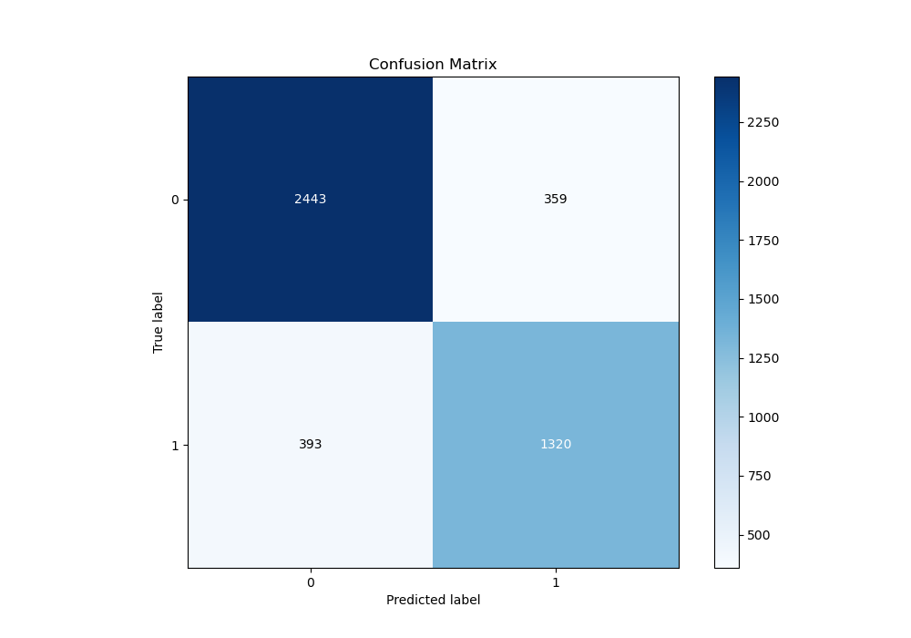
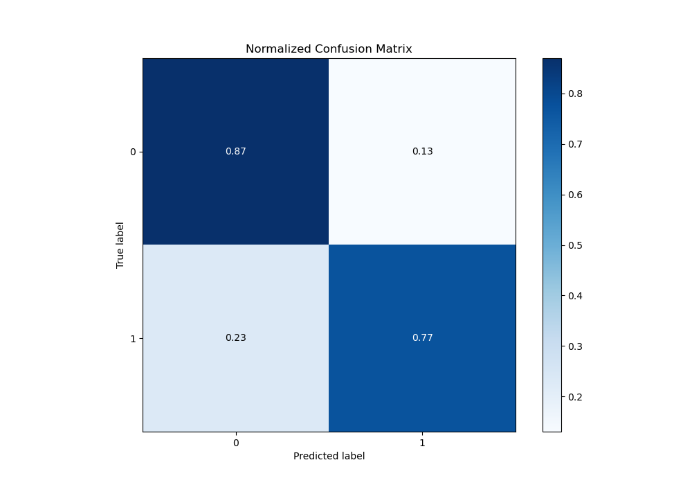
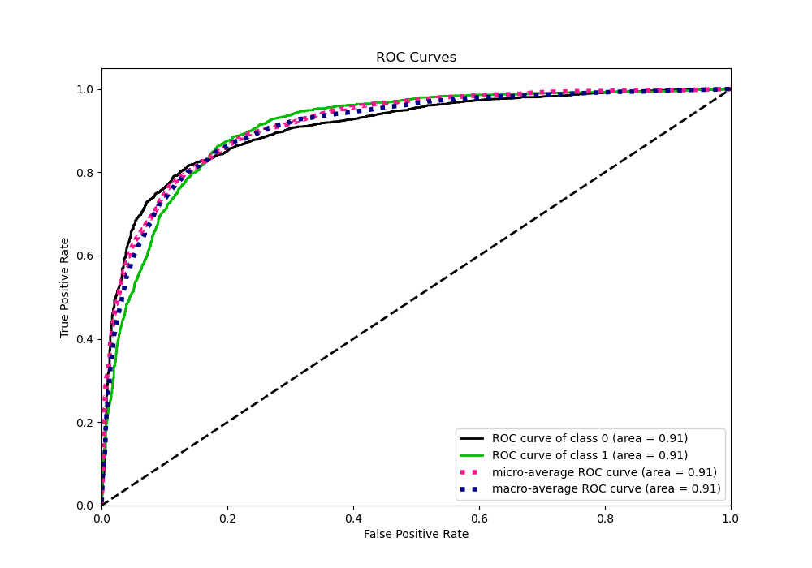
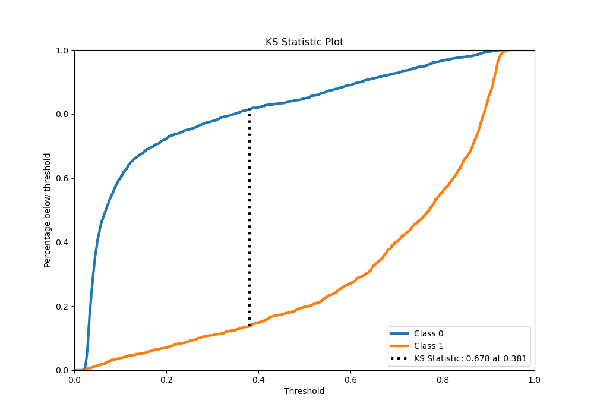
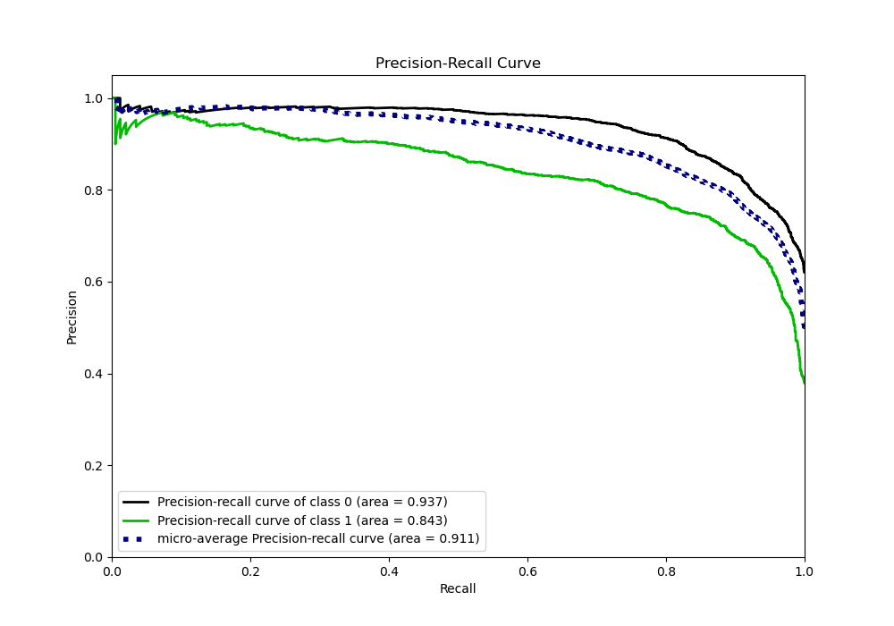
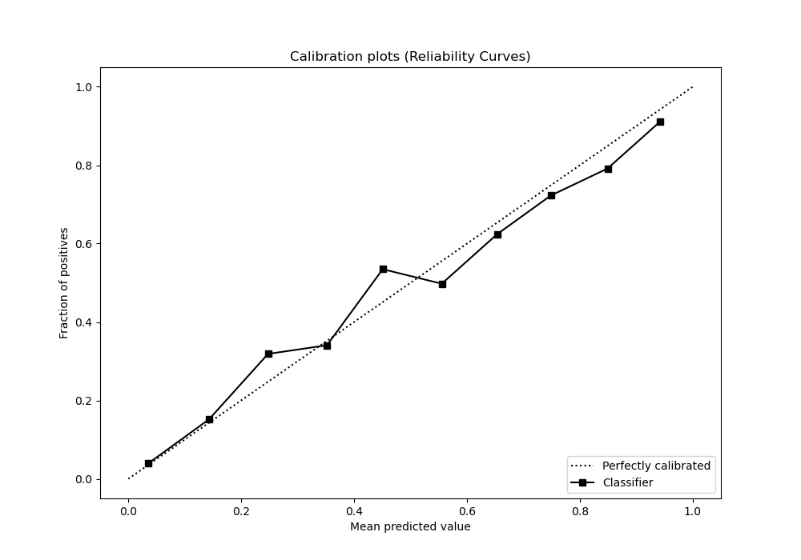
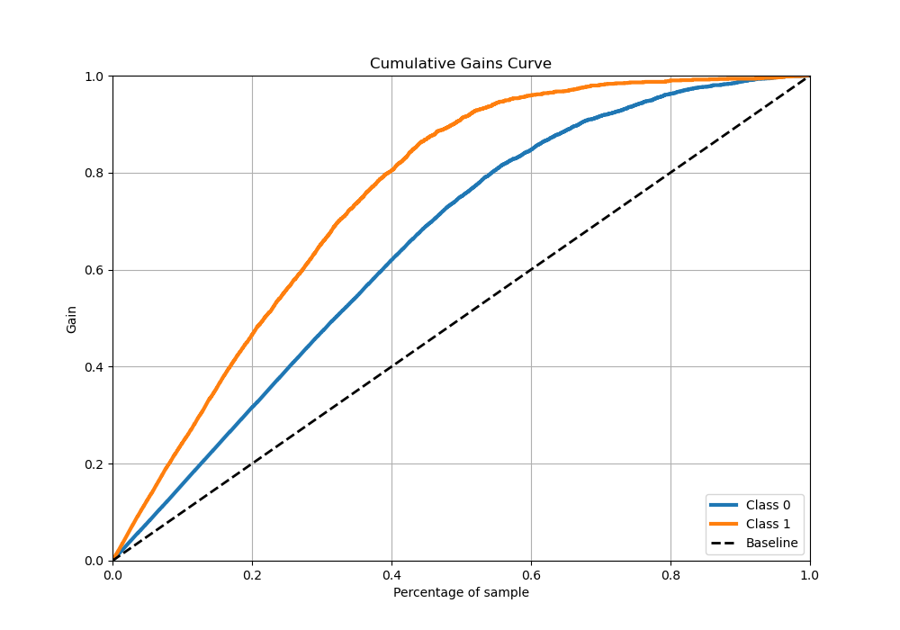
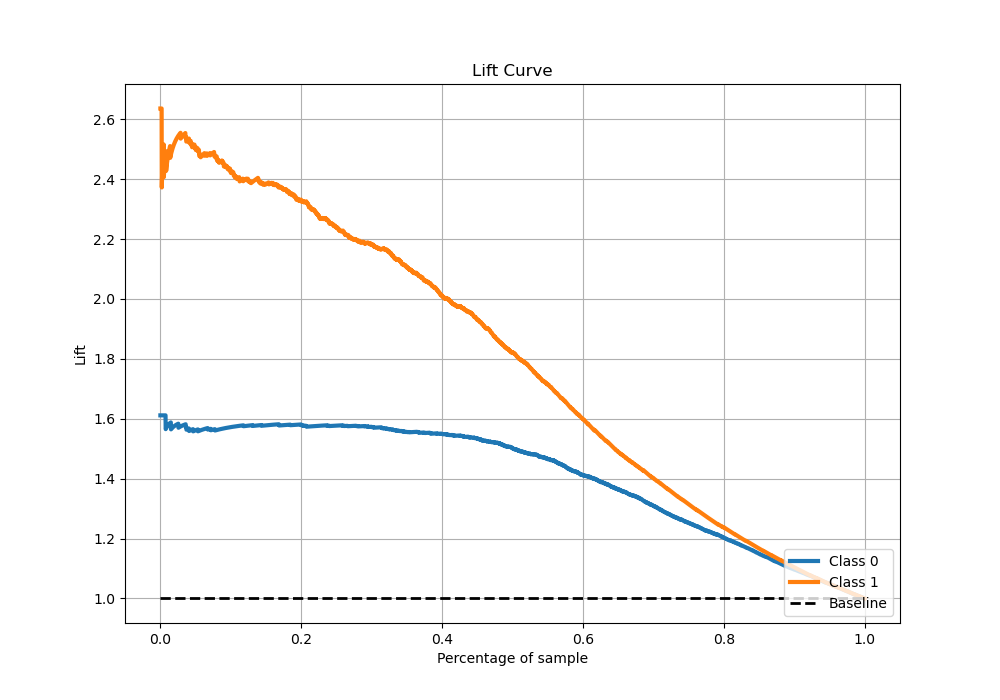

# Summary of 26_CatBoost_Stacked

[<< Go back](../README.md)

## CatBoost
- **n_jobs**: -1
- **learning_rate**: 0.1
- **depth**: 4
- **rsm**: 0.9
- **loss_function**: Logloss
- **eval_metric**: Logloss
- **explain_level**: 0

## Validation
 - **validation_type**: kfold
 - **stratify**: True
 - **k_folds**: 5
 - **shuffle**: True
 - **random_seed**: 42

## Optimized metric
logloss

## Training time

14.0 seconds

## Metric details
|           |    score |   threshold |
|:----------|---------:|------------:|
| logloss   | 0.373968 | nan         |
| auc       | 0.906601 | nan         |
| f1        | 0.796871 |   0.382032  |
| accuracy  | 0.833444 |   0.5497    |
| precision | 0.966443 |   0.912882  |
| recall    | 1        |   0.0156367 |
| mcc       | 0.662237 |   0.382032  |

## Metric details with threshold from accuracy metric
|           |    score |   threshold |
|:----------|---------:|------------:|
| logloss   | 0.373968 |    nan      |
| auc       | 0.906601 |    nan      |
| f1        | 0.778302 |      0.5497 |
| accuracy  | 0.833444 |      0.5497 |
| precision | 0.786182 |      0.5497 |
| recall    | 0.770578 |      0.5497 |
| mcc       | 0.645026 |      0.5497 |

## Confusion matrix (at threshold=0.5497)
|              |   Predicted as 0 |   Predicted as 1 |
|:-------------|-----------------:|-----------------:|
| Labeled as 0 |             2443 |              359 |
| Labeled as 1 |              393 |             1320 |

## Learning curves

## Confusion Matrix

## Normalized Confusion Matrix

## ROC Curve

## Kolmogorov-Smirnov Statistic

## Precision-Recall Curve

## Calibration Curve

## Cumulative Gains Curve

## Lift Curve

[<< Go back](../README.md)
