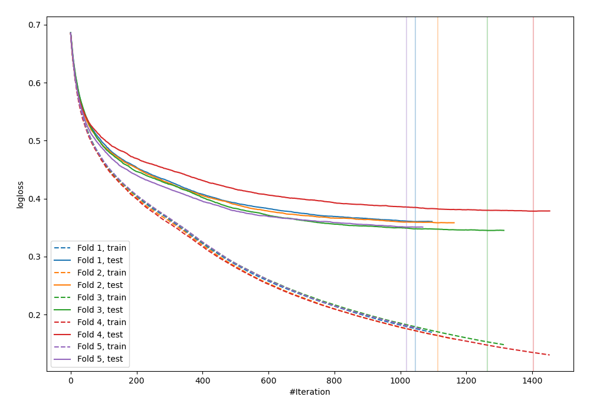
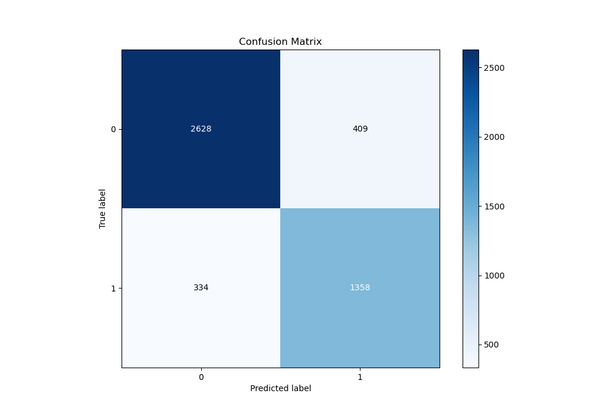
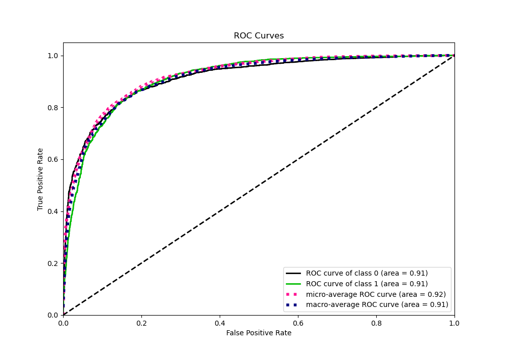
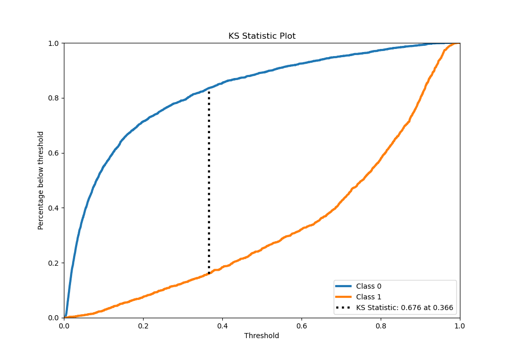
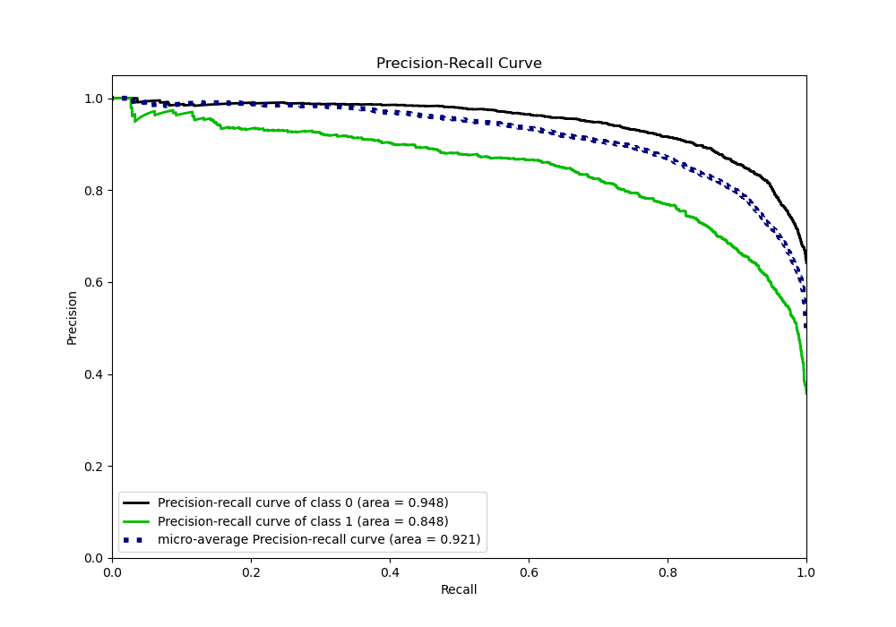
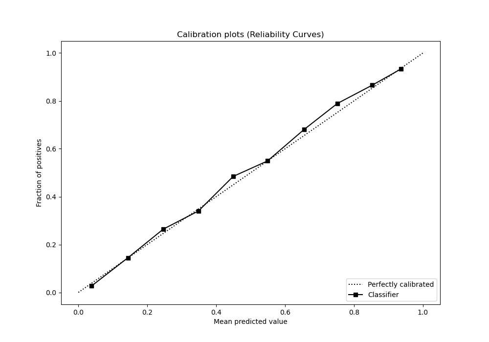
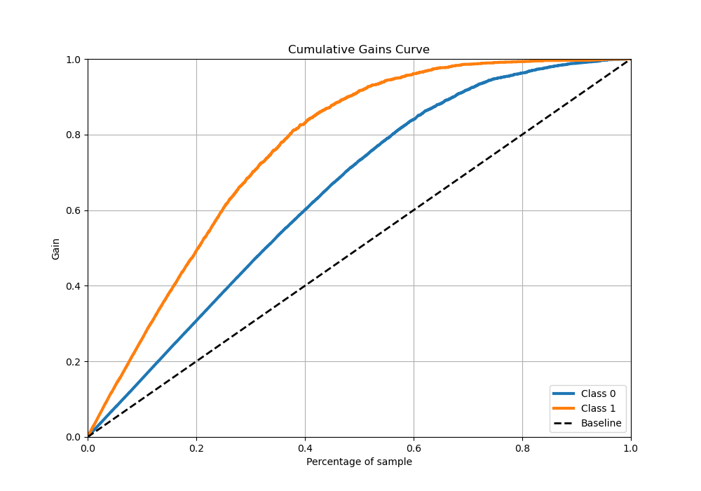
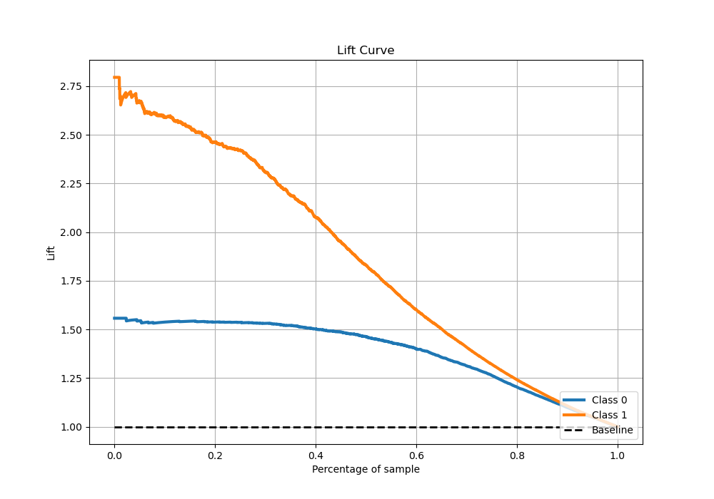

# Summary of 27_CatBoost

[<< Go back](../README.md)

## CatBoost
- **n_jobs**: -1
- **learning_rate**: 0.025
- **depth**: 6
- **rsm**: 0.9
- **loss_function**: Logloss
- **eval_metric**: Logloss
- **explain_level**: 0

## Validation
 - **validation_type**: kfold
 - **stratify**: True
 - **k_folds**: 5
 - **shuffle**: True
 - **random_seed**: 42

## Optimized metric
logloss

## Training time

87.4 seconds

## Metric details
|           |    score |   threshold |
|:----------|---------:|------------:|
| logloss   | 0.358515 | nan         |
| auc       | 0.912917 | nan         |
| f1        | 0.786941 |   0.388175  |
| accuracy  | 0.842884 |   0.424082  |
| precision | 0.967213 |   0.945411  |
| recall    | 1        |   0.0023005 |
| mcc       | 0.661822 |   0.424082  |

## Metric details with threshold from accuracy metric
|           |    score |   threshold |
|:----------|---------:|------------:|
| logloss   | 0.358515 |  nan        |
| auc       | 0.912917 |  nan        |
| f1        | 0.785198 |    0.424082 |
| accuracy  | 0.842884 |    0.424082 |
| precision | 0.768534 |    0.424082 |
| recall    | 0.8026   |    0.424082 |
| mcc       | 0.661822 |    0.424082 |

## Confusion matrix (at threshold=0.424082)
|              |   Predicted as 0 |   Predicted as 1 |
|:-------------|-----------------:|-----------------:|
| Labeled as 0 |             2628 |              409 |
| Labeled as 1 |              334 |             1358 |

## Learning curves

## Confusion Matrix

## Normalized Confusion Matrix

## ROC Curve

## Kolmogorov-Smirnov Statistic

## Precision-Recall Curve

## Calibration Curve

## Cumulative Gains Curve

## Lift Curve

[<< Go back](../README.md)
