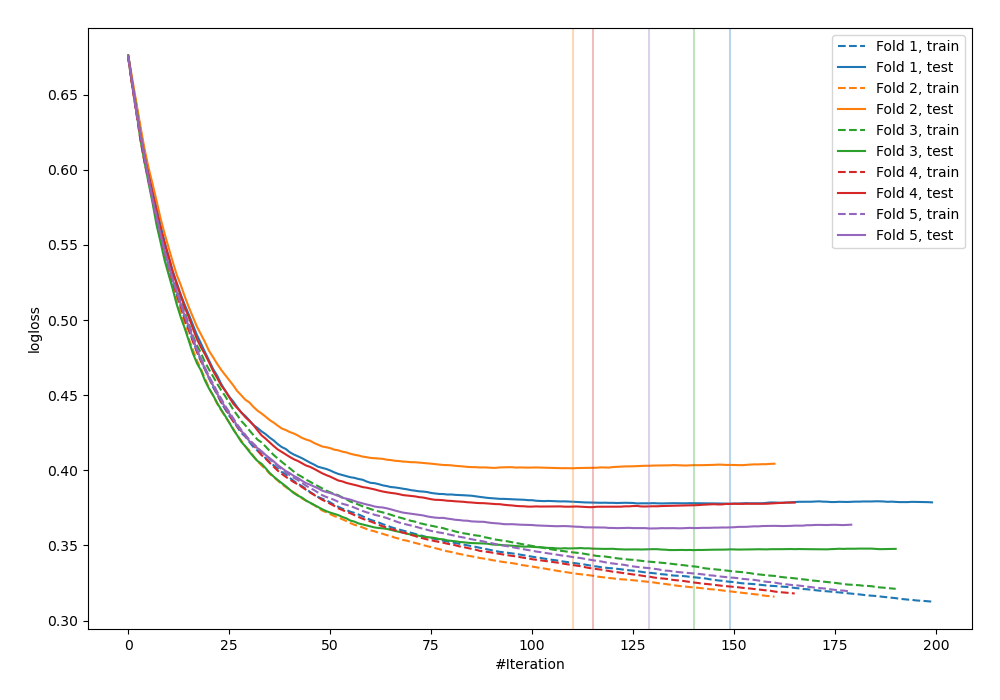
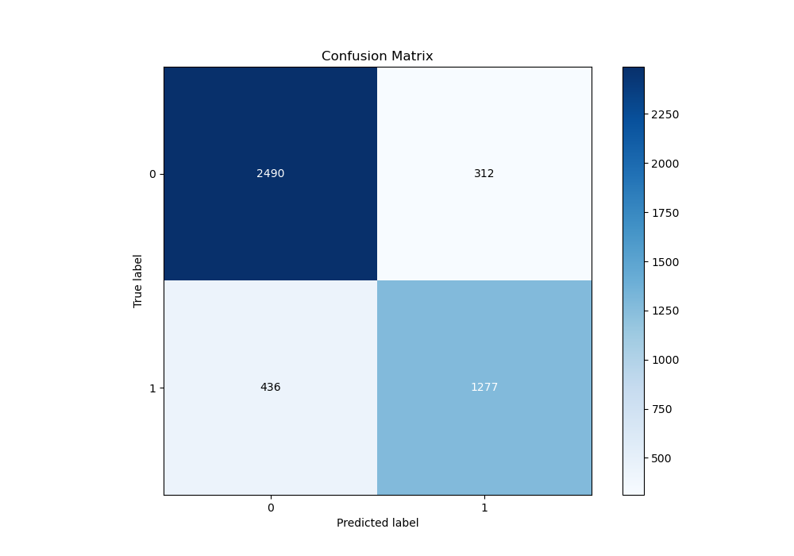
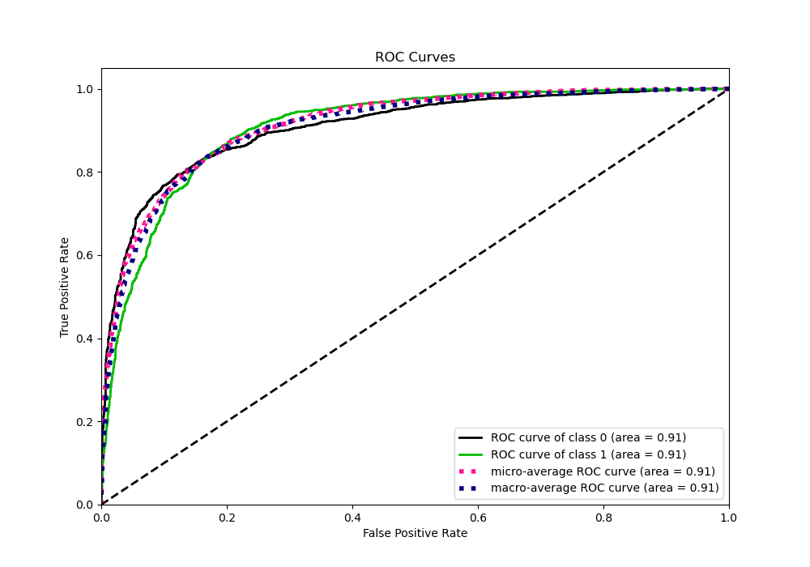
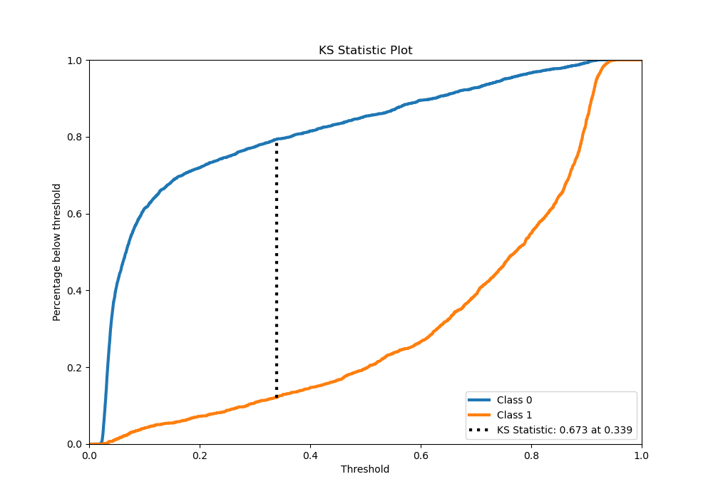
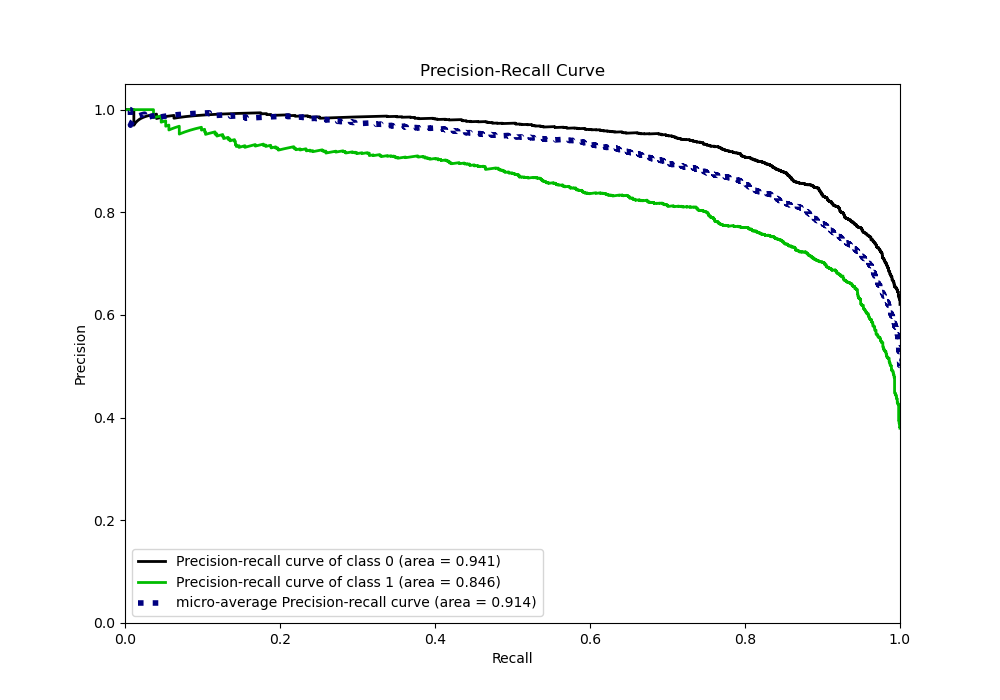
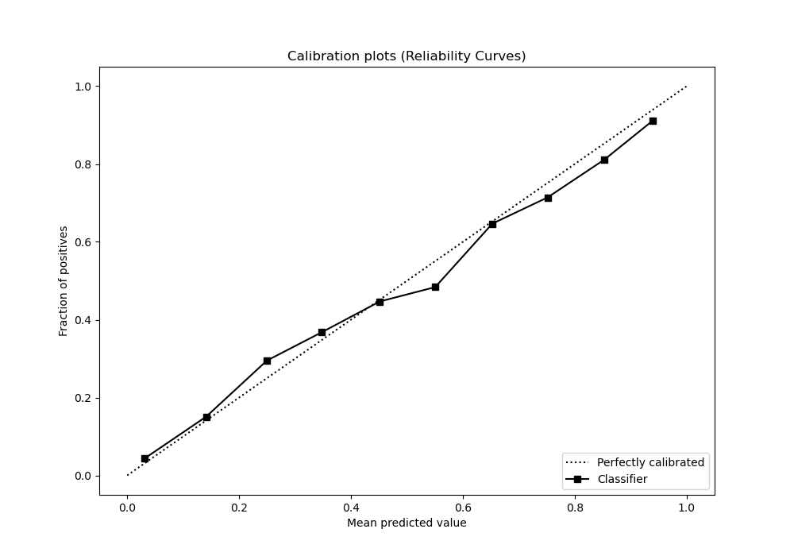
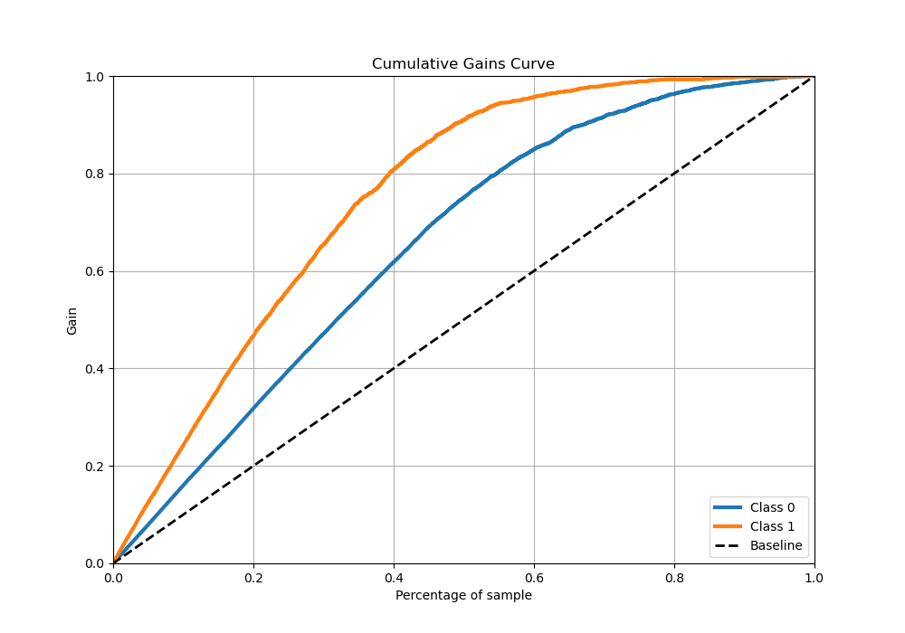
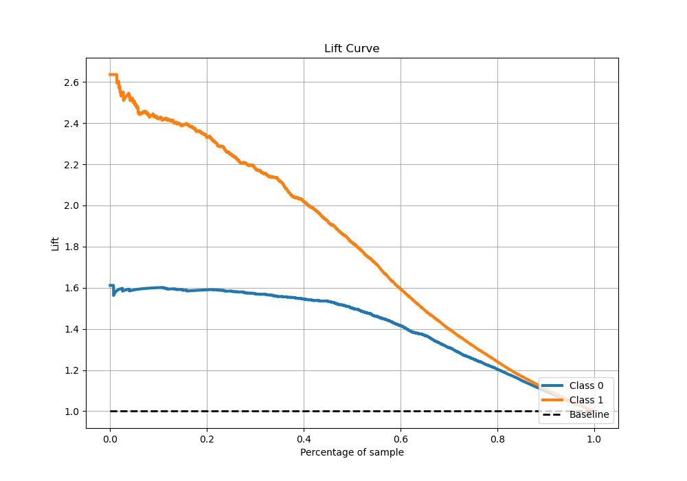

# Summary of 27_CatBoost_Stacked

[<< Go back](../README.md)

## CatBoost
- **n_jobs**: -1
- **learning_rate**: 0.025
- **depth**: 6
- **rsm**: 0.9
- **loss_function**: Logloss
- **eval_metric**: Logloss
- **explain_level**: 0

## Validation
 - **validation_type**: kfold
 - **stratify**: True
 - **k_folds**: 5
 - **shuffle**: True
 - **random_seed**: 42

## Optimized metric
logloss

## Training time

25.8 seconds

## Metric details
|           |    score |   threshold |
|:----------|---------:|------------:|
| logloss   | 0.372567 | nan         |
| auc       | 0.907919 | nan         |
| f1        | 0.792731 |   0.339615  |
| accuracy  | 0.83433  |   0.586414  |
| precision | 1        |   0.924348  |
| recall    | 1        |   0.0181719 |
| mcc       | 0.656817 |   0.445797  |

## Metric details with threshold from accuracy metric
|           |    score |   threshold |
|:----------|---------:|------------:|
| logloss   | 0.372567 |  nan        |
| auc       | 0.907919 |  nan        |
| f1        | 0.773471 |    0.586414 |
| accuracy  | 0.83433  |    0.586414 |
| precision | 0.80365  |    0.586414 |
| recall    | 0.745476 |    0.586414 |
| mcc       | 0.644302 |    0.586414 |

## Confusion matrix (at threshold=0.586414)
|              |   Predicted as 0 |   Predicted as 1 |
|:-------------|-----------------:|-----------------:|
| Labeled as 0 |             2490 |              312 |
| Labeled as 1 |              436 |             1277 |

## Learning curves

## Confusion Matrix

## Normalized Confusion Matrix

## ROC Curve

## Kolmogorov-Smirnov Statistic

## Precision-Recall Curve

## Calibration Curve

## Cumulative Gains Curve

## Lift Curve

[<< Go back](../README.md)
