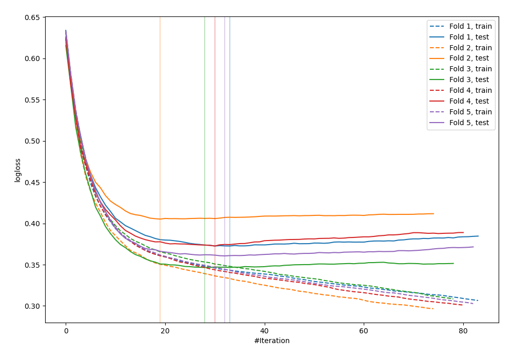
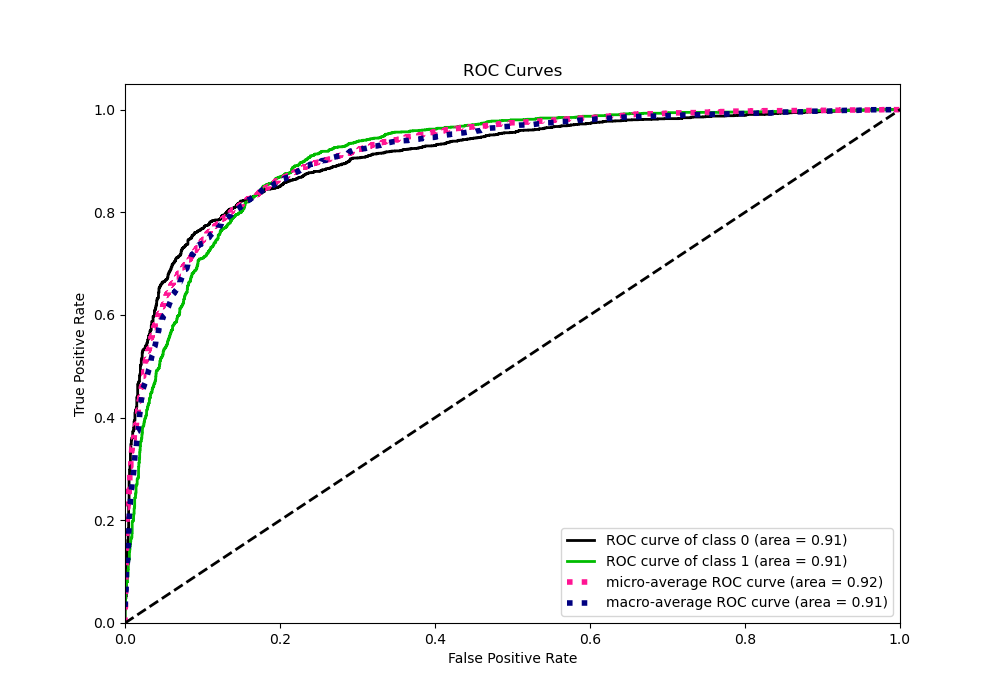
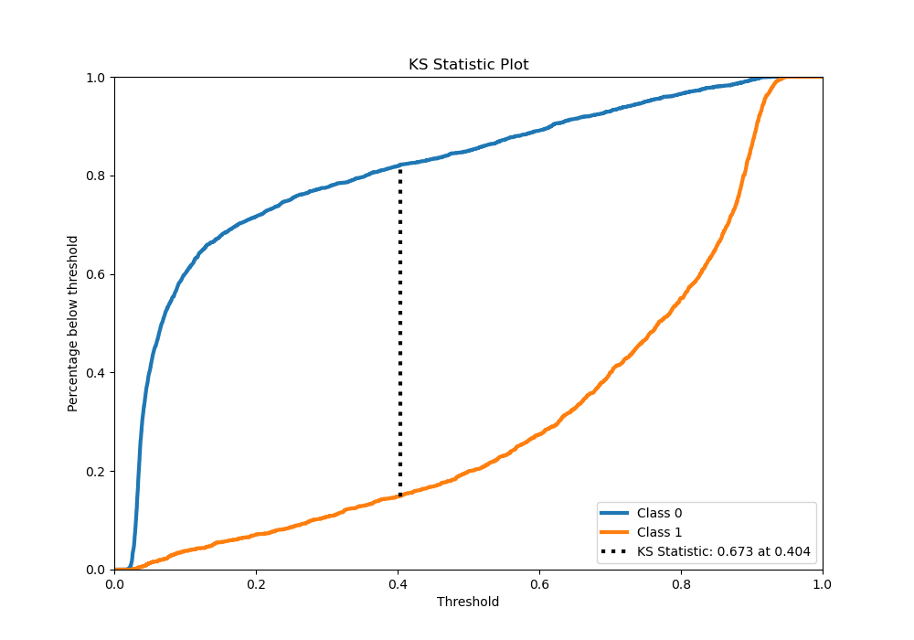
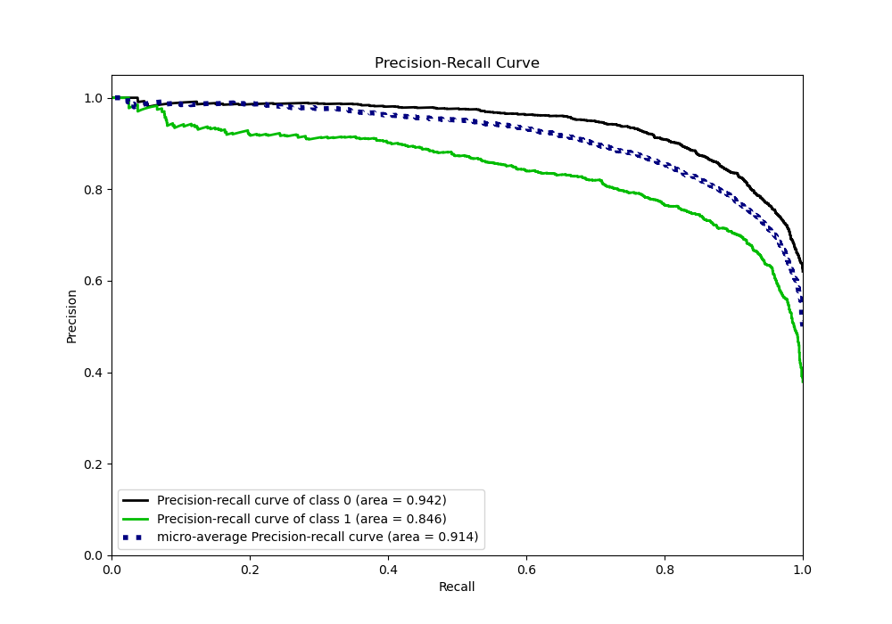
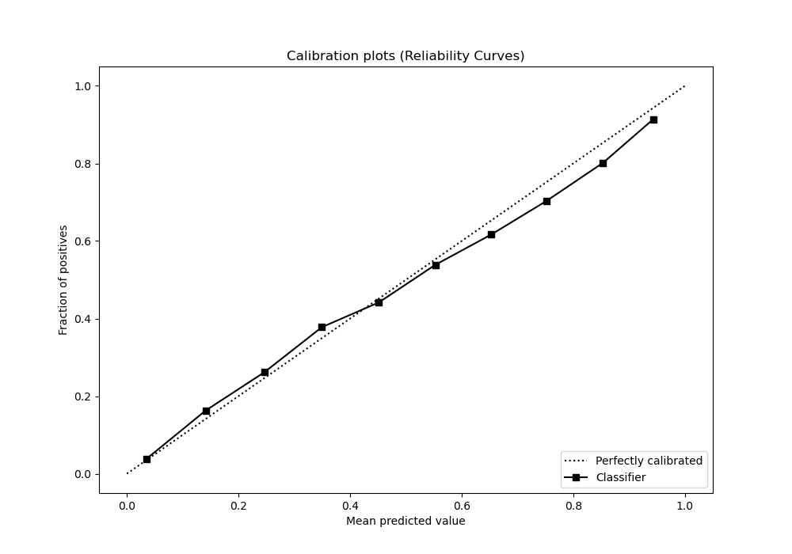
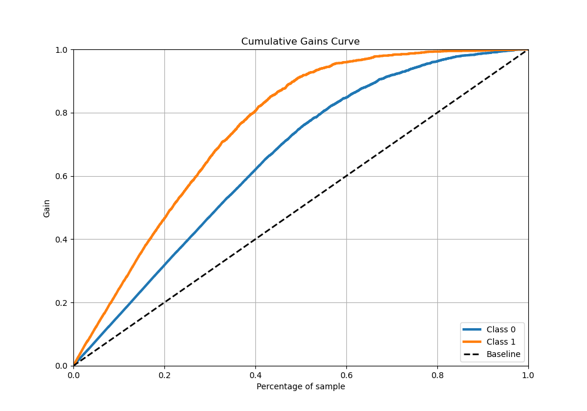
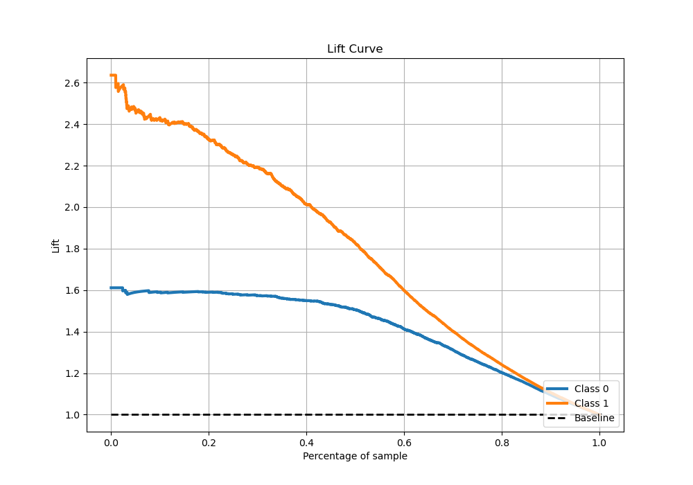

# Summary of 28_CatBoost_Stacked

[<< Go back](../README.md)

## CatBoost
- **n_jobs**: -1
- **learning_rate**: 0.1
- **depth**: 5
- **rsm**: 0.8
- **loss_function**: Logloss
- **eval_metric**: Logloss
- **explain_level**: 0

## Validation
 - **validation_type**: kfold
 - **stratify**: True
 - **k_folds**: 5
 - **shuffle**: True
 - **random_seed**: 42

## Optimized metric
logloss

## Training time

22.0 seconds

## Metric details
|           |    score |   threshold |
|:----------|---------:|------------:|
| logloss   | 0.371597 |  nan        |
| auc       | 0.9086   |  nan        |
| f1        | 0.793009 |    0.40956  |
| accuracy  | 0.833001 |    0.46778  |
| precision | 0.983051 |    0.92372  |
| recall    | 1        |    0.014782 |
| mcc       | 0.656634 |    0.40956  |

## Metric details with threshold from accuracy metric
|           |    score |   threshold |
|:----------|---------:|------------:|
| logloss   | 0.371597 |   nan       |
| auc       | 0.9086   |   nan       |
| f1        | 0.788914 |     0.46778 |
| accuracy  | 0.833001 |     0.46778 |
| precision | 0.757934 |     0.46778 |
| recall    | 0.822534 |     0.46778 |
| mcc       | 0.65264  |     0.46778 |

## Confusion matrix (at threshold=0.46778)
|              |   Predicted as 0 |   Predicted as 1 |
|:-------------|-----------------:|-----------------:|
| Labeled as 0 |             2352 |              450 |
| Labeled as 1 |              304 |             1409 |

## Learning curves

## Confusion Matrix

## Normalized Confusion Matrix

## ROC Curve

## Kolmogorov-Smirnov Statistic

## Precision-Recall Curve

## Calibration Curve

## Cumulative Gains Curve

## Lift Curve

[<< Go back](../README.md)
