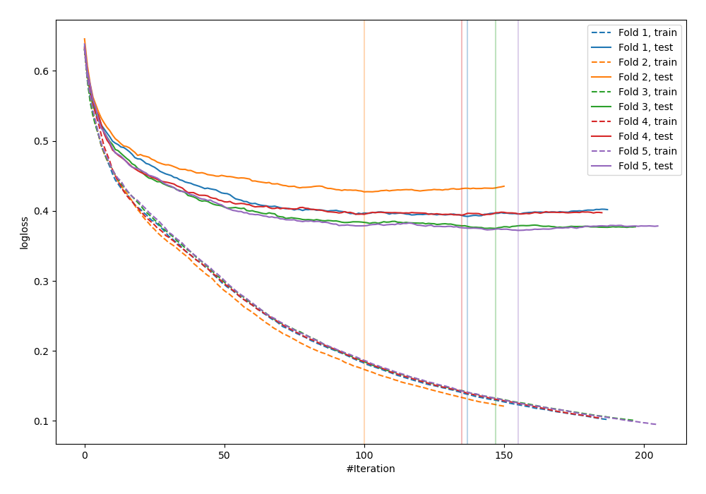
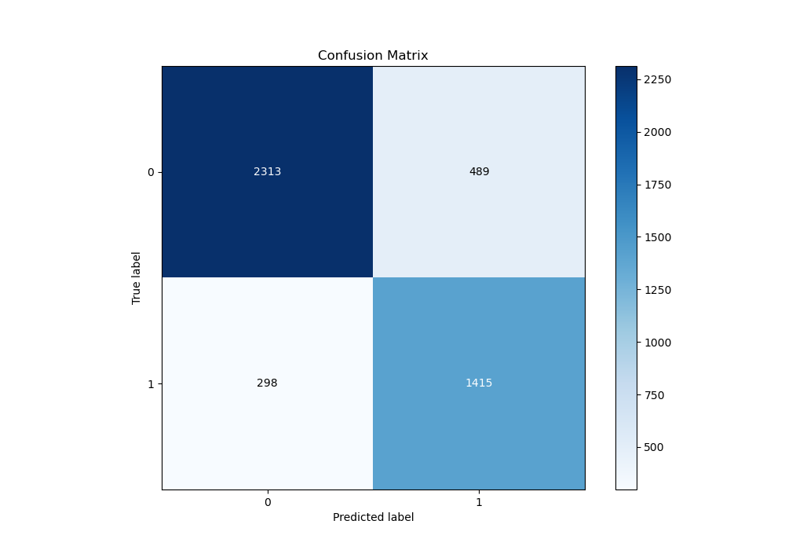
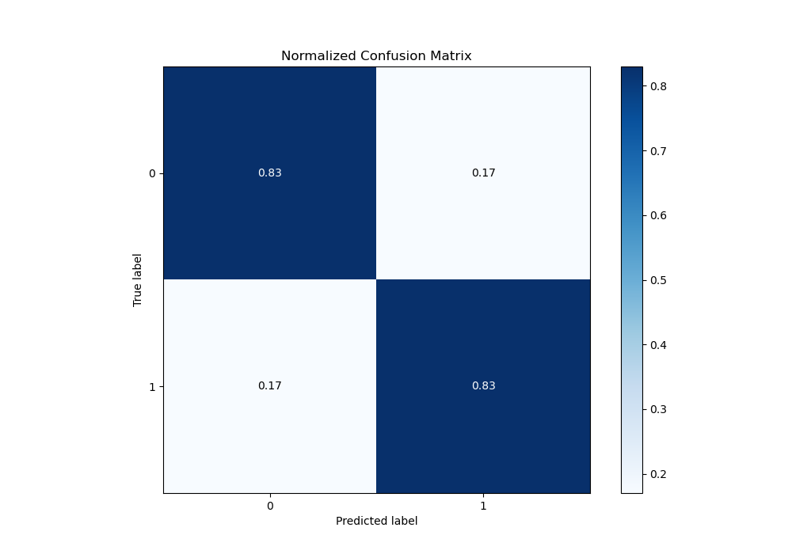
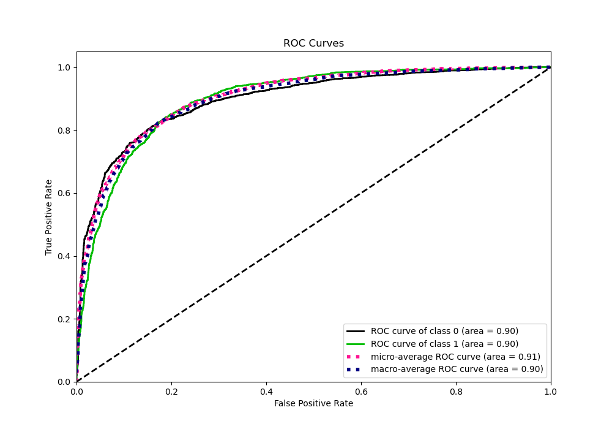
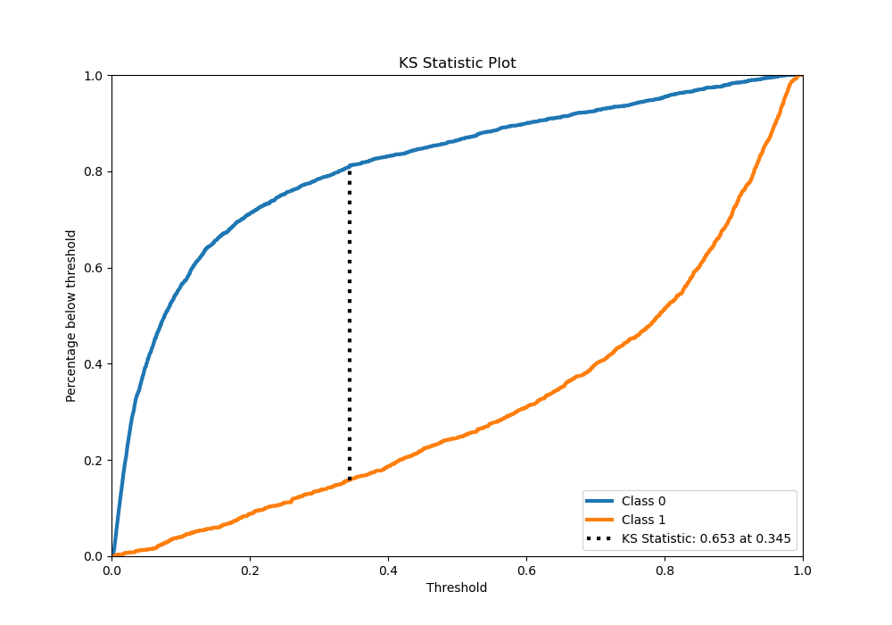
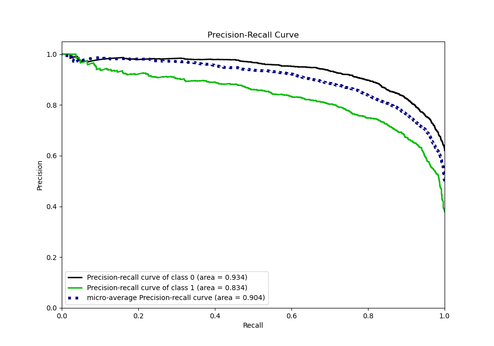
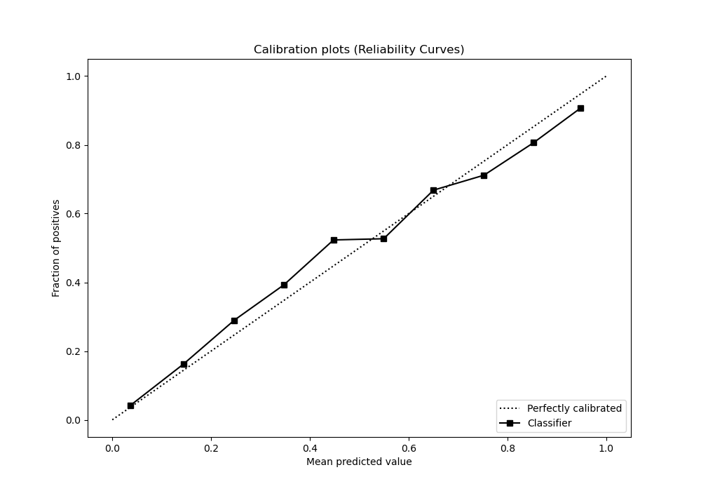
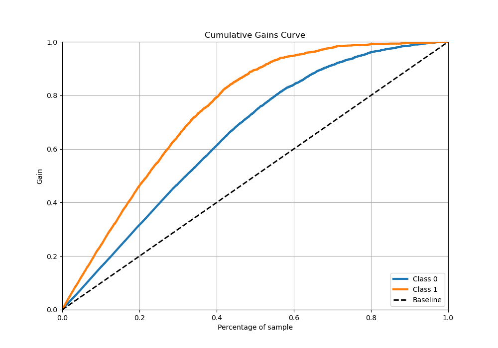
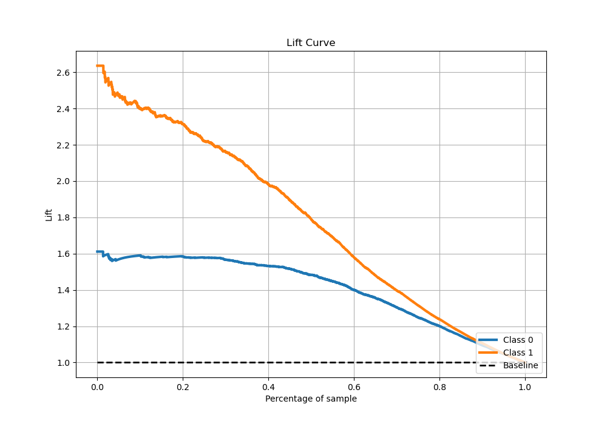

# Summary of 29_CatBoost

[<< Go back](../README.md)

## CatBoost
- **n_jobs**: -1
- **learning_rate**: 0.2
- **depth**: 7
- **rsm**: 1.0
- **loss_function**: Logloss
- **eval_metric**: Logloss
- **explain_level**: 0

## Validation
 - **validation_type**: kfold
 - **stratify**: True
 - **k_folds**: 5
 - **shuffle**: True
 - **random_seed**: 42

## Optimized metric
logloss

## Training time

23.5 seconds

## Metric details
|           |    score |    threshold |
|:----------|---------:|-------------:|
| logloss   | 0.392046 | nan          |
| auc       | 0.898781 | nan          |
| f1        | 0.782416 |   0.379837   |
| accuracy  | 0.825692 |   0.379837   |
| precision | 1        |   0.977958   |
| recall    | 1        |   0.00107358 |
| mcc       | 0.64018  |   0.379837   |

## Metric details with threshold from accuracy metric
|           |    score |   threshold |
|:----------|---------:|------------:|
| logloss   | 0.392046 |  nan        |
| auc       | 0.898781 |  nan        |
| f1        | 0.782416 |    0.379837 |
| accuracy  | 0.825692 |    0.379837 |
| precision | 0.743172 |    0.379837 |
| recall    | 0.826036 |    0.379837 |
| mcc       | 0.64018  |    0.379837 |

## Confusion matrix (at threshold=0.379837)
|              |   Predicted as 0 |   Predicted as 1 |
|:-------------|-----------------:|-----------------:|
| Labeled as 0 |             2313 |              489 |
| Labeled as 1 |              298 |             1415 |

## Learning curves

## Confusion Matrix

## Normalized Confusion Matrix

## ROC Curve

## Kolmogorov-Smirnov Statistic

## Precision-Recall Curve

## Calibration Curve

## Cumulative Gains Curve

## Lift Curve

[<< Go back](../README.md)
