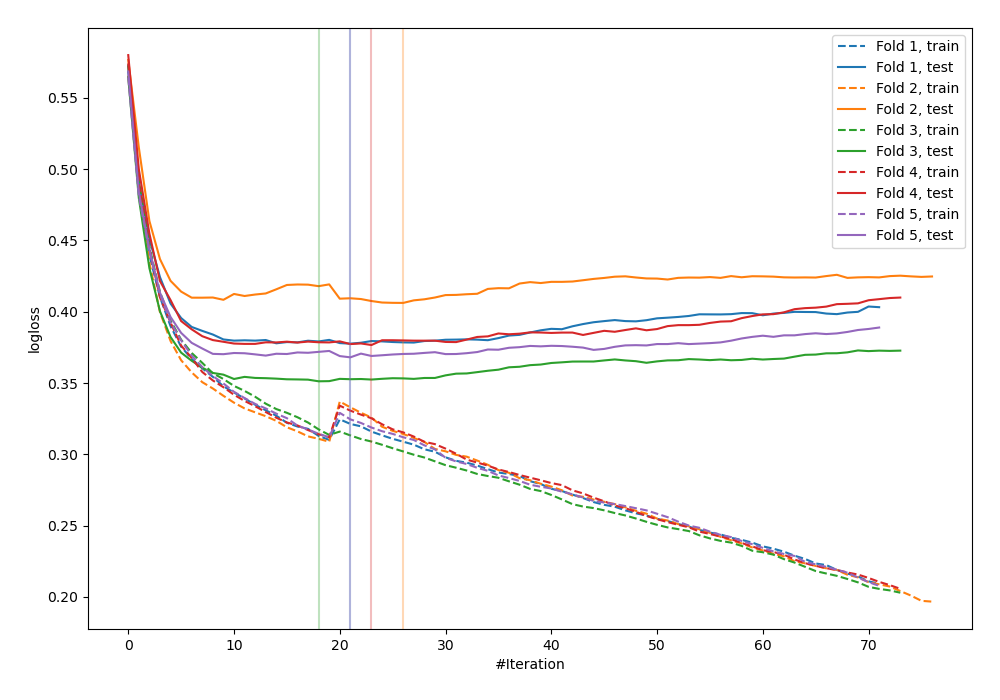
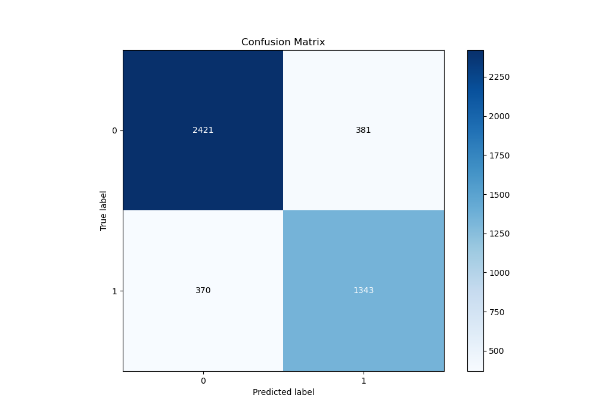
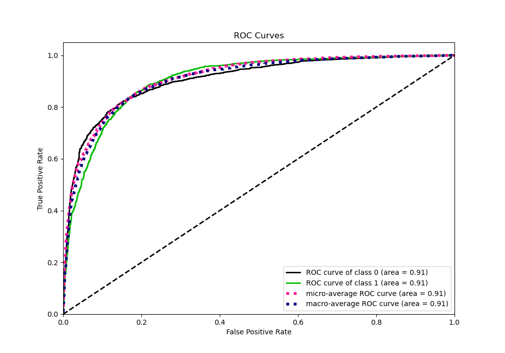
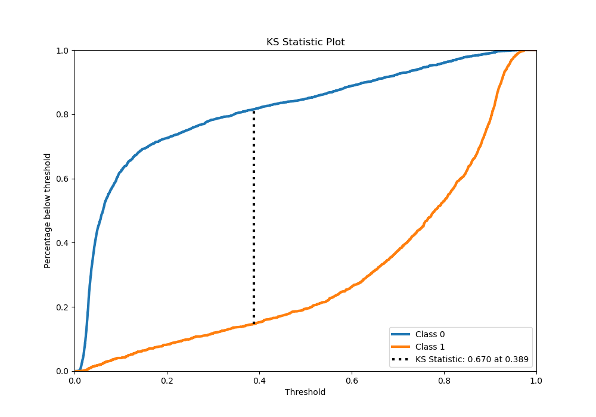
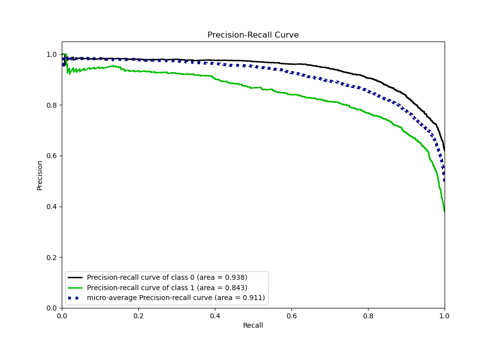
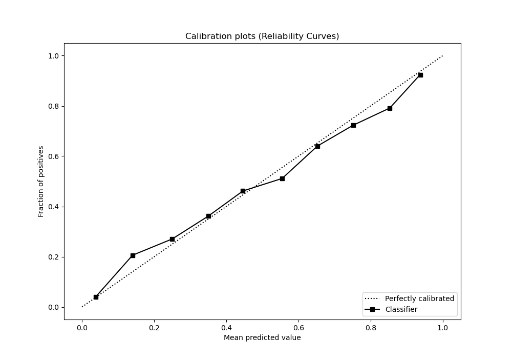
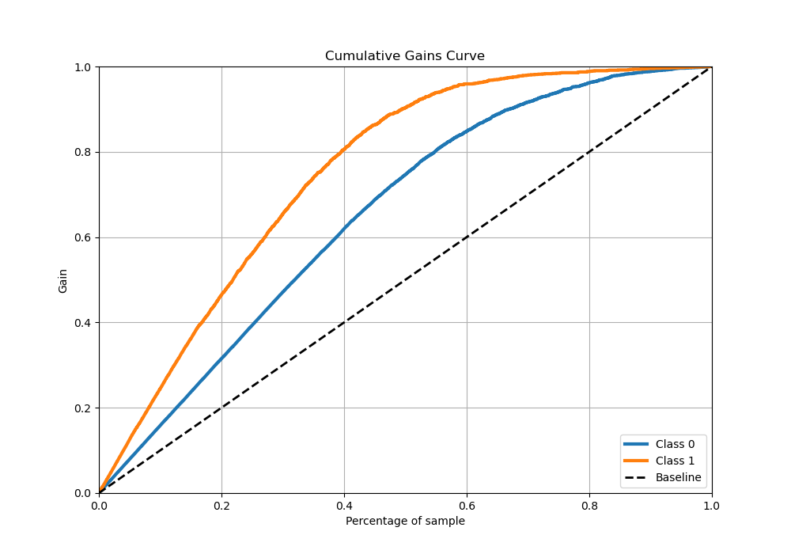
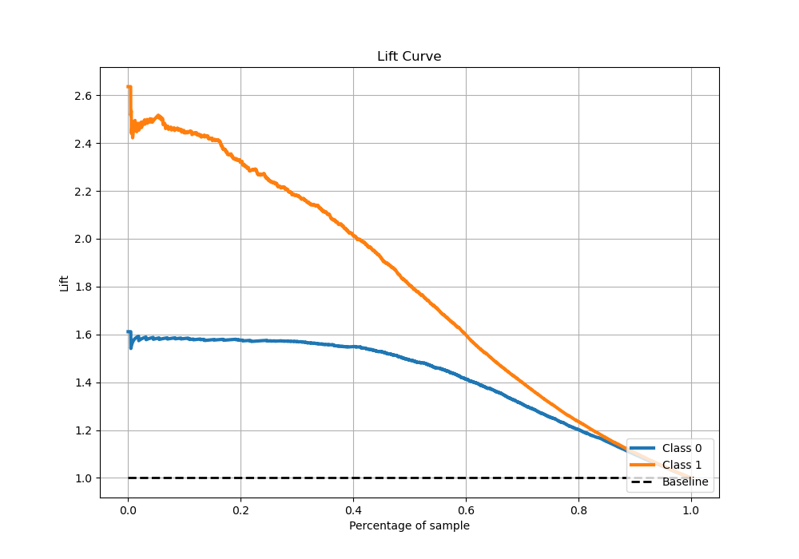

# Summary of 29_CatBoost_Stacked

[<< Go back](../README.md)

## CatBoost
- **n_jobs**: -1
- **learning_rate**: 0.2
- **depth**: 7
- **rsm**: 1.0
- **loss_function**: Logloss
- **eval_metric**: Logloss
- **explain_level**: 0

## Validation
 - **validation_type**: kfold
 - **stratify**: True
 - **k_folds**: 5
 - **shuffle**: True
 - **random_seed**: 42

## Optimized metric
logloss

## Training time

32.7 seconds

## Metric details
|           |    score |    threshold |
|:----------|---------:|-------------:|
| logloss   | 0.376207 | nan          |
| auc       | 0.905838 | nan          |
| f1        | 0.791917 |   0.405168   |
| accuracy  | 0.833666 |   0.54435    |
| precision | 0.953975 |   0.915597   |
| recall    | 1        |   0.00692157 |
| mcc       | 0.654791 |   0.405168   |

## Metric details with threshold from accuracy metric
|           |    score |   threshold |
|:----------|---------:|------------:|
| logloss   | 0.376207 |   nan       |
| auc       | 0.905838 |   nan       |
| f1        | 0.781495 |     0.54435 |
| accuracy  | 0.833666 |     0.54435 |
| precision | 0.779002 |     0.54435 |
| recall    | 0.784005 |     0.54435 |
| mcc       | 0.647231 |     0.54435 |

## Confusion matrix (at threshold=0.54435)
|              |   Predicted as 0 |   Predicted as 1 |
|:-------------|-----------------:|-----------------:|
| Labeled as 0 |             2421 |              381 |
| Labeled as 1 |              370 |             1343 |

## Learning curves

## Confusion Matrix

## Normalized Confusion Matrix

## ROC Curve

## Kolmogorov-Smirnov Statistic

## Precision-Recall Curve

## Calibration Curve

## Cumulative Gains Curve

## Lift Curve

[<< Go back](../README.md)
