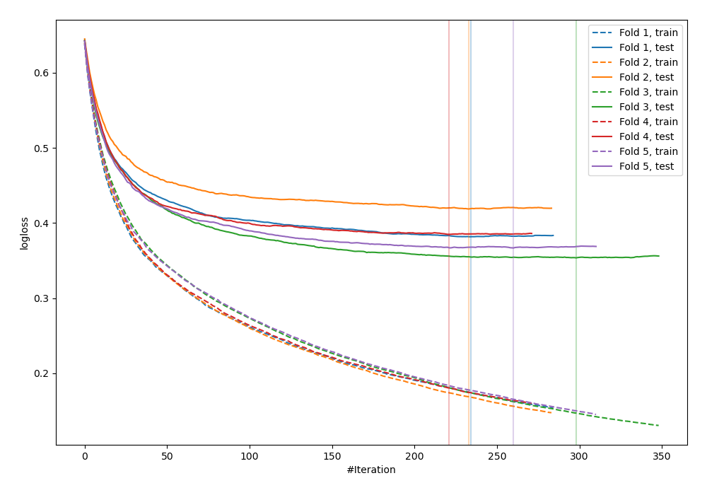
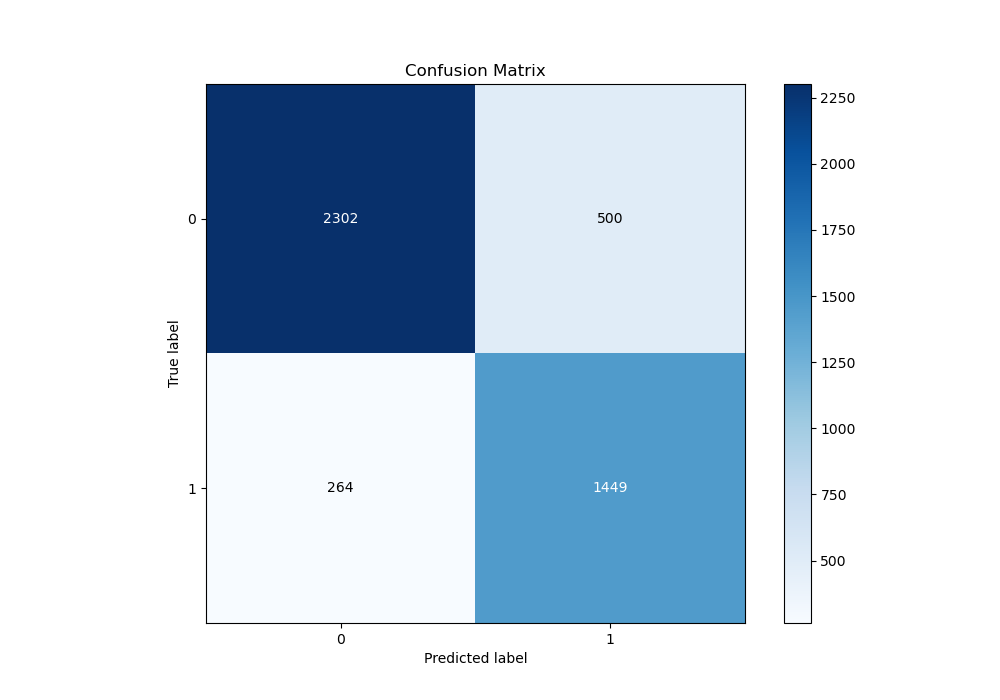
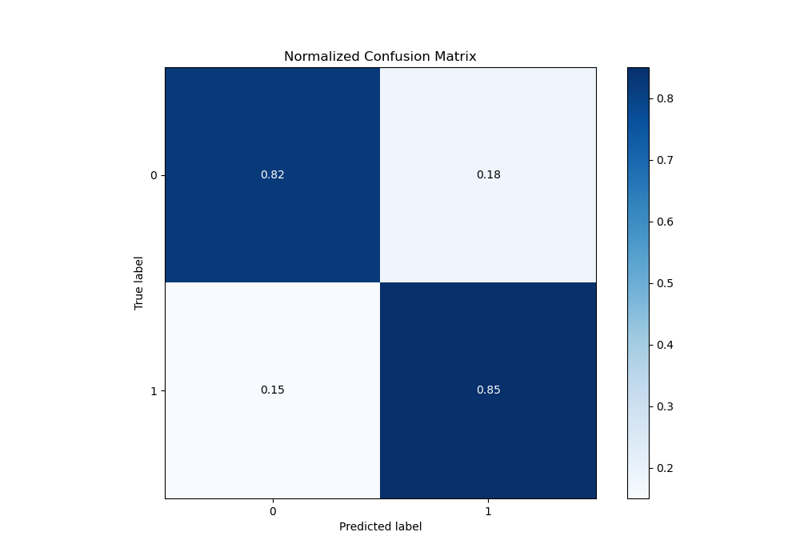
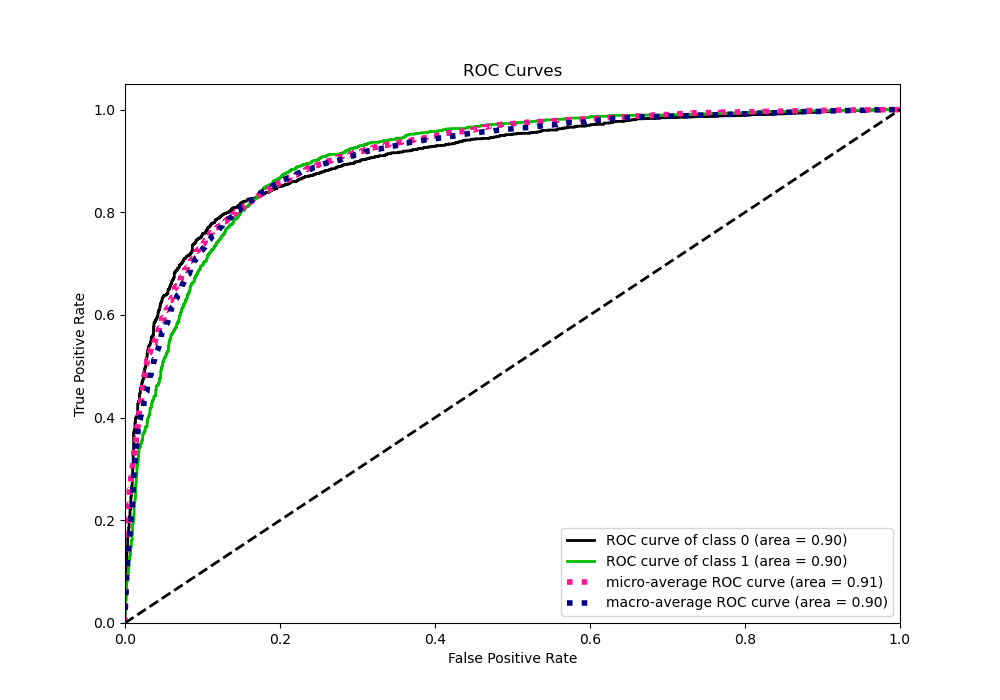
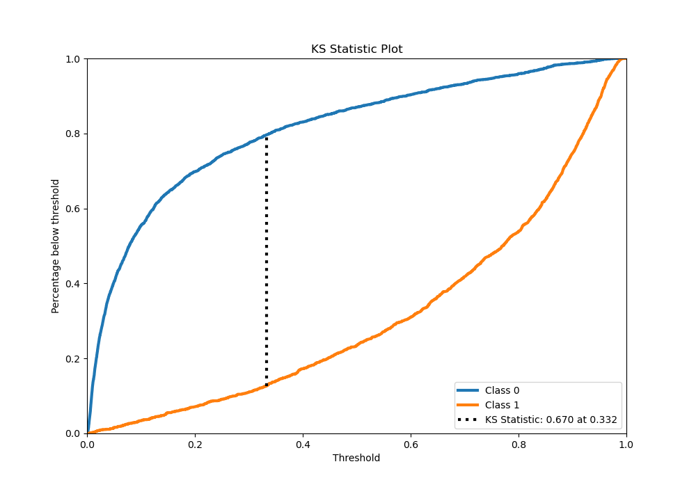
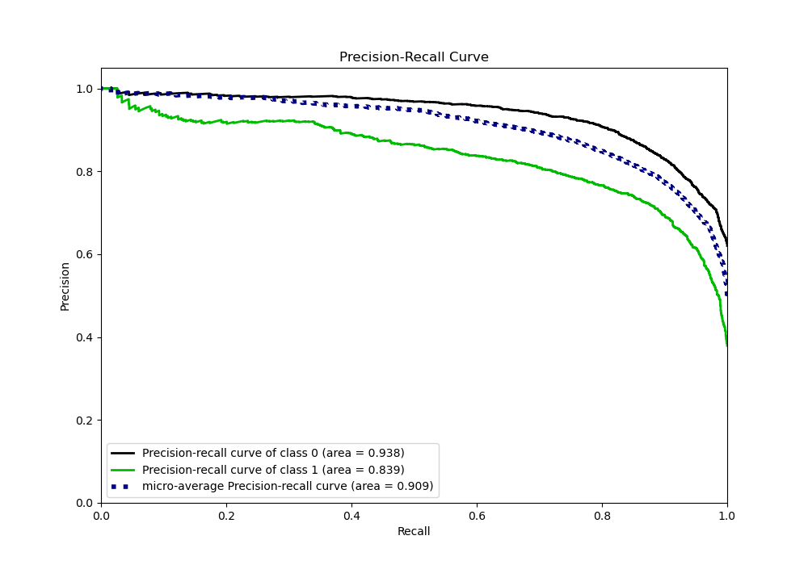
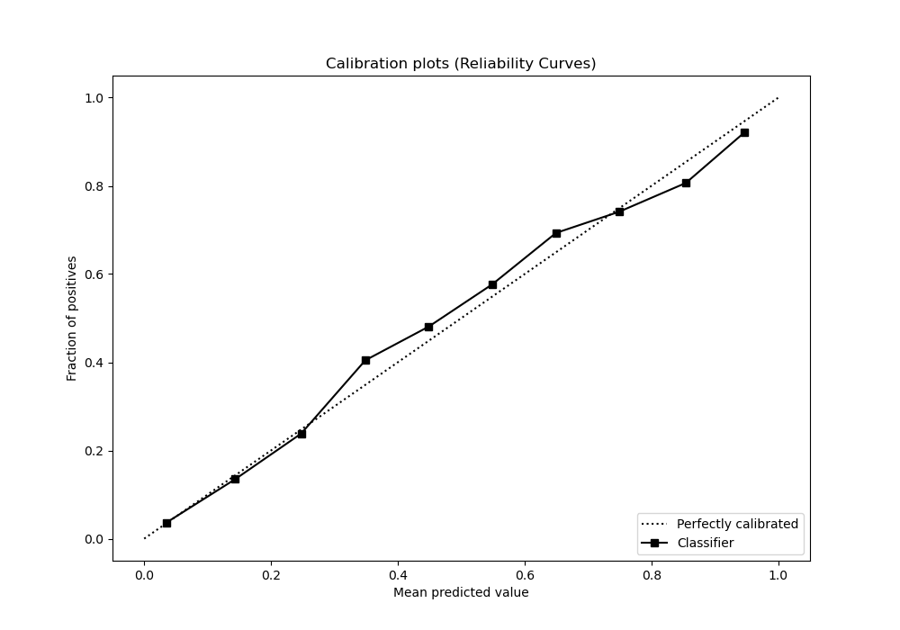
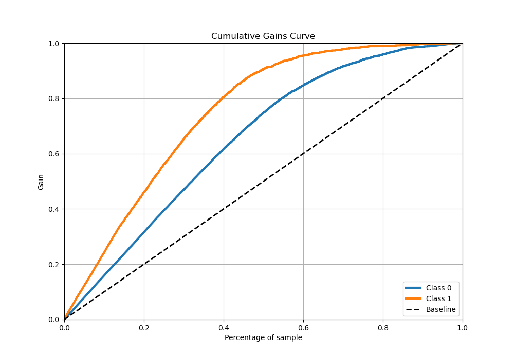
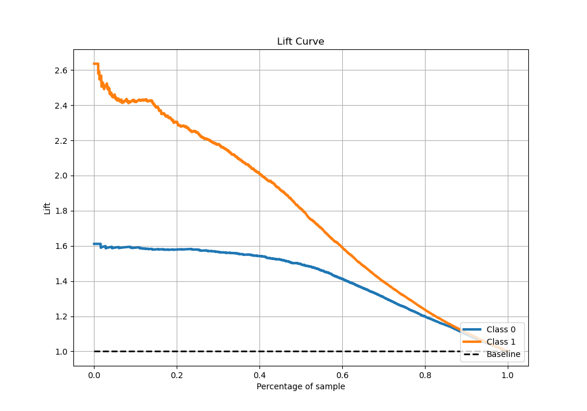

# Summary of 2_Default_Xgboost

[<< Go back](../README.md)

## Extreme Gradient Boosting (Xgboost)
- **n_jobs**: -1
- **objective**: binary:logistic
- **eta**: 0.075
- **max_depth**: 6
- **min_child_weight**: 1
- **subsample**: 1.0
- **colsample_bytree**: 1.0
- **eval_metric**: logloss
- **explain_level**: 0

## Validation
 - **validation_type**: kfold
 - **stratify**: True
 - **k_folds**: 5
 - **shuffle**: True
 - **random_seed**: 42

## Optimized metric
logloss

## Training time

50.6 seconds

## Metric details
|           |    score |     threshold |
|:----------|---------:|--------------:|
| logloss   | 0.381284 | nan           |
| auc       | 0.903603 | nan           |
| f1        | 0.791371 |   0.376835    |
| accuracy  | 0.830786 |   0.376835    |
| precision | 0.966102 |   0.974026    |
| recall    | 1        |   0.000530294 |
| mcc       | 0.653869 |   0.376835    |

## Metric details with threshold from accuracy metric
|           |    score |   threshold |
|:----------|---------:|------------:|
| logloss   | 0.381284 |  nan        |
| auc       | 0.903603 |  nan        |
| f1        | 0.791371 |    0.376835 |
| accuracy  | 0.830786 |    0.376835 |
| precision | 0.743458 |    0.376835 |
| recall    | 0.845884 |    0.376835 |
| mcc       | 0.653869 |    0.376835 |

## Confusion matrix (at threshold=0.376835)
|              |   Predicted as 0 |   Predicted as 1 |
|:-------------|-----------------:|-----------------:|
| Labeled as 0 |             2302 |              500 |
| Labeled as 1 |              264 |             1449 |

## Learning curves

## Confusion Matrix

## Normalized Confusion Matrix

## ROC Curve

## Kolmogorov-Smirnov Statistic

## Precision-Recall Curve

## Calibration Curve

## Cumulative Gains Curve

## Lift Curve

[<< Go back](../README.md)
