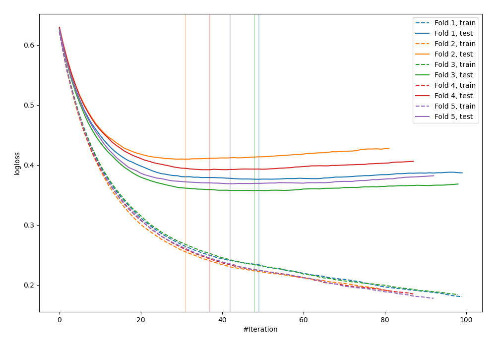
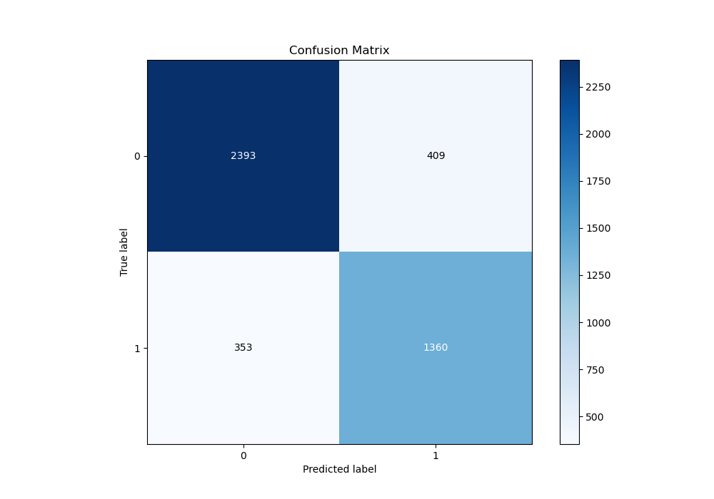
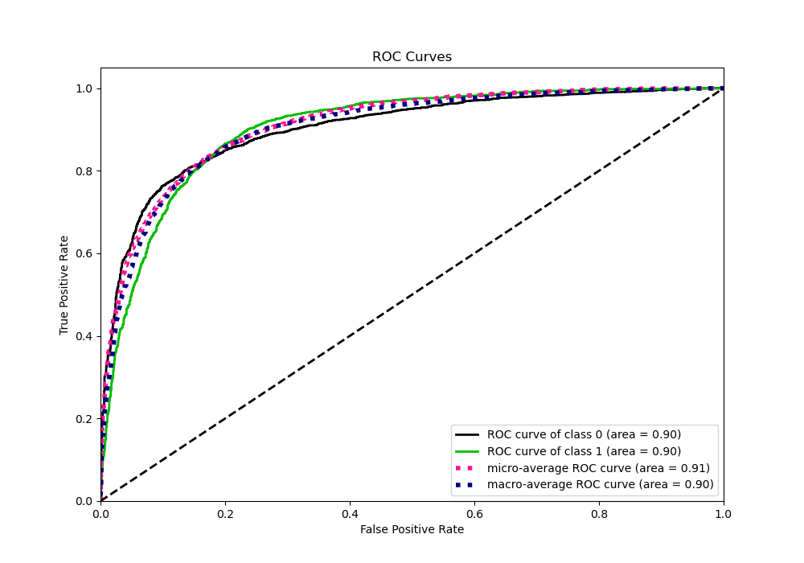
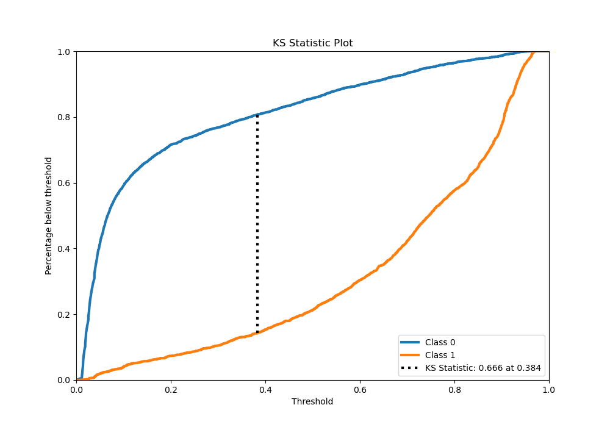
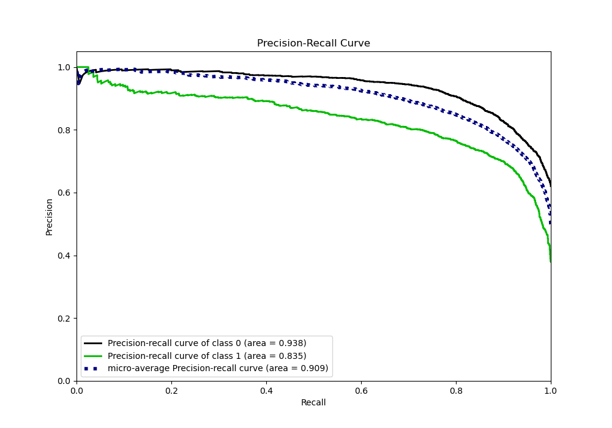
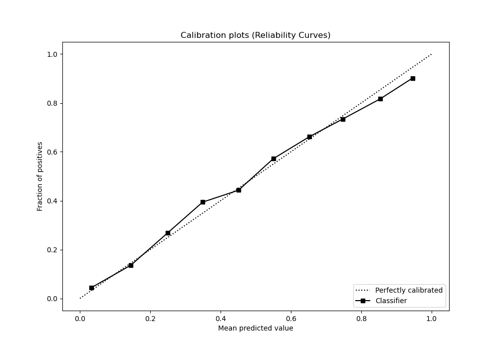
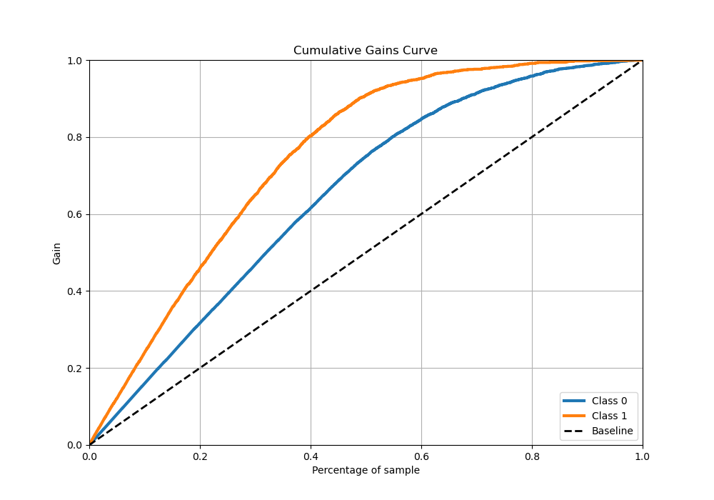
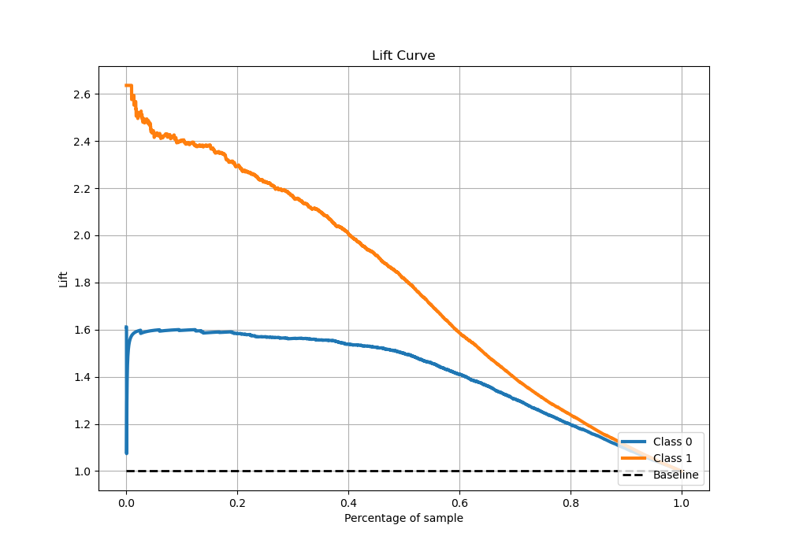

# Summary of 2_Default_Xgboost_Stacked

[<< Go back](../README.md)

## Extreme Gradient Boosting (Xgboost)
- **n_jobs**: -1
- **objective**: binary:logistic
- **eta**: 0.075
- **max_depth**: 6
- **min_child_weight**: 1
- **subsample**: 1.0
- **colsample_bytree**: 1.0
- **eval_metric**: logloss
- **explain_level**: 0

## Validation
 - **validation_type**: kfold
 - **stratify**: True
 - **k_folds**: 5
 - **shuffle**: True
 - **random_seed**: 42

## Optimized metric
logloss

## Training time

24.9 seconds

## Metric details
|           |    score |   threshold |
|:----------|---------:|------------:|
| logloss   | 0.380555 | nan         |
| auc       | 0.902785 | nan         |
| f1        | 0.789446 |   0.37015   |
| accuracy  | 0.831229 |   0.490205  |
| precision | 0.983051 |   0.952501  |
| recall    | 1        |   0.0107254 |
| mcc       | 0.648822 |   0.37015   |

## Metric details with threshold from accuracy metric
|           |    score |   threshold |
|:----------|---------:|------------:|
| logloss   | 0.380555 |  nan        |
| auc       | 0.902785 |  nan        |
| f1        | 0.78116  |    0.490205 |
| accuracy  | 0.831229 |    0.490205 |
| precision | 0.768796 |    0.490205 |
| recall    | 0.793929 |    0.490205 |
| mcc       | 0.644092 |    0.490205 |

## Confusion matrix (at threshold=0.490205)
|              |   Predicted as 0 |   Predicted as 1 |
|:-------------|-----------------:|-----------------:|
| Labeled as 0 |             2393 |              409 |
| Labeled as 1 |              353 |             1360 |

## Learning curves

## Confusion Matrix

## Normalized Confusion Matrix

## ROC Curve

## Kolmogorov-Smirnov Statistic

## Precision-Recall Curve

## Calibration Curve

## Cumulative Gains Curve

## Lift Curve

[<< Go back](../README.md)
