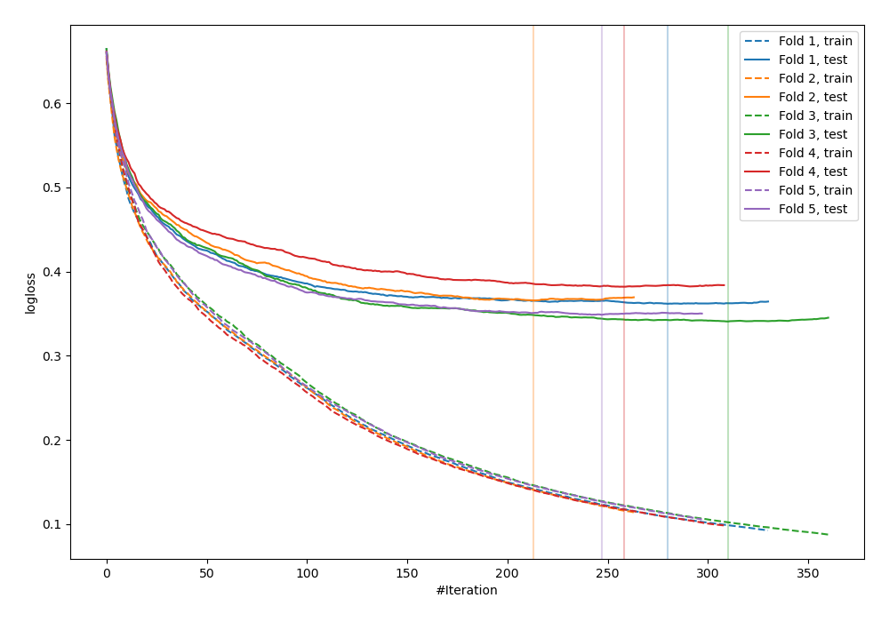
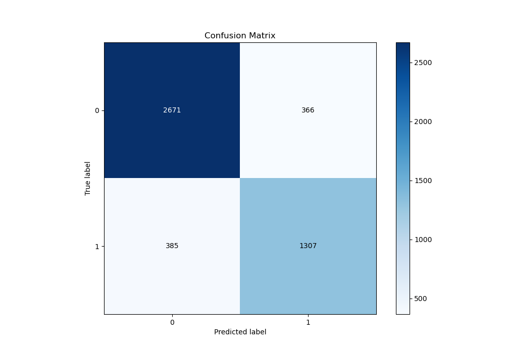
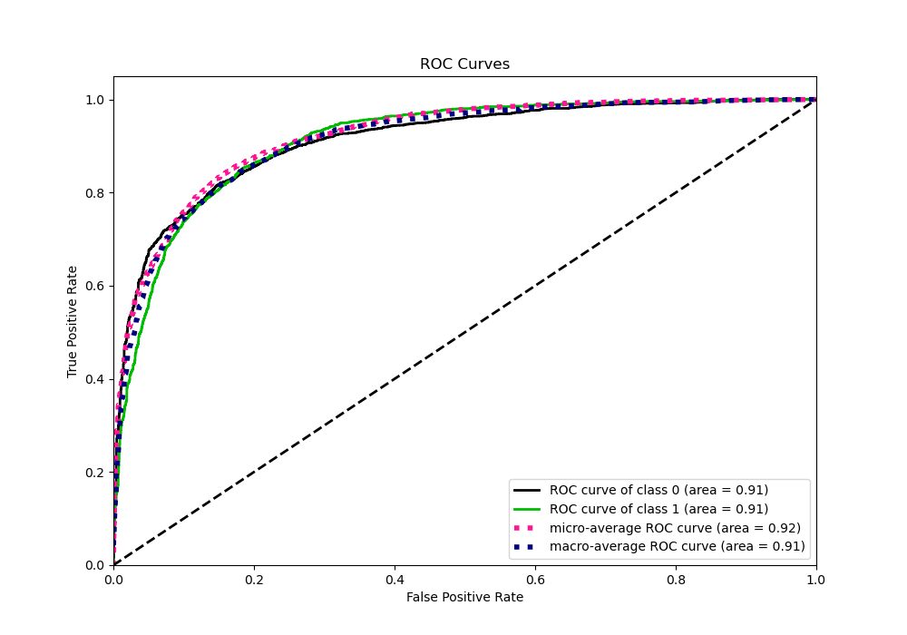
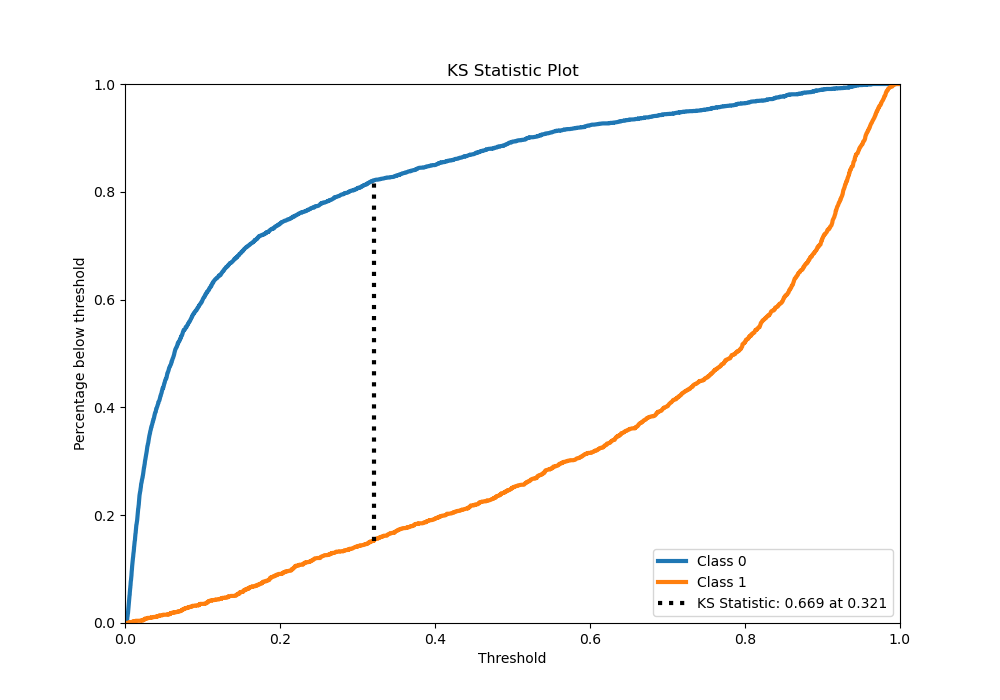
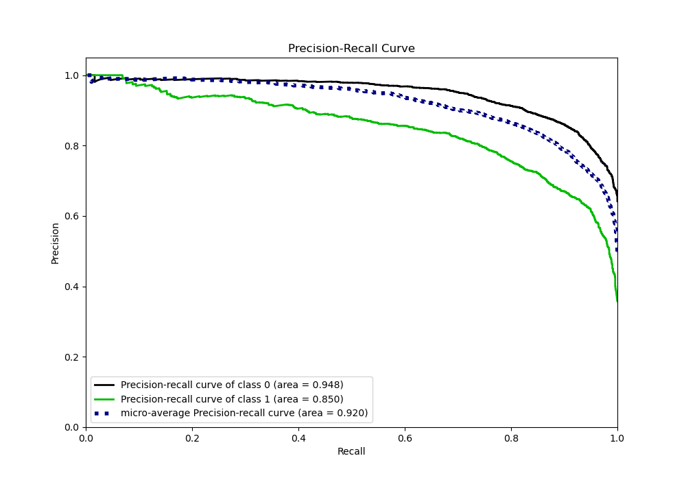
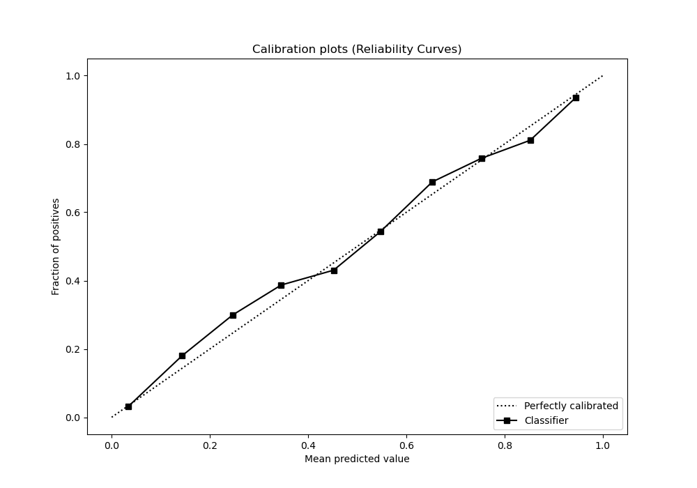
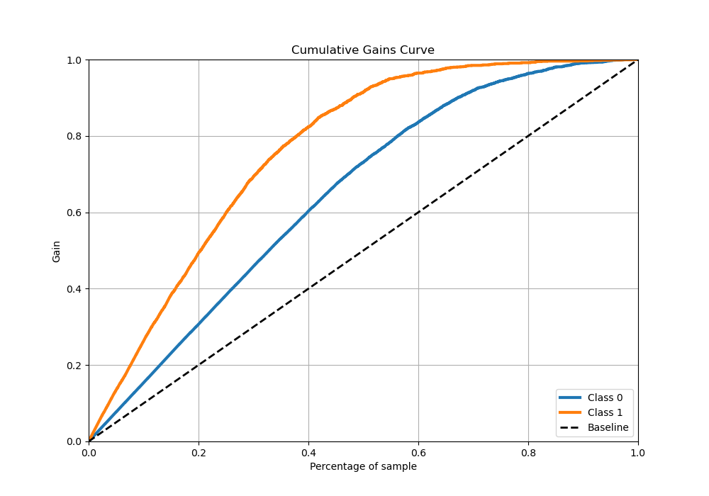
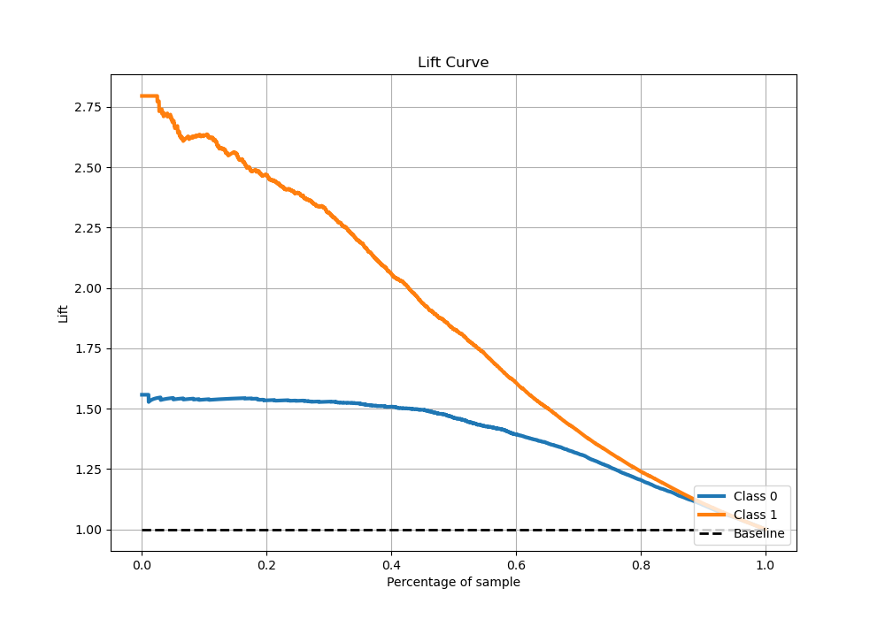

# Summary of 30_CatBoost

[<< Go back](../README.md)

## CatBoost
- **n_jobs**: -1
- **learning_rate**: 0.1
- **depth**: 8
- **rsm**: 1.0
- **loss_function**: Logloss
- **eval_metric**: Logloss
- **explain_level**: 0

## Validation
 - **validation_type**: kfold
 - **stratify**: True
 - **k_folds**: 5
 - **shuffle**: True
 - **random_seed**: 42

## Optimized metric
logloss

## Training time

72.1 seconds

## Metric details
|           |    score |     threshold |
|:----------|---------:|--------------:|
| logloss   | 0.359767 | nan           |
| auc       | 0.912225 | nan           |
| f1        | 0.780726 |   0.313222    |
| accuracy  | 0.841193 |   0.46969     |
| precision | 1        |   0.972486    |
| recall    | 1        |   0.000554268 |
| mcc       | 0.653595 |   0.46969     |

## Metric details with threshold from accuracy metric
|           |    score |   threshold |
|:----------|---------:|------------:|
| logloss   | 0.359767 |   nan       |
| auc       | 0.912225 |   nan       |
| f1        | 0.77682  |     0.46969 |
| accuracy  | 0.841193 |     0.46969 |
| precision | 0.781231 |     0.46969 |
| recall    | 0.772459 |     0.46969 |
| mcc       | 0.653595 |     0.46969 |

## Confusion matrix (at threshold=0.46969)
|              |   Predicted as 0 |   Predicted as 1 |
|:-------------|-----------------:|-----------------:|
| Labeled as 0 |             2671 |              366 |
| Labeled as 1 |              385 |             1307 |

## Learning curves

## Confusion Matrix

## Normalized Confusion Matrix

## ROC Curve

## Kolmogorov-Smirnov Statistic

## Precision-Recall Curve

## Calibration Curve

## Cumulative Gains Curve

## Lift Curve

[<< Go back](../README.md)
