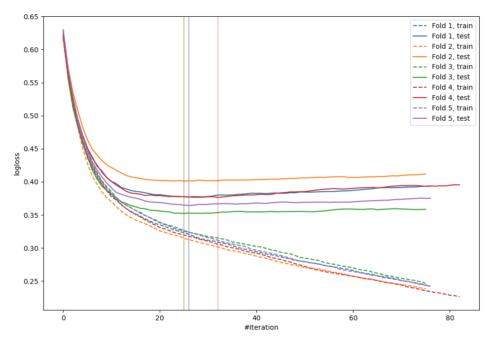
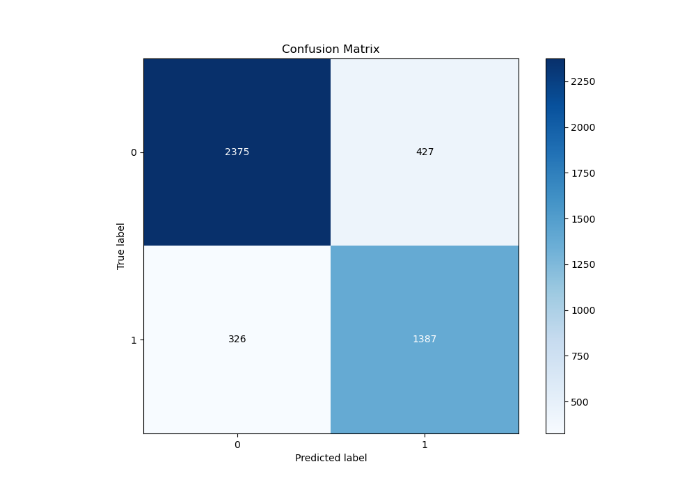
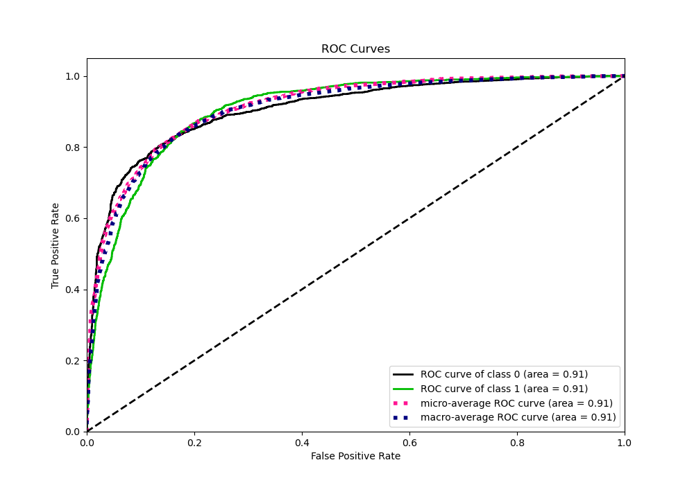
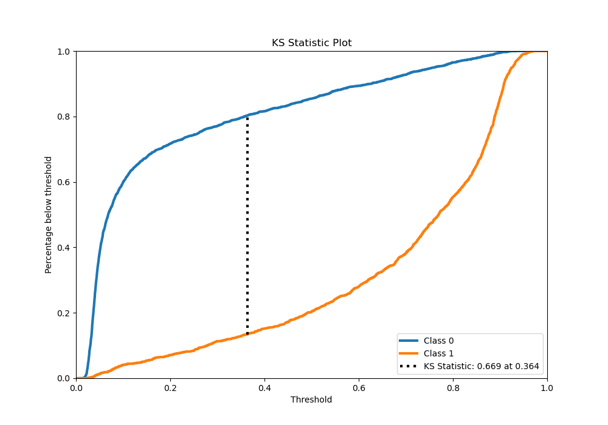
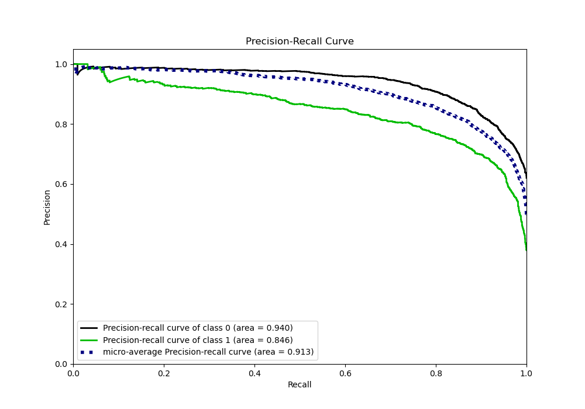
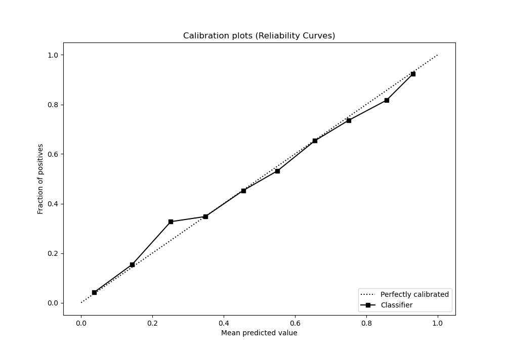
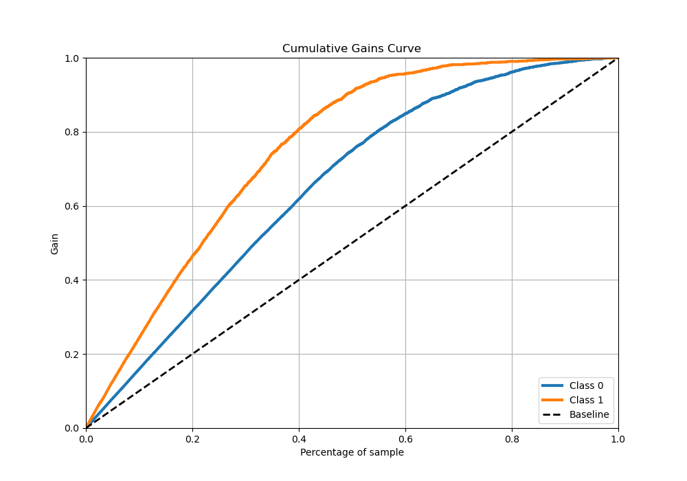
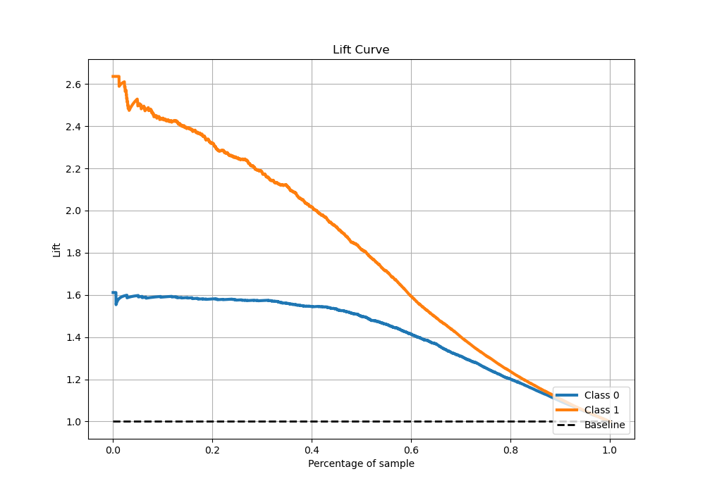

# Summary of 30_CatBoost_Stacked

[<< Go back](../README.md)

## CatBoost
- **n_jobs**: -1
- **learning_rate**: 0.1
- **depth**: 8
- **rsm**: 1.0
- **loss_function**: Logloss
- **eval_metric**: Logloss
- **explain_level**: 0

## Validation
 - **validation_type**: kfold
 - **stratify**: True
 - **k_folds**: 5
 - **shuffle**: True
 - **random_seed**: 42

## Optimized metric
logloss

## Training time

22.9 seconds

## Metric details
|           |    score |   threshold |
|:----------|---------:|------------:|
| logloss   | 0.374247 | nan         |
| auc       | 0.906893 | nan         |
| f1        | 0.791045 |   0.361532  |
| accuracy  | 0.833223 |   0.481249  |
| precision | 0.990385 |   0.920868  |
| recall    | 1        |   0.0145619 |
| mcc       | 0.654045 |   0.44184   |

## Metric details with threshold from accuracy metric
|           |    score |   threshold |
|:----------|---------:|------------:|
| logloss   | 0.374247 |  nan        |
| auc       | 0.906893 |  nan        |
| f1        | 0.786504 |    0.481249 |
| accuracy  | 0.833223 |    0.481249 |
| precision | 0.764609 |    0.481249 |
| recall    | 0.809691 |    0.481249 |
| mcc       | 0.650572 |    0.481249 |

## Confusion matrix (at threshold=0.481249)
|              |   Predicted as 0 |   Predicted as 1 |
|:-------------|-----------------:|-----------------:|
| Labeled as 0 |             2375 |              427 |
| Labeled as 1 |              326 |             1387 |

## Learning curves

## Confusion Matrix

## Normalized Confusion Matrix

## ROC Curve

## Kolmogorov-Smirnov Statistic

## Precision-Recall Curve

## Calibration Curve

## Cumulative Gains Curve

## Lift Curve

[<< Go back](../README.md)
