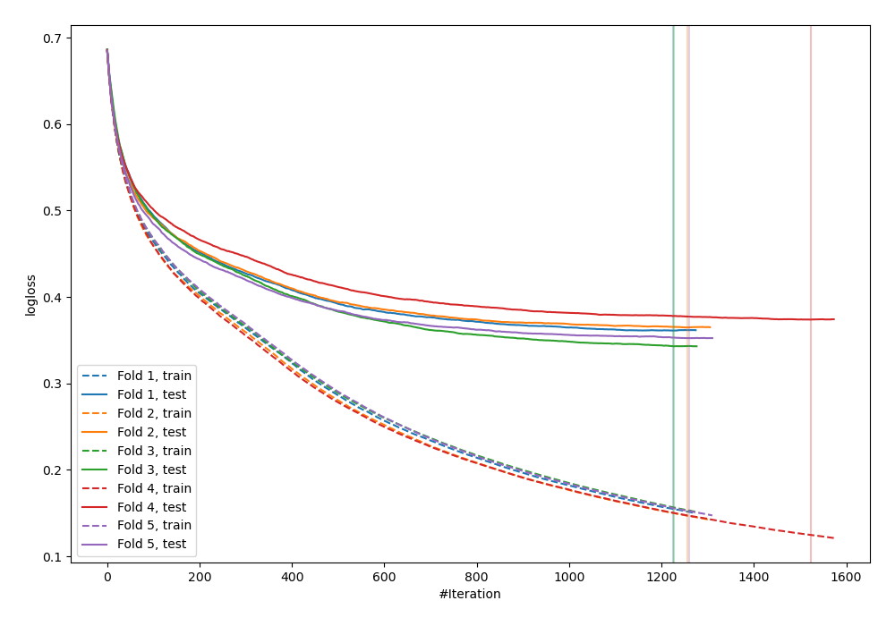
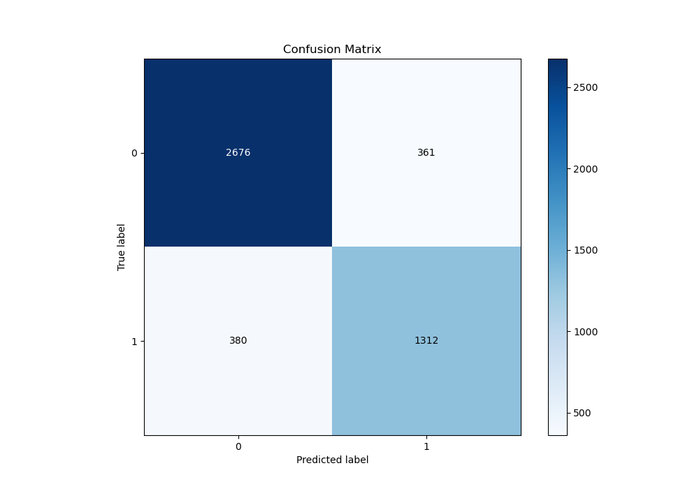
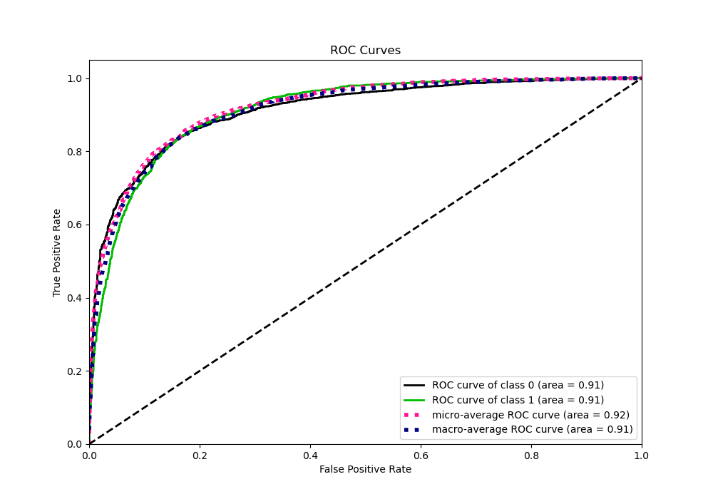
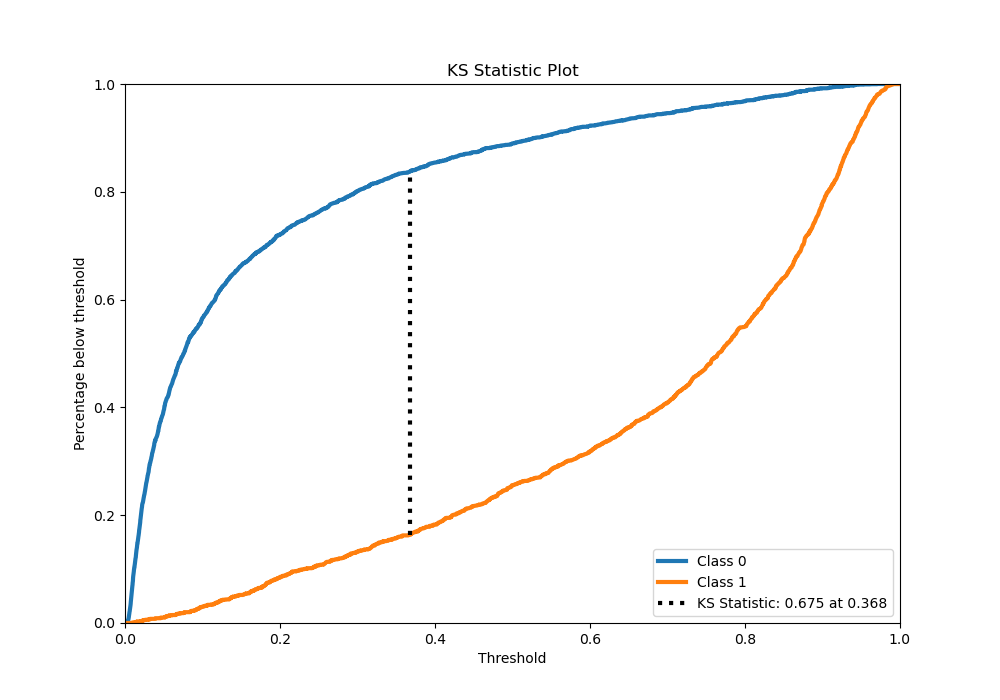
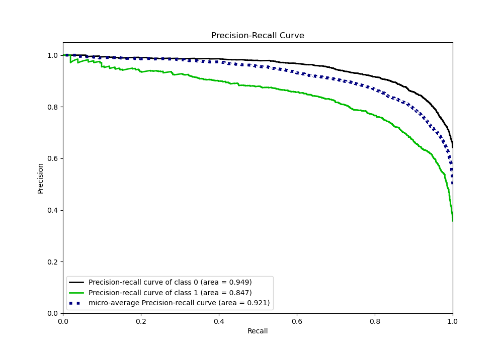
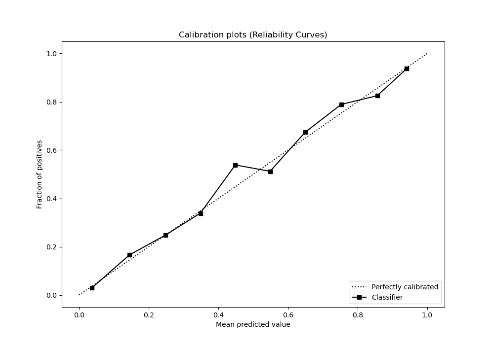
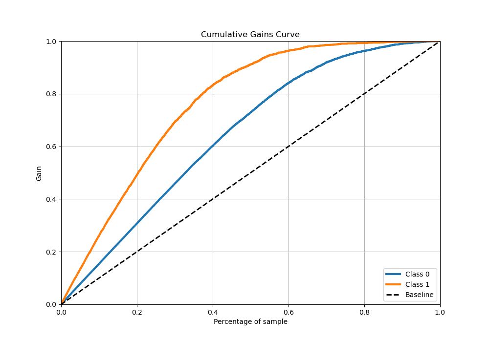
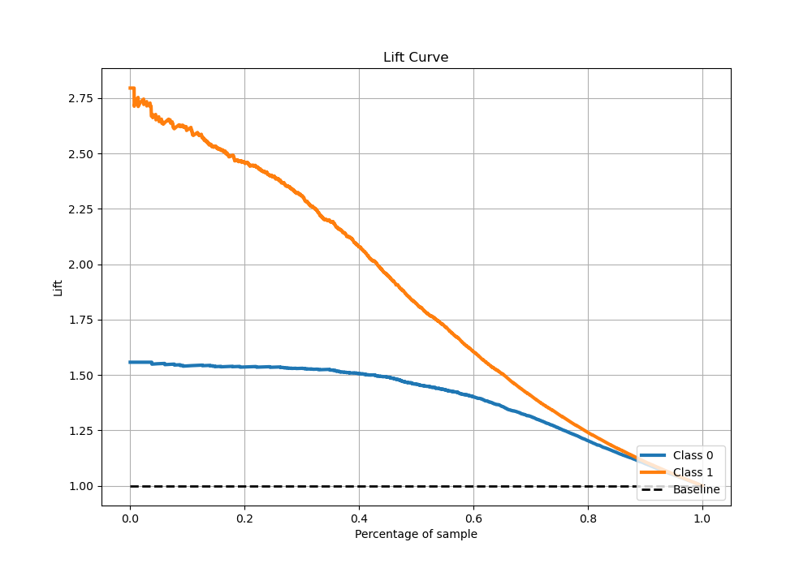

# Summary of 31_CatBoost

[<< Go back](../README.md)

## CatBoost
- **n_jobs**: -1
- **learning_rate**: 0.025
- **depth**: 6
- **rsm**: 1.0
- **loss_function**: Logloss
- **eval_metric**: Logloss
- **explain_level**: 0

## Validation
 - **validation_type**: kfold
 - **stratify**: True
 - **k_folds**: 5
 - **shuffle**: True
 - **random_seed**: 42

## Optimized metric
logloss

## Training time

92.3 seconds

## Metric details
|           |    score |    threshold |
|:----------|---------:|-------------:|
| logloss   | 0.358994 | nan          |
| auc       | 0.912413 | nan          |
| f1        | 0.786111 |   0.367788   |
| accuracy  | 0.843307 |   0.466616   |
| precision | 0.97541  |   0.950102   |
| recall    | 1        |   0.00206764 |
| mcc       | 0.660418 |   0.404652   |

## Metric details with threshold from accuracy metric
|           |    score |   threshold |
|:----------|---------:|------------:|
| logloss   | 0.358994 |  nan        |
| auc       | 0.912413 |  nan        |
| f1        | 0.779792 |    0.466616 |
| accuracy  | 0.843307 |    0.466616 |
| precision | 0.78422  |    0.466616 |
| recall    | 0.775414 |    0.466616 |
| mcc       | 0.658208 |    0.466616 |

## Confusion matrix (at threshold=0.466616)
|              |   Predicted as 0 |   Predicted as 1 |
|:-------------|-----------------:|-----------------:|
| Labeled as 0 |             2676 |              361 |
| Labeled as 1 |              380 |             1312 |

## Learning curves

## Confusion Matrix

## Normalized Confusion Matrix

## ROC Curve

## Kolmogorov-Smirnov Statistic

## Precision-Recall Curve

## Calibration Curve

## Cumulative Gains Curve

## Lift Curve

[<< Go back](../README.md)
