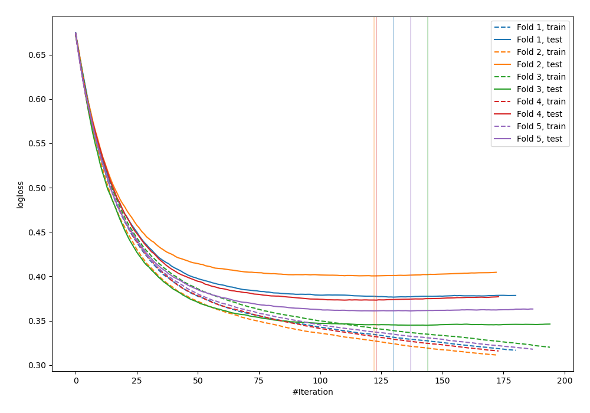
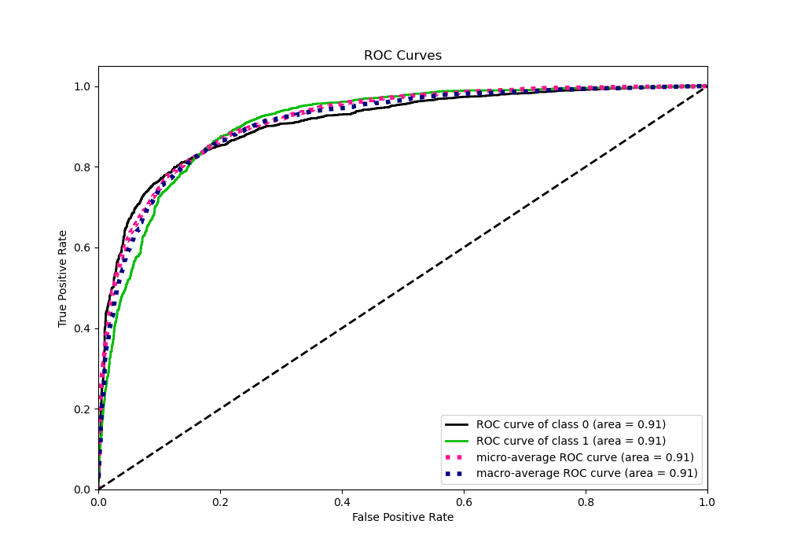
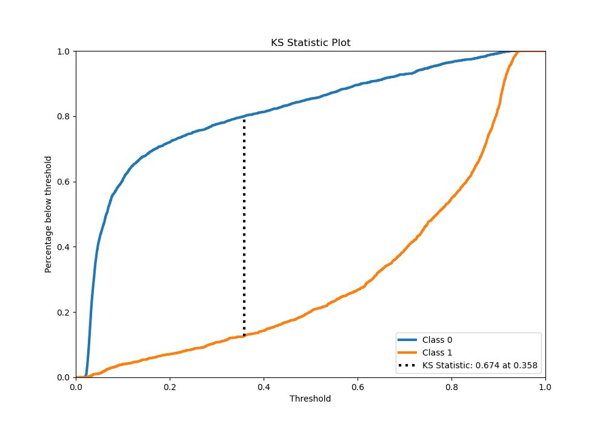
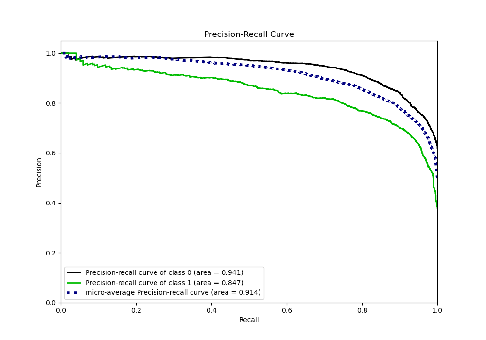
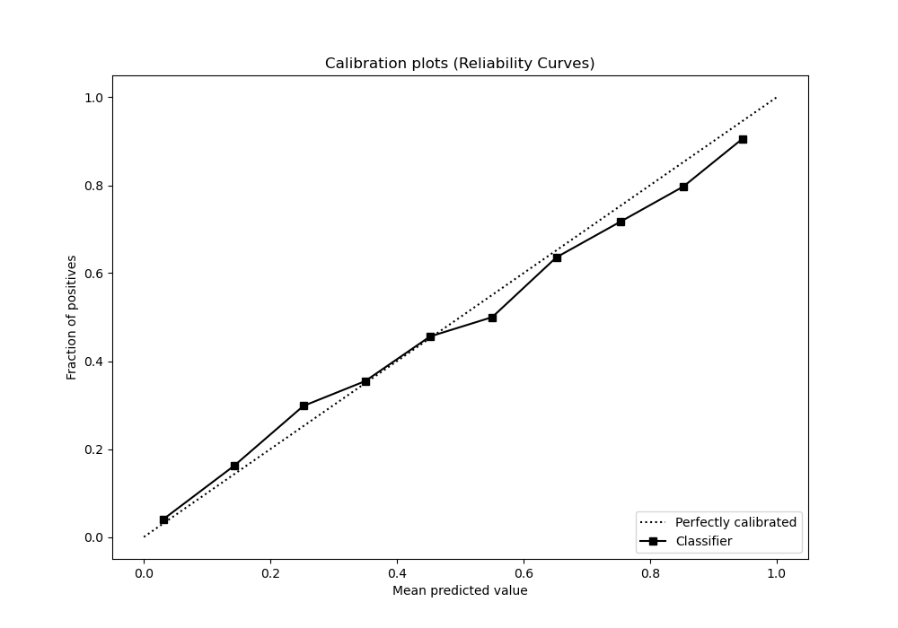
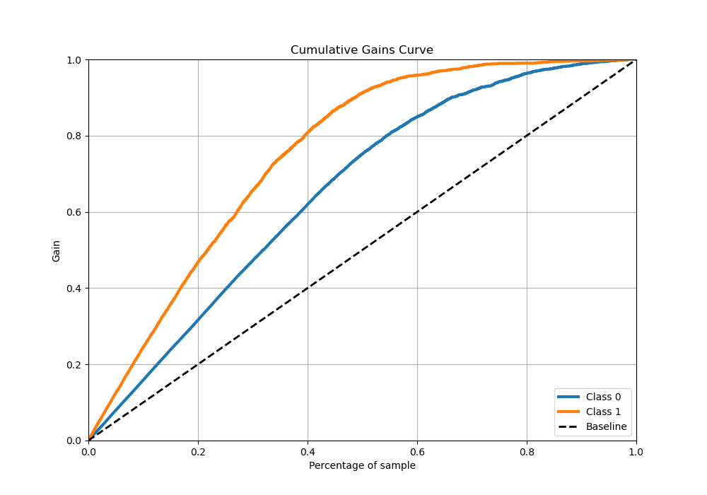
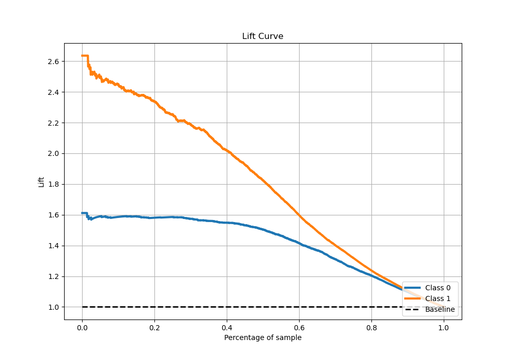

# Summary of 31_CatBoost_Stacked

[<< Go back](../README.md)

## CatBoost
- **n_jobs**: -1
- **learning_rate**: 0.025
- **depth**: 6
- **rsm**: 1.0
- **loss_function**: Logloss
- **eval_metric**: Logloss
- **explain_level**: 0

## Validation
 - **validation_type**: kfold
 - **stratify**: True
 - **k_folds**: 5
 - **shuffle**: True
 - **random_seed**: 42

## Optimized metric
logloss

## Training time

29.0 seconds

## Metric details
|           |    score |   threshold |
|:----------|---------:|------------:|
| logloss   | 0.371304 |  nan        |
| auc       | 0.908269 |  nan        |
| f1        | 0.793177 |    0.367154 |
| accuracy  | 0.833887 |    0.465042 |
| precision | 1        |    0.928165 |
| recall    | 1        |    0.017991 |
| mcc       | 0.655243 |    0.367154 |

## Metric details with threshold from accuracy metric
|           |    score |   threshold |
|:----------|---------:|------------:|
| logloss   | 0.371304 |  nan        |
| auc       | 0.908269 |  nan        |
| f1        | 0.790034 |    0.465042 |
| accuracy  | 0.833887 |    0.465042 |
| precision | 0.75901  |    0.465042 |
| recall    | 0.823701 |    0.465042 |
| mcc       | 0.654495 |    0.465042 |

## Confusion matrix (at threshold=0.465042)
|              |   Predicted as 0 |   Predicted as 1 |
|:-------------|-----------------:|-----------------:|
| Labeled as 0 |             2354 |              448 |
| Labeled as 1 |              302 |             1411 |

## Learning curves

## Confusion Matrix

## Normalized Confusion Matrix

## ROC Curve

## Kolmogorov-Smirnov Statistic

## Precision-Recall Curve

## Calibration Curve

## Cumulative Gains Curve

## Lift Curve

[<< Go back](../README.md)
