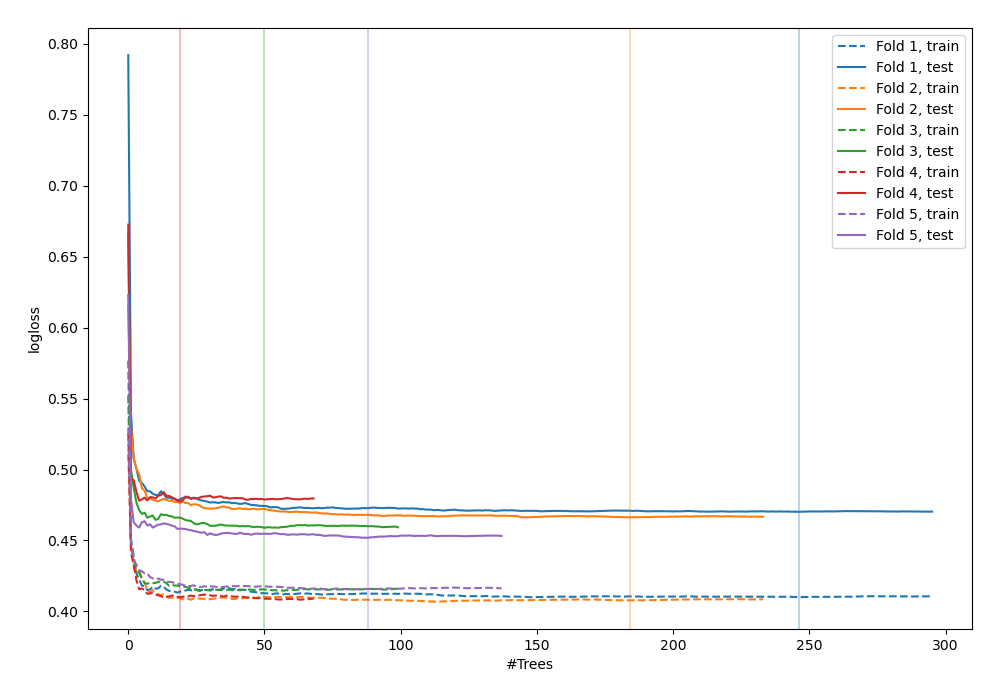
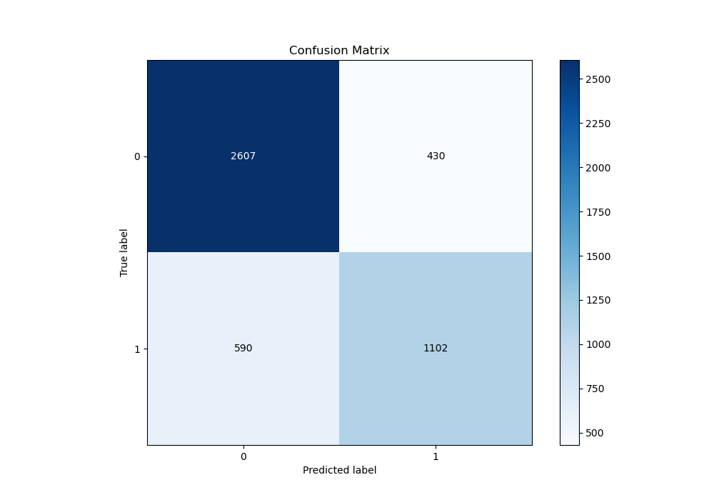
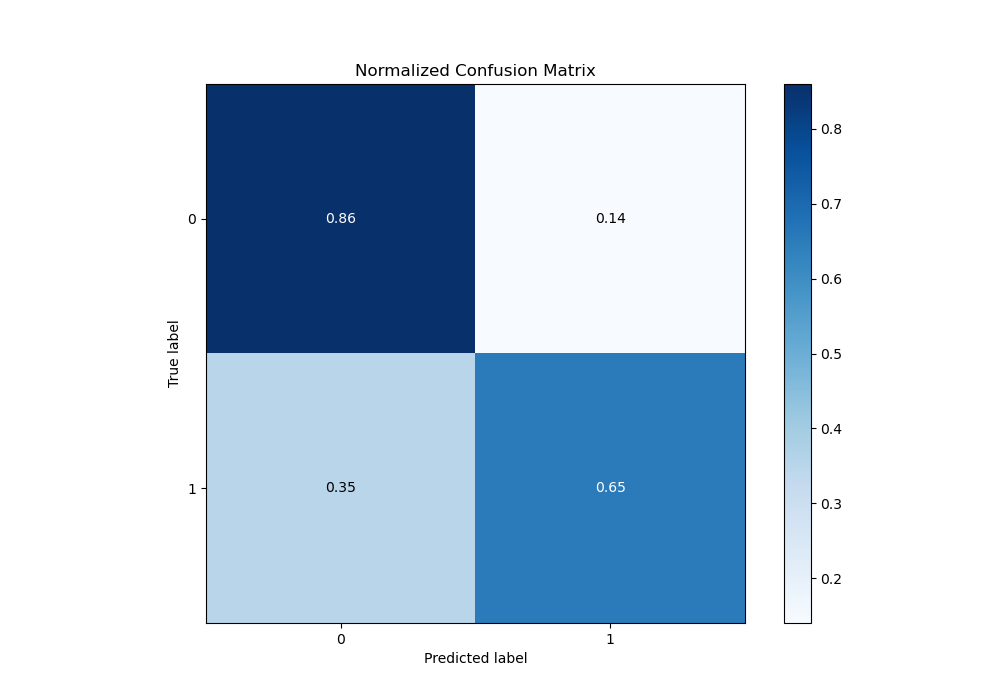
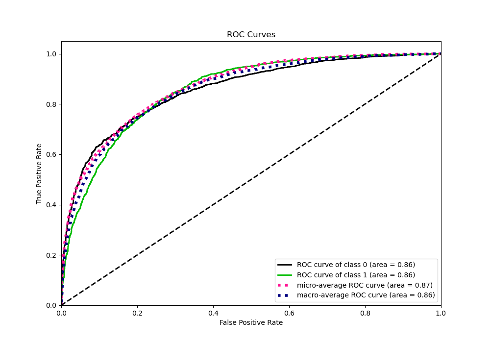
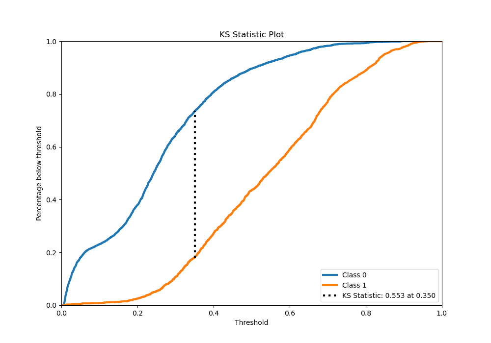
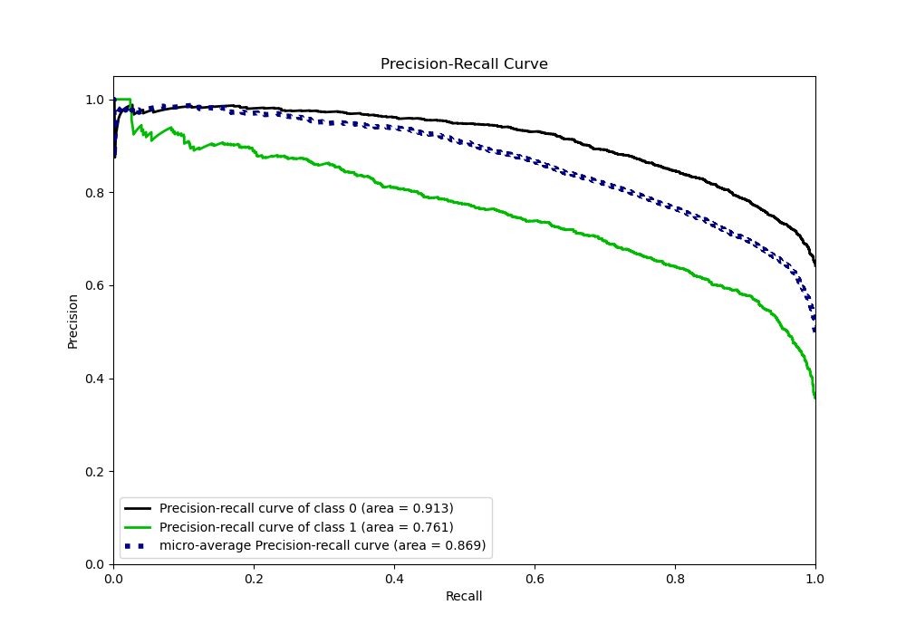
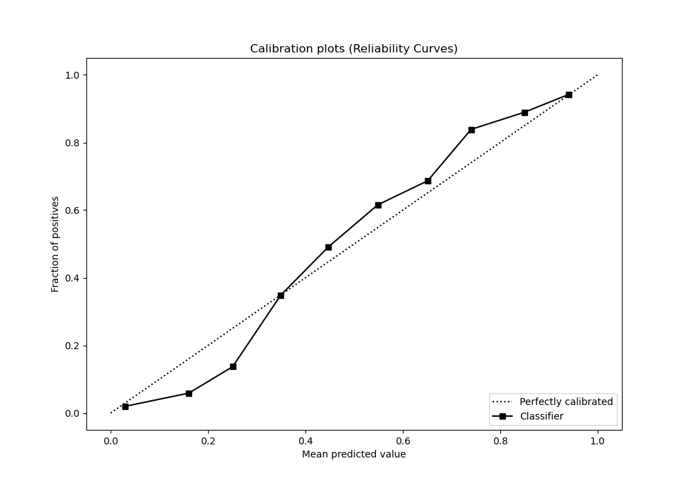
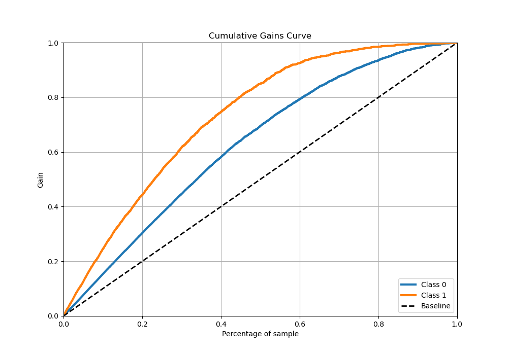
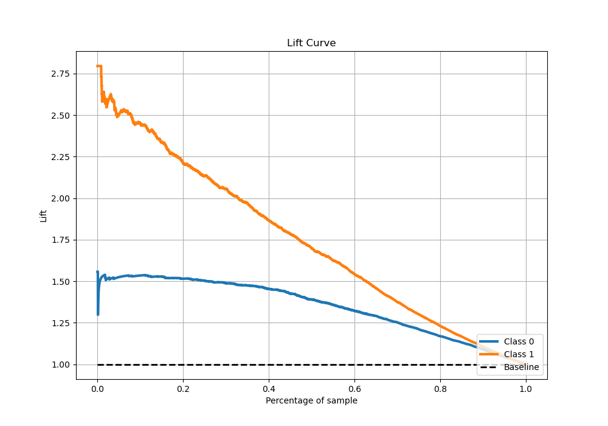

# Summary of 32_RandomForest

[<< Go back](../README.md)

## Random Forest
- **n_jobs**: -1
- **criterion**: entropy
- **max_features**: 0.8
- **min_samples_split**: 50
- **max_depth**: 7
- **eval_metric_name**: logloss
- **explain_level**: 0

## Validation
 - **validation_type**: kfold
 - **stratify**: True
 - **k_folds**: 5
 - **shuffle**: True
 - **random_seed**: 42

## Optimized metric
logloss

## Training time

51.2 seconds

## Metric details
|           |    score |    threshold |
|:----------|---------:|-------------:|
| logloss   | 0.464926 | nan          |
| auc       | 0.857245 | nan          |
| f1        | 0.712519 |   0.350675   |
| accuracy  | 0.78431  |   0.448143   |
| precision | 0.933333 |   0.86291    |
| recall    | 1        |   0.00543879 |
| mcc       | 0.530317 |   0.350675   |

## Metric details with threshold from accuracy metric
|           |    score |   threshold |
|:----------|---------:|------------:|
| logloss   | 0.464926 |  nan        |
| auc       | 0.857245 |  nan        |
| f1        | 0.683623 |    0.448143 |
| accuracy  | 0.78431  |    0.448143 |
| precision | 0.719321 |    0.448143 |
| recall    | 0.6513   |    0.448143 |
| mcc       | 0.522093 |    0.448143 |

## Confusion matrix (at threshold=0.448143)
|              |   Predicted as 0 |   Predicted as 1 |
|:-------------|-----------------:|-----------------:|
| Labeled as 0 |             2607 |              430 |
| Labeled as 1 |              590 |             1102 |

## Learning curves

## Confusion Matrix

## Normalized Confusion Matrix

## ROC Curve

## Kolmogorov-Smirnov Statistic

## Precision-Recall Curve

## Calibration Curve

## Cumulative Gains Curve

## Lift Curve

[<< Go back](../README.md)
