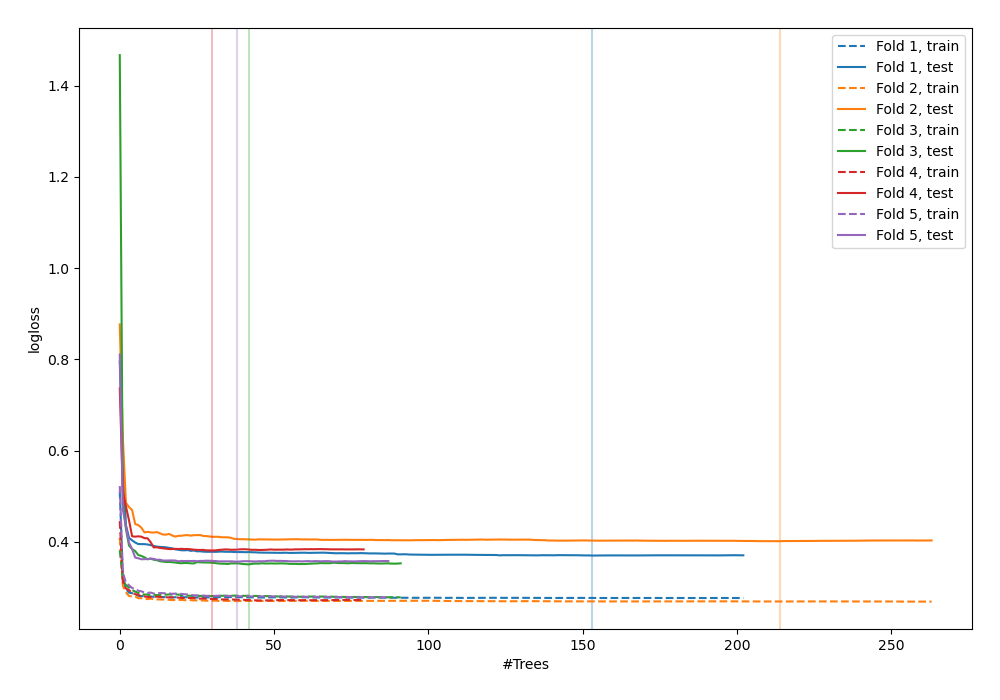
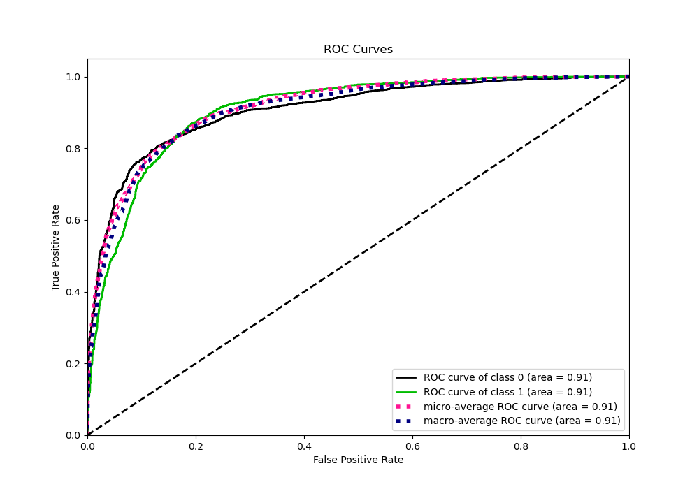
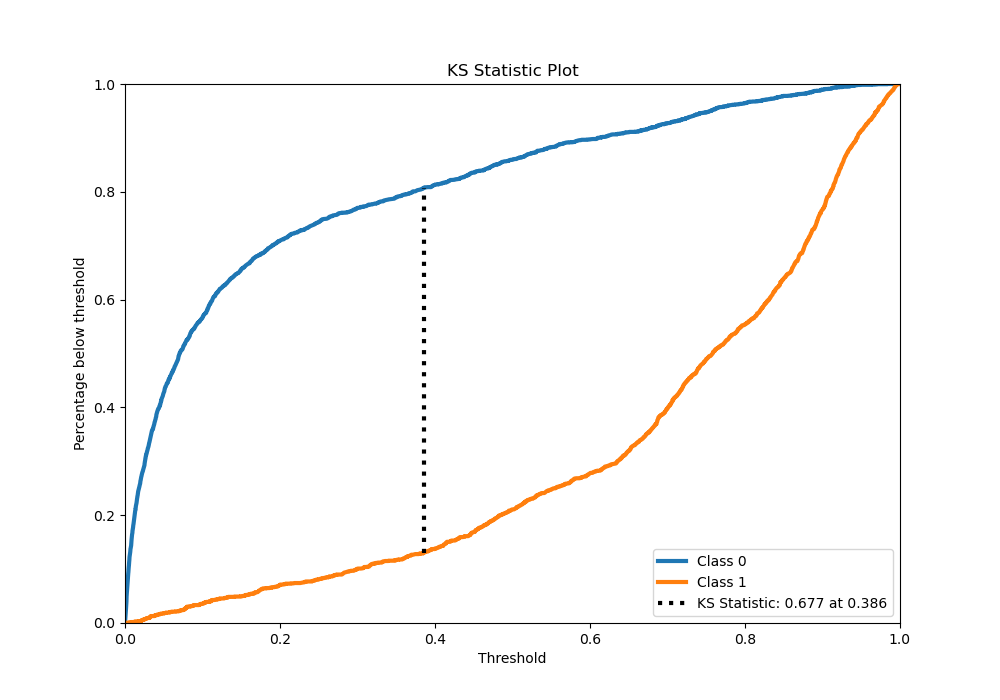
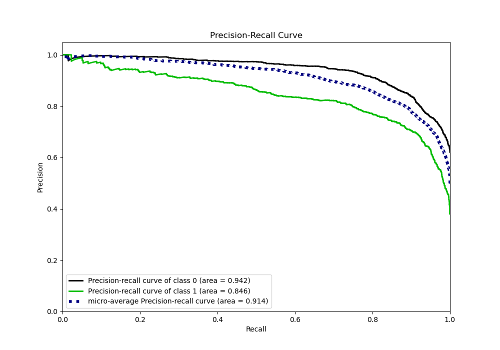
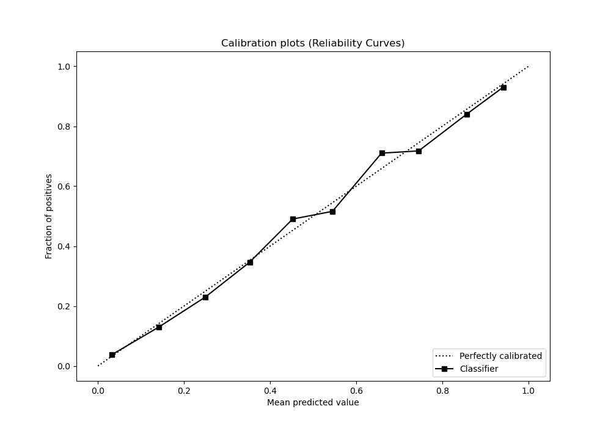
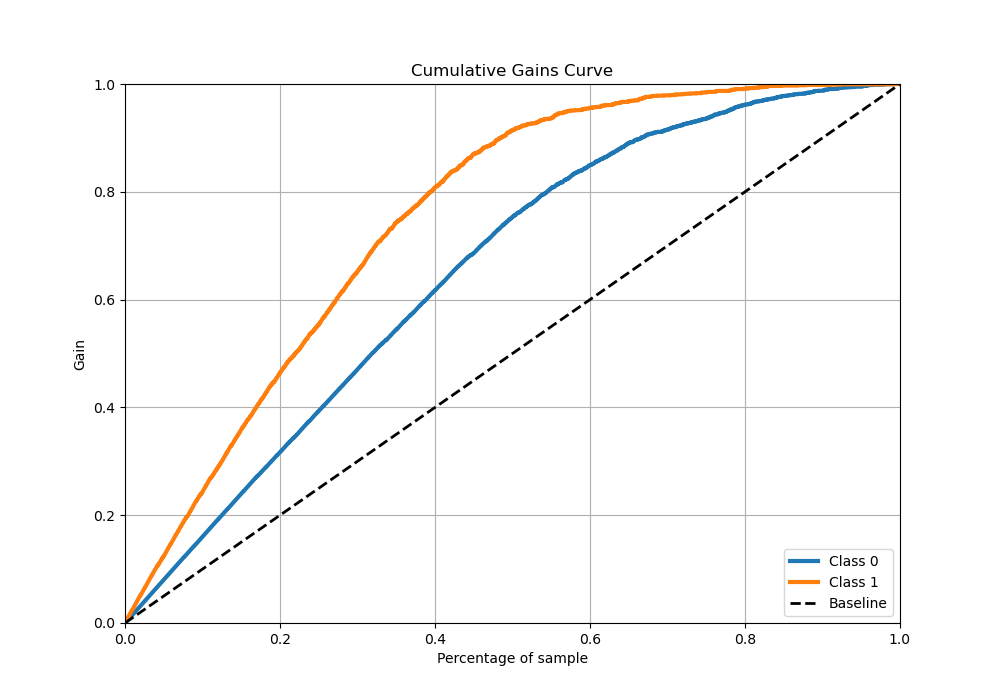
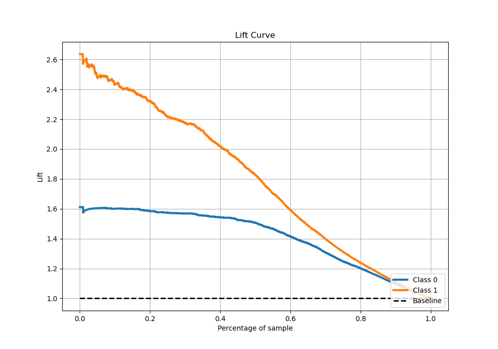

# Summary of 32_RandomForest_Stacked

[<< Go back](../README.md)

## Random Forest
- **n_jobs**: -1
- **criterion**: entropy
- **max_features**: 0.8
- **min_samples_split**: 50
- **max_depth**: 7
- **eval_metric_name**: logloss
- **explain_level**: 0

## Validation
 - **validation_type**: kfold
 - **stratify**: True
 - **k_folds**: 5
 - **shuffle**: True
 - **random_seed**: 42

## Optimized metric
logloss

## Training time

41.8 seconds

## Metric details
|           |    score |     threshold |
|:----------|---------:|--------------:|
| logloss   | 0.371867 | nan           |
| auc       | 0.907107 | nan           |
| f1        | 0.795309 |   0.382478    |
| accuracy  | 0.83433  |   0.563549    |
| precision | 0.983051 |   0.978938    |
| recall    | 1        |   0.000104202 |
| mcc       | 0.658911 |   0.382478    |

## Metric details with threshold from accuracy metric
|           |    score |   threshold |
|:----------|---------:|------------:|
| logloss   | 0.371867 |  nan        |
| auc       | 0.907107 |  nan        |
| f1        | 0.773471 |    0.563549 |
| accuracy  | 0.83433  |    0.563549 |
| precision | 0.80365  |    0.563549 |
| recall    | 0.745476 |    0.563549 |
| mcc       | 0.644302 |    0.563549 |

## Confusion matrix (at threshold=0.563549)
|              |   Predicted as 0 |   Predicted as 1 |
|:-------------|-----------------:|-----------------:|
| Labeled as 0 |             2490 |              312 |
| Labeled as 1 |              436 |             1277 |

## Learning curves

## Confusion Matrix

## Normalized Confusion Matrix

## ROC Curve

## Kolmogorov-Smirnov Statistic

## Precision-Recall Curve

## Calibration Curve

## Cumulative Gains Curve

## Lift Curve

[<< Go back](../README.md)
