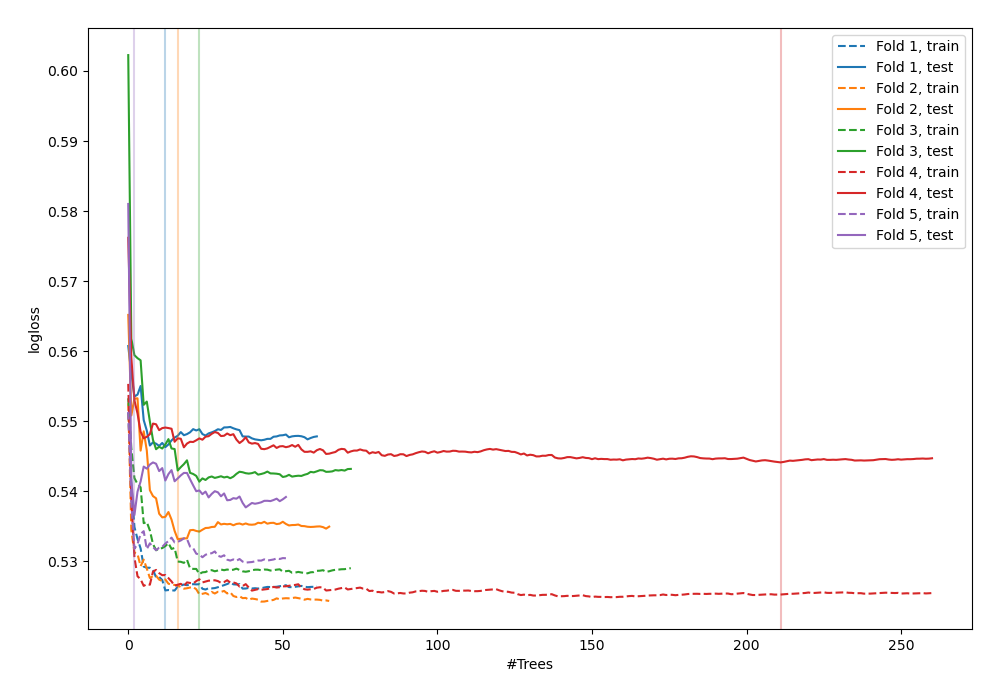
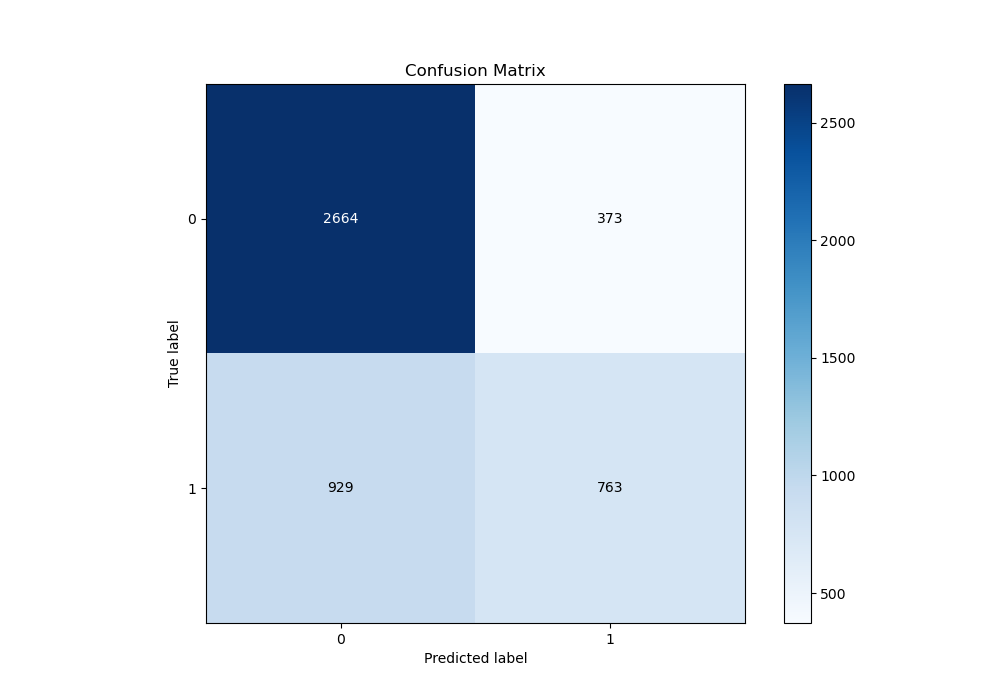
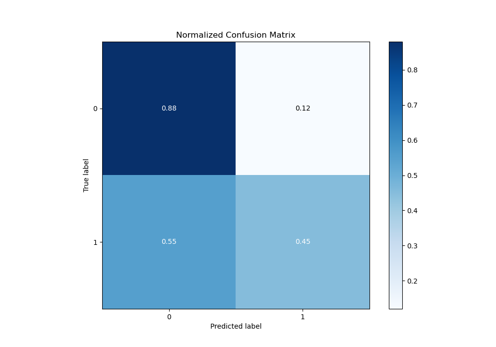
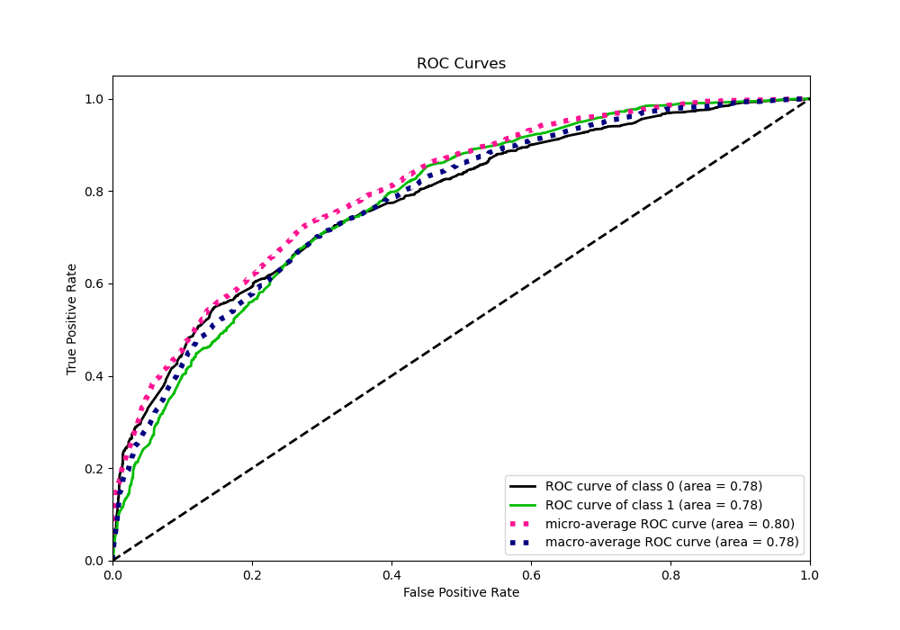
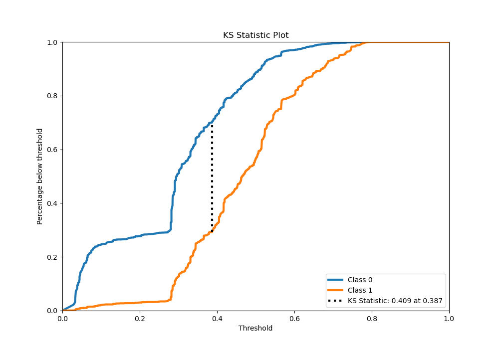
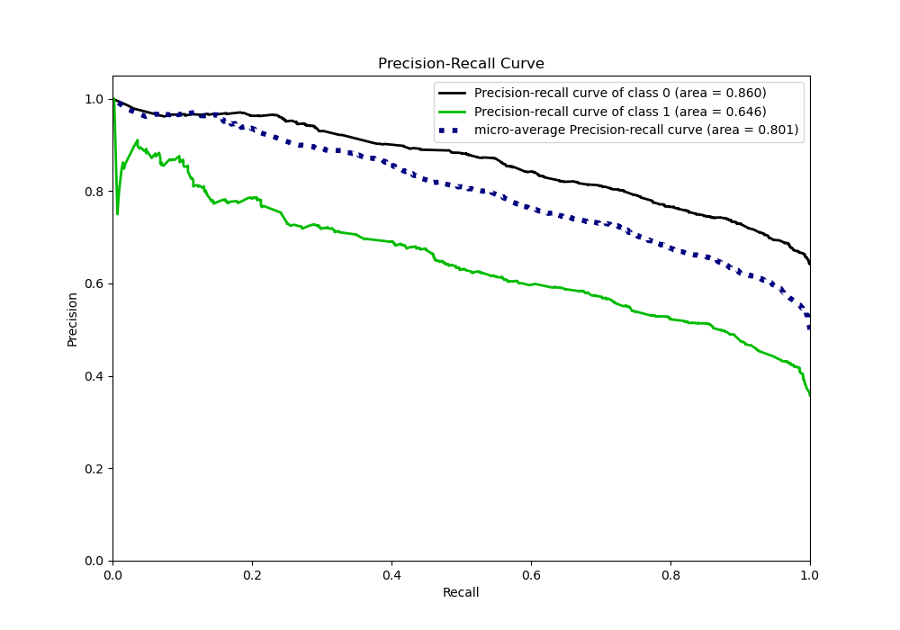
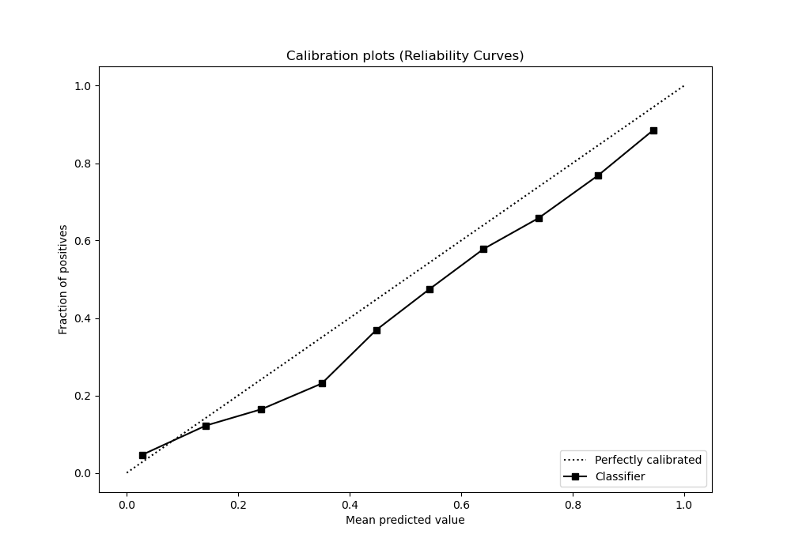
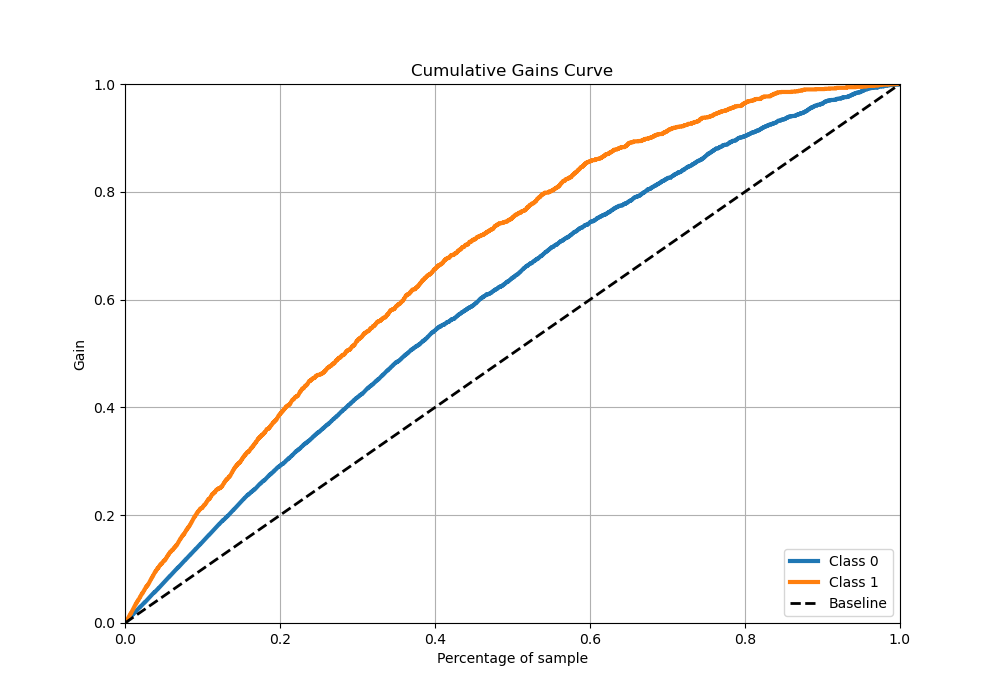
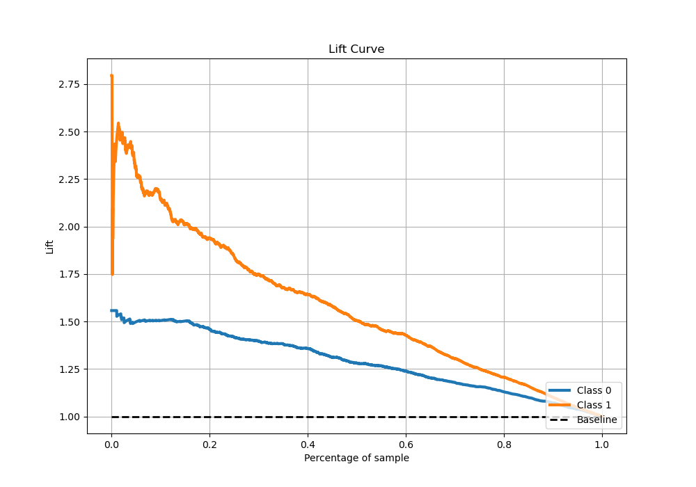

# Summary of 33_RandomForest

[<< Go back](../README.md)

## Random Forest
- **n_jobs**: -1
- **criterion**: entropy
- **max_features**: 1.0
- **min_samples_split**: 20
- **max_depth**: 3
- **eval_metric_name**: logloss
- **explain_level**: 0

## Validation
 - **validation_type**: kfold
 - **stratify**: True
 - **k_folds**: 5
 - **shuffle**: True
 - **random_seed**: 42

## Optimized metric
logloss

## Training time

34.4 seconds

## Metric details
|           |    score |   threshold |
|:----------|---------:|------------:|
| logloss   | 0.540332 | nan         |
| auc       | 0.776315 | nan         |
| f1        | 0.63963  |   0.308547  |
| accuracy  | 0.724678 |   0.495022  |
| precision | 0.893333 |   0.735005  |
| recall    | 1        |   0.0259833 |
| mcc       | 0.395518 |   0.402555  |

## Metric details with threshold from accuracy metric
|           |    score |   threshold |
|:----------|---------:|------------:|
| logloss   | 0.540332 |  nan        |
| auc       | 0.776315 |  nan        |
| f1        | 0.539604 |    0.495022 |
| accuracy  | 0.724678 |    0.495022 |
| precision | 0.671655 |    0.495022 |
| recall    | 0.450946 |    0.495022 |
| mcc       | 0.368169 |    0.495022 |

## Confusion matrix (at threshold=0.495022)
|              |   Predicted as 0 |   Predicted as 1 |
|:-------------|-----------------:|-----------------:|
| Labeled as 0 |             2664 |              373 |
| Labeled as 1 |              929 |              763 |

## Learning curves

## Confusion Matrix

## Normalized Confusion Matrix

## ROC Curve

## Kolmogorov-Smirnov Statistic

## Precision-Recall Curve

## Calibration Curve

## Cumulative Gains Curve

## Lift Curve

[<< Go back](../README.md)
