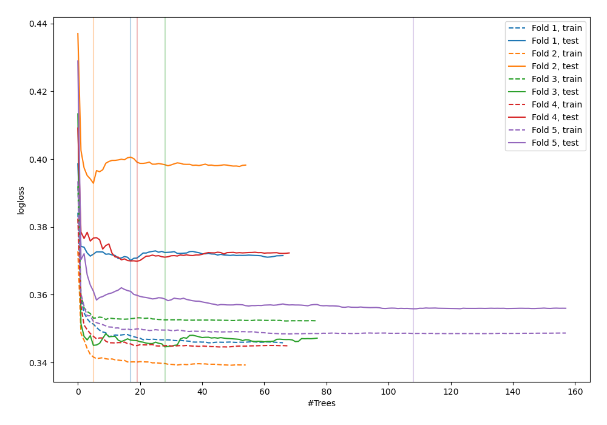
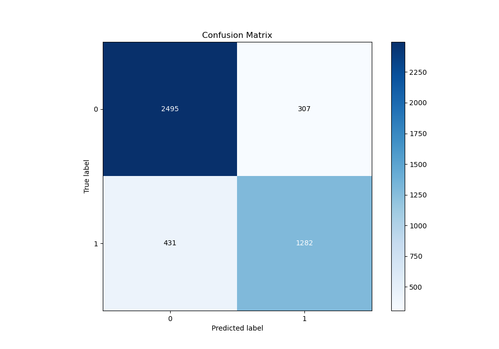
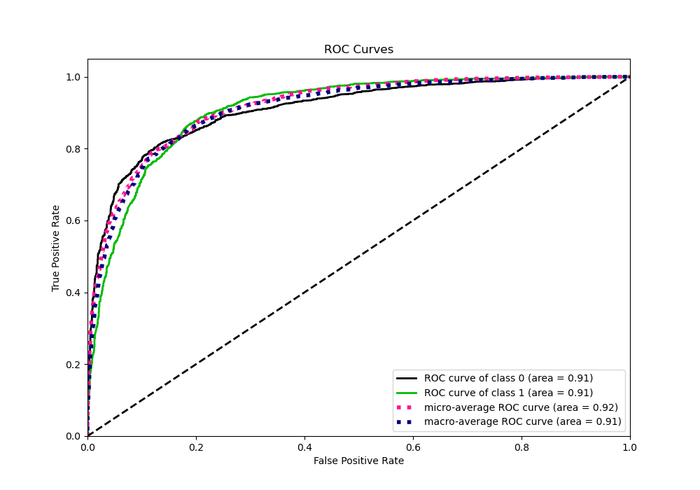
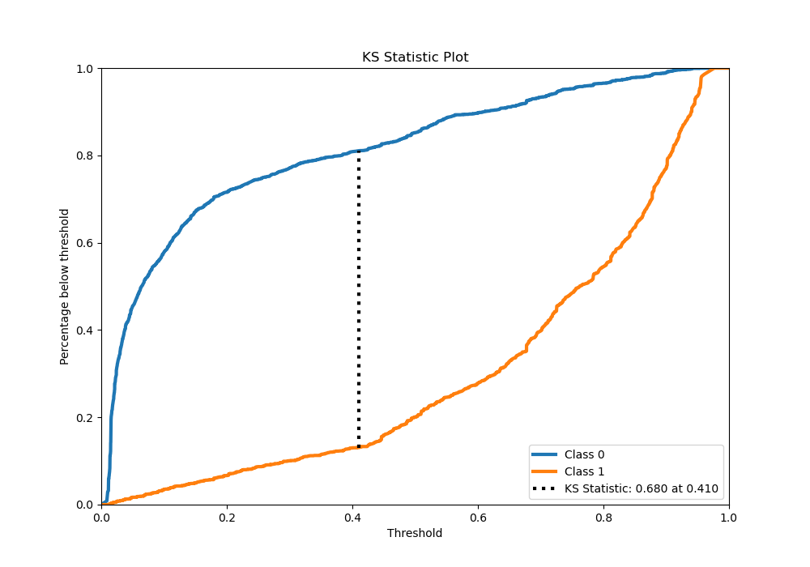
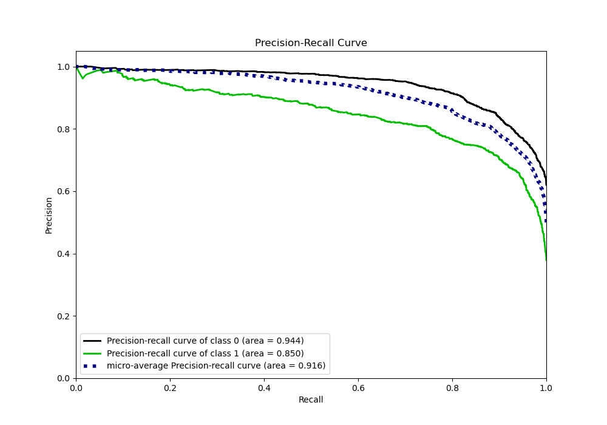
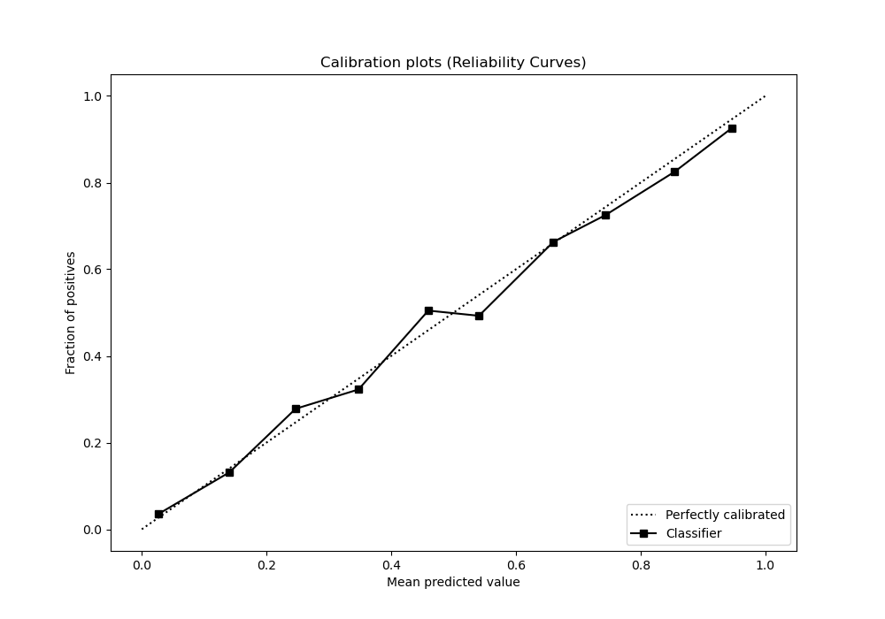
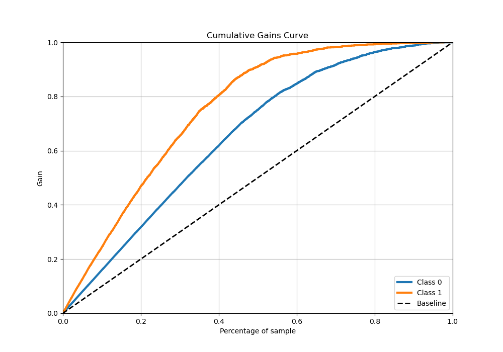
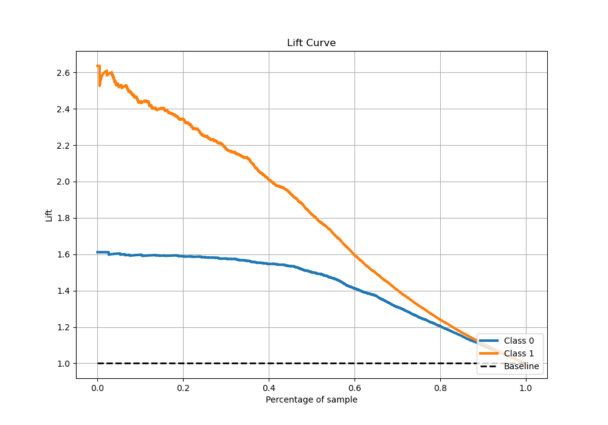

# Summary of 33_RandomForest_Stacked

[<< Go back](../README.md)

## Random Forest
- **n_jobs**: -1
- **criterion**: entropy
- **max_features**: 1.0
- **min_samples_split**: 20
- **max_depth**: 3
- **eval_metric_name**: logloss
- **explain_level**: 0

## Validation
 - **validation_type**: kfold
 - **stratify**: True
 - **k_folds**: 5
 - **shuffle**: True
 - **random_seed**: 42

## Optimized metric
logloss

## Training time

24.2 seconds

## Metric details
|           |    score |    threshold |
|:----------|---------:|-------------:|
| logloss   | 0.36667  | nan          |
| auc       | 0.909951 | nan          |
| f1        | 0.79741  |   0.426901   |
| accuracy  | 0.836545 |   0.560669   |
| precision | 0.986486 |   0.943344   |
| recall    | 1        |   0.00799804 |
| mcc       | 0.663156 |   0.426901   |

## Metric details with threshold from accuracy metric
|           |    score |   threshold |
|:----------|---------:|------------:|
| logloss   | 0.36667  |  nan        |
| auc       | 0.909951 |  nan        |
| f1        | 0.776499 |    0.560669 |
| accuracy  | 0.836545 |    0.560669 |
| precision | 0.806797 |    0.560669 |
| recall    | 0.748395 |    0.560669 |
| mcc       | 0.649081 |    0.560669 |

## Confusion matrix (at threshold=0.560669)
|              |   Predicted as 0 |   Predicted as 1 |
|:-------------|-----------------:|-----------------:|
| Labeled as 0 |             2495 |              307 |
| Labeled as 1 |              431 |             1282 |

## Learning curves

## Confusion Matrix

## Normalized Confusion Matrix

## ROC Curve

## Kolmogorov-Smirnov Statistic

## Precision-Recall Curve

## Calibration Curve

## Cumulative Gains Curve

## Lift Curve

[<< Go back](../README.md)
