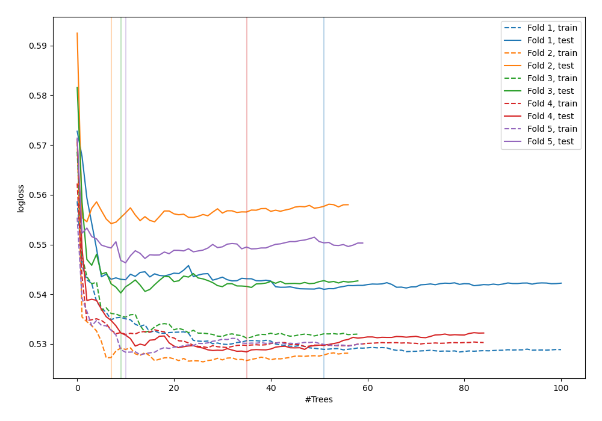
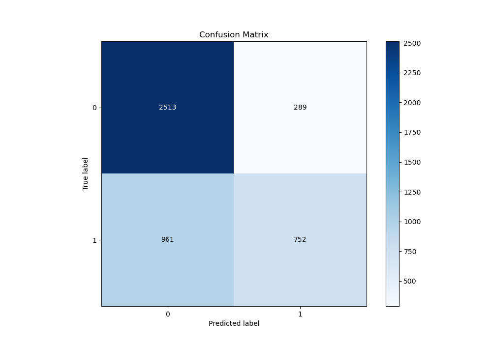
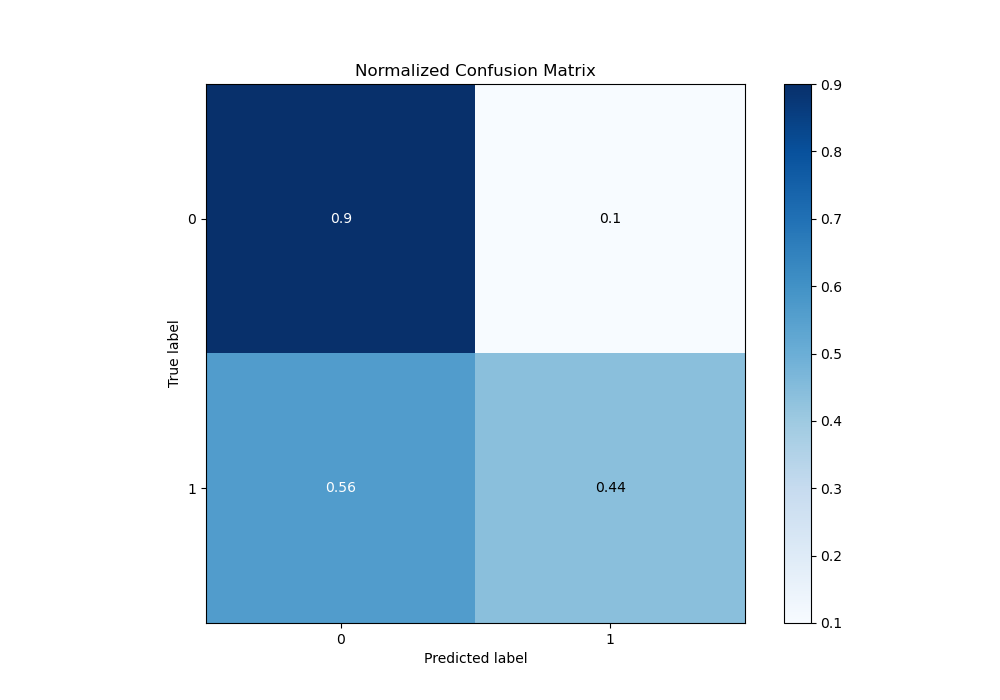
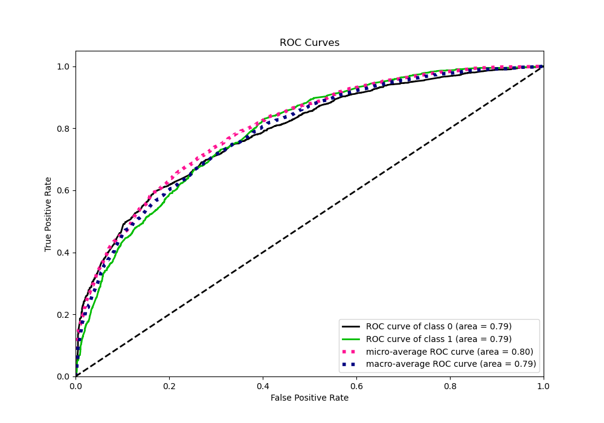
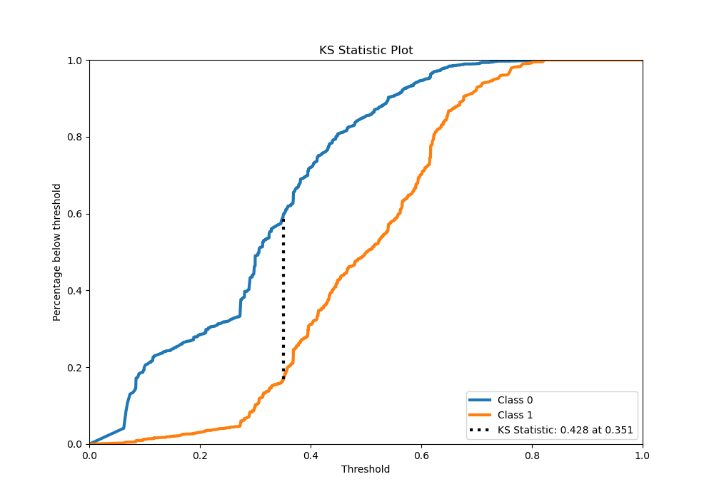
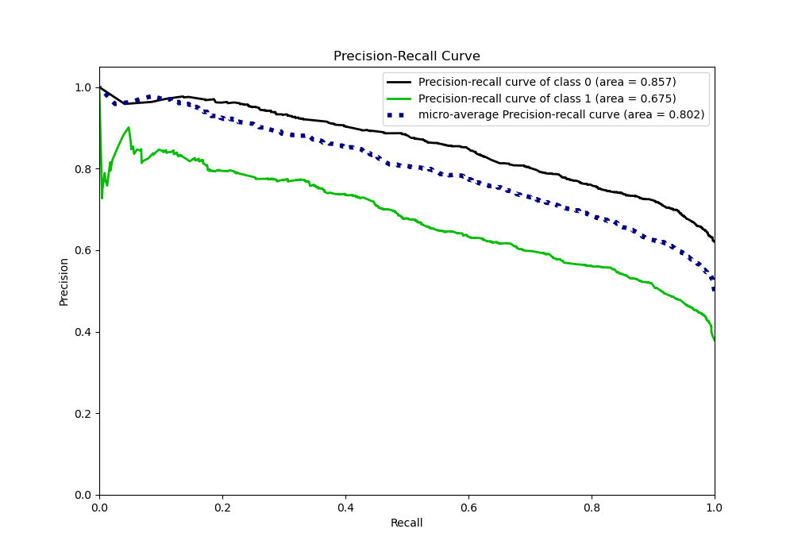
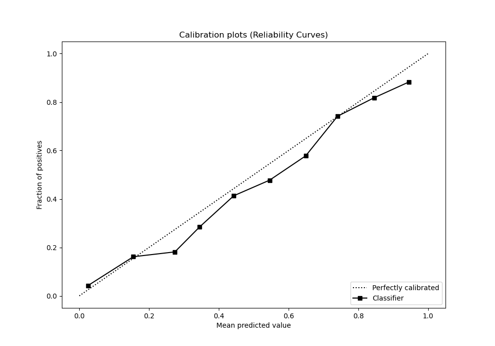
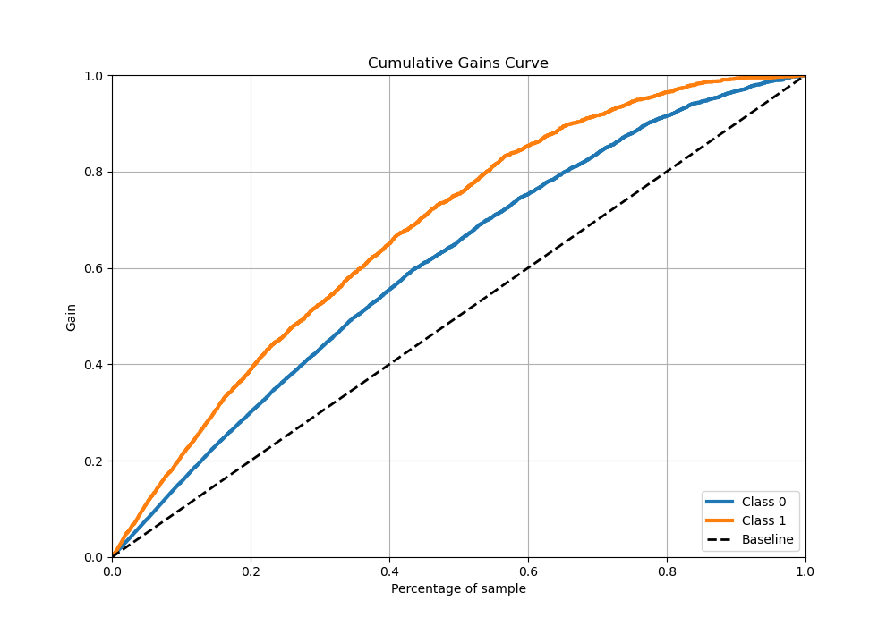
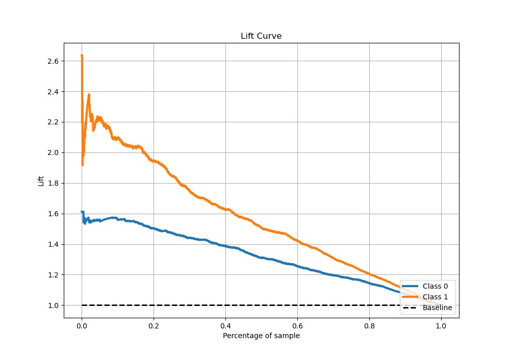

# Summary of 34_RandomForest

[<< Go back](../README.md)

## Random Forest
- **n_jobs**: -1
- **criterion**: gini
- **max_features**: 1.0
- **min_samples_split**: 30
- **max_depth**: 3
- **eval_metric_name**: logloss
- **explain_level**: 0

## Validation
 - **validation_type**: kfold
 - **stratify**: True
 - **k_folds**: 5
 - **shuffle**: True
 - **random_seed**: 42

## Optimized metric
logloss

## Training time

17.1 seconds

## Metric details
|           |    score |   threshold |
|:----------|---------:|------------:|
| logloss   | 0.542028 | nan         |
| auc       | 0.787119 | nan         |
| f1        | 0.666979 |   0.35055   |
| accuracy  | 0.723145 |   0.540011  |
| precision | 0.862745 |   0.7304    |
| recall    | 1        |   0.0561193 |
| mcc       | 0.418027 |   0.35055   |

## Metric details with threshold from accuracy metric
|           |    score |   threshold |
|:----------|---------:|------------:|
| logloss   | 0.542028 |  nan        |
| auc       | 0.787119 |  nan        |
| f1        | 0.546115 |    0.540011 |
| accuracy  | 0.723145 |    0.540011 |
| precision | 0.722382 |    0.540011 |
| recall    | 0.438996 |    0.540011 |
| mcc       | 0.386923 |    0.540011 |

## Confusion matrix (at threshold=0.540011)
|              |   Predicted as 0 |   Predicted as 1 |
|:-------------|-----------------:|-----------------:|
| Labeled as 0 |             2513 |              289 |
| Labeled as 1 |              961 |              752 |

## Learning curves

## Confusion Matrix

## Normalized Confusion Matrix

## ROC Curve

## Kolmogorov-Smirnov Statistic

## Precision-Recall Curve

## Calibration Curve

## Cumulative Gains Curve

## Lift Curve

[<< Go back](../README.md)
