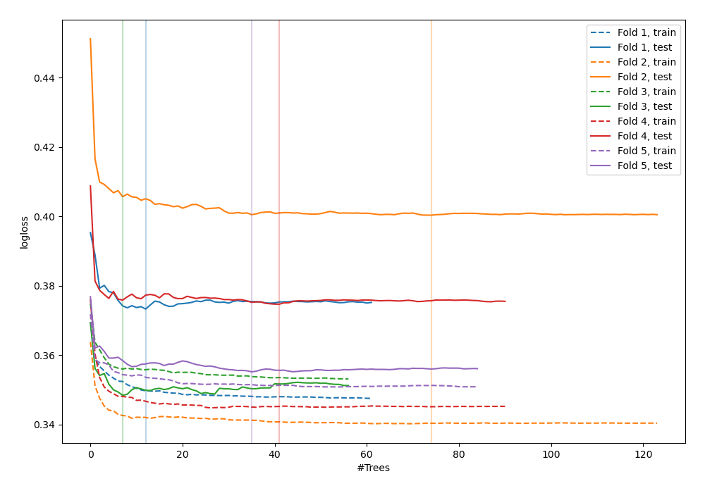
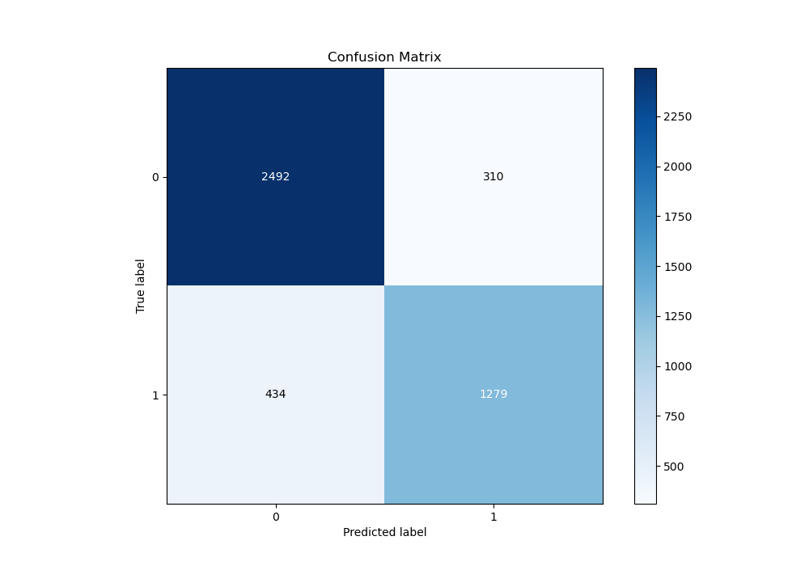
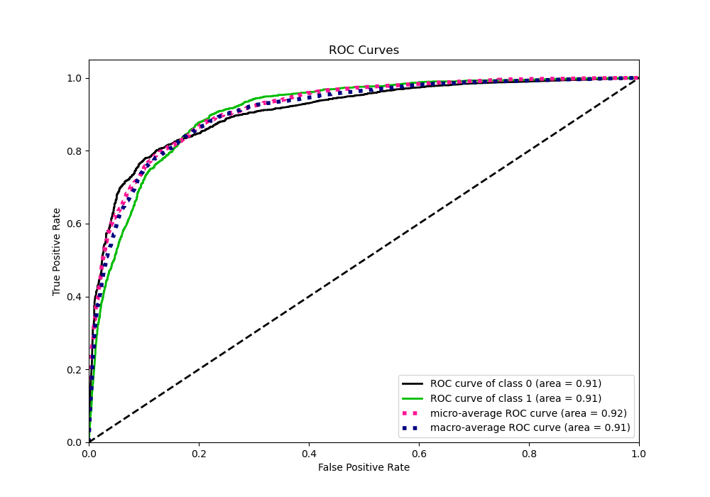
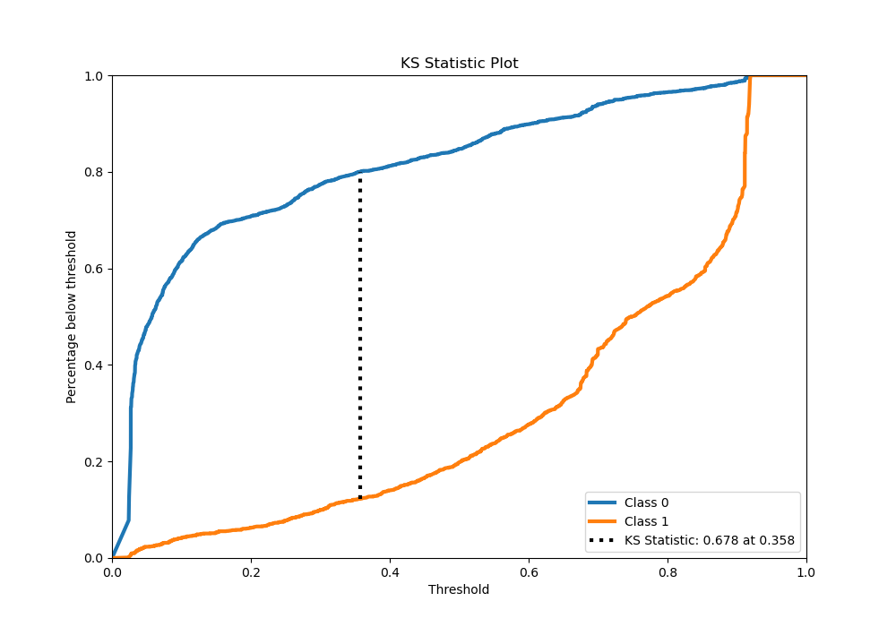
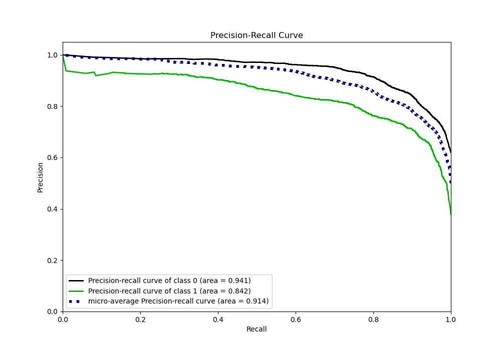
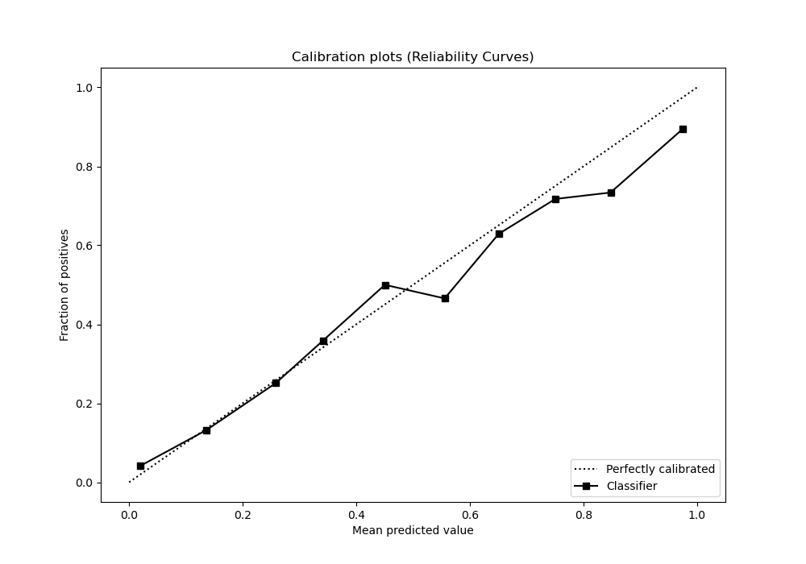
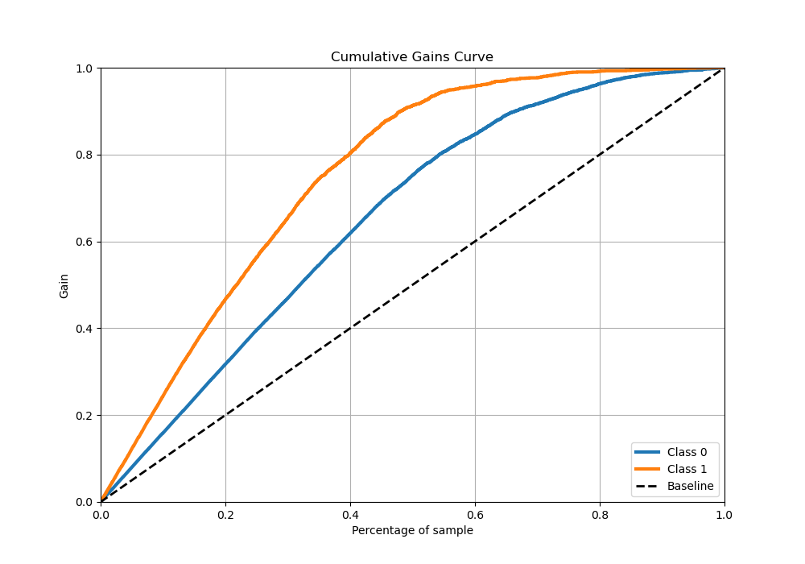
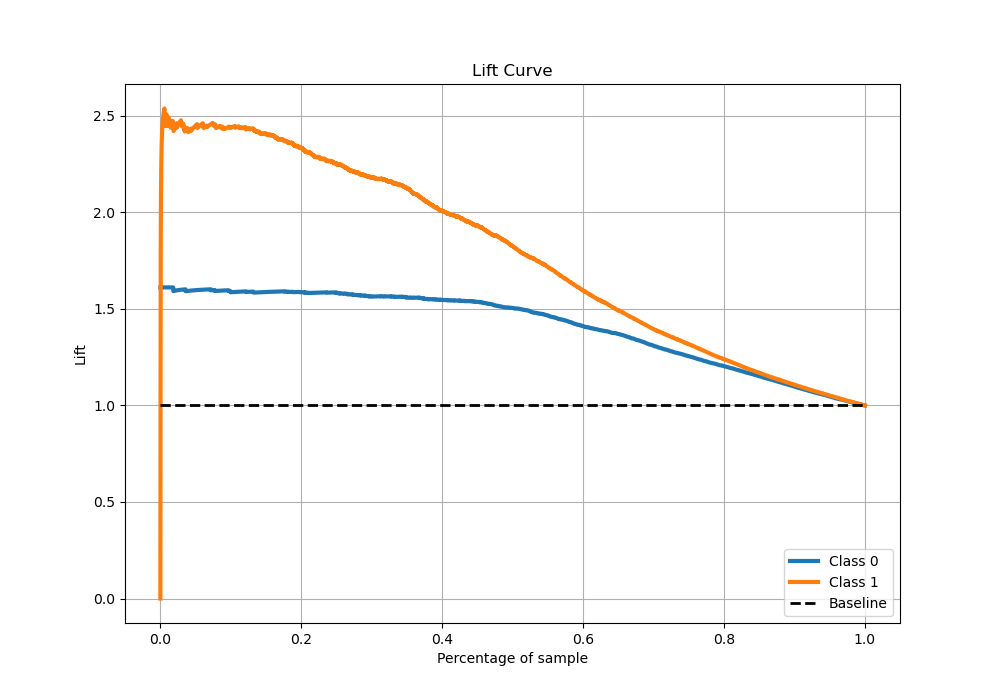

# Summary of 34_RandomForest_Stacked

[<< Go back](../README.md)

## Random Forest
- **n_jobs**: -1
- **criterion**: gini
- **max_features**: 1.0
- **min_samples_split**: 30
- **max_depth**: 3
- **eval_metric_name**: logloss
- **explain_level**: 0

## Validation
 - **validation_type**: kfold
 - **stratify**: True
 - **k_folds**: 5
 - **shuffle**: True
 - **random_seed**: 42

## Optimized metric
logloss

## Training time

36.8 seconds

## Metric details
|           |    score |   threshold |
|:----------|---------:|------------:|
| logloss   | 0.370339 | nan         |
| auc       | 0.908305 | nan         |
| f1        | 0.795842 |   0.380941  |
| accuracy  | 0.835216 |   0.569179  |
| precision | 0.9375   |   0.9188    |
| recall    | 1        |   0.0216691 |
| mcc       | 0.659829 |   0.380941  |

## Metric details with threshold from accuracy metric
|           |    score |   threshold |
|:----------|---------:|------------:|
| logloss   | 0.370339 |  nan        |
| auc       | 0.908305 |  nan        |
| f1        | 0.774682 |    0.569179 |
| accuracy  | 0.835216 |    0.569179 |
| precision | 0.804909 |    0.569179 |
| recall    | 0.746643 |    0.569179 |
| mcc       | 0.646214 |    0.569179 |

## Confusion matrix (at threshold=0.569179)
|              |   Predicted as 0 |   Predicted as 1 |
|:-------------|-----------------:|-----------------:|
| Labeled as 0 |             2492 |              310 |
| Labeled as 1 |              434 |             1279 |

## Learning curves

## Confusion Matrix

## Normalized Confusion Matrix

## ROC Curve

## Kolmogorov-Smirnov Statistic

## Precision-Recall Curve

## Calibration Curve

## Cumulative Gains Curve

## Lift Curve

[<< Go back](../README.md)
