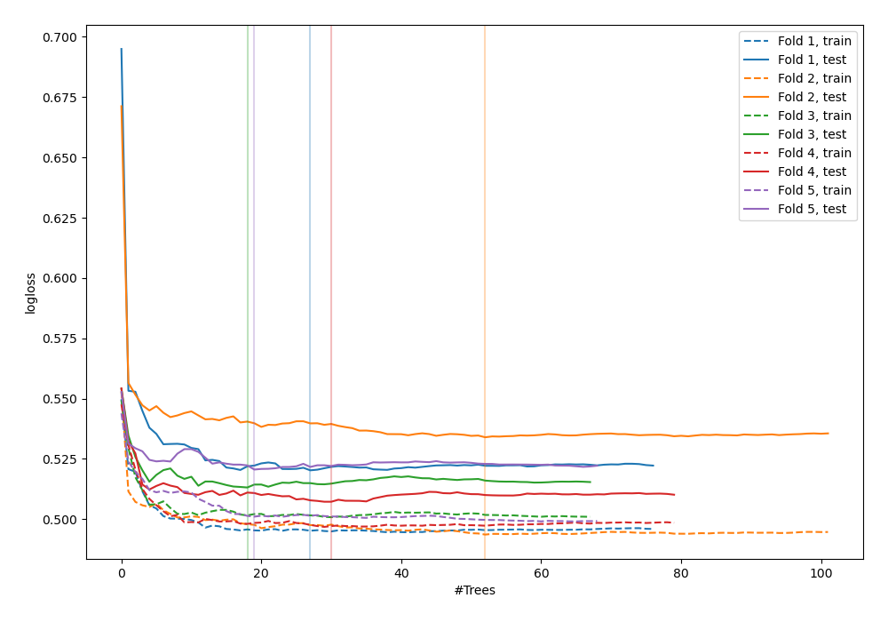
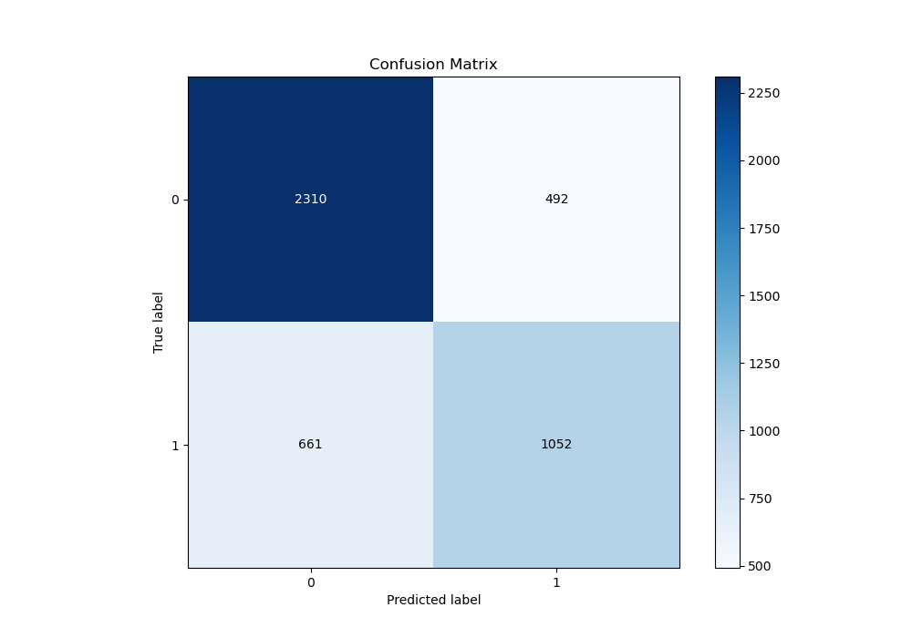
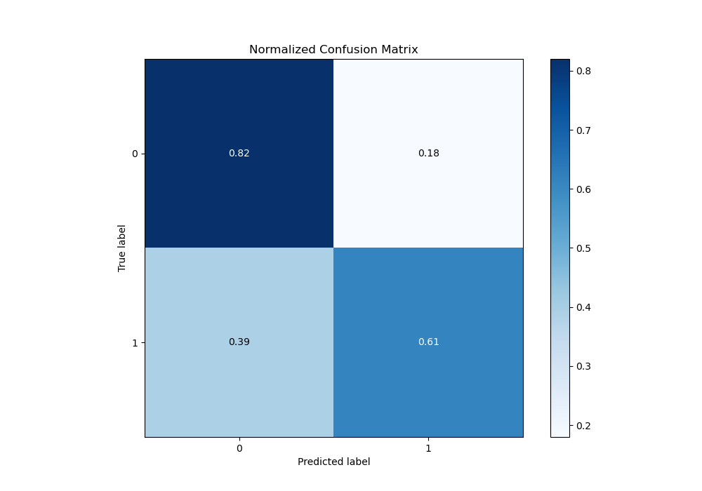
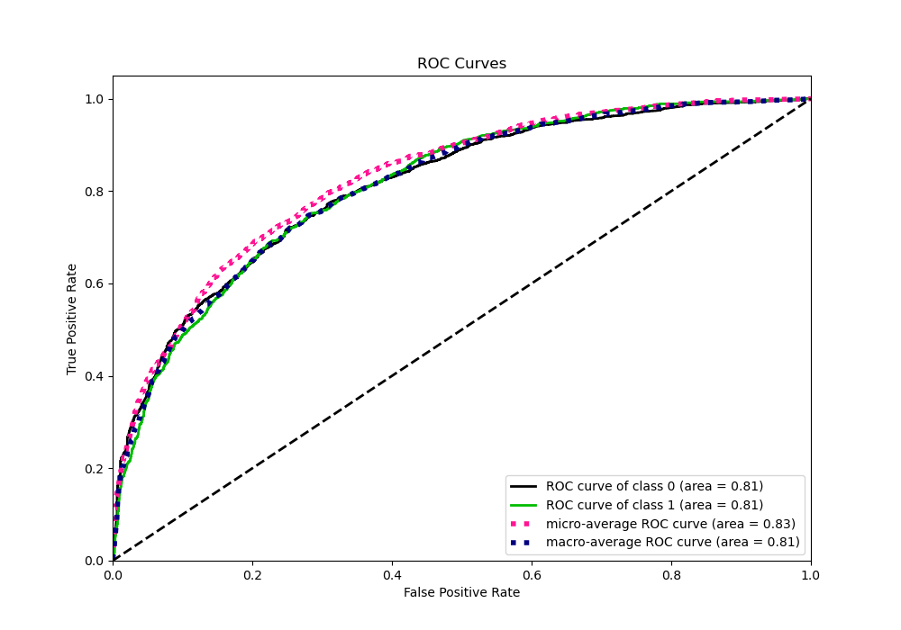
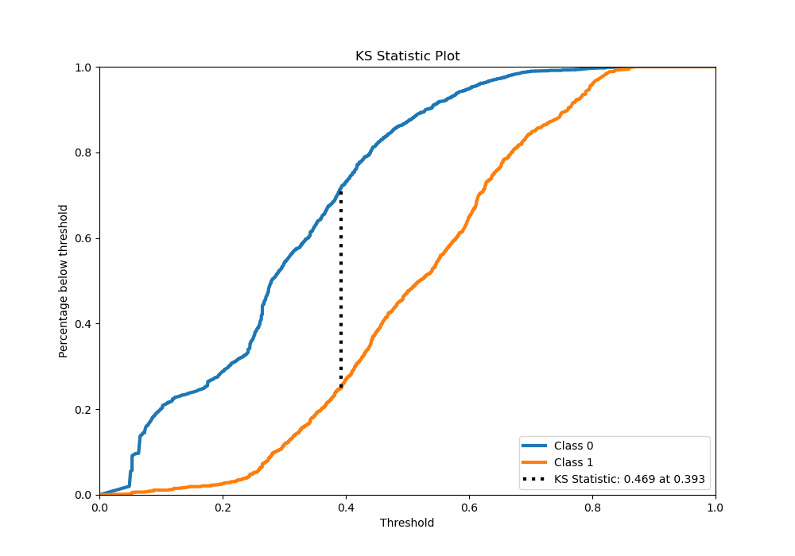
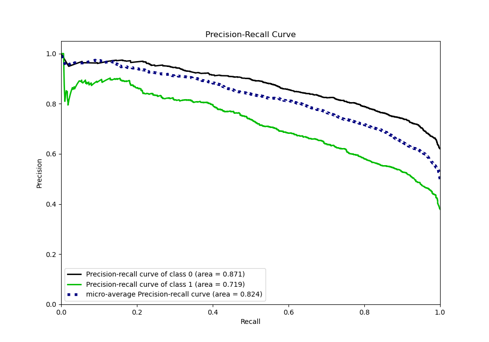
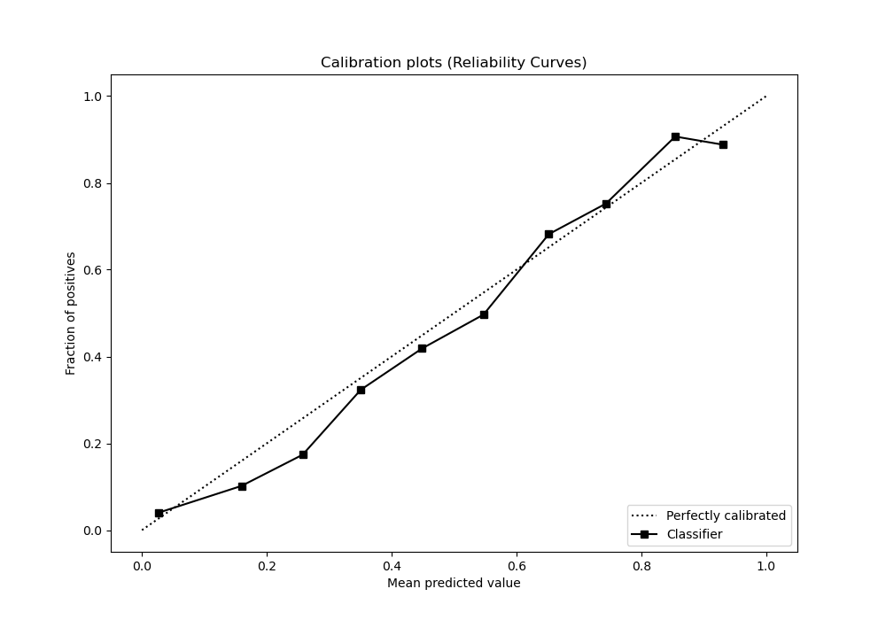
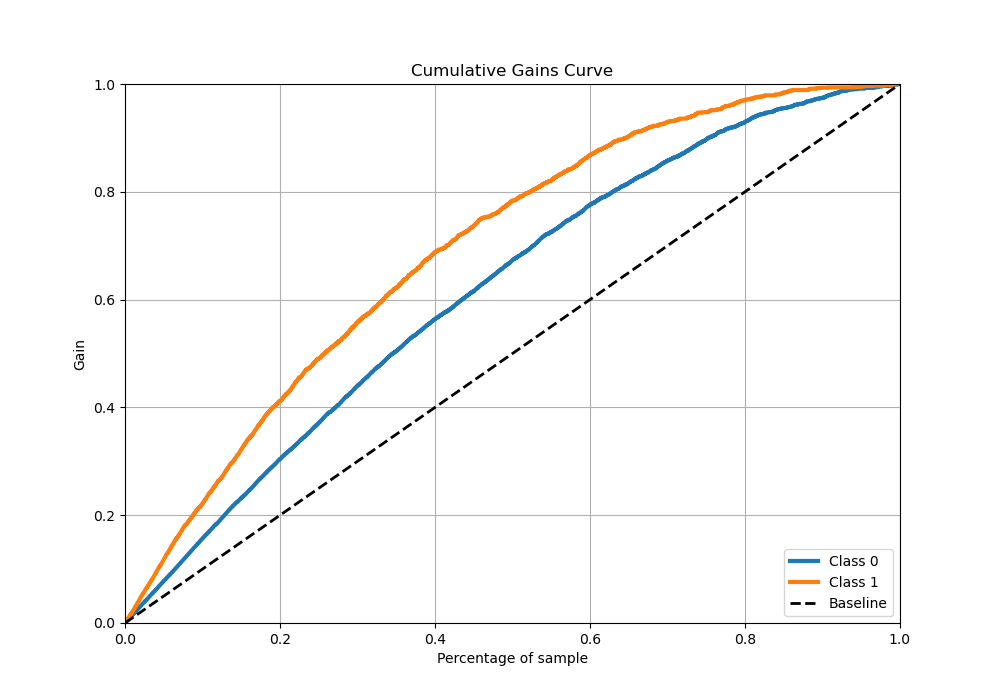
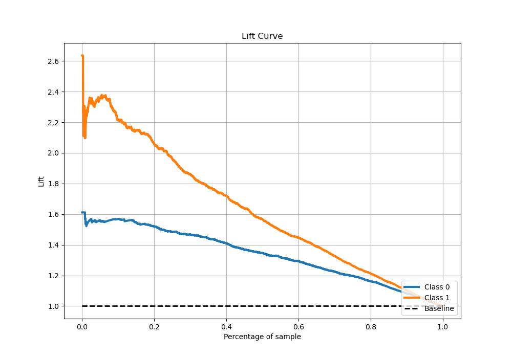

# Summary of 35_RandomForest

[<< Go back](../README.md)

## Random Forest
- **n_jobs**: -1
- **criterion**: gini
- **max_features**: 0.8
- **min_samples_split**: 50
- **max_depth**: 4
- **eval_metric_name**: logloss
- **explain_level**: 0

## Validation
 - **validation_type**: kfold
 - **stratify**: True
 - **k_folds**: 5
 - **shuffle**: True
 - **random_seed**: 42

## Optimized metric
logloss

## Training time

18.5 seconds

## Metric details
|           |    score |   threshold |
|:----------|---------:|------------:|
| logloss   | 0.519043 | nan         |
| auc       | 0.811789 | nan         |
| f1        | 0.677904 |   0.392134  |
| accuracy  | 0.744629 |   0.452954  |
| precision | 0.899582 |   0.737419  |
| recall    | 1        |   0.0437956 |
| mcc       | 0.458779 |   0.421282  |

## Metric details with threshold from accuracy metric
|           |    score |   threshold |
|:----------|---------:|------------:|
| logloss   | 0.519043 |  nan        |
| auc       | 0.811789 |  nan        |
| f1        | 0.645993 |    0.452954 |
| accuracy  | 0.744629 |    0.452954 |
| precision | 0.681347 |    0.452954 |
| recall    | 0.614127 |    0.452954 |
| mcc       | 0.448586 |    0.452954 |

## Confusion matrix (at threshold=0.452954)
|              |   Predicted as 0 |   Predicted as 1 |
|:-------------|-----------------:|-----------------:|
| Labeled as 0 |             2310 |              492 |
| Labeled as 1 |              661 |             1052 |

## Learning curves

## Confusion Matrix

## Normalized Confusion Matrix

## ROC Curve

## Kolmogorov-Smirnov Statistic

## Precision-Recall Curve

## Calibration Curve

## Cumulative Gains Curve

## Lift Curve

[<< Go back](../README.md)
