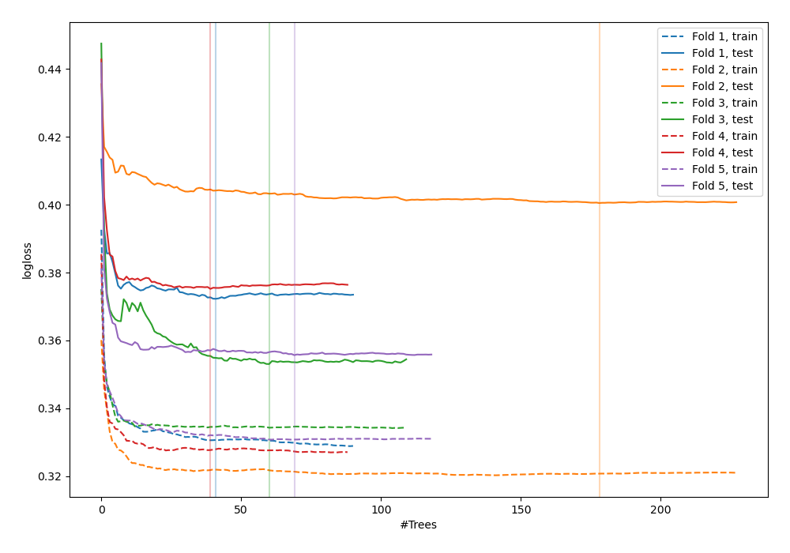
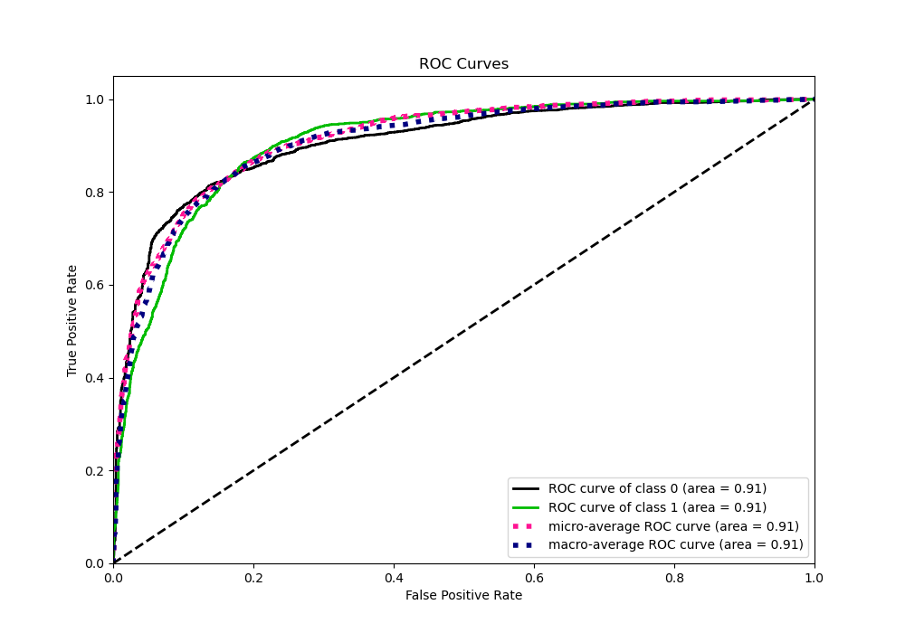
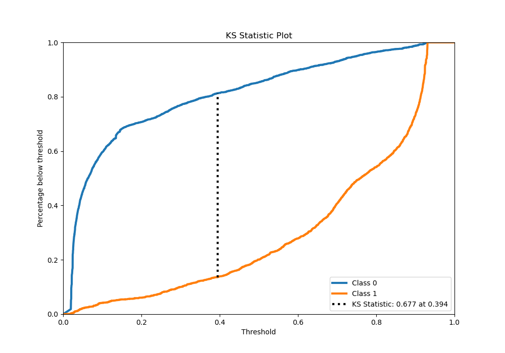
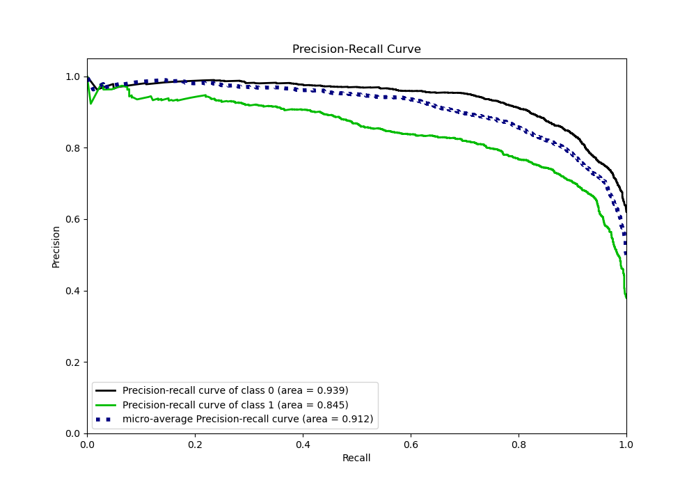
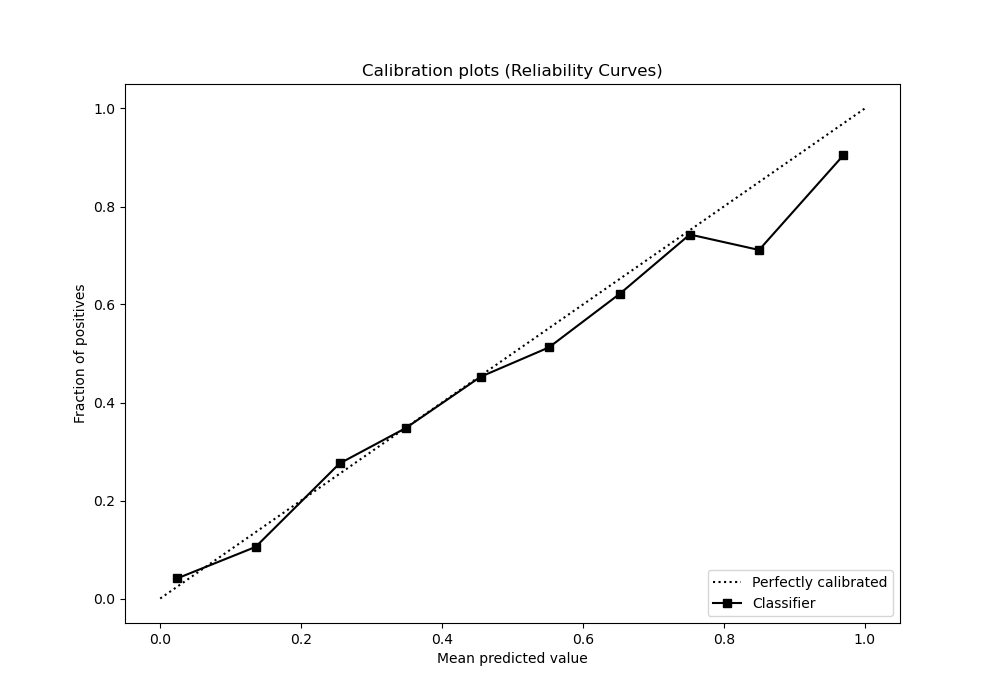
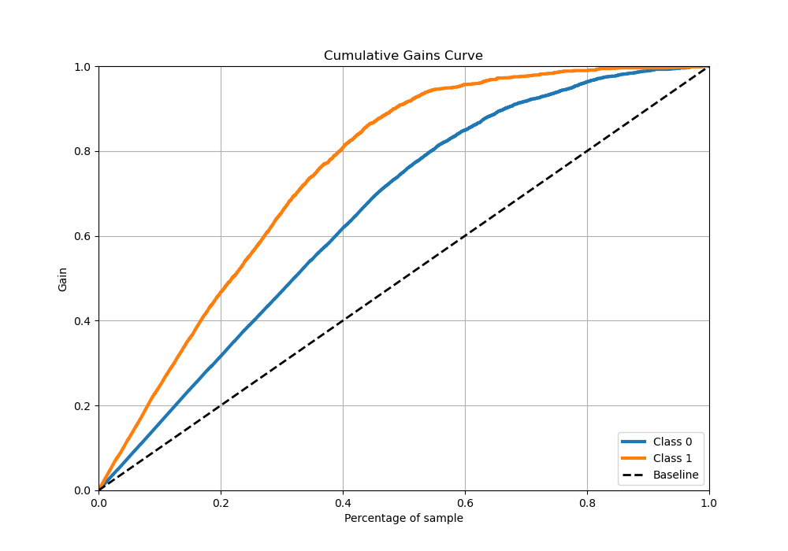
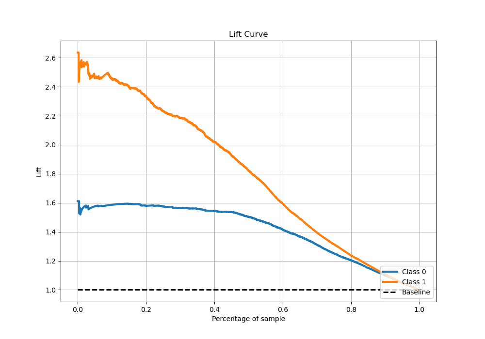

# Summary of 35_RandomForest_Stacked

[<< Go back](../README.md)

## Random Forest
- **n_jobs**: -1
- **criterion**: gini
- **max_features**: 0.8
- **min_samples_split**: 50
- **max_depth**: 4
- **eval_metric_name**: logloss
- **explain_level**: 0

## Validation
 - **validation_type**: kfold
 - **stratify**: True
 - **k_folds**: 5
 - **shuffle**: True
 - **random_seed**: 42

## Optimized metric
logloss

## Training time

35.9 seconds

## Metric details
|           |    score |   threshold |
|:----------|---------:|------------:|
| logloss   | 0.371336 | nan         |
| auc       | 0.907396 | nan         |
| f1        | 0.795252 |   0.402072  |
| accuracy  | 0.834551 |   0.556274  |
| precision | 0.971154 |   0.928868  |
| recall    | 1        |   0.0177081 |
| mcc       | 0.659479 |   0.402072  |

## Metric details with threshold from accuracy metric
|           |    score |   threshold |
|:----------|---------:|------------:|
| logloss   | 0.371336 |  nan        |
| auc       | 0.907396 |  nan        |
| f1        | 0.776815 |    0.556274 |
| accuracy  | 0.834551 |    0.556274 |
| precision | 0.795594 |    0.556274 |
| recall    | 0.758903 |    0.556274 |
| mcc       | 0.645941 |    0.556274 |

## Confusion matrix (at threshold=0.556274)
|              |   Predicted as 0 |   Predicted as 1 |
|:-------------|-----------------:|-----------------:|
| Labeled as 0 |             2468 |              334 |
| Labeled as 1 |              413 |             1300 |

## Learning curves

## Confusion Matrix

## Normalized Confusion Matrix

## ROC Curve

## Kolmogorov-Smirnov Statistic

## Precision-Recall Curve

## Calibration Curve

## Cumulative Gains Curve

## Lift Curve

[<< Go back](../README.md)
