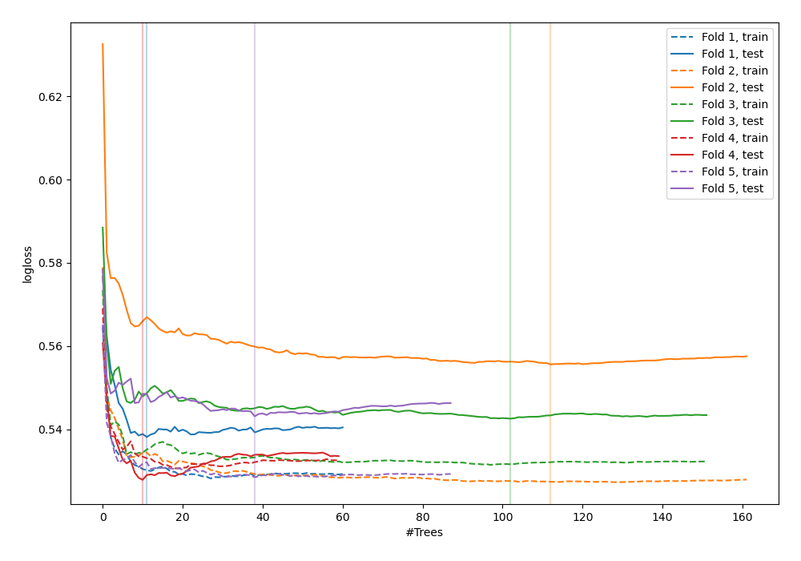
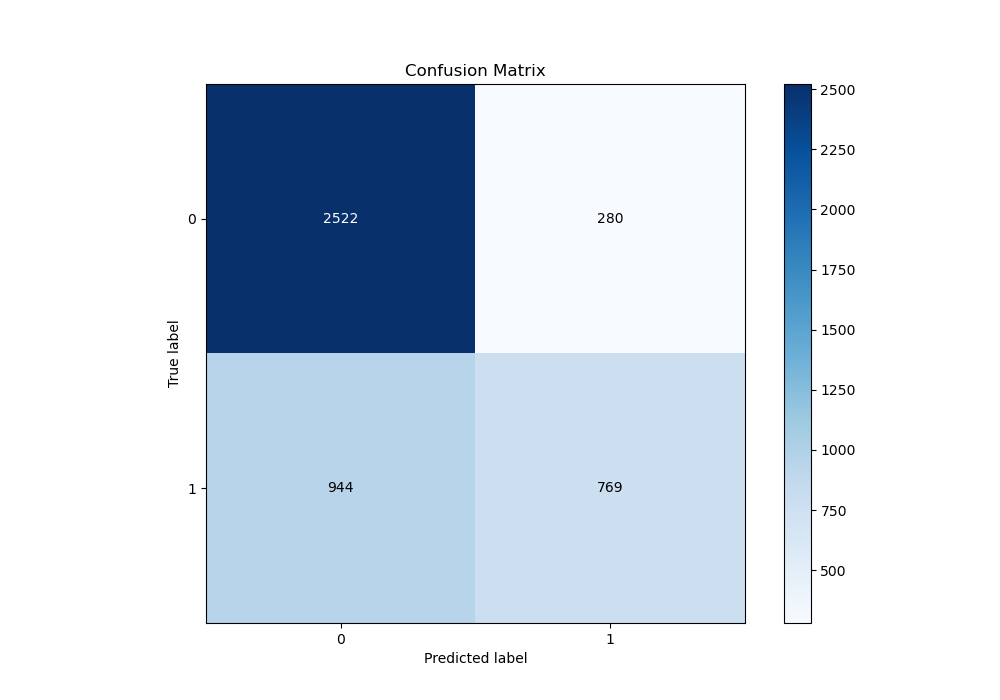
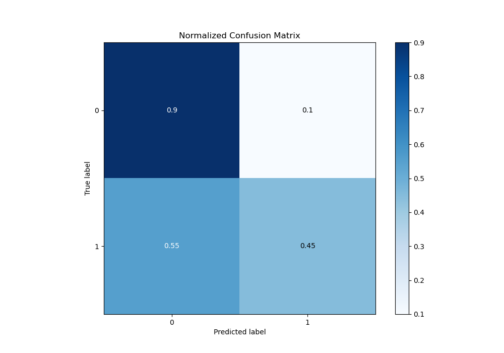
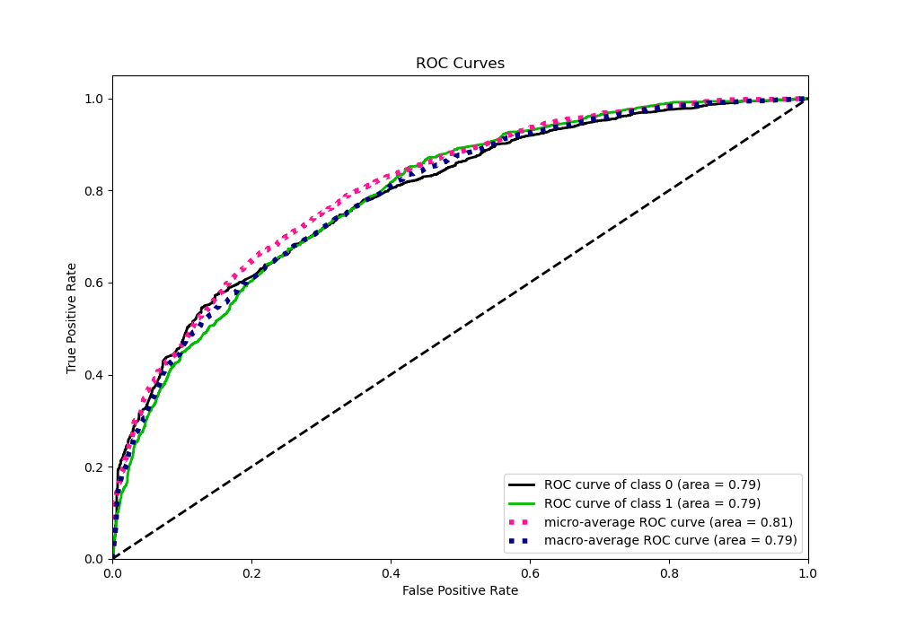
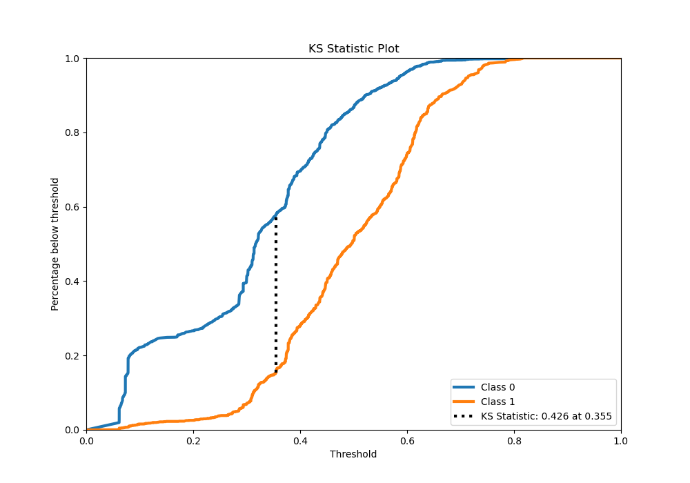
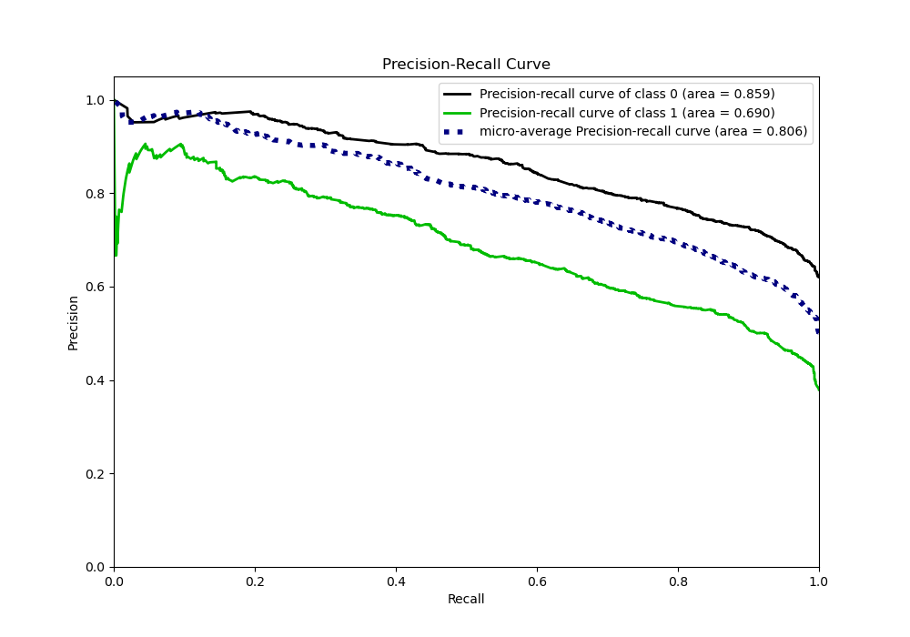
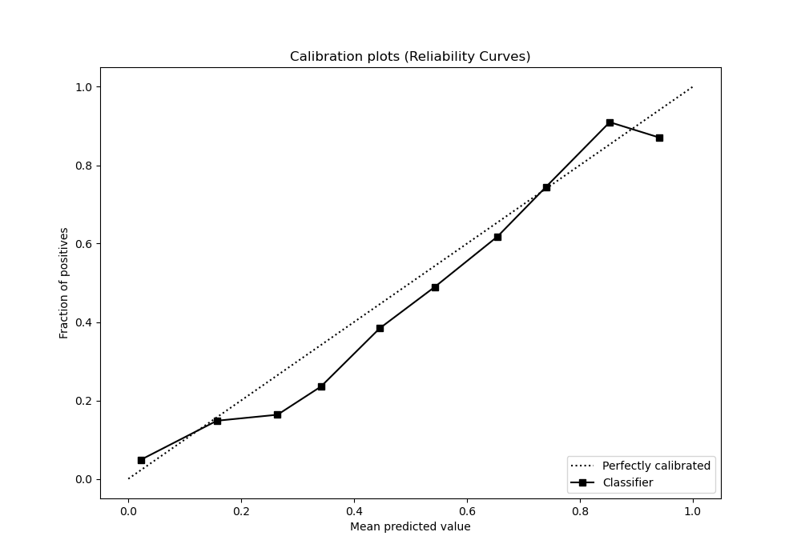
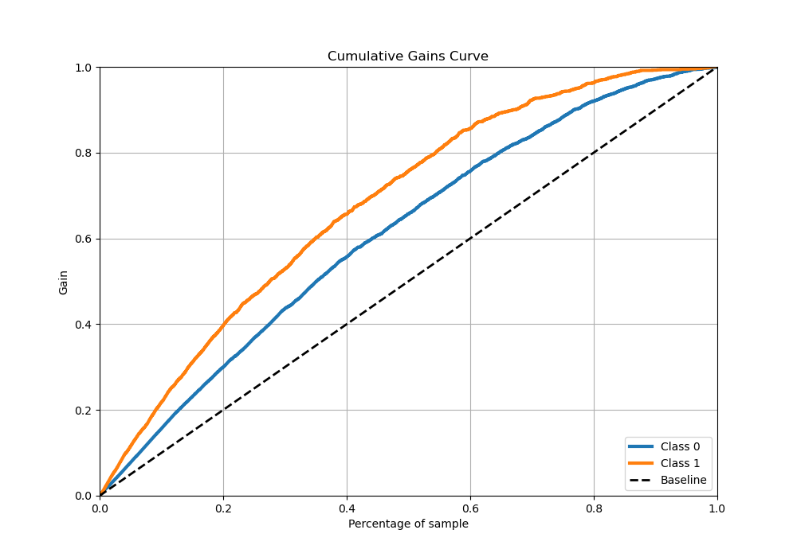
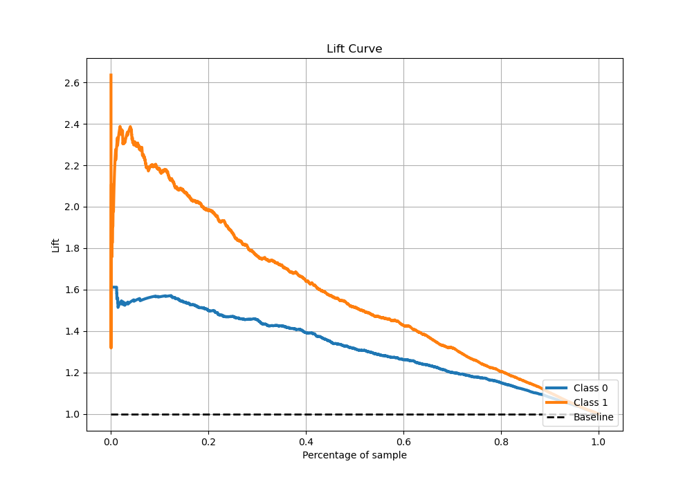

# Summary of 36_RandomForest

[<< Go back](../README.md)

## Random Forest
- **n_jobs**: -1
- **criterion**: gini
- **max_features**: 0.7
- **min_samples_split**: 50
- **max_depth**: 3
- **eval_metric_name**: logloss
- **explain_level**: 0

## Validation
 - **validation_type**: kfold
 - **stratify**: True
 - **k_folds**: 5
 - **shuffle**: True
 - **random_seed**: 42

## Optimized metric
logloss

## Training time

21.9 seconds

## Metric details
|           |    score |   threshold |
|:----------|---------:|------------:|
| logloss   | 0.541479 | nan         |
| auc       | 0.791893 | nan         |
| f1        | 0.666369 |   0.332953  |
| accuracy  | 0.728904 |   0.522327  |
| precision | 0.898936 |   0.665079  |
| recall    | 1        |   0.0544826 |
| mcc       | 0.416115 |   0.440983  |

## Metric details with threshold from accuracy metric
|           |    score |   threshold |
|:----------|---------:|------------:|
| logloss   | 0.541479 |  nan        |
| auc       | 0.791893 |  nan        |
| f1        | 0.556843 |    0.522327 |
| accuracy  | 0.728904 |    0.522327 |
| precision | 0.733079 |    0.522327 |
| recall    | 0.44892  |    0.522327 |
| mcc       | 0.400983 |    0.522327 |

## Confusion matrix (at threshold=0.522327)
|              |   Predicted as 0 |   Predicted as 1 |
|:-------------|-----------------:|-----------------:|
| Labeled as 0 |             2522 |              280 |
| Labeled as 1 |              944 |              769 |

## Learning curves

## Confusion Matrix

## Normalized Confusion Matrix

## ROC Curve

## Kolmogorov-Smirnov Statistic

## Precision-Recall Curve

## Calibration Curve

## Cumulative Gains Curve

## Lift Curve

[<< Go back](../README.md)
