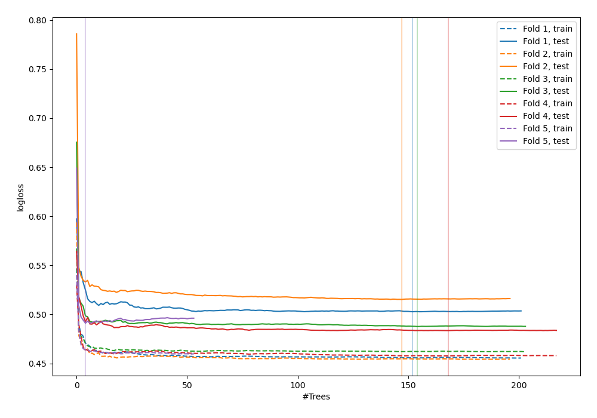
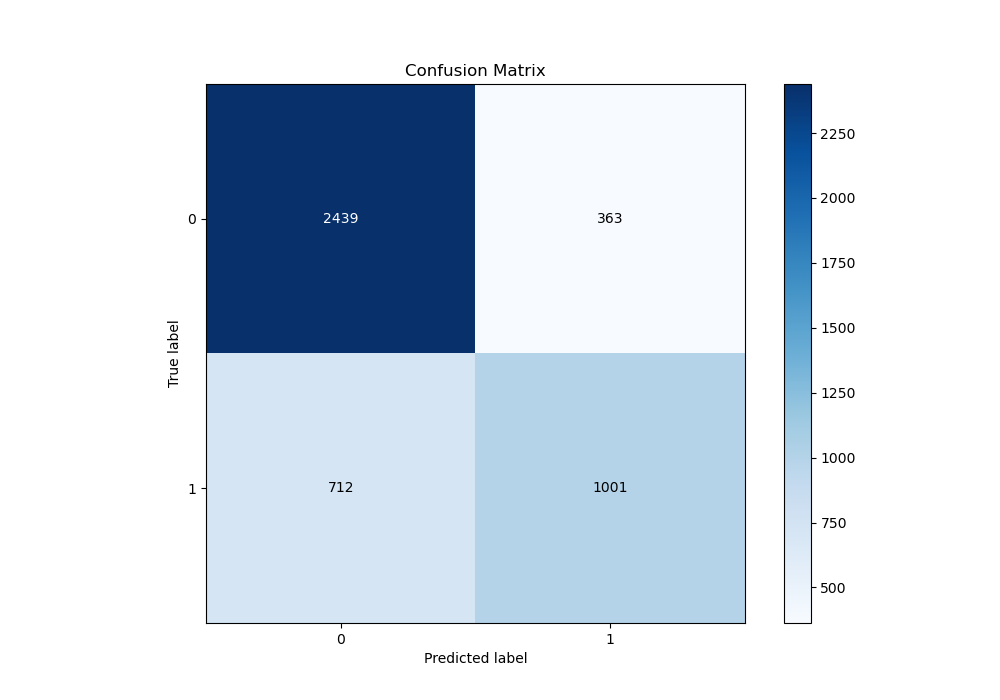
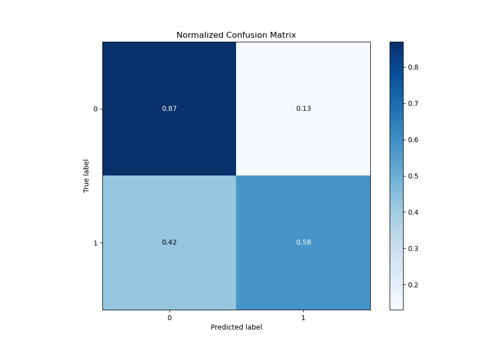
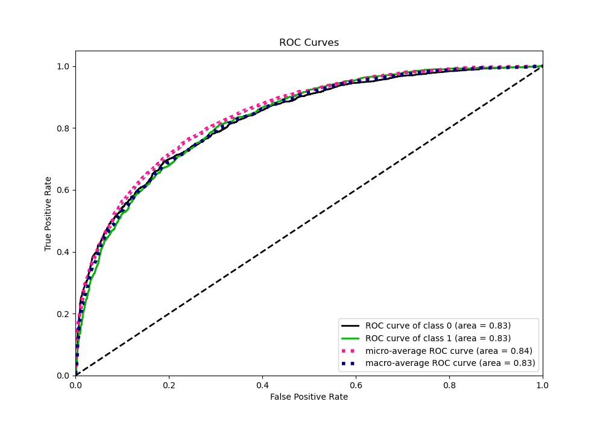
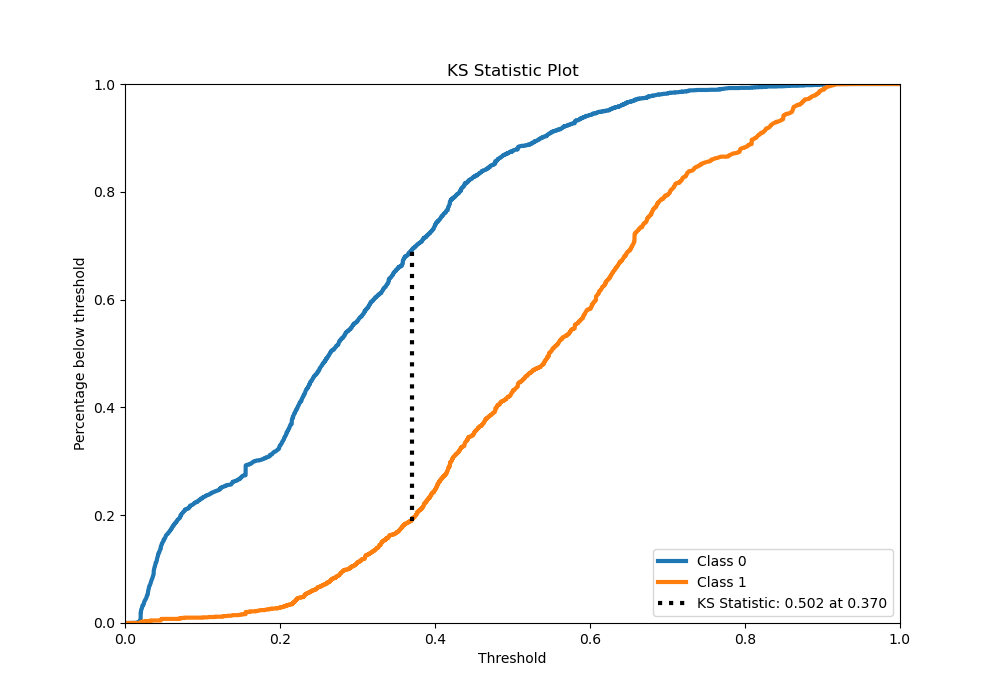
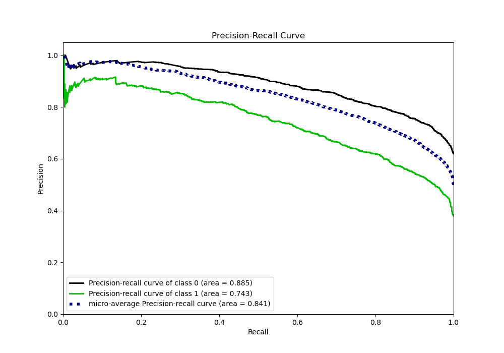
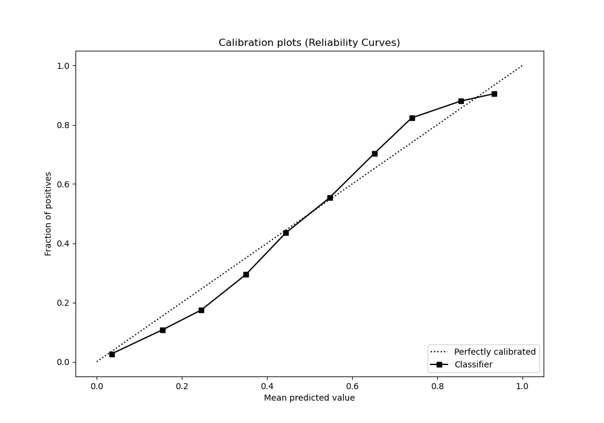
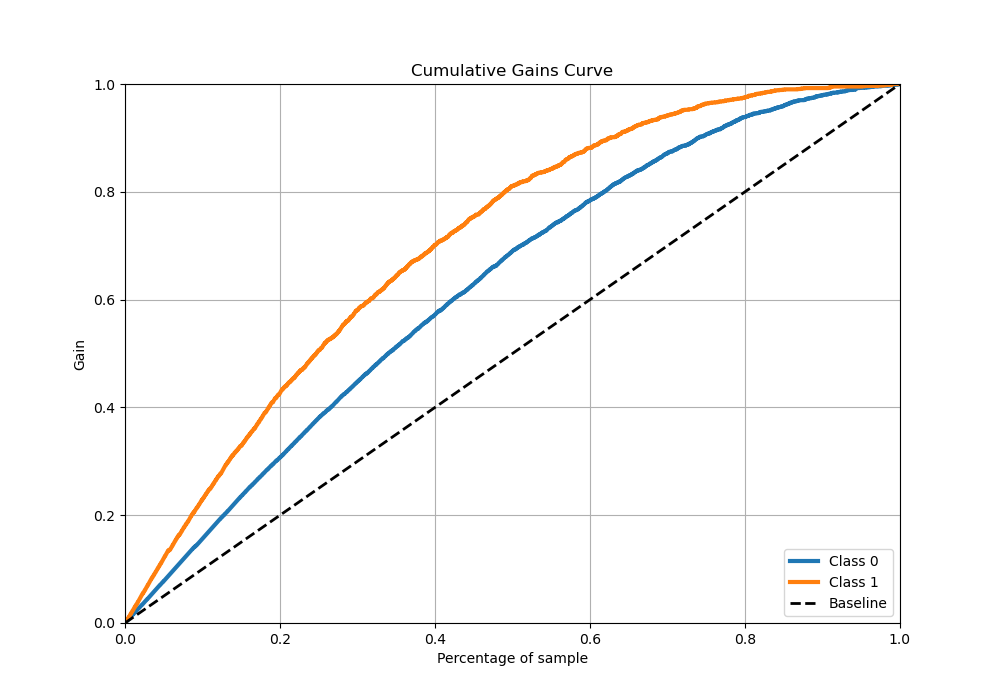
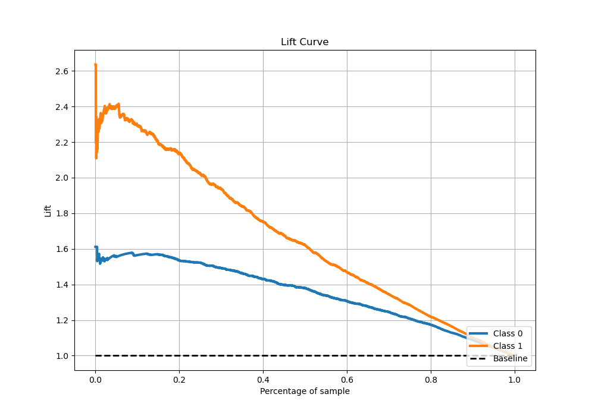

# Summary of 37_RandomForest

[<< Go back](../README.md)

## Random Forest
- **n_jobs**: -1
- **criterion**: entropy
- **max_features**: 0.9
- **min_samples_split**: 20
- **max_depth**: 5
- **eval_metric_name**: logloss
- **explain_level**: 0

## Validation
 - **validation_type**: kfold
 - **stratify**: True
 - **k_folds**: 5
 - **shuffle**: True
 - **random_seed**: 42

## Optimized metric
logloss

## Training time

35.6 seconds

## Metric details
|           |    score |   threshold |
|:----------|---------:|------------:|
| logloss   | 0.496009 |  nan        |
| auc       | 0.830469 |  nan        |
| f1        | 0.699019 |    0.367403 |
| accuracy  | 0.761905 |    0.491806 |
| precision | 0.912752 |    0.83218  |
| recall    | 1        |    0.013595 |
| mcc       | 0.484837 |    0.374864 |

## Metric details with threshold from accuracy metric
|           |    score |   threshold |
|:----------|---------:|------------:|
| logloss   | 0.496009 |  nan        |
| auc       | 0.830469 |  nan        |
| f1        | 0.650634 |    0.491806 |
| accuracy  | 0.761905 |    0.491806 |
| precision | 0.733871 |    0.491806 |
| recall    | 0.584355 |    0.491806 |
| mcc       | 0.480625 |    0.491806 |

## Confusion matrix (at threshold=0.491806)
|              |   Predicted as 0 |   Predicted as 1 |
|:-------------|-----------------:|-----------------:|
| Labeled as 0 |             2439 |              363 |
| Labeled as 1 |              712 |             1001 |

## Learning curves

## Confusion Matrix

## Normalized Confusion Matrix

## ROC Curve

## Kolmogorov-Smirnov Statistic

## Precision-Recall Curve

## Calibration Curve

## Cumulative Gains Curve

## Lift Curve

[<< Go back](../README.md)
