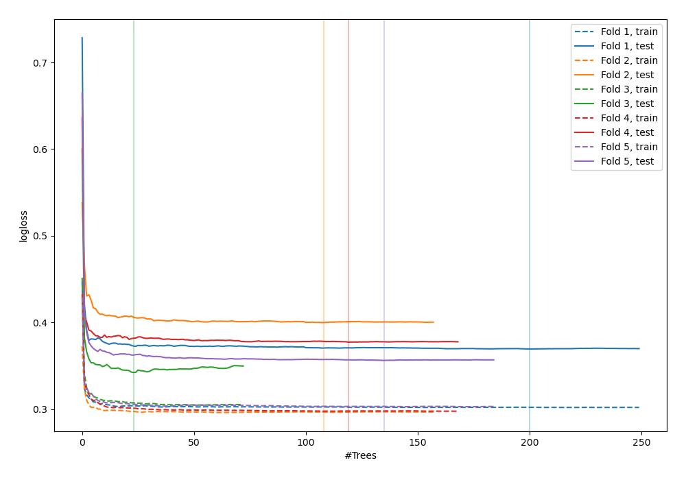
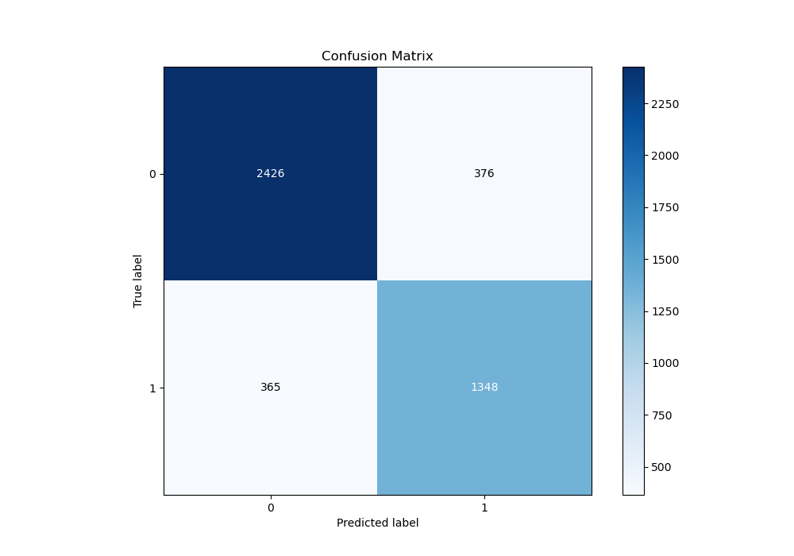
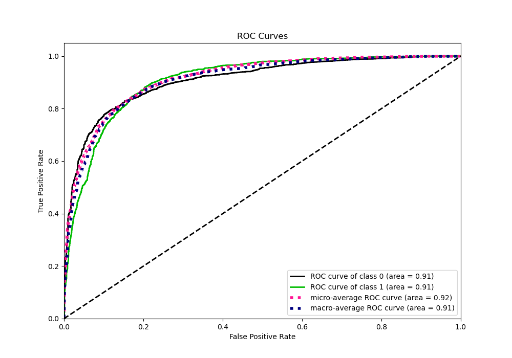
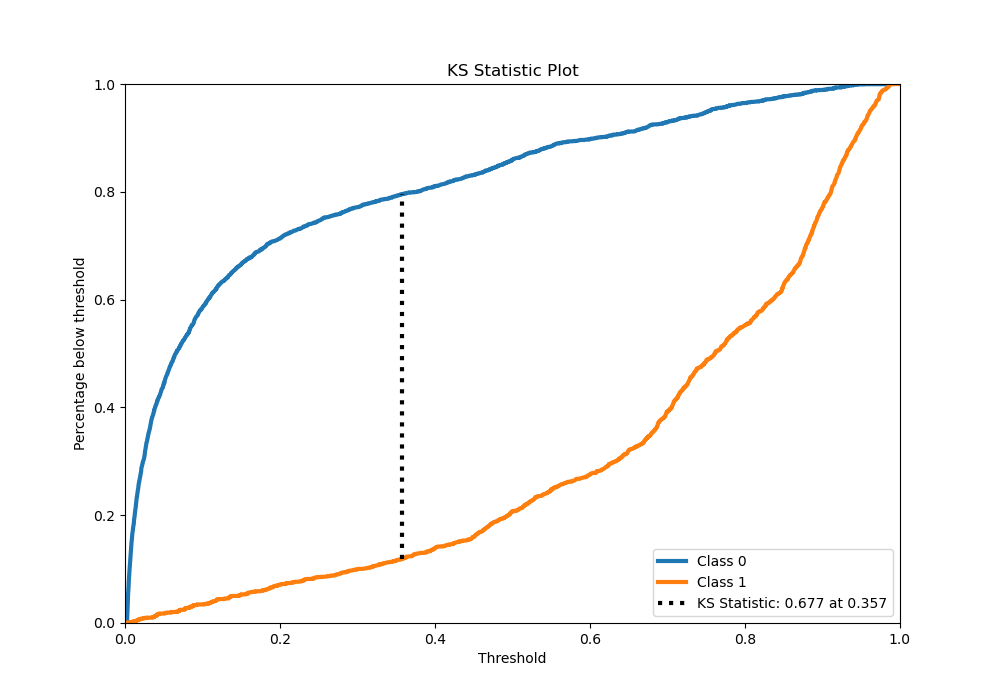
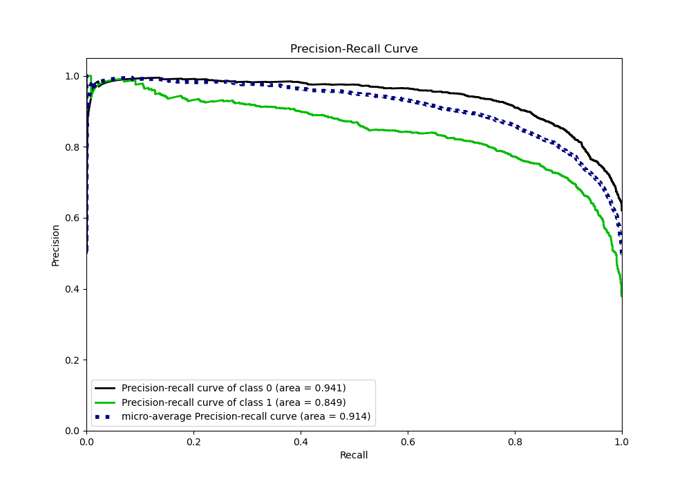
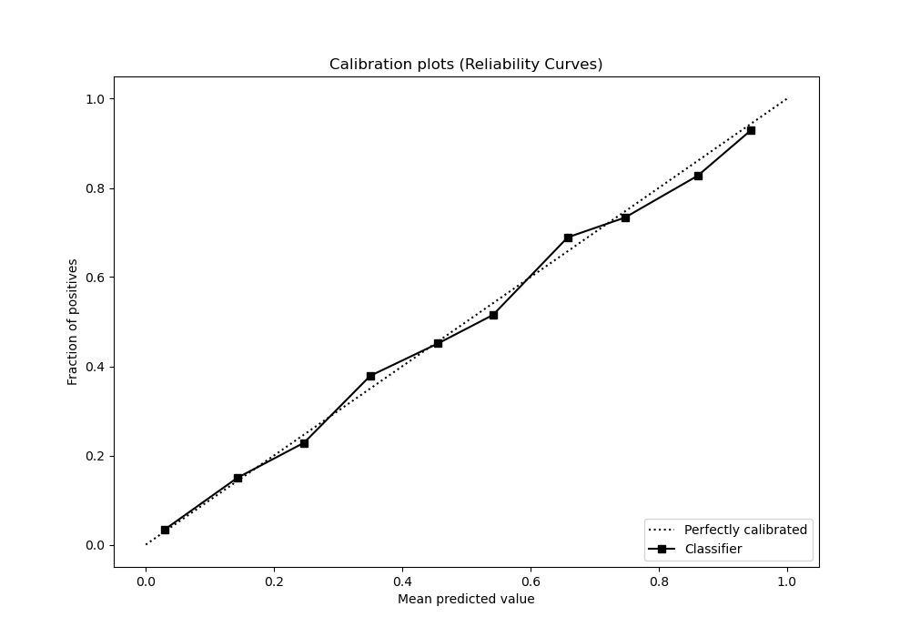
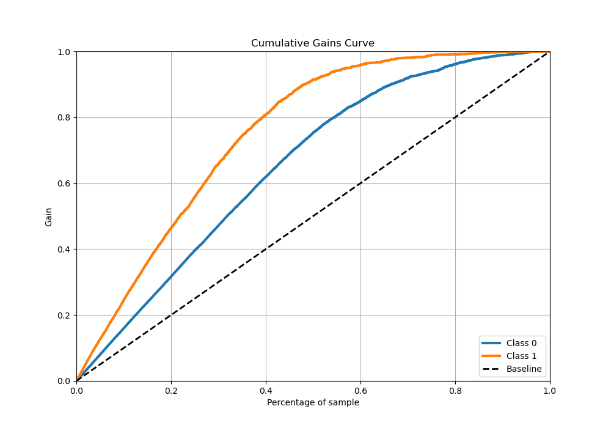
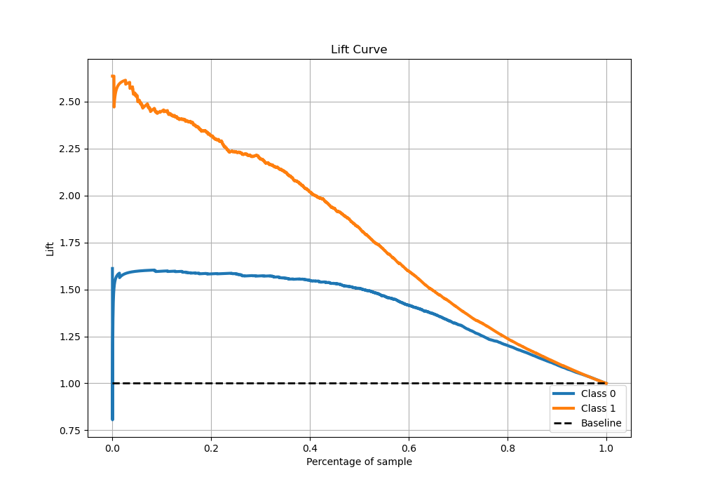

# Summary of 37_RandomForest_Stacked

[<< Go back](../README.md)

## Random Forest
- **n_jobs**: -1
- **criterion**: entropy
- **max_features**: 0.9
- **min_samples_split**: 20
- **max_depth**: 5
- **eval_metric_name**: logloss
- **explain_level**: 0

## Validation
 - **validation_type**: kfold
 - **stratify**: True
 - **k_folds**: 5
 - **shuffle**: True
 - **random_seed**: 42

## Optimized metric
logloss

## Training time

45.7 seconds

## Metric details
|           |    score |    threshold |
|:----------|---------:|-------------:|
| logloss   | 0.368997 | nan          |
| auc       | 0.908777 | nan          |
| f1        | 0.795365 |   0.356875   |
| accuracy  | 0.83588  |   0.511808   |
| precision | 0.990385 |   0.957987   |
| recall    | 1        |   0.00217671 |
| mcc       | 0.658612 |   0.356875   |

## Metric details with threshold from accuracy metric
|           |    score |   threshold |
|:----------|---------:|------------:|
| logloss   | 0.368997 |  nan        |
| auc       | 0.908777 |  nan        |
| f1        | 0.784405 |    0.511808 |
| accuracy  | 0.83588  |    0.511808 |
| precision | 0.781903 |    0.511808 |
| recall    | 0.786924 |    0.511808 |
| mcc       | 0.651929 |    0.511808 |

## Confusion matrix (at threshold=0.511808)
|              |   Predicted as 0 |   Predicted as 1 |
|:-------------|-----------------:|-----------------:|
| Labeled as 0 |             2426 |              376 |
| Labeled as 1 |              365 |             1348 |

## Learning curves

## Confusion Matrix

## Normalized Confusion Matrix

## ROC Curve

## Kolmogorov-Smirnov Statistic

## Precision-Recall Curve

## Calibration Curve

## Cumulative Gains Curve

## Lift Curve

[<< Go back](../README.md)
