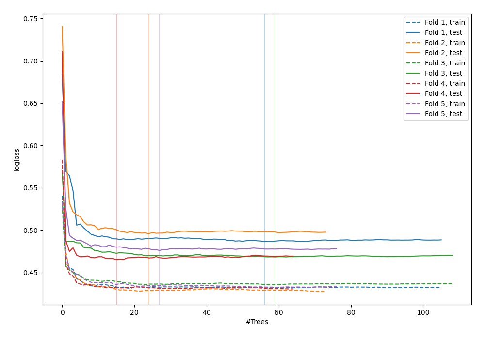
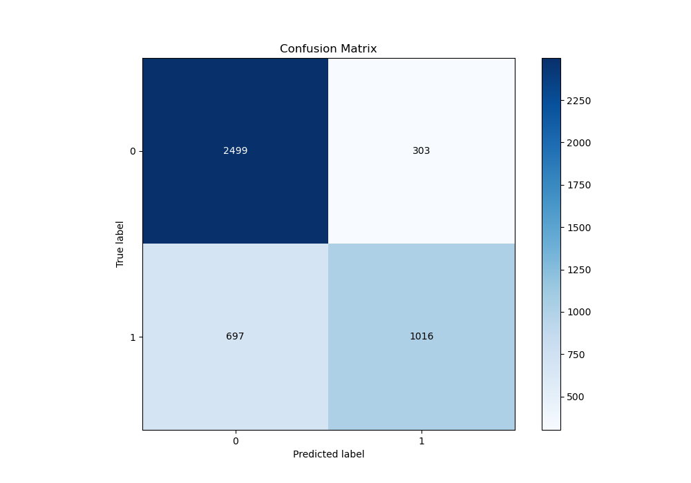
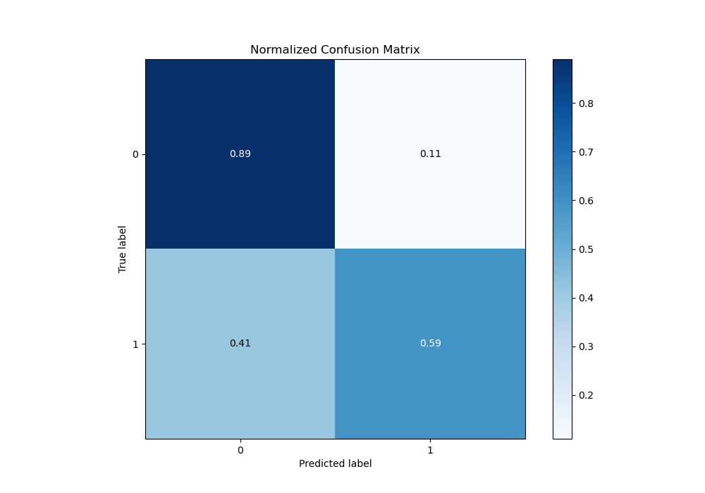
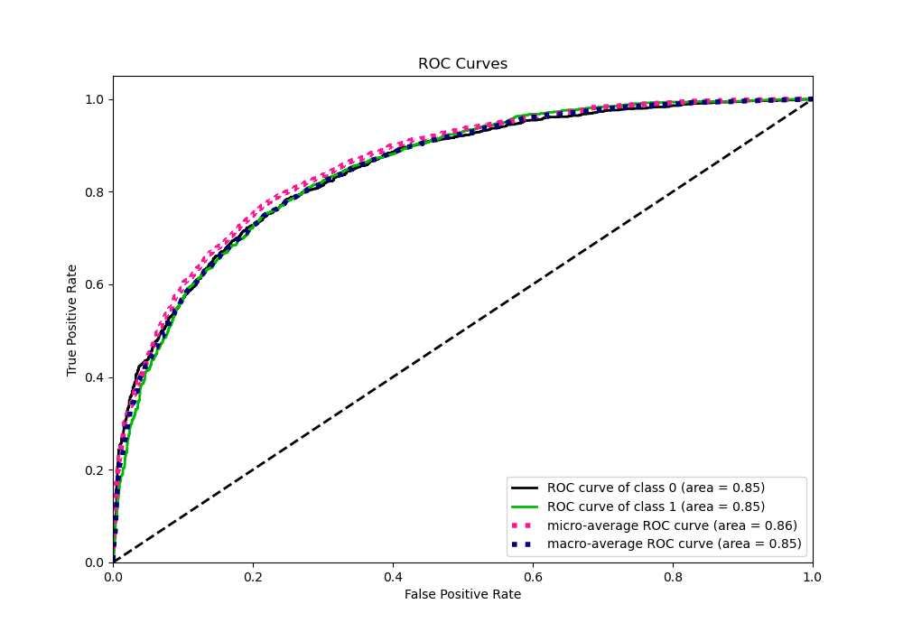
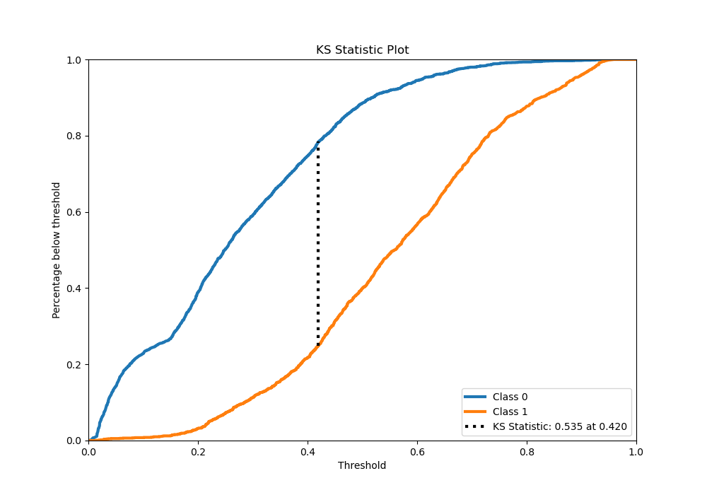
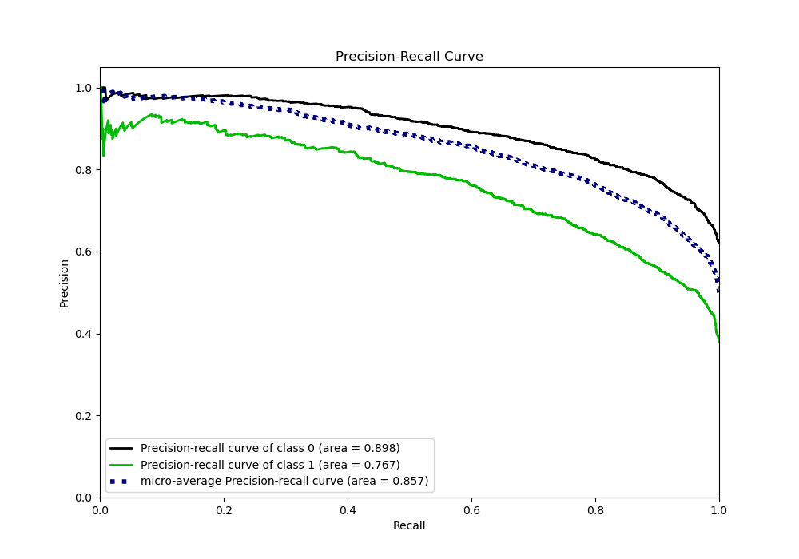
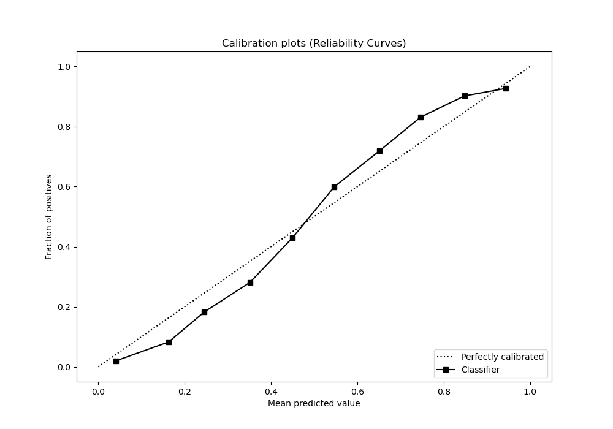
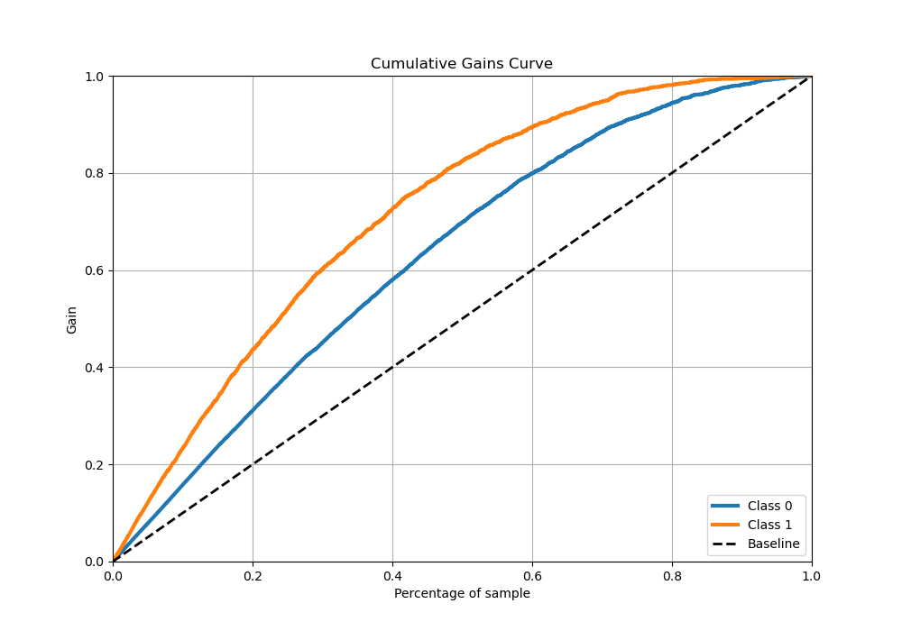
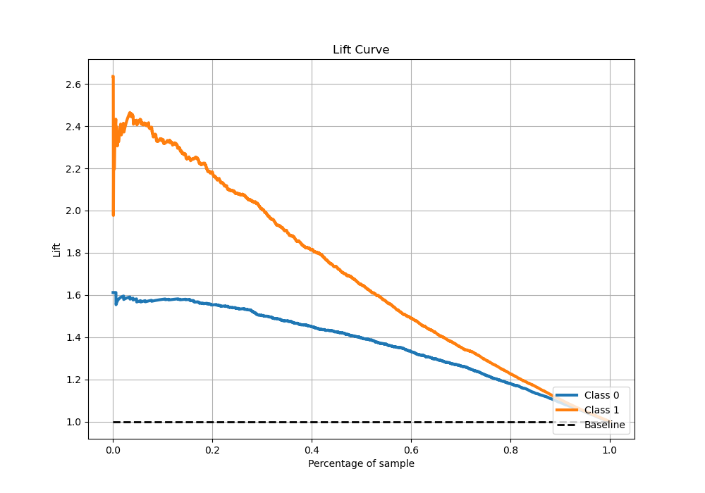

# Summary of 38_RandomForest

[<< Go back](../README.md)

## Random Forest
- **n_jobs**: -1
- **criterion**: entropy
- **max_features**: 0.8
- **min_samples_split**: 40
- **max_depth**: 6
- **eval_metric_name**: logloss
- **explain_level**: 0

## Validation
 - **validation_type**: kfold
 - **stratify**: True
 - **k_folds**: 5
 - **shuffle**: True
 - **random_seed**: 42

## Optimized metric
logloss

## Training time

22.1 seconds

## Metric details
|           |    score |    threshold |
|:----------|---------:|-------------:|
| logloss   | 0.478279 | nan          |
| auc       | 0.847619 | nan          |
| f1        | 0.713661 |   0.380523   |
| accuracy  | 0.778516 |   0.506792   |
| precision | 0.932886 |   0.852823   |
| recall    | 1        |   0.00445175 |
| mcc       | 0.52372  |   0.418507   |

## Metric details with threshold from accuracy metric
|           |    score |   threshold |
|:----------|---------:|------------:|
| logloss   | 0.478279 |  nan        |
| auc       | 0.847619 |  nan        |
| f1        | 0.670185 |    0.506792 |
| accuracy  | 0.778516 |    0.506792 |
| precision | 0.770281 |    0.506792 |
| recall    | 0.593112 |    0.506792 |
| mcc       | 0.517495 |    0.506792 |

## Confusion matrix (at threshold=0.506792)
|              |   Predicted as 0 |   Predicted as 1 |
|:-------------|-----------------:|-----------------:|
| Labeled as 0 |             2499 |              303 |
| Labeled as 1 |              697 |             1016 |

## Learning curves

## Confusion Matrix

## Normalized Confusion Matrix

## ROC Curve

## Kolmogorov-Smirnov Statistic

## Precision-Recall Curve

## Calibration Curve

## Cumulative Gains Curve

## Lift Curve

[<< Go back](../README.md)
