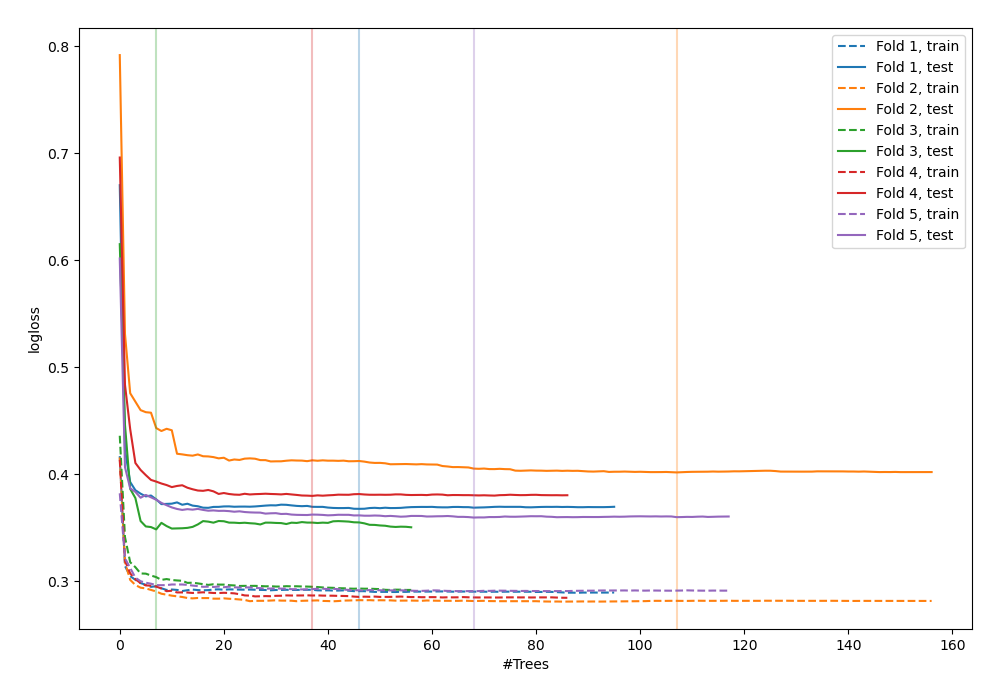
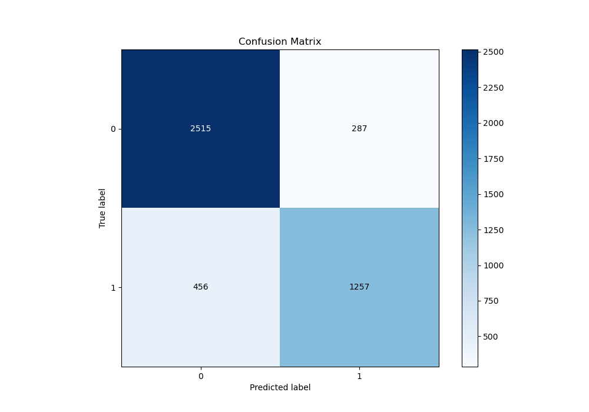
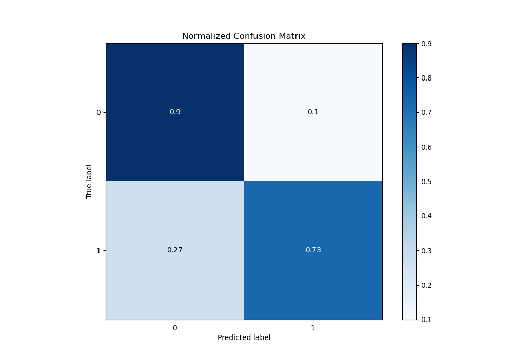
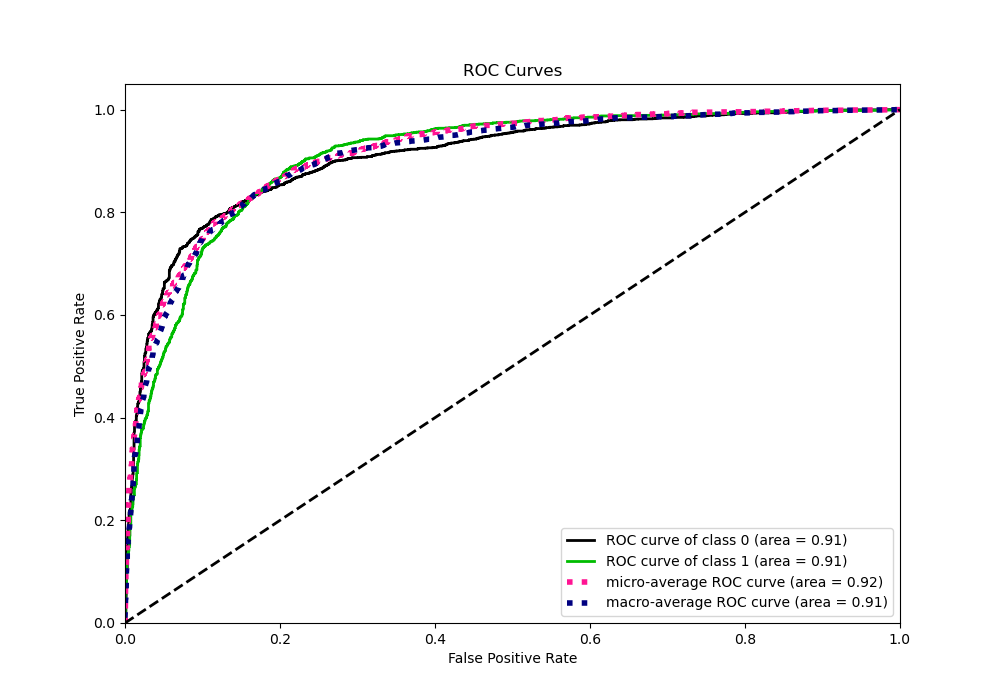
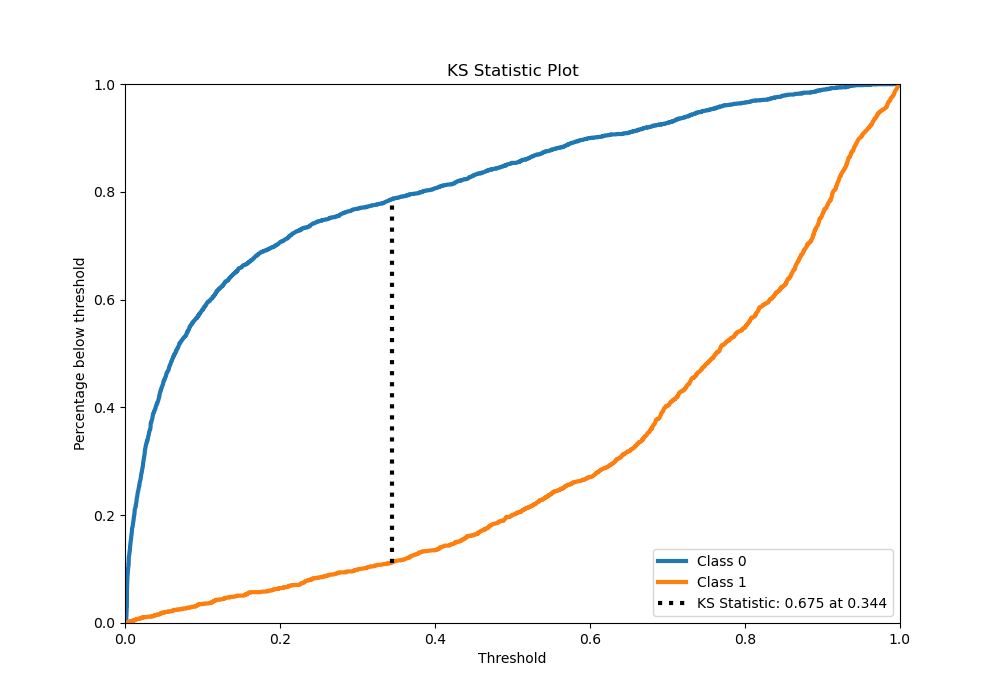
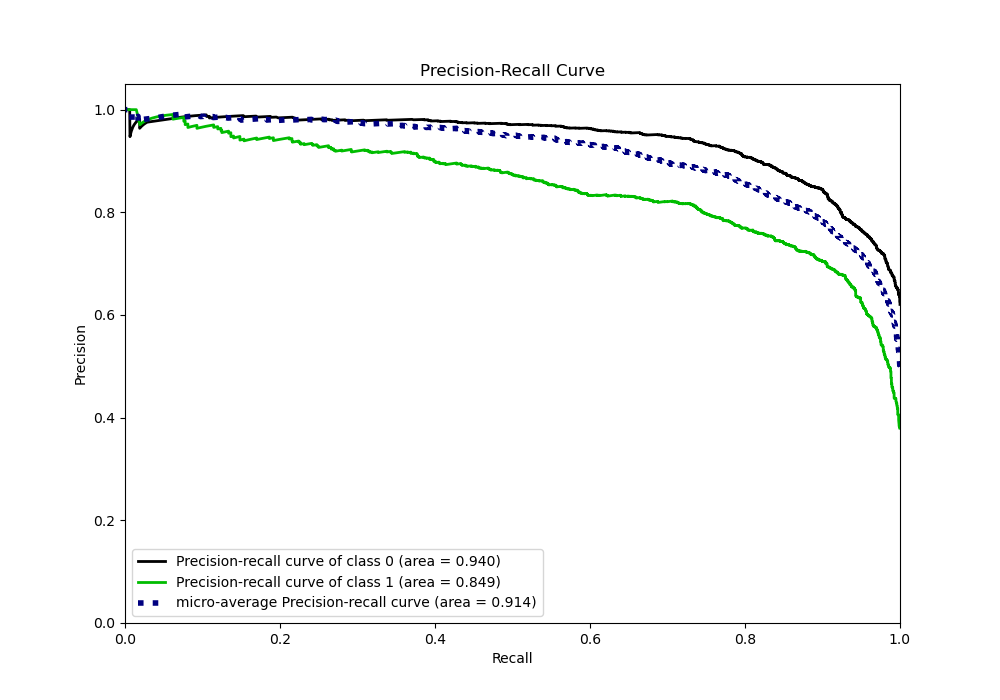
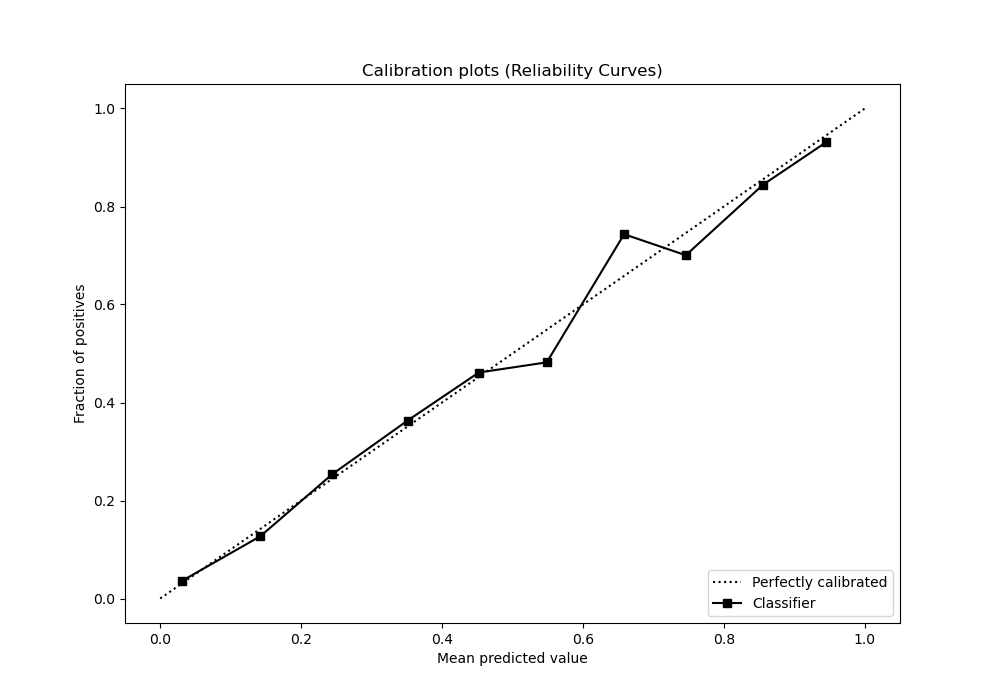
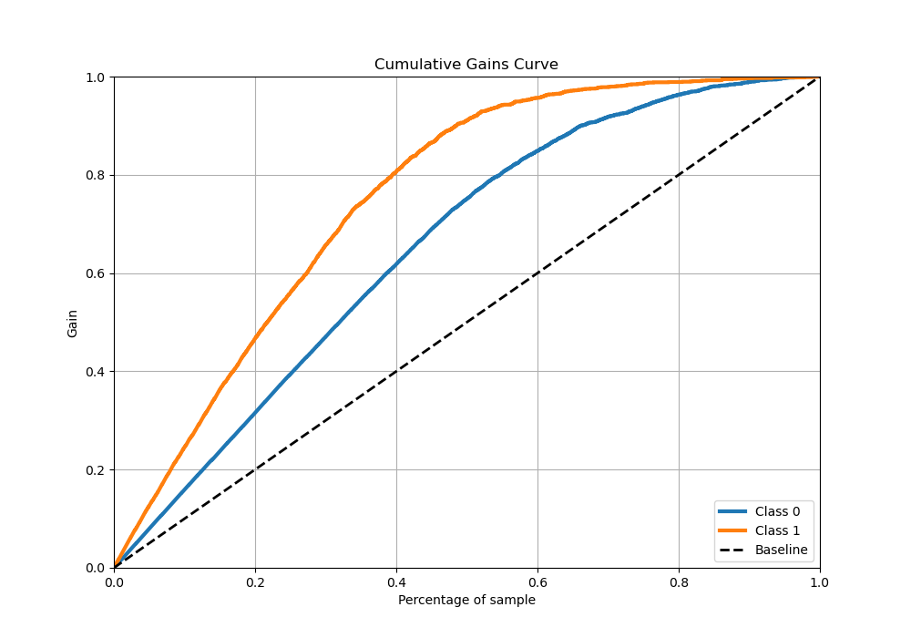
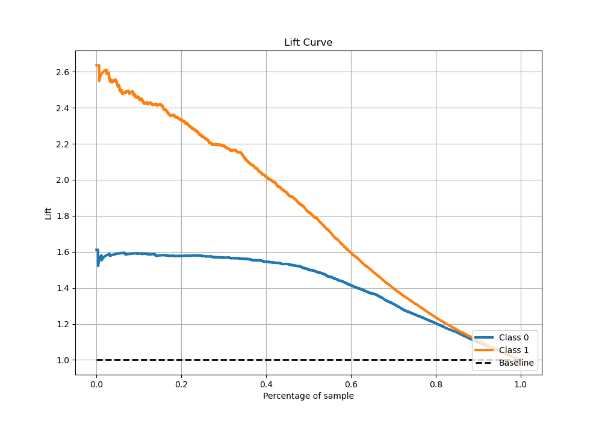

# Summary of 38_RandomForest_Stacked

[<< Go back](../README.md)

## Random Forest
- **n_jobs**: -1
- **criterion**: entropy
- **max_features**: 0.8
- **min_samples_split**: 40
- **max_depth**: 6
- **eval_metric_name**: logloss
- **explain_level**: 0

## Validation
 - **validation_type**: kfold
 - **stratify**: True
 - **k_folds**: 5
 - **shuffle**: True
 - **random_seed**: 42

## Optimized metric
logloss

## Training time

32.2 seconds

## Metric details
|           |    score |     threshold |
|:----------|---------:|--------------:|
| logloss   | 0.371589 | nan           |
| auc       | 0.90785  | nan           |
| f1        | 0.793258 |   0.365078    |
| accuracy  | 0.835437 |   0.592972    |
| precision | 0.990385 |   0.969963    |
| recall    | 1        |   0.000443284 |
| mcc       | 0.654969 |   0.45155     |

## Metric details with threshold from accuracy metric
|           |    score |   threshold |
|:----------|---------:|------------:|
| logloss   | 0.371589 |  nan        |
| auc       | 0.90785  |  nan        |
| f1        | 0.771876 |    0.592972 |
| accuracy  | 0.835437 |    0.592972 |
| precision | 0.814119 |    0.592972 |
| recall    | 0.7338   |    0.592972 |
| mcc       | 0.645839 |    0.592972 |

## Confusion matrix (at threshold=0.592972)
|              |   Predicted as 0 |   Predicted as 1 |
|:-------------|-----------------:|-----------------:|
| Labeled as 0 |             2515 |              287 |
| Labeled as 1 |              456 |             1257 |

## Learning curves

## Confusion Matrix

## Normalized Confusion Matrix

## ROC Curve

## Kolmogorov-Smirnov Statistic

## Precision-Recall Curve

## Calibration Curve

## Cumulative Gains Curve

## Lift Curve

[<< Go back](../README.md)
