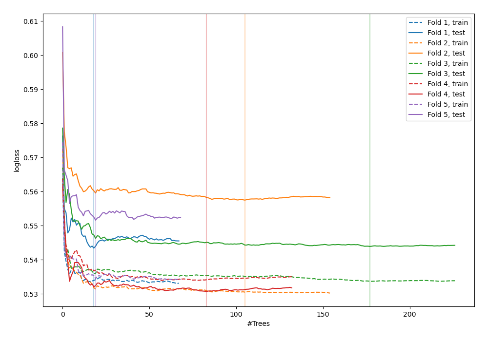
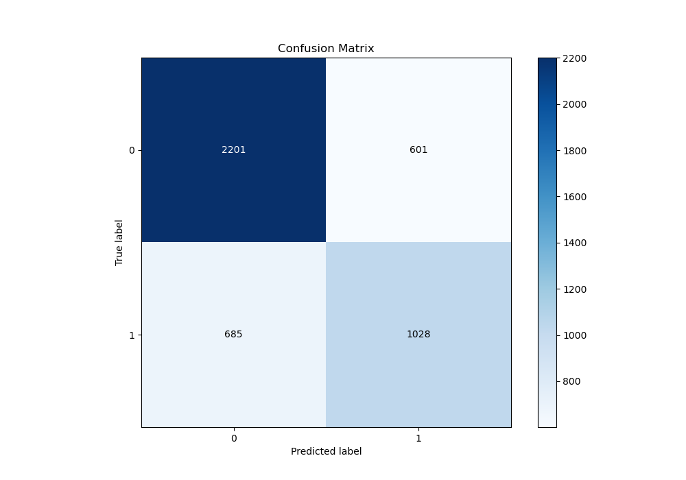
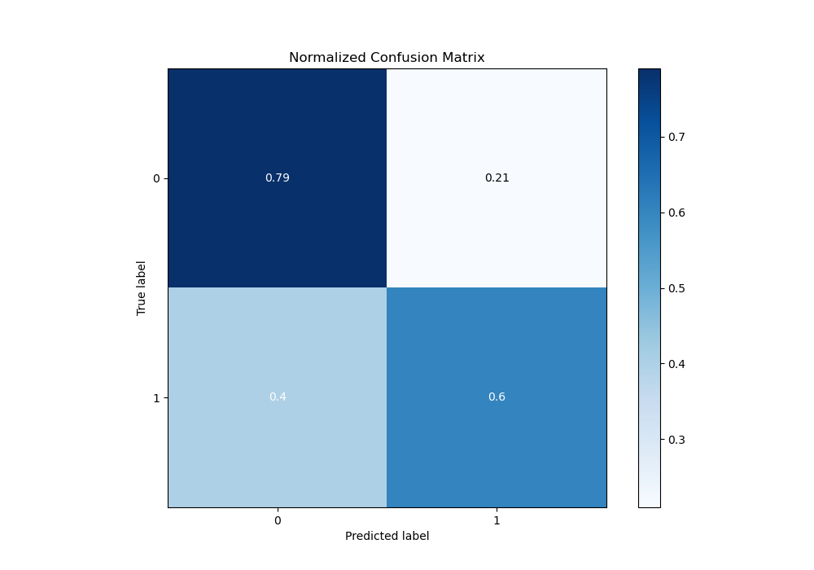
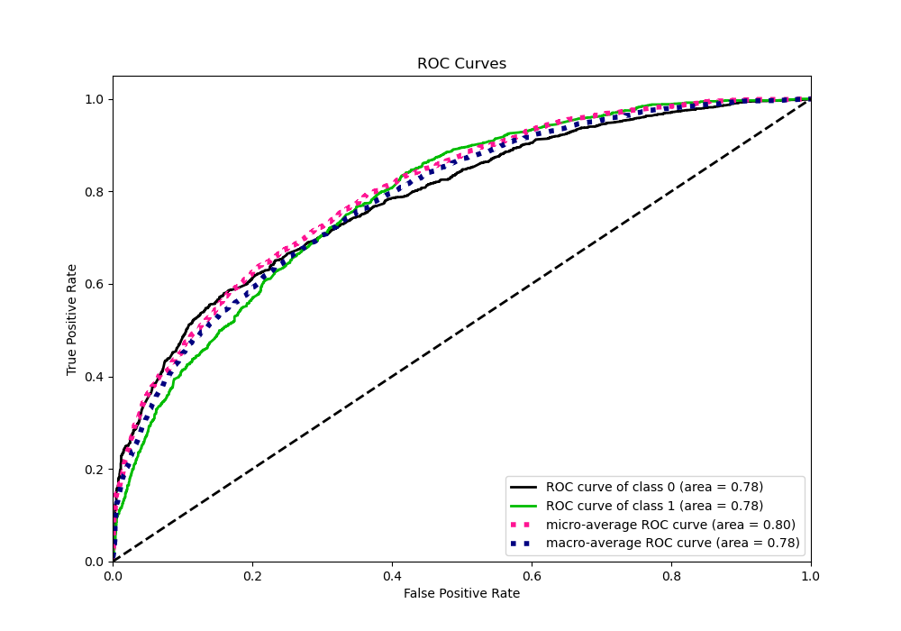
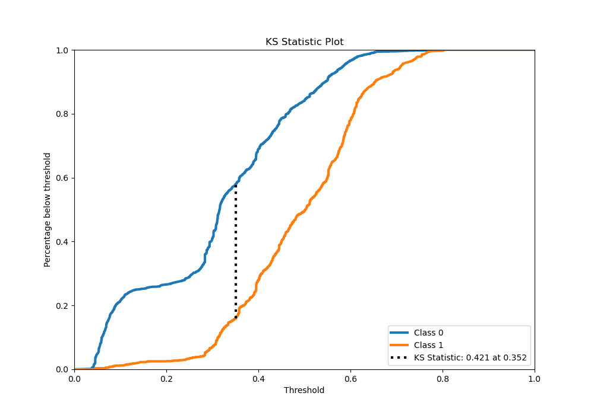
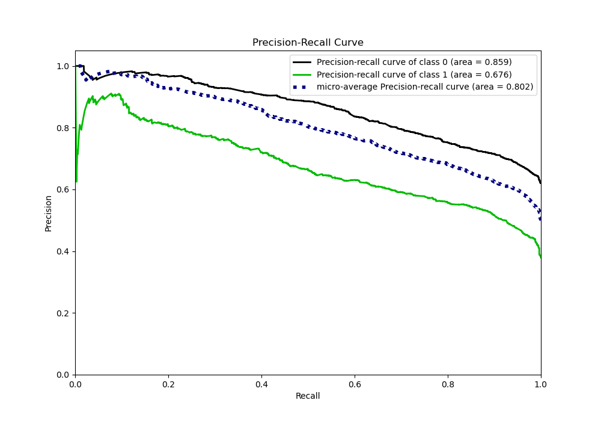
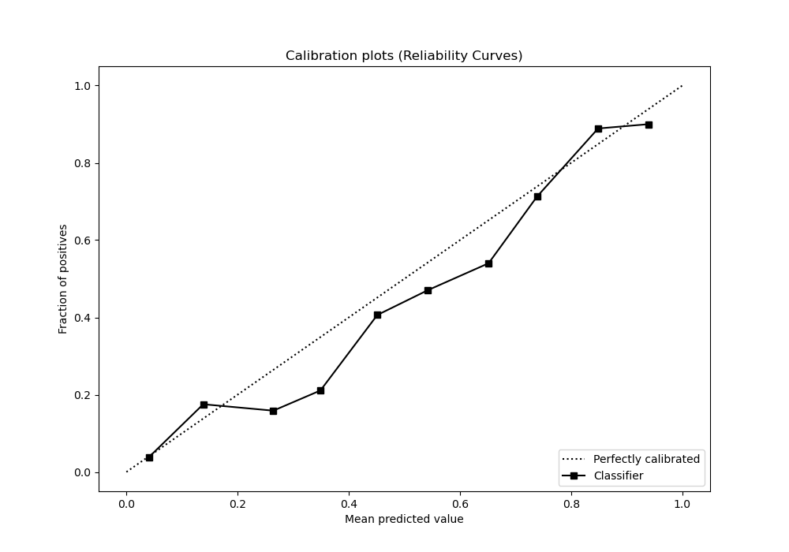
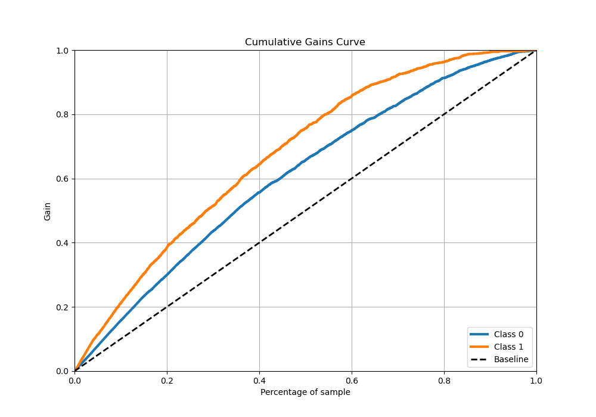
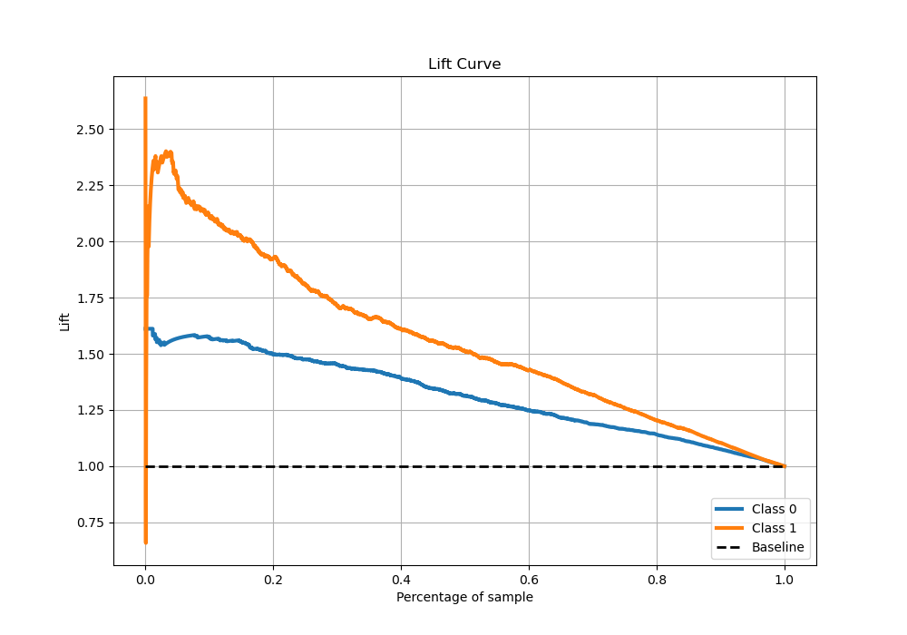

# Summary of 39_RandomForest

[<< Go back](../README.md)

## Random Forest
- **n_jobs**: -1
- **criterion**: entropy
- **max_features**: 0.7
- **min_samples_split**: 40
- **max_depth**: 3
- **eval_metric_name**: logloss
- **explain_level**: 0

## Validation
 - **validation_type**: kfold
 - **stratify**: True
 - **k_folds**: 5
 - **shuffle**: True
 - **random_seed**: 42

## Optimized metric
logloss

## Training time

31.5 seconds

## Metric details
|           |    score |   threshold |
|:----------|---------:|------------:|
| logloss   | 0.545441 | nan         |
| auc       | 0.784845 | nan         |
| f1        | 0.664513 |   0.349777  |
| accuracy  | 0.715172 |   0.45033   |
| precision | 0.90604  |   0.684752  |
| recall    | 1        |   0.0338383 |
| mcc       | 0.412149 |   0.349777  |

## Metric details with threshold from accuracy metric
|           |    score |   threshold |
|:----------|---------:|------------:|
| logloss   | 0.545441 |   nan       |
| auc       | 0.784845 |   nan       |
| f1        | 0.6152   |     0.45033 |
| accuracy  | 0.715172 |     0.45033 |
| precision | 0.631062 |     0.45033 |
| recall    | 0.600117 |     0.45033 |
| mcc       | 0.389647 |     0.45033 |

## Confusion matrix (at threshold=0.45033)
|              |   Predicted as 0 |   Predicted as 1 |
|:-------------|-----------------:|-----------------:|
| Labeled as 0 |             2201 |              601 |
| Labeled as 1 |              685 |             1028 |

## Learning curves

## Confusion Matrix

## Normalized Confusion Matrix

## ROC Curve

## Kolmogorov-Smirnov Statistic

## Precision-Recall Curve

## Calibration Curve

## Cumulative Gains Curve

## Lift Curve

[<< Go back](../README.md)
