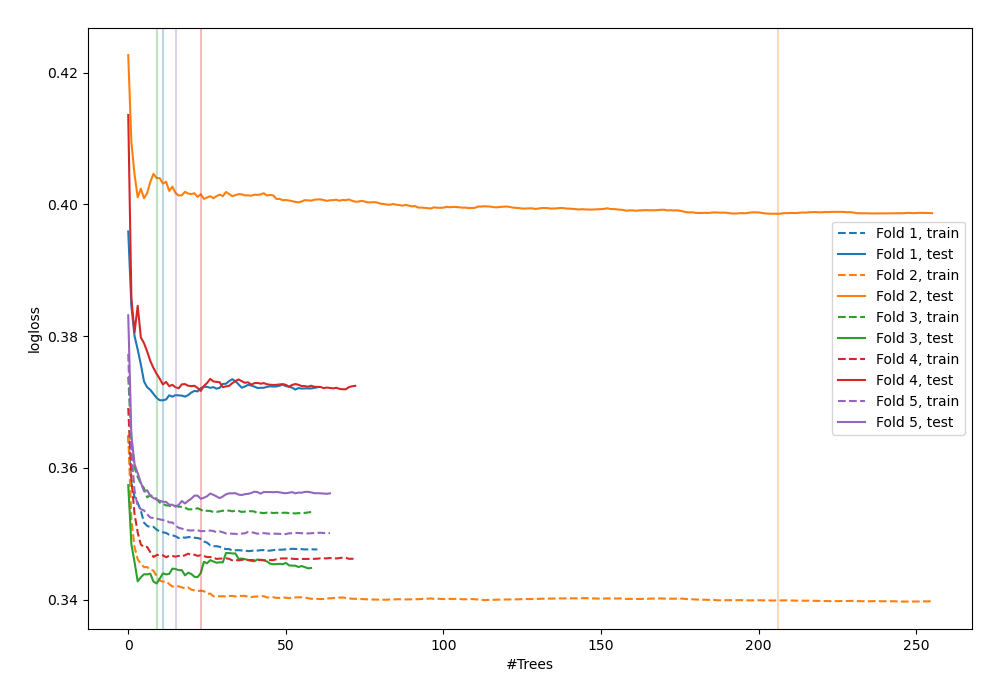
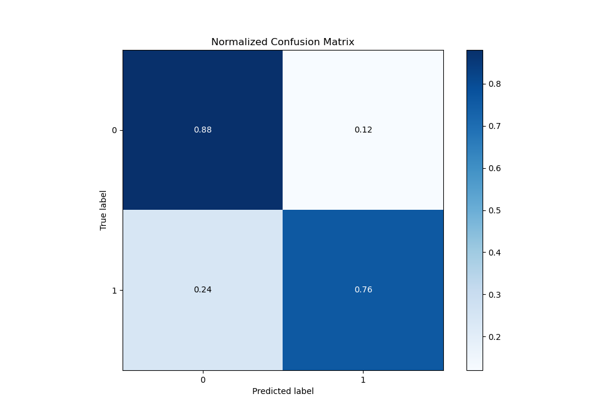
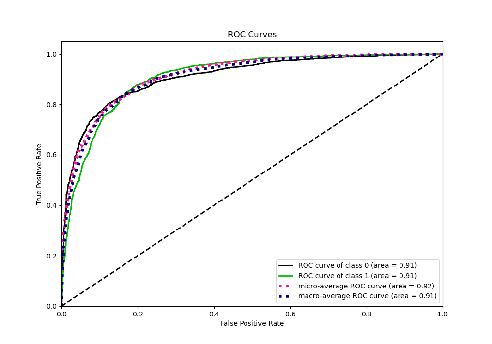
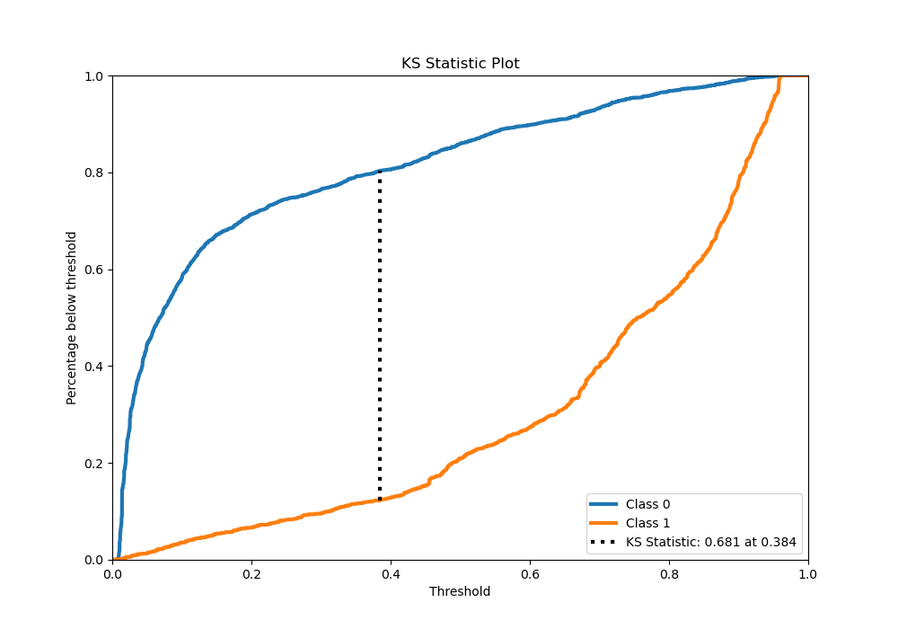
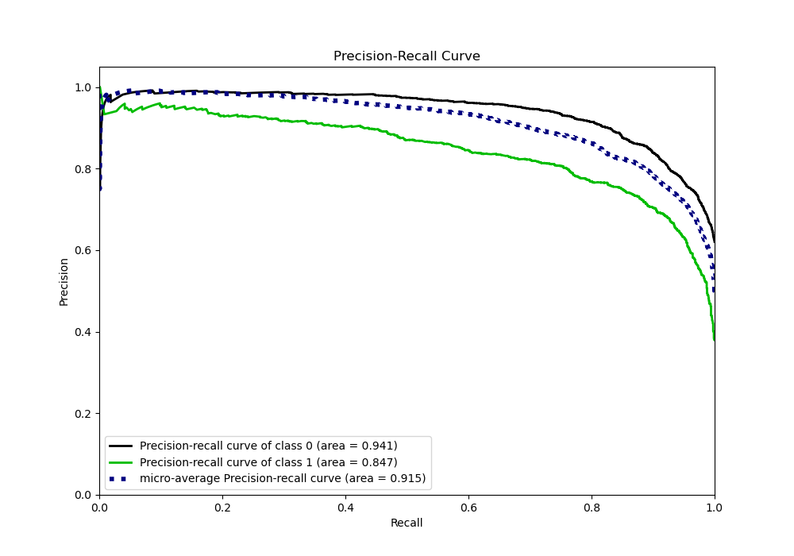
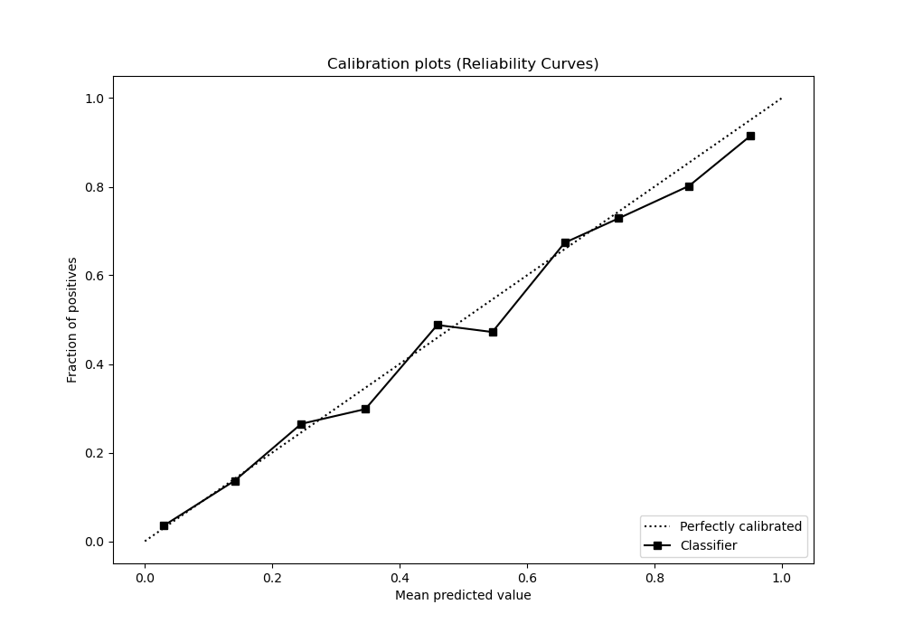
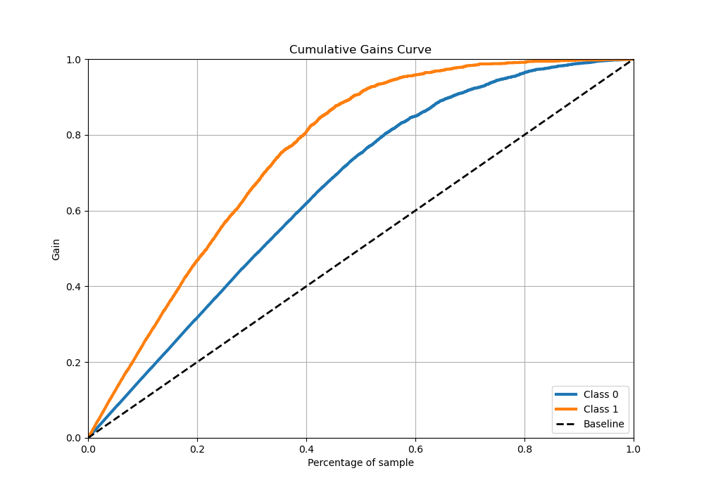
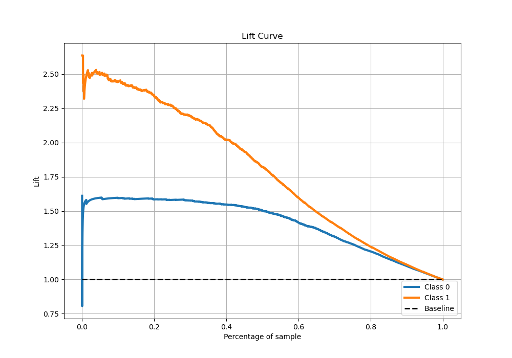

# Summary of 39_RandomForest_Stacked

[<< Go back](../README.md)

## Random Forest
- **n_jobs**: -1
- **criterion**: entropy
- **max_features**: 0.7
- **min_samples_split**: 40
- **max_depth**: 3
- **eval_metric_name**: logloss
- **explain_level**: 0

## Validation
 - **validation_type**: kfold
 - **stratify**: True
 - **k_folds**: 5
 - **shuffle**: True
 - **random_seed**: 42

## Optimized metric
logloss

## Training time

88.6 seconds

## Metric details
|           |    score |    threshold |
|:----------|---------:|-------------:|
| logloss   | 0.367406 | nan          |
| auc       | 0.909761 | nan          |
| f1        | 0.796908 |   0.398449   |
| accuracy  | 0.836766 |   0.54852    |
| precision | 0.953608 |   0.933993   |
| recall    | 1        |   0.00790742 |
| mcc       | 0.663085 |   0.44152    |

## Metric details with threshold from accuracy metric
|           |    score |   threshold |
|:----------|---------:|------------:|
| logloss   | 0.367406 |   nan       |
| auc       | 0.909761 |   nan       |
| f1        | 0.779803 |     0.54852 |
| accuracy  | 0.836766 |     0.54852 |
| precision | 0.798654 |     0.54852 |
| recall    | 0.761821 |     0.54852 |
| mcc       | 0.65069  |     0.54852 |

## Confusion matrix (at threshold=0.54852)
|              |   Predicted as 0 |   Predicted as 1 |
|:-------------|-----------------:|-----------------:|
| Labeled as 0 |             2473 |              329 |
| Labeled as 1 |              408 |             1305 |

## Learning curves

## Confusion Matrix

## Normalized Confusion Matrix

## ROC Curve

## Kolmogorov-Smirnov Statistic

## Precision-Recall Curve

## Calibration Curve

## Cumulative Gains Curve

## Lift Curve

[<< Go back](../README.md)
