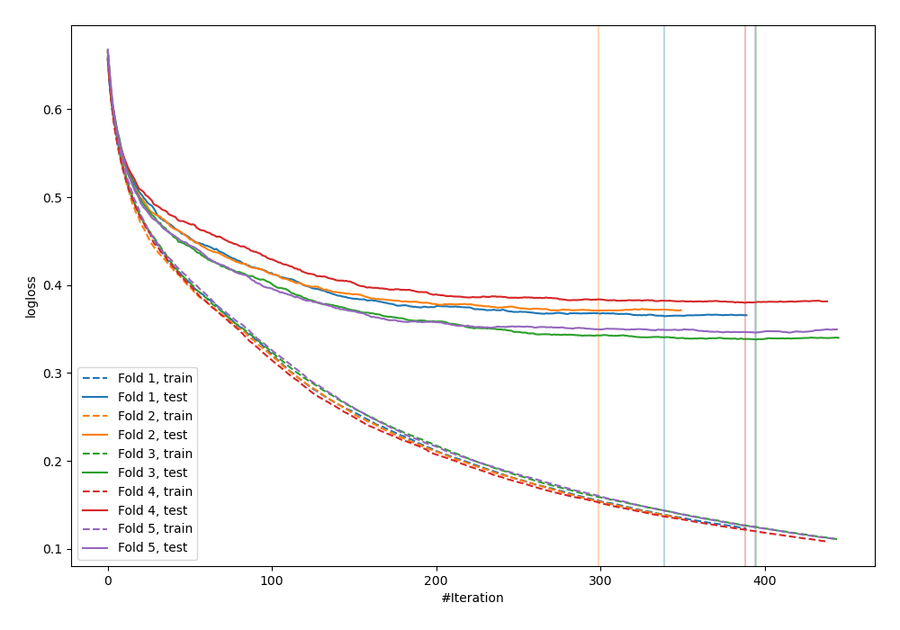
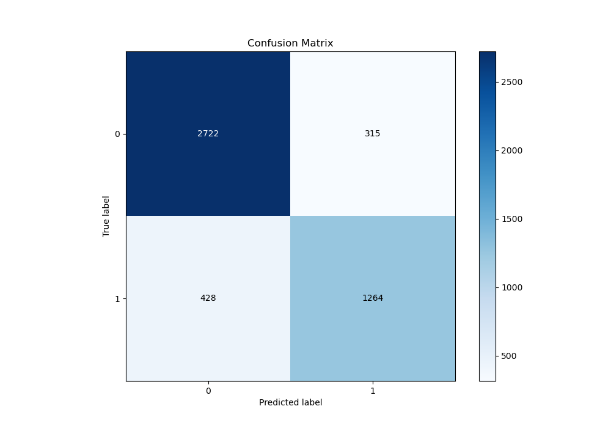
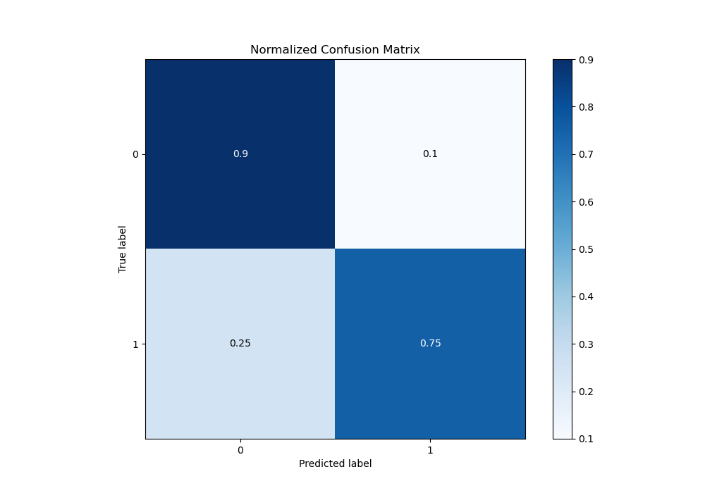
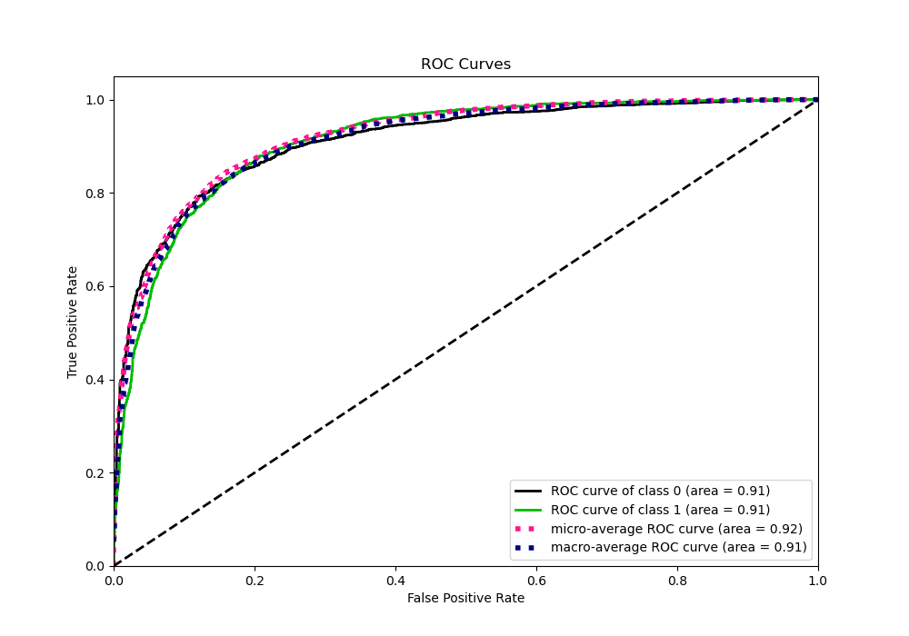
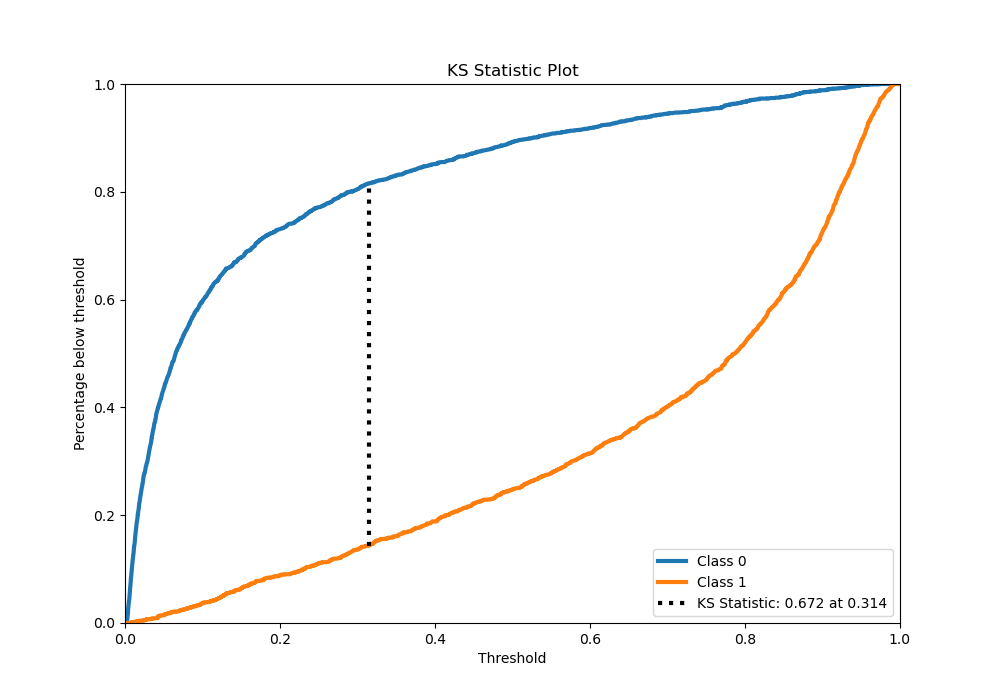
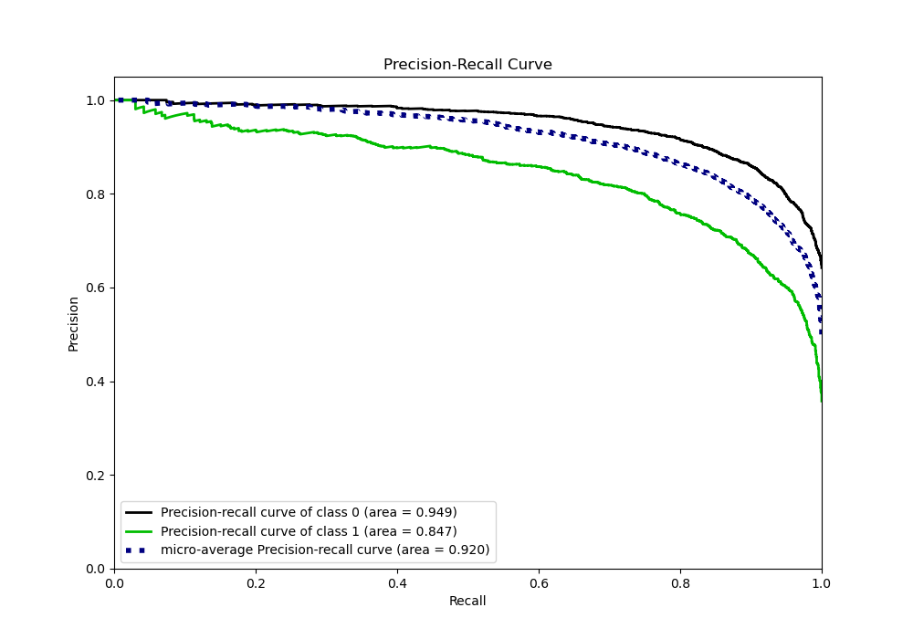
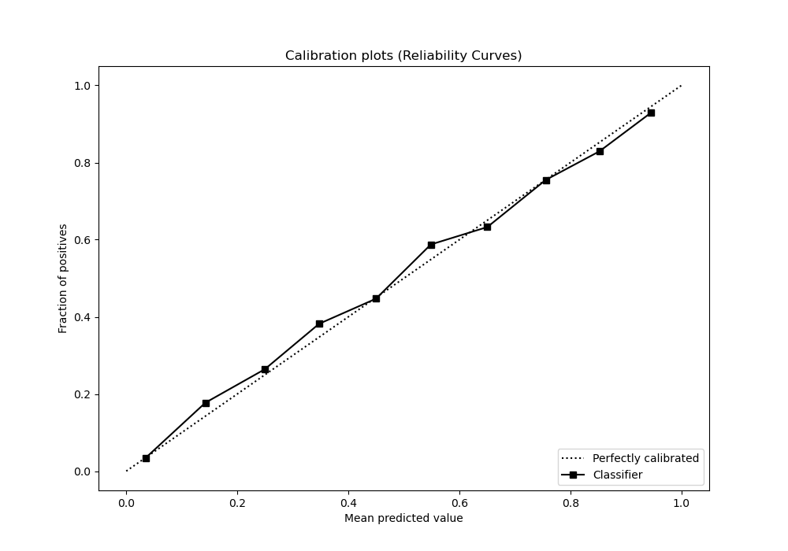
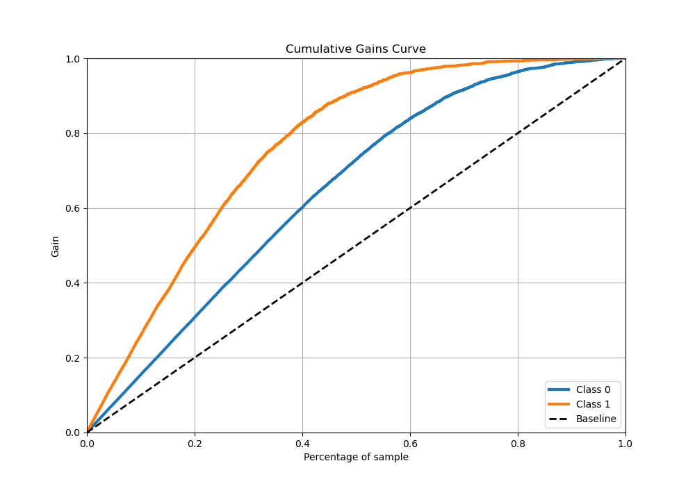
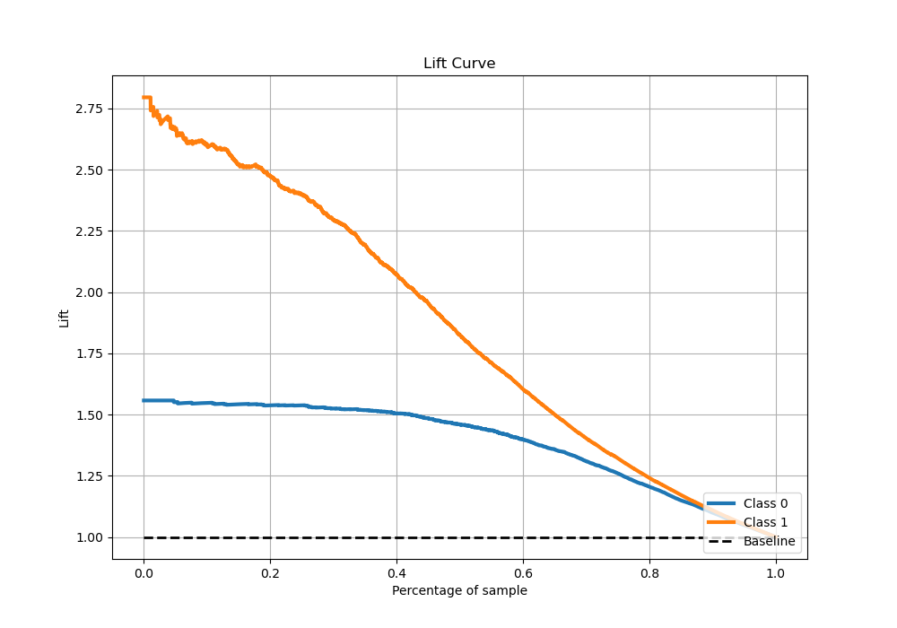

# Summary of 3_Default_CatBoost

[<< Go back](../README.md)

## CatBoost
- **n_jobs**: -1
- **learning_rate**: 0.1
- **depth**: 6
- **rsm**: 1
- **loss_function**: Logloss
- **eval_metric**: Logloss
- **explain_level**: 0

## Validation
 - **validation_type**: kfold
 - **stratify**: True
 - **k_folds**: 5
 - **shuffle**: True
 - **random_seed**: 42

## Optimized metric
logloss

## Training time

47.3 seconds

## Metric details
|           |    score |    threshold |
|:----------|---------:|-------------:|
| logloss   | 0.359847 | nan          |
| auc       | 0.912014 | nan          |
| f1        | 0.782437 |   0.382547   |
| accuracy  | 0.842884 |   0.51152    |
| precision | 0.973333 |   0.970185   |
| recall    | 1        |   0.00134463 |
| mcc       | 0.6539   |   0.382547   |

## Metric details with threshold from accuracy metric
|           |    score |   threshold |
|:----------|---------:|------------:|
| logloss   | 0.359847 |   nan       |
| auc       | 0.912014 |   nan       |
| f1        | 0.772852 |     0.51152 |
| accuracy  | 0.842884 |     0.51152 |
| precision | 0.800507 |     0.51152 |
| recall    | 0.747045 |     0.51152 |
| mcc       | 0.653892 |     0.51152 |

## Confusion matrix (at threshold=0.51152)
|              |   Predicted as 0 |   Predicted as 1 |
|:-------------|-----------------:|-----------------:|
| Labeled as 0 |             2722 |              315 |
| Labeled as 1 |              428 |             1264 |

## Learning curves

## Confusion Matrix

## Normalized Confusion Matrix

## ROC Curve

## Kolmogorov-Smirnov Statistic

## Precision-Recall Curve

## Calibration Curve

## Cumulative Gains Curve

## Lift Curve

[<< Go back](../README.md)
