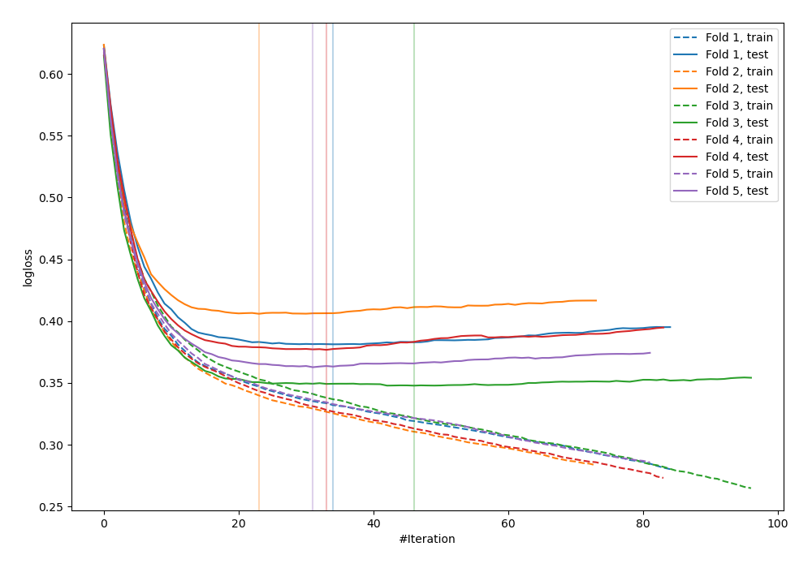
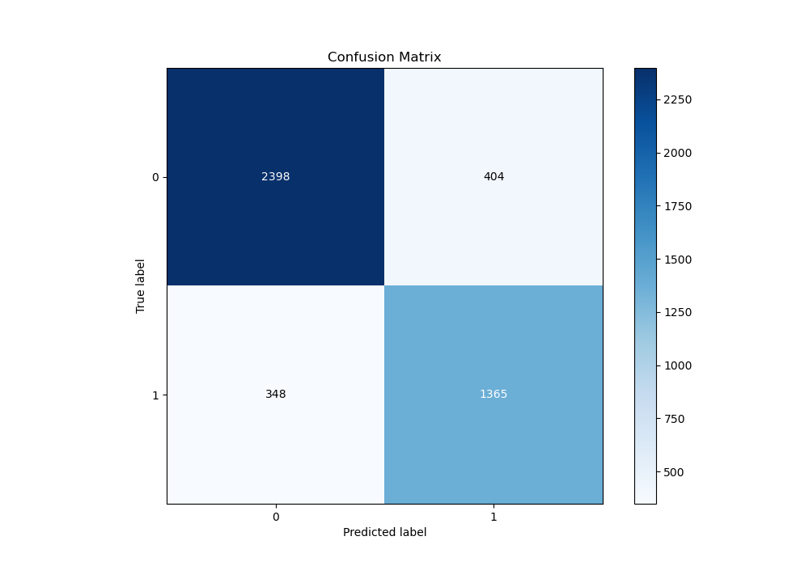
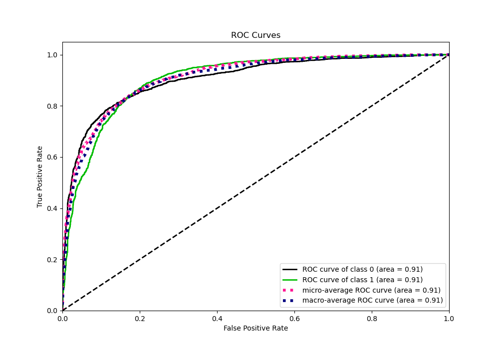
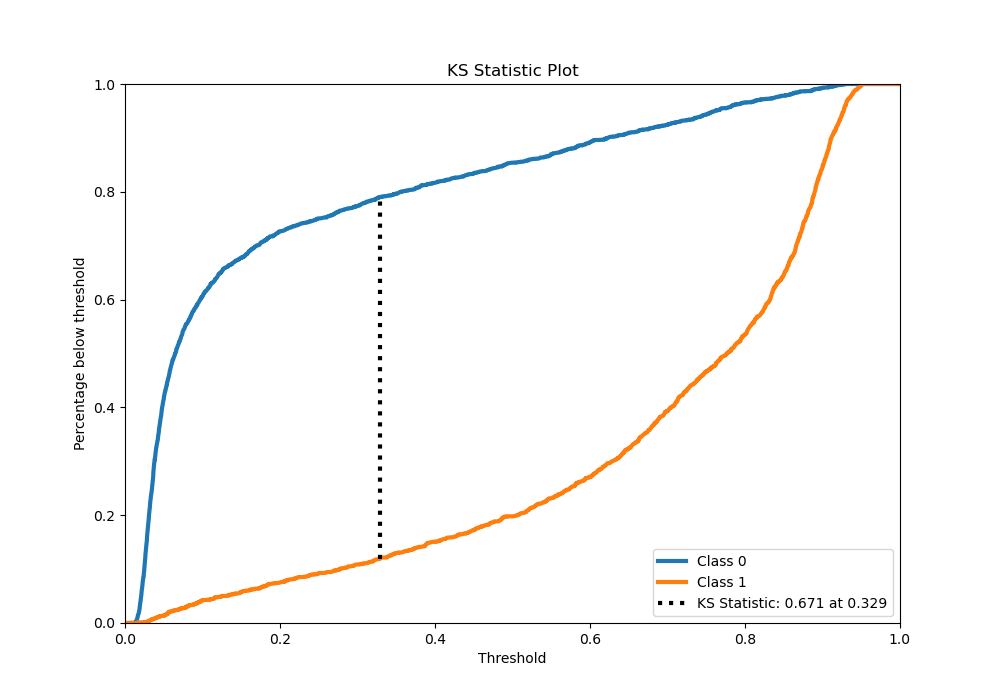
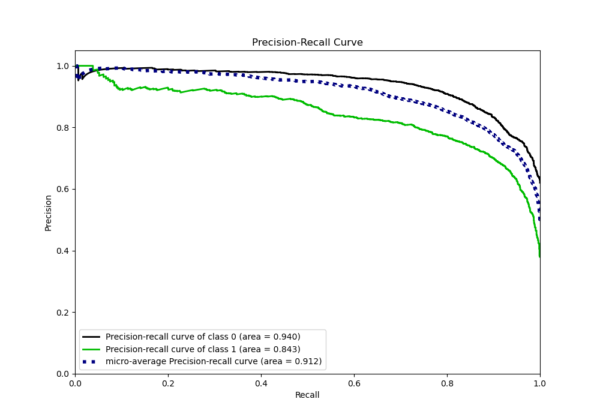
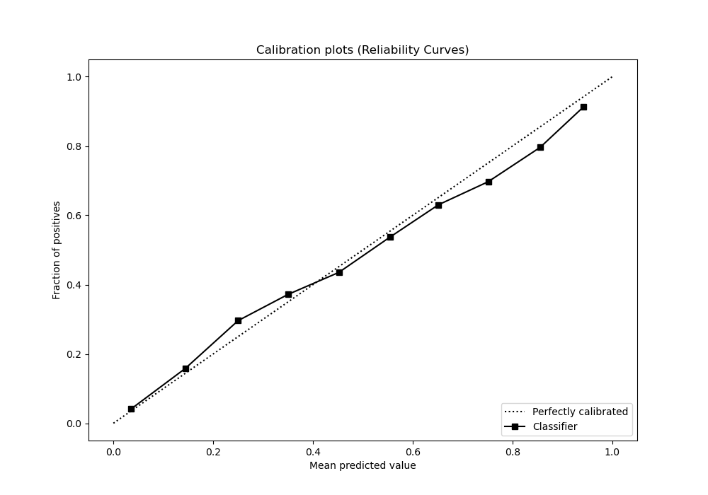
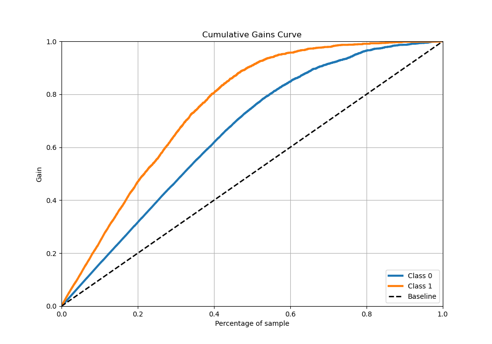
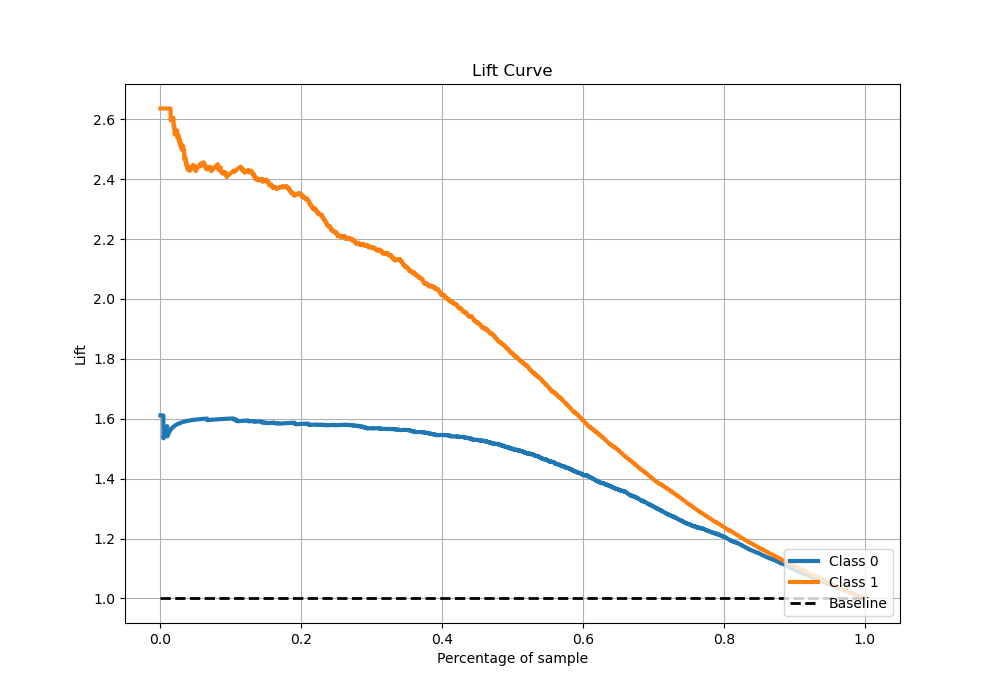

# Summary of 3_Default_CatBoost_Stacked

[<< Go back](../README.md)

## CatBoost
- **n_jobs**: -1
- **learning_rate**: 0.1
- **depth**: 6
- **rsm**: 1
- **loss_function**: Logloss
- **eval_metric**: Logloss
- **explain_level**: 0

## Validation
 - **validation_type**: kfold
 - **stratify**: True
 - **k_folds**: 5
 - **shuffle**: True
 - **random_seed**: 42

## Optimized metric
logloss

## Training time

15.6 seconds

## Metric details
|           |    score |   threshold |
|:----------|---------:|------------:|
| logloss   | 0.374878 | nan         |
| auc       | 0.906393 | nan         |
| f1        | 0.792555 |   0.387132  |
| accuracy  | 0.833444 |   0.510894  |
| precision | 1        |   0.930887  |
| recall    | 1        |   0.0117584 |
| mcc       | 0.654884 |   0.387132  |

## Metric details with threshold from accuracy metric
|           |    score |   threshold |
|:----------|---------:|------------:|
| logloss   | 0.374878 |  nan        |
| auc       | 0.906393 |  nan        |
| f1        | 0.784032 |    0.510894 |
| accuracy  | 0.833444 |    0.510894 |
| precision | 0.771622 |    0.510894 |
| recall    | 0.796848 |    0.510894 |
| mcc       | 0.648767 |    0.510894 |

## Confusion matrix (at threshold=0.510894)
|              |   Predicted as 0 |   Predicted as 1 |
|:-------------|-----------------:|-----------------:|
| Labeled as 0 |             2398 |              404 |
| Labeled as 1 |              348 |             1365 |

## Learning curves

## Confusion Matrix

## Normalized Confusion Matrix

## ROC Curve

## Kolmogorov-Smirnov Statistic

## Precision-Recall Curve

## Calibration Curve

## Cumulative Gains Curve

## Lift Curve

[<< Go back](../README.md)
